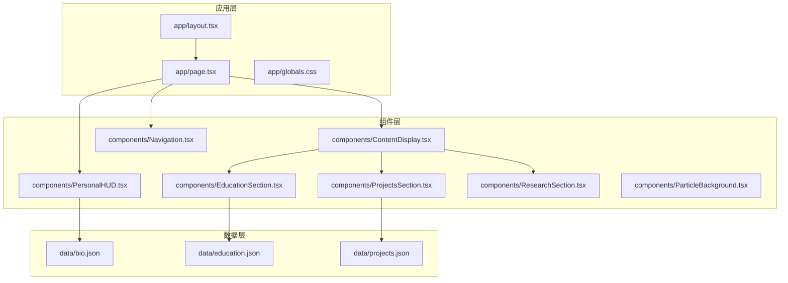
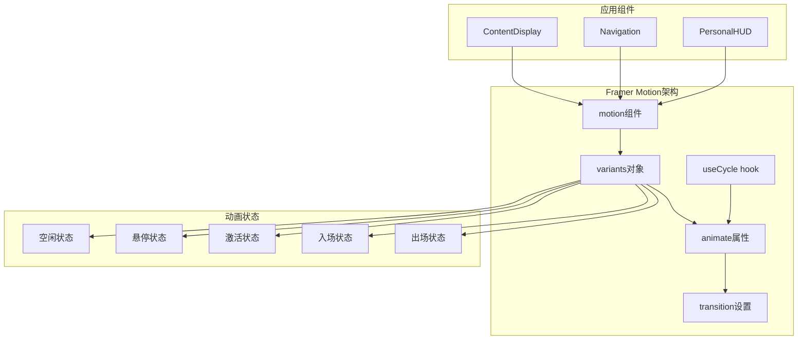
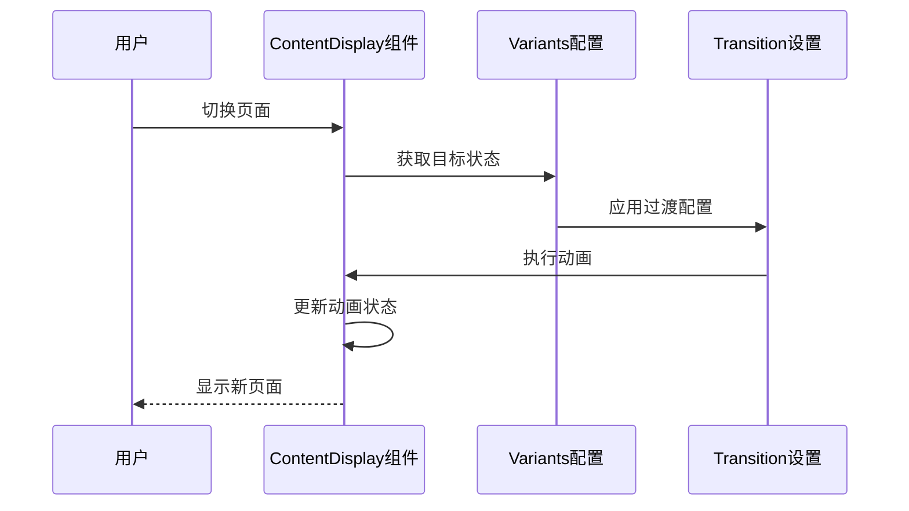
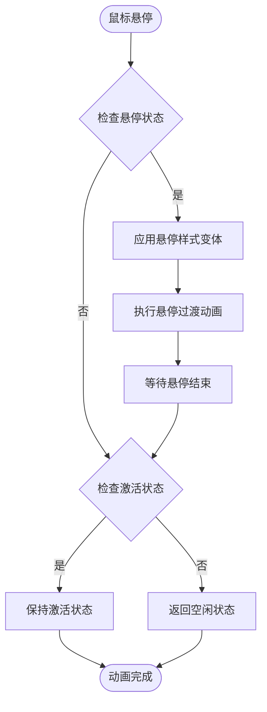
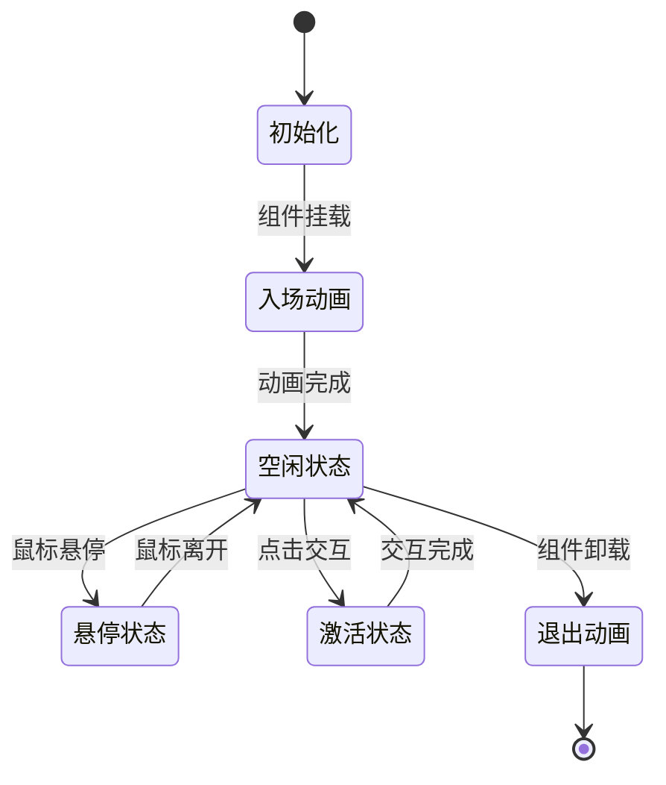
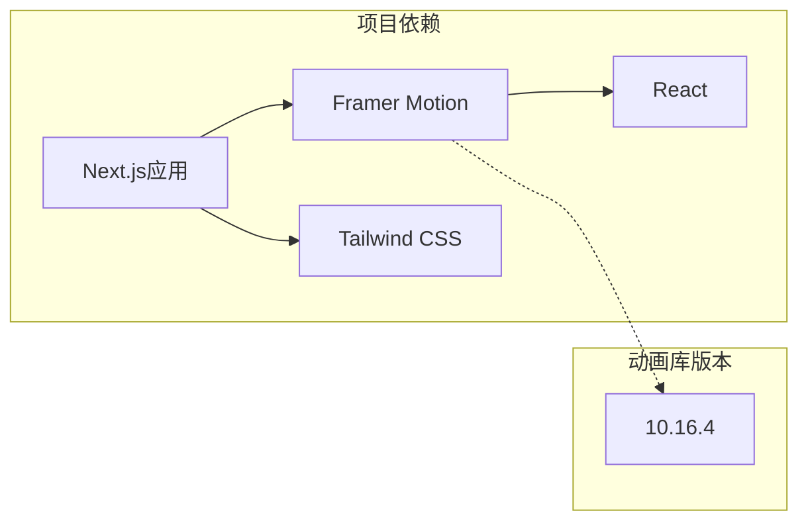

# Framer Motion动画实现

<cite>
**本文档引用的文件**
- [ContentDisplay.tsx](file://components/ContentDisplay.tsx)
- [Navigation.tsx](file://components/Navigation.tsx)
- [PersonalHUD.tsx](file://components/PersonalHUD.tsx)
- [layout.tsx](file://app/layout.tsx)
- [page.tsx](file://app/page.tsx)
- [globals.css](file://app/globals.css)
- [package.json](file://package.json)
- [README.md](file://README.md)
</cite>

## 目录
1. [简介](#简介)
2. [项目结构](#项目结构)
3. [核心组件](#核心组件)
4. [架构概览](#架构概览)
5. [详细组件分析](#详细组件分析)
6. [依赖分析](#依赖分析)
7. [性能考虑](#性能考虑)
8. [故障排除指南](#故障排除指南)
9. [结论](#结论)
10. [附录](#附录)

## 简介
本项目展示了如何在Next.js应用中集成和使用Framer Motion来创建流畅的动画效果。通过三个核心组件：ContentDisplay（内容展示）、Navigation（导航）和PersonalHUD（个人信息面板），实现了页面切换动画、导航项悬停效果以及个人信息面板的交互动画。

## 项目结构
项目采用Next.js框架构建，主要文件组织如下：

**图表来源**
- [layout.tsx](file://app/layout.tsx)
- [page.tsx](file://app/page.tsx)
- [ContentDisplay.tsx](file://components/ContentDisplay.tsx)
- [Navigation.tsx](file://components/Navigation.tsx)
- [PersonalHUD.tsx](file://components/PersonalHUD.tsx)

**章节来源**
- [layout.tsx](file://app/layout.tsx)
- [page.tsx](file://app/page.tsx)
- [package.json](file://package.json)

## 核心组件
本项目的核心动画组件包括：

### ContentDisplay组件
负责页面内容的切换动画，实现平滑的页面过渡效果。

### Navigation组件  
实现导航项的悬停和激活状态动画，提供直观的用户交互反馈。

### PersonalHUD组件
管理个人信息面板的入场、状态切换和交互反馈动画。

**章节来源**
- [ContentDisplay.tsx](file://components/ContentDisplay.tsx)
- [Navigation.tsx](file://components/Navigation.tsx)
- [PersonalHUD.tsx](file://components/PersonalHUD.tsx)

## 架构概览
整个动画系统基于Framer Motion的motion组件和variants配置构建，通过variants对象定义不同的动画状态，animate属性控制动画播放，结合useCycle hook实现循环动画效果。

**图表来源**
- [ContentDisplay.tsx](file://components/ContentDisplay.tsx)
- [Navigation.tsx](file://components/Navigation.tsx)
- [PersonalHUD.tsx](file://components/PersonalHUD.tsx)

## 详细组件分析

### ContentDisplay组件分析
ContentDisplay组件实现了页面切换动画机制，通过variants配置和transition设置提供流畅的页面过渡效果。

#### 动画状态管理
组件使用variants对象定义了多种动画状态：
- 空闲状态（idle）：默认的静止状态
- 激活状态（active）：当前显示的页面状态
- 悬停状态（hover）：鼠标悬停时的临时状态
- 入场状态（enter）：新页面进入时的动画
- 出场状态（exit）：旧页面退出时的动画

#### 页面切换流程

**图表来源**
- [ContentDisplay.tsx](file://components/ContentDisplay.tsx)

#### 关键实现特性
- 使用motion.div作为基础容器组件
- 通过variants对象定义不同状态下的样式变化
- 配置transition属性控制动画时长和缓动函数
- 实现状态间的平滑过渡效果

**章节来源**
- [ContentDisplay.tsx](file://components/ContentDisplay.tsx)

### Navigation组件分析
Navigation组件专注于导航项的悬停效果和激活状态动画，提供直观的用户交互反馈。

#### 悬停效果实现

**图表来源**
- [Navigation.tsx](file://components/Navigation.tsx)

#### 导航项状态管理
- 空闲状态：默认的导航项外观
- 悬停状态：鼠标悬停时的高亮效果
- 激活状态：当前选中页面对应的导航项
- 过渡状态：状态切换过程中的中间态

**章节来源**
- [Navigation.tsx](file://components/Navigation.tsx)

### PersonalHUD组件分析
PersonalHUD组件实现了个人信息面板的完整动画生命周期，包括入场动画、状态切换和交互反馈。

#### 动画生命周期

**图表来源**
- [PersonalHUD.tsx](file://components/PersonalHUD.tsx)

#### 交互反馈机制
- 鼠标悬停：提供视觉反馈和状态提示
- 点击交互：触发面板展开或收起
- 状态同步：确保动画状态与组件状态一致

**章节来源**
- [PersonalHUD.tsx](file://components/PersonalHUD.tsx)

## 依赖分析
项目对Framer Motion的依赖关系和版本信息如下：

**图表来源**
- [package.json](file://package.json)

**章节来源**
- [package.json](file://package.json)

## 性能考虑
基于Framer Motion的最佳实践，以下是关键的性能优化技巧：

### 硬件加速优化
- 使用transform属性而非改变布局属性（如width、height）
- 启用GPU加速，确保动画流畅性
- 避免使用会触发布局的CSS属性

### 帧率优化策略
- 控制同时运行的动画数量
- 使用适当的动画时长和缓动函数
- 避免复杂的阴影和滤镜效果

### 内存管理
- 及时清理动画监听器
- 合理使用动画状态缓存
- 避免内存泄漏

## 故障排除指南
常见问题及解决方案：

### 动画不生效
- 检查variants配置是否正确
- 确认animate属性绑定的值存在
- 验证transition设置的合理性

### 性能问题
- 减少同时运行的动画数量
- 优化复杂动画的帧率
- 检查是否有不必要的重绘

### 浏览器兼容性
- 确保目标浏览器支持CSS transform
- 提供降级方案以保证基本功能
- 测试不同设备上的表现

**章节来源**
- [ContentDisplay.tsx](file://components/ContentDisplay.tsx)
- [Navigation.tsx](file://components/Navigation.tsx)
- [PersonalHUD.tsx](file://components/PersonalHUD.tsx)

## 结论
本项目成功展示了Framer Motion在Next.js应用中的实际应用，通过三个核心组件实现了完整的动画系统。ContentDisplay提供了页面切换的流畅体验，Navigation增强了用户交互的直观性，PersonalHUD则展现了复杂动画状态管理的能力。

项目的关键优势包括：
- 清晰的组件分离和职责划分
- 基于variants的状态管理模式
- 良好的性能优化实践
- 完整的动画生命周期管理

## 附录

### Framer Motion核心概念
- **motion组件**：用于包装可动画的DOM元素或React组件
- **variants对象**：定义不同状态下的样式配置
- **animate属性**：控制元素的动画状态
- **useCycle hook**：实现动画状态的循环切换

### 开发最佳实践
- 合理设计动画状态层次
- 控制动画时长和缓动函数
- 确保动画与用户期望一致
- 提供无障碍访问支持

### 自定义动画示例
项目提供了以下自定义动画模式：
- 页面切换动画：从左侧滑入滑出
- 导航悬停效果：颜色渐变和阴影变化
- 个人信息面板：缩放和透明度变化

**章节来源**
- [README.md](file://README.md)