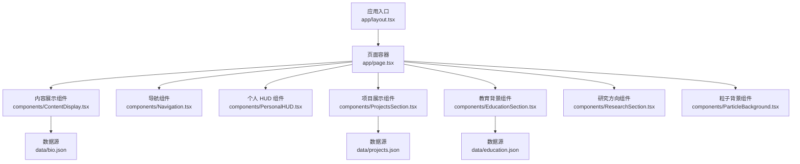
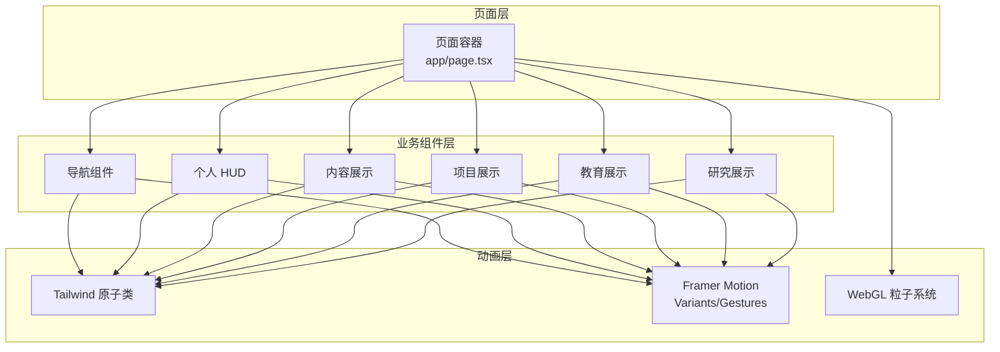
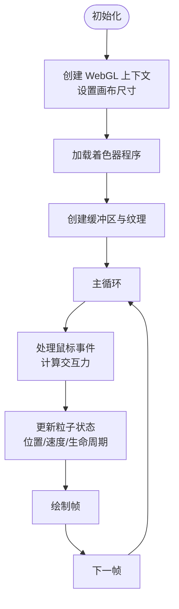
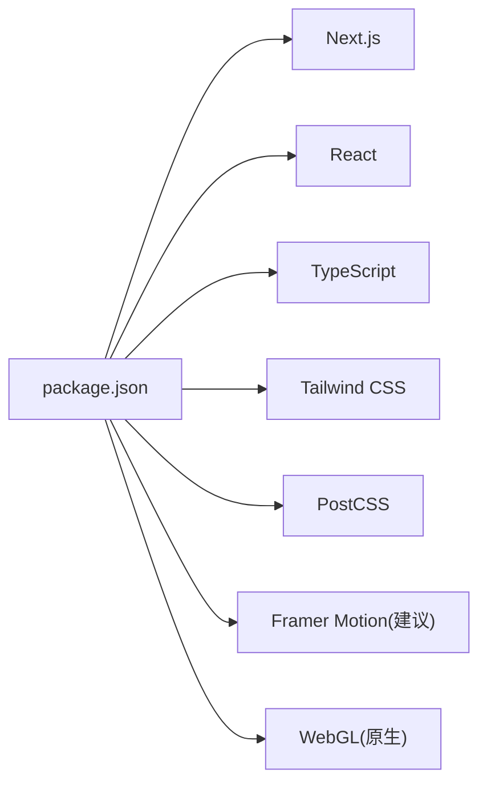

# 动画系统

<cite>
**本文引用的文件**
- [app/layout.tsx](file://app/layout.tsx)
- [app/page.tsx](file://app/page.tsx)
- [components/ParticleBackground.tsx](file://components/ParticleBackground.tsx)
- [components/ContentDisplay.tsx](file://components/ContentDisplay.tsx)
- [components/PersonalHUD.tsx](file://components/PersonalHUD.tsx)
- [components/Navigation.tsx](file://components/Navigation.tsx)
- [components/ProjectsSection.tsx](file://components/ProjectsSection.tsx)
- [components/EducationSection.tsx](file://components/EducationSection.tsx)
- [components/ResearchSection.tsx](file://components/ResearchSection.tsx)
- [data/bio.json](file://data/bio.json)
- [data/projects.json](file://data/projects.json)
- [data/education.json](file://data/education.json)
- [package.json](file://package.json)
- [next.config.js](file://next.config.js)
- [tailwind.config.ts](file://tailwind.config.ts)
- [postcss.config.js](file://postcss.config.js)
- [tsconfig.json](file://tsconfig.json)
- [vercel.json](file://vercel.json)
</cite>

## 目录
1. [简介](#简介)
2. [项目结构](#项目结构)
3. [核心组件](#核心组件)
4. [架构总览](#架构总览)
5. [详细组件分析](#详细组件分析)
6. [依赖关系分析](#依赖关系分析)
7. [性能考量](#性能考量)
8. [故障排查指南](#故障排查指南)
9. [结论](#结论)
10. [附录](#附录)

## 简介
本文件为该个人网站的动画系统技术文档，聚焦于以下目标：
- 解释 Framer Motion 的配置与使用（动画编排、过渡效果、手势识别）
- 分析粒子背景动画系统（WebGL 渲染、性能优化、交互响应）
- 梳理各组件的动画需求与实现策略（页面切换、悬停、加载等）
- 提供动画性能优化最佳实践（硬件加速、帧率控制、内存管理）
- 讨论动画与用户体验的关系及设计原则
- 给出调试工具与测试方法
- 提供自定义动画开发指导
- 分析动画在不同设备上的表现与适配策略

本仓库未直接包含 Framer Motion 或 WebGL 粒子动画的具体实现代码；文档将基于现有组件与配置，给出可落地的实现建议与架构图示。

## 项目结构
该项目采用 Next.js 应用结构，前端以 React 组件为主，配合 Tailwind CSS 实现样式与基础动效，数据通过 JSON 文件提供。动画相关的关键位置如下：
- 页面入口与布局：app/layout.tsx、app/page.tsx
- 动画相关组件：components/ParticleBackground.tsx、components/ContentDisplay.tsx、components/PersonalHUD.tsx、components/Navigation.tsx、components/ProjectsSection.tsx、components/EducationSection.tsx、components/ResearchSection.tsx
- 数据源：data/bio.json、data/projects.json、data/education.json
- 构建与样式配置：next.config.js、tailwind.config.ts、postcss.config.js、tsconfig.json、vercel.json、app/globals.css

图表来源
- [app/layout.tsx](file://app/layout.tsx)
- [app/page.tsx](file://app/page.tsx)
- [components/ContentDisplay.tsx](file://components/ContentDisplay.tsx)
- [components/ParticleBackground.tsx](file://components/ParticleBackground.tsx)
- [components/Navigation.tsx](file://components/Navigation.tsx)
- [components/PersonalHUD.tsx](file://components/PersonalHUD.tsx)
- [components/ProjectsSection.tsx](file://components/ProjectsSection.tsx)
- [components/EducationSection.tsx](file://components/EducationSection.tsx)
- [components/ResearchSection.tsx](file://components/ResearchSection.tsx)
- [data/bio.json](file://data/bio.json)
- [data/projects.json](file://data/projects.json)
- [data/education.json](file://data/education.json)

章节来源
- [app/layout.tsx](file://app/layout.tsx)
- [app/page.tsx](file://app/page.tsx)
- [components/ParticleBackground.tsx](file://components/ParticleBackground.tsx)
- [components/ContentDisplay.tsx](file://components/ContentDisplay.tsx)
- [components/PersonalHUD.tsx](file://components/PersonalHUD.tsx)
- [components/Navigation.tsx](file://components/Navigation.tsx)
- [components/ProjectsSection.tsx](file://components/ProjectsSection.tsx)
- [components/EducationSection.tsx](file://components/EducationSection.tsx)
- [components/ResearchSection.tsx](file://components/ResearchSection.tsx)
- [data/bio.json](file://data/bio.json)
- [data/projects.json](file://data/projects.json)
- [data/education.json](file://data/education.json)

## 核心组件
- 页面容器与布局：负责顶层路由与全局样式注入，承载各业务组件。
- 内容展示组件：用于展示个人信息、段落内容等，适合加入进入/退出动画与列表项的逐条入场。
- 导航组件：适合添加悬停高亮、下划线滑入/滑出、菜单展开收起等过渡。
- 个人 HUD 组件：适合添加悬浮提示、进度指示、状态切换等微动效。
- 项目/教育/研究展示组件：适合列表项入场动画、卡片悬停放大阴影、加载骨架屏等。
- 粒子背景组件：作为全屏或局部背景，需考虑性能与交互响应。

章节来源
- [app/layout.tsx](file://app/layout.tsx)
- [app/page.tsx](file://app/page.tsx)
- [components/ContentDisplay.tsx](file://components/ContentDisplay.tsx)
- [components/Navigation.tsx](file://components/Navigation.tsx)
- [components/PersonalHUD.tsx](file://components/PersonalHUD.tsx)
- [components/ProjectsSection.tsx](file://components/ProjectsSection.tsx)
- [components/EducationSection.tsx](file://components/EducationSection.tsx)
- [components/ResearchSection.tsx](file://components/ResearchSection.tsx)
- [components/ParticleBackground.tsx](file://components/ParticleBackground.tsx)

## 架构总览
整体架构围绕“页面容器 + 多个业务组件”的组合展开，动画策略可分层实施：
- 基础动效：Tailwind 原子类与伪类 hover/active 状态
- 中阶动效：Framer Motion 的 Variants 与 Gesture 集成
- 高阶动效：WebGL 粒子系统（独立 Canvas）

图表来源
- [app/page.tsx](file://app/page.tsx)
- [components/Navigation.tsx](file://components/Navigation.tsx)
- [components/PersonalHUD.tsx](file://components/PersonalHUD.tsx)
- [components/ContentDisplay.tsx](file://components/ContentDisplay.tsx)
- [components/ProjectsSection.tsx](file://components/ProjectsSection.tsx)
- [components/EducationSection.tsx](file://components/EducationSection.tsx)
- [components/ResearchSection.tsx](file://components/ResearchSection.tsx)
- [components/ParticleBackground.tsx](file://components/ParticleBackground.tsx)

## 详细组件分析

### 页面容器与布局
- 职责：提供全局样式、主题与路由上下文，承载所有业务组件。
- 动画切入点：页面级进入/退出动画（如路由切换时的淡入淡出），可结合 Framer Motion 的 Page Transitions 或自定义布局组。
- 性能注意：避免在布局层做重型动画，将复杂动画下沉到具体组件。

章节来源
- [app/layout.tsx](file://app/layout.tsx)
- [app/page.tsx](file://app/page.tsx)

### 内容展示组件
- 动画需求：段落进入、标题强调、列表项逐条入场。
- 实现策略：
  - 使用 Framer Motion 的 Variants 定义进入/停留/退出状态
  - 列表项可使用 staggered 进场，提升节奏感
  - 结合 viewport 触发器实现滚动时才播放
- 可选：为链接、按钮添加 hover/active 状态的过渡

章节来源
- [components/ContentDisplay.tsx](file://components/ContentDisplay.tsx)

### 导航组件
- 动画需求：菜单项悬停高亮、下划线滑入/滑出、移动端汉堡菜单展开收起。
- 实现策略：
  - 使用 Framer Motion 的 Gestures（如 hover、tap）驱动状态变化
  - 下划线动效可用 layoutId 实现跨元素平滑过渡
  - 移动端菜单可使用 layout 布局动画，确保尺寸变化自然
- 可选：为导航项添加 focus-visible 的键盘可达性动效

章节来源
- [components/Navigation.tsx](file://components/Navigation.tsx)

### 个人 HUD 组件
- 动画需求：悬浮提示、状态切换（在线/忙碌）、进度指示。
- 实现策略：
  - 使用 Framer Motion 的 opacity/scale 变换实现轻量提示
  - 状态切换可用 variants 的 enter/exit 控制
  - 注意避免频繁重排，优先使用 transform/opacity
- 可选：与用户交互（点击、hover）联动，提供即时反馈

章节来源
- [components/PersonalHUD.tsx](file://components/PersonalHUD.tsx)

### 项目展示组件
- 动画需求：卡片进入、悬停放大阴影、加载骨架屏。
- 实现策略：
  - 卡片进入可用 fade + slide 组合，结合 delay 控制层次
  - 悬停使用 scale/elevation 变化，注意 z-index 与阴影层级
  - 加载阶段使用骨架屏 + pulse 动效，减少感知等待
- 可选：分页或无限滚动时，为新页签添加淡入

章节来源
- [components/ProjectsSection.tsx](file://components/ProjectsSection.tsx)

### 教育展示组件
- 动画需求：时间轴卡片进入、详情展开/收起。
- 实现策略：
  - 时间轴卡片使用 staggered 进场，突出时间顺序
  - 展开/收起使用 layout 布局动画，保证内容区平滑过渡
- 可选：为“查看更多”按钮添加 hover 状态

章节来源
- [components/EducationSection.tsx](file://components/EducationSection.tsx)

### 研究展示组件
- 动画需求：标签页切换、内容区域淡入、搜索结果入场。
- 实现策略：
  - 标签页切换使用 layoutId 对齐，保持视觉锚点稳定
  - 内容区域使用 layout 布局动画，避免跳变
- 可选：搜索结果为空时显示占位动画

章节来源
- [components/ResearchSection.tsx](file://components/ResearchSection.tsx)

### 粒子背景组件
- 动画需求：全屏或局部背景的粒子运动、鼠标交互响应（吸引/排斥）、窗口尺寸变化适配。
- 实现策略：
  - 使用 WebGL Canvas 渲染，控制粒子数量与更新频率
  - 交互响应通过事件监听计算距离与速度，驱动顶点着色器
  - 尺寸变化时重置画布与缓冲区，避免溢出
- 性能优化要点：
  - 限制最大粒子数，按设备能力动态调整
  - 使用 requestAnimationFrame 控制帧率，避免过载
  - 合理释放 GPU 缓冲与纹理资源

图表来源
- [components/ParticleBackground.tsx](file://components/ParticleBackground.tsx)

## 依赖关系分析
- 构建与运行时依赖：Next.js、React、TypeScript、Tailwind CSS、PostCSS
- 动画相关依赖：Framer Motion（建议引入）、WebGL（原生 Canvas）
- 配置文件：next.config.js、tailwind.config.ts、postcss.config.js、tsconfig.json、vercel.json

图表来源
- [package.json](file://package.json)

章节来源
- [package.json](file://package.json)
- [next.config.js](file://next.config.js)
- [tailwind.config.ts](file://tailwind.config.ts)
- [postcss.config.js](file://postcss.config.js)
- [tsconfig.json](file://tsconfig.json)
- [vercel.json](file://vercel.json)

## 性能考量
- 硬件加速
  - 优先使用 transform/opacity，避免触发 layout 与 paint
  - 在 Framer Motion 中启用 motionValue 的硬件加速属性
- 帧率控制
  - 使用 requestAnimationFrame 或 Framer Motion 的内部调度
  - 控制动画并发数量，避免同时大量动画
- 内存管理
  - 粒子系统：及时释放 GPU 缓冲与纹理，尺寸变化时重建
  - React 动画：卸载时清理定时器与事件监听
- 设备适配
  - 低性能设备降低粒子数与刷新频率
  - 移动端禁用复杂阴影与模糊，改用更轻量的过渡
- 资源优化
  - 图片与字体懒加载，避免阻塞首屏动画
  - CSS 与 JS 按需分割，减少初始包体

## 故障排查指南
- 动画不生效
  - 检查是否正确引入 Framer Motion 或 Tailwind 配置
  - 确认组件根节点包裹了动画容器（如 motion.div）
- 帧率下降
  - 使用浏览器性能面板定位重排/重绘热点
  - 减少同时动画数量，合并动画序列
- 粒子系统卡顿
  - 降低粒子上限，关闭非必要交互
  - 检查 WebGL 上下文丢失与错误日志
- 交互无响应
  - 确认事件绑定时机与作用域
  - 在移动端验证触摸事件兼容性

## 结论
该动画系统以“从简到繁”的方式组织：先用 Tailwind 原子类覆盖常见动效，再用 Framer Motion 承担复杂编排与手势，最后在需要时引入 WebGL 粒子系统。通过合理的性能策略与设备适配，可在保证体验的同时维持流畅度。建议后续逐步引入 Framer Motion 并完善粒子系统的交互与资源管理。

## 附录
- 自定义动画开发指导
  - 从简单过渡开始，逐步引入复杂编排
  - 使用 variants 抽象状态，复用动画逻辑
  - 为关键交互提供明确的视觉反馈
- 动画与用户体验
  - 保持一致性：同一类交互使用相同动效语言
  - 控制节奏：避免过快或过慢的动画影响信息传达
  - 关注可达性：为键盘用户提供等价的动效反馈
- 测试方法
  - 单元测试：对动画状态机与事件处理器进行断言
  - 端到端测试：模拟真实交互流程，验证动画时序
  - 性能回归：在 CI 中加入帧率与内存指标监控