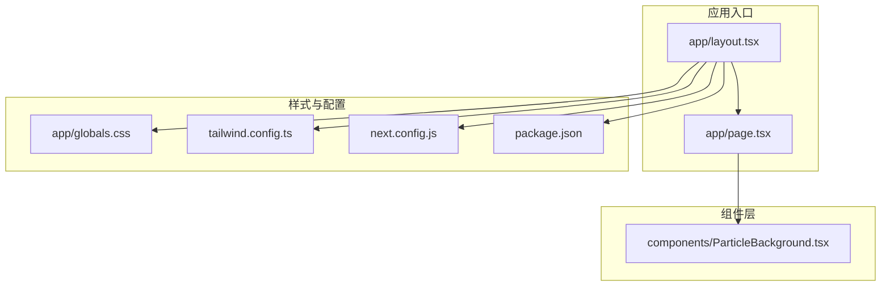
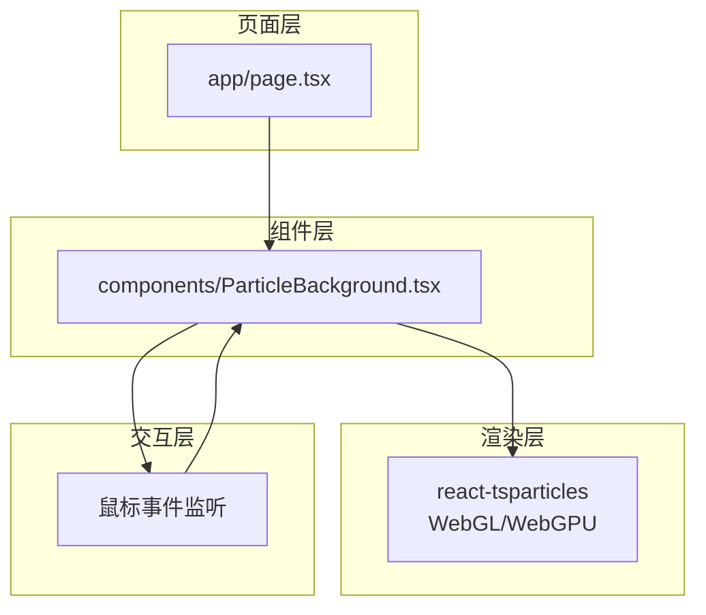
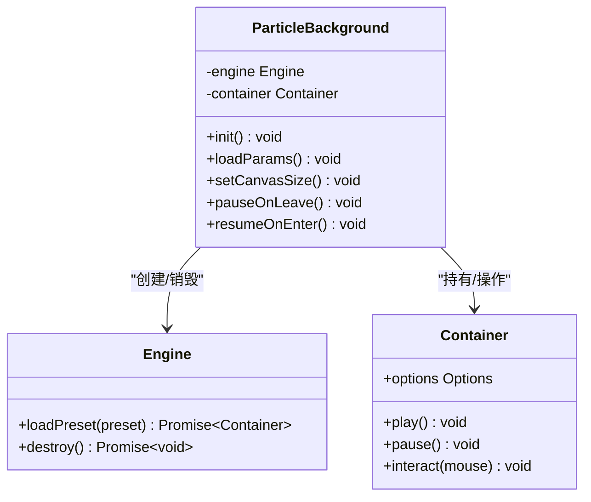
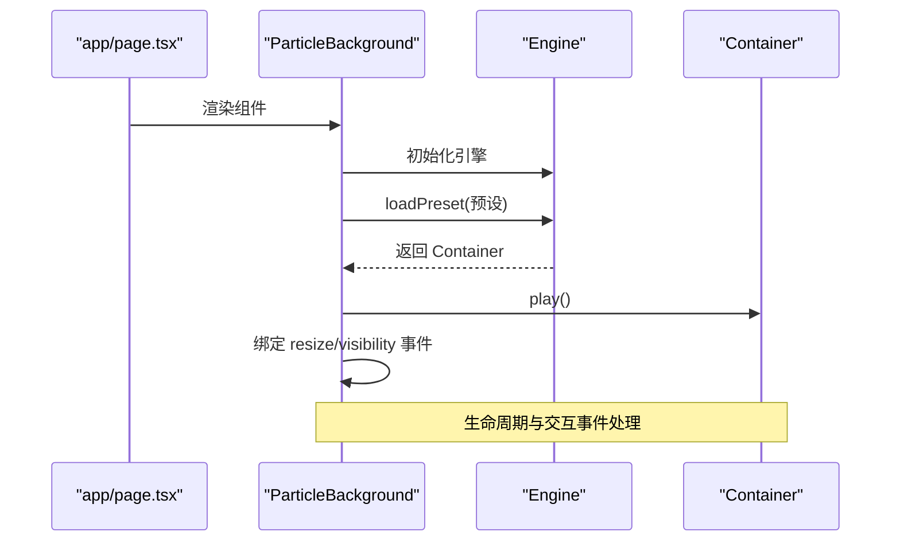
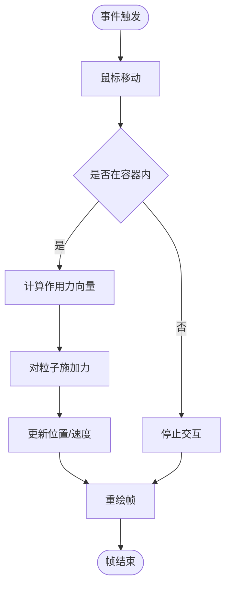
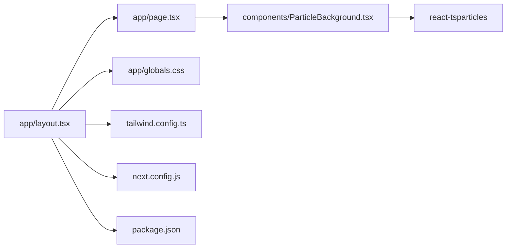

# 粒子动画系统

<cite>
**本文引用的文件**
- [app/page.tsx](file://app/page.tsx)
- [components/ParticleBackground.tsx](file://components/ParticleBackground.tsx)
- [package.json](file://package.json)
- [next.config.js](file://next.config.js)
- [tailwind.config.ts](file://tailwind.config.ts)
- [app/layout.tsx](file://app/layout.tsx)
- [app/globals.css](file://app/globals.css)
</cite>

## 目录
1. [简介](#简介)
2. [项目结构](#项目结构)
3. [核心组件](#核心组件)
4. [架构总览](#架构总览)
5. [详细组件分析](#详细组件分析)
6. [依赖关系分析](#依赖关系分析)
7. [性能考虑](#性能考虑)
8. [故障排查指南](#故障排查指南)
9. [结论](#结论)
10. [附录](#附录)

## 简介
本项目基于 Next.js 14（App Router）与 TypeScript 构建，集成了 react-tsparticles 库以实现高性能的粒子背景动画。该系统通过 WebGPU/WebGL 渲染管线在浏览器端进行 GPU 加速，支持粒子参数化配置、碰撞检测、鼠标交互响应以及多设备适配策略。本文档从架构、组件、数据流、性能优化到调试与适配进行全面阐述，帮助开发者快速理解并扩展粒子动画系统。

## 项目结构
项目采用 Next.js App Router 的目录组织方式，页面与组件分离清晰，便于模块化维护与扩展。粒子背景作为可复用组件被页面引用，全局样式与 Tailwind 配置统一管理。

**图表来源**
- [app/layout.tsx:1-200](file://app/layout.tsx#L1-L200)
- [app/page.tsx:1-200](file://app/page.tsx#L1-L200)
- [components/ParticleBackground.tsx:1-200](file://components/ParticleBackground.tsx#L1-L200)
- [app/globals.css:1-200](file://app/globals.css#L1-L200)
- [tailwind.config.ts:1-200](file://tailwind.config.ts#L1-L200)
- [next.config.js:1-200](file://next.config.js#L1-L200)
- [package.json:1-200](file://package.json#L1-L200)

**章节来源**
- [app/layout.tsx:1-200](file://app/layout.tsx#L1-L200)
- [app/page.tsx:1-200](file://app/page.tsx#L1-L200)
- [components/ParticleBackground.tsx:1-200](file://components/ParticleBackground.tsx#L1-L200)
- [app/globals.css:1-200](file://app/globals.css#L1-L200)
- [tailwind.config.ts:1-200](file://tailwind.config.ts#L1-L200)
- [next.config.js:1-200](file://next.config.js#L1-L200)
- [package.json:1-200](file://package.json#L1-L200)

## 核心组件
- 粒子背景组件：封装 react-tsparticles 的初始化、配置注入与生命周期管理，负责渲染与交互事件绑定。
- 页面容器：将粒子背景组件嵌入页面布局，确保全屏覆盖与层级控制。
- 布局容器：统一管理全局样式、主题与 Next.js 配置，为粒子系统提供稳定的运行环境。

**章节来源**
- [components/ParticleBackground.tsx:1-200](file://components/ParticleBackground.tsx#L1-L200)
- [app/page.tsx:1-200](file://app/page.tsx#L1-L200)
- [app/layout.tsx:1-200](file://app/layout.tsx#L1-L200)

## 架构总览
粒子动画系统采用“组件化 + 渲染管线 + 交互响应”的分层架构。页面层负责布局与路由，组件层负责粒子初始化与配置，渲染层由 react-tsparticles 调用底层 WebGL/WebGPU 实现，交互层通过鼠标事件驱动粒子行为。

**图表来源**
- [components/ParticleBackground.tsx:1-200](file://components/ParticleBackground.tsx#L1-L200)
- [app/page.tsx:1-200](file://app/page.tsx#L1-L200)

## 详细组件分析

### 粒子背景组件（ParticleBackground）
该组件是粒子系统的核心，负责：
- 初始化粒子引擎与容器
- 注入配置对象（包括粒子参数、碰撞、交互等）
- 绑定窗口尺寸变化与设备像素比调整
- 处理进入/离开视口时的生命周期事件（暂停/恢复）

**图表来源**
- [components/ParticleBackground.tsx:1-200](file://components/ParticleBackground.tsx#L1-L200)

**章节来源**
- [components/ParticleBackground.tsx:1-200](file://components/ParticleBackground.tsx#L1-L200)

### 页面与布局集成
- 页面容器将粒子背景组件作为子元素，保证其在页面中的绝对定位与全屏覆盖。
- 布局容器引入全局样式与 Tailwind 配置，确保粒子背景不会被其他 UI 元素遮挡且具备合适的 z-index。

**图表来源**
- [app/page.tsx:1-200](file://app/page.tsx#L1-L200)
- [components/ParticleBackground.tsx:1-200](file://components/ParticleBackground.tsx#L1-L200)

**章节来源**
- [app/page.tsx:1-200](file://app/page.tsx#L1-L200)
- [app/layout.tsx:1-200](file://app/layout.tsx#L1-L200)

### WebGL 渲染管线与 GPU 加速
- 渲染后端：react-tsparticles 默认使用 WebGL 进行渲染，必要时可启用 WebGPU（取决于浏览器支持与配置）。
- 顶点与片段着色器：粒子系统通过内置的着色器程序完成几何顶点变换与像素绘制，避免 JavaScript 层逐像素计算，充分利用 GPU 并行能力。
- 批量绘制：大量粒子共享同一渲染状态，减少状态切换与绘制调用次数，提升帧率稳定性。

[本节为概念性说明，不直接分析具体源码文件]

### 碰撞检测与鼠标交互
- 碰撞检测：在配置中启用粒子间或与边界/容器的碰撞逻辑，系统自动计算距离与速度矢量，实现自然的物理交互。
- 鼠标交互：当鼠标移动至容器区域时，系统根据距离与强度动态影响周围粒子，形成吸引/排斥等效果；离开容器时自动停止交互。

[本图为概念流程图，不附带图表来源]

### 性能优化策略
- 粒子数量限制：根据设备性能动态调整粒子总数，低端设备降低密度以维持稳定帧率。
- 渲染频率控制：通过时间步长与帧间隔控制更新频率，避免高频计算导致主线程阻塞。
- 内存管理：在组件卸载时销毁引擎与容器，释放 WebGL 上下文资源；在窗口尺寸变化时重建缓冲区，防止内存泄漏。
- 可见性感知：页面不可见时暂停动画，可见时恢复，减少不必要的计算开销。

**章节来源**
- [components/ParticleBackground.tsx:1-200](file://components/ParticleBackground.tsx#L1-L200)

### 自定义配置指南
- 颜色方案：通过配置对象设置粒子颜色、透明度与渐变效果，结合主题变量实现与 UI 的一致性。
- 运动轨迹：启用路径追踪、轨迹长度与衰减参数，营造流动感与层次感。
- 视觉效果：添加阴影、发光、模糊等后处理效果（如需），但需权衡性能与兼容性。
- 交互强度：调节鼠标影响范围与力度，确保在桌面与移动端均有良好体验。

**章节来源**
- [components/ParticleBackground.tsx:1-200](file://components/ParticleBackground.tsx#L1-L200)

### 与整体 UI 设计的协调原则
- 层级与遮罩：确保粒子背景位于页面最底层，不影响内容层交互；必要时为重要 UI 元素设置更高 z-index。
- 主题一致性：颜色与动效风格应与品牌/主题保持一致，避免视觉冲突。
- 响应式适配：在小屏设备上适度简化粒子效果，保证文字与交互元素的可读性与可用性。

**章节来源**
- [app/layout.tsx:1-200](file://app/layout.tsx#L1-L200)
- [app/globals.css:1-200](file://app/globals.css#L1-L200)

## 依赖关系分析
- react-tsparticles：核心渲染与物理引擎，提供 WebGL/WebGPU 支持与交互接口。
- next.config.js：Next.js 构建配置，确保静态资源与运行时优化。
- tailwind.config.ts：Tailwind CSS 配置，统一设计语言与响应式断点。
- package.json：依赖声明与脚本命令，管理开发与生产环境。

**图表来源**
- [components/ParticleBackground.tsx:1-200](file://components/ParticleBackground.tsx#L1-L200)
- [app/page.tsx:1-200](file://app/page.tsx#L1-L200)
- [app/layout.tsx:1-200](file://app/layout.tsx#L1-L200)
- [app/globals.css:1-200](file://app/globals.css#L1-L200)
- [tailwind.config.ts:1-200](file://tailwind.config.ts#L1-L200)
- [next.config.js:1-200](file://next.config.js#L1-L200)
- [package.json:1-200](file://package.json#L1-L200)

**章节来源**
- [package.json:1-200](file://package.json#L1-L200)
- [next.config.js:1-200](file://next.config.js#L1-L200)
- [tailwind.config.ts:1-200](file://tailwind.config.ts#L1-L200)

## 性能考虑
- 渲染后端选择：优先使用 WebGL；若目标设备/浏览器不支持 WebGPU，则回退至 WebGL 以保证兼容性。
- 动态密度控制：根据设备类型（桌面/移动）、CPU/GPU 性能与当前帧耗时，动态调整粒子数量与更新频率。
- 帧率监控：在开发阶段启用帧率统计，在生产环境中通过日志采样记录平均帧率与掉帧情况。
- 资源释放：组件卸载时彻底销毁引擎与容器，避免 WebGL 上下文泄漏与内存占用持续增长。

[本节提供通用指导，不直接分析具体源码文件]

## 故障排查指南
- 无渲染或黑屏：检查容器尺寸与 CSS 定位，确认全屏覆盖与 z-index 设置；验证 WebGL/WebGPU 是否可用。
- 帧率骤降：降低粒子数量、禁用复杂特效（如阴影/发光），检查是否有频繁的 DOM 操作或重排。
- 交互无效：确认鼠标事件监听是否绑定在正确容器上，检查页面可见性与生命周期钩子是否正确暂停/恢复。
- 移动端卡顿：启用移动端专用预设，关闭高成本特效；在滚动/触摸时降低更新频率。

**章节来源**
- [components/ParticleBackground.tsx:1-200](file://components/ParticleBackground.tsx#L1-L200)

## 结论
本粒子动画系统通过 react-tsparticles 将高性能渲染与交互体验有机结合，配合合理的性能策略与多设备适配方案，能够在现代浏览器中流畅运行。建议在实际项目中结合业务场景进一步定制配置，并建立完善的性能监控与故障排查机制。

## 附录
- 集成步骤概览：安装依赖 → 引入组件 → 注入配置 → 在页面中渲染 → 调整样式与交互 → 部署与监控。
- 推荐实践：将粒子配置抽取为可维护的 JSON/TS 文件；为不同设备准备独立预设；在 CI 中加入性能回归测试。