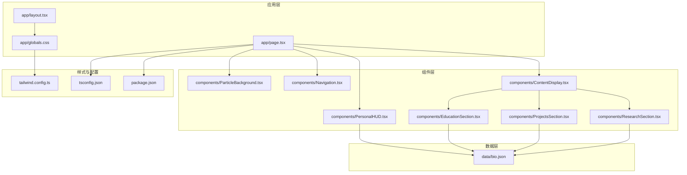
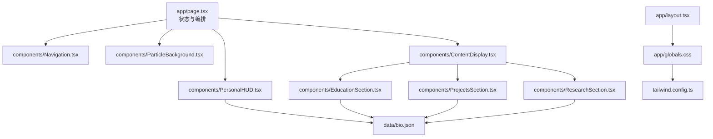
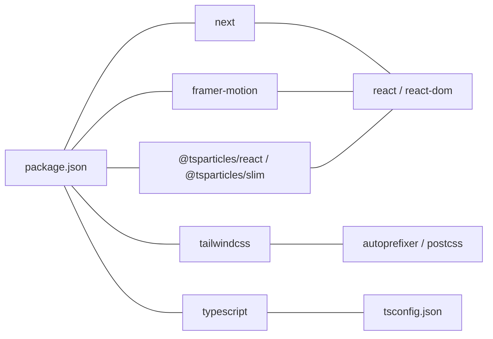

# 代码规范与最佳实践

<cite>
**本文引用的文件**
- [package.json](file://package.json)
- [tsconfig.json](file://tsconfig.json)
- [README.md](file://README.md)
- [app/layout.tsx](file://app/layout.tsx)
- [app/page.tsx](file://app/page.tsx)
- [app/globals.css](file://app/globals.css)
- [tailwind.config.ts](file://tailwind.config.ts)
- [components/ParticleBackground.tsx](file://components/ParticleBackground.tsx)
- [components/PersonalHUD.tsx](file://components/PersonalHUD.tsx)
- [components/Navigation.tsx](file://components/Navigation.tsx)
- [components/ContentDisplay.tsx](file://components/ContentDisplay.tsx)
- [components/EducationSection.tsx](file://components/EducationSection.tsx)
- [components/ProjectsSection.tsx](file://components/ProjectsSection.tsx)
- [components/ResearchSection.tsx](file://components/ResearchSection.tsx)
- [data/bio.json](file://data/bio.json)
</cite>

## 目录
1. [引言](#引言)
2. [项目结构](#项目结构)
3. [核心组件](#核心组件)
4. [架构总览](#架构总览)
5. [详细组件分析](#详细组件分析)
6. [依赖关系分析](#依赖关系分析)
7. [性能考虑](#性能考虑)
8. [故障排查指南](#故障排查指南)
9. [结论](#结论)
10. [附录](#附录)

## 引言
本指南面向“杨天成个人网页”项目，提供一套系统化的代码规范与最佳实践，覆盖 TypeScript 编码规范、React 组件开发规范、文件组织与目录结构、注释与文档编写标准、性能优化技巧、错误处理与异常管理，以及代码审查检查清单与质量保证流程。目标是帮助开发者在保持一致性的前提下，提升代码可读性、可维护性与运行效率。

## 项目结构
项目采用 Next.js App Router 的典型目录结构，结合 TypeScript、Tailwind CSS、Framer Motion 与 react-tsparticles，形成以组件为中心的模块化组织方式。核心目录与职责如下：
- app：应用根布局与页面入口，包含全局样式与元数据配置
- components：可复用 UI 组件与业务模块组件
- data：静态 JSON 数据源，用于驱动内容展示
- 配置文件：package.json、tsconfig.json、tailwind.config.ts、vercel.json 等

图表来源
- [app/page.tsx:1-61](file://app/page.tsx#L1-L61)
- [components/ContentDisplay.tsx:1-125](file://components/ContentDisplay.tsx#L1-L125)
- [components/ParticleBackground.tsx:1-126](file://components/ParticleBackground.tsx#L1-L126)
- [components/PersonalHUD.tsx:1-132](file://components/PersonalHUD.tsx#L1-L132)
- [components/Navigation.tsx:1-103](file://components/Navigation.tsx#L1-L103)
- [components/EducationSection.tsx:1-143](file://components/EducationSection.tsx#L1-L143)
- [components/ProjectsSection.tsx:1-161](file://components/ProjectsSection.tsx#L1-L161)
- [components/ResearchSection.tsx:1-175](file://components/ResearchSection.tsx#L1-L175)
- [app/globals.css:1-212](file://app/globals.css#L1-L212)
- [tailwind.config.ts:1-72](file://tailwind.config.ts#L1-L72)
- [tsconfig.json:1-27](file://tsconfig.json#L1-L27)
- [package.json:1-30](file://package.json#L1-L30)

章节来源
- [README.md:146-169](file://README.md#L146-L169)
- [package.json:1-30](file://package.json#L1-L30)
- [tsconfig.json:1-27](file://tsconfig.json#L1-L27)
- [tailwind.config.ts:1-72](file://tailwind.config.ts#L1-L72)
- [app/layout.tsx:1-37](file://app/layout.tsx#L1-L37)
- [app/page.tsx:1-61](file://app/page.tsx#L1-L61)

## 核心组件
本节聚焦于关键组件的职责、数据流与交互逻辑，为后续规范制定提供依据。

- 根布局与页面
  - app/layout.tsx：定义站点元信息与全局字体资源加载；作为根布局容器承载子组件
  - app/page.tsx：应用入口，负责状态管理与组件编排，包含粒子背景、HUD、导航与内容展示区域
- 交互与展示组件
  - components/ParticleBackground.tsx：客户端组件，初始化粒子引擎并渲染动态背景
  - components/PersonalHUD.tsx：客户端组件，消费 data/bio.json 展示个人信息与技能矩阵
  - components/Navigation.tsx：客户端组件，提供底部导航按钮，支持悬停与激活态动画
  - components/ContentDisplay.tsx：客户端组件，根据激活状态切换不同内容区，并配合 Framer Motion 执行切换动画
  - components/EducationSection.tsx：客户端组件，基于 data/education.json 渲染教育经历时间线
  - components/ProjectsSection.tsx：客户端组件，基于 data/projects.json 渲染项目卡片与高亮细节
  - components/ResearchSection.tsx：客户端组件，基于 data/research.json 渲染研究时间线与进度条

章节来源
- [app/layout.tsx:1-37](file://app/layout.tsx#L1-L37)
- [app/page.tsx:1-61](file://app/page.tsx#L1-L61)
- [components/ParticleBackground.tsx:1-126](file://components/ParticleBackground.tsx#L1-L126)
- [components/PersonalHUD.tsx:1-132](file://components/PersonalHUD.tsx#L1-L132)
- [components/Navigation.tsx:1-103](file://components/Navigation.tsx#L1-L103)
- [components/ContentDisplay.tsx:1-125](file://components/ContentDisplay.tsx#L1-L125)
- [components/EducationSection.tsx:1-143](file://components/EducationSection.tsx#L1-L143)
- [components/ProjectsSection.tsx:1-161](file://components/ProjectsSection.tsx#L1-L161)
- [components/ResearchSection.tsx:1-175](file://components/ResearchSection.tsx#L1-L175)
- [data/bio.json:1-14](file://data/bio.json#L1-L14)

## 架构总览
整体采用“页面级编排 + 组件级复用”的分层架构。页面负责状态与路由，组件负责展示与交互，数据通过静态 JSON 注入，样式通过 Tailwind CSS 与自定义动画类统一管理。

图表来源
- [app/page.tsx:1-61](file://app/page.tsx#L1-L61)
- [components/Navigation.tsx:1-103](file://components/Navigation.tsx#L1-L103)
- [components/PersonalHUD.tsx:1-132](file://components/PersonalHUD.tsx#L1-L132)
- [components/ContentDisplay.tsx:1-125](file://components/ContentDisplay.tsx#L1-L125)
- [components/EducationSection.tsx:1-143](file://components/EducationSection.tsx#L1-L143)
- [components/ProjectsSection.tsx:1-161](file://components/ProjectsSection.tsx#L1-L161)
- [components/ResearchSection.tsx:1-175](file://components/ResearchSection.tsx#L1-L175)
- [app/layout.tsx:1-37](file://app/layout.tsx#L1-L37)
- [app/globals.css:1-212](file://app/globals.css#L1-L212)
- [tailwind.config.ts:1-72](file://tailwind.config.ts#L1-L72)
- [data/bio.json:1-14](file://data/bio.json#L1-L14)

## 详细组件分析

### TypeScript 编码规范
- 类型安全与严格模式
  - 使用严格模式与 noEmit，确保类型检查在构建阶段生效
  - 使用 ReactNode 作为通用子节点类型，避免 any
  - 对 props 使用接口明确参数契约，如 NavigationProps、ContentDisplayProps
- 泛型与工具类型
  - 在需要时使用 Partial、Pick、Omit 等映射类型简化接口定义
  - 对数组元素使用明确的索引类型，避免隐式 any
- 导入路径与别名
  - 使用 @/* 路径别名，统一相对路径，减少层级过深导致的维护成本

章节来源
- [tsconfig.json:1-27](file://tsconfig.json#L1-L27)
- [components/Navigation.tsx:6-9](file://components/Navigation.tsx#L6-L9)
- [components/ContentDisplay.tsx:8-10](file://components/ContentDisplay.tsx#L8-L10)
- [app/layout.tsx:1-3](file://app/layout.tsx#L1-L3)

### React 组件开发规范
- 函数组件与 Hook 使用
  - 优先使用函数组件与 Hooks，避免不必要的类组件
  - 将副作用封装在 useEffect 中，合理设置依赖数组，避免重复执行
  - 将可复用的状态逻辑抽取为自定义 Hook（建议）
- 组件命名与导出
  - 组件文件名采用帕斯卡命名，导出默认组件
  - 子组件内部函数采用驼峰命名，清晰表达职责
- Props 设计与解构
  - 使用接口定义 props，避免在组件内硬编码类型
  - 在组件入口处进行必要的参数校验或默认值处理
- 客户端组件标记
  - 包含客户端逻辑的组件统一添加 'use client' 指令，避免 SSR 与 CSR 混用引发问题

章节来源
- [app/page.tsx:1-61](file://app/page.tsx#L1-L61)
- [components/Navigation.tsx:1-103](file://components/Navigation.tsx#L1-L103)
- [components/ContentDisplay.tsx:1-125](file://components/ContentDisplay.tsx#L1-L125)
- [components/PersonalHUD.tsx:1-132](file://components/PersonalHUD.tsx#L1-L132)

### 文件组织与目录结构最佳实践
- 目录分层
  - app：页面与根布局，集中管理元数据与全局样式
  - components：按功能域拆分，如展示型组件与业务型组件
  - data：纯数据源，JSON 结构清晰、字段语义明确
- 命名约定
  - 组件文件：帕斯卡命名（如 EducationSection.tsx）
  - 数据文件：小写加下划线或中划线（如 education.json）
  - 样式文件：globals.css 作为全局样式入口，组件内局部样式通过 Tailwind 类组合
- 路径别名
  - 使用 @/* 统一导入路径，降低相对路径复杂度

章节来源
- [README.md:146-169](file://README.md#L146-L169)
- [tsconfig.json:20-22](file://tsconfig.json#L20-L22)
- [package.json:1-30](file://package.json#L1-L30)

### 代码注释与文档编写标准
- 组件注释
  - 在组件文件顶部简述组件用途、关键 props 与行为
  - 对复杂逻辑（如动画序列、粒子配置）添加行内注释说明
- 接口与类型注释
  - 对数据模型接口添加简要说明，标注字段含义与约束
- README 文档
  - 保持内容更新指南与自定义说明的时效性，便于协作与维护

章节来源
- [README.md:43-125](file://README.md#L43-L125)
- [components/ParticleBackground.tsx:1-126](file://components/ParticleBackground.tsx#L1-L126)
- [components/PersonalHUD.tsx:1-132](file://components/PersonalHUD.tsx#L1-L132)

### 性能优化编码技巧
- 渲染优化
  - 使用 Framer Motion 的 AnimatePresence 与 key 控制切换动画，避免无谓重渲染
  - 将静态内容与动态内容分离，减少频繁更新的范围
- 动画与资源
  - 合理设置粒子数量与动画帧率，避免过度消耗 GPU/CPU
  - 使用 CSS 动画与 Tailwind 动画类替代 JavaScript 驱动的高频动画
- 样式与主题
  - 通过 tailwind.config.ts 扩展颜色与动画，统一视觉与性能策略
- 数据加载
  - 将静态 JSON 数据本地化，避免网络请求带来的抖动

章节来源
- [components/ContentDisplay.tsx:26-42](file://components/ContentDisplay.tsx#L26-L42)
- [components/ParticleBackground.tsx:33-34](file://components/ParticleBackground.tsx#L33-L34)
- [tailwind.config.ts:1-72](file://tailwind.config.ts#L1-L72)
- [app/globals.css:1-212](file://app/globals.css#L1-L212)

### 错误处理与异常管理标准模式
- 客户端组件边界
  - 对外部资源（如字体、第三方库）加载失败进行降级处理（建议）
- 动画与交互异常
  - 对动画参数进行边界检查，避免异常值导致的闪烁或崩溃
- 数据缺失保护
  - 对 JSON 字段进行存在性判断与默认值处理，防止渲染空值

章节来源
- [components/PersonalHUD.tsx:4-5](file://components/PersonalHUD.tsx#L4-L5)
- [components/Navigation.tsx:17-15](file://components/Navigation.tsx#L17-L15)
- [components/ContentDisplay.tsx:14-24](file://components/ContentDisplay.tsx#L14-L24)

### 代码审查检查清单
- TypeScript
  - 是否启用严格模式？是否避免 any？
  - 接口定义是否完整且语义清晰？
- React
  - 是否使用函数组件与 Hooks？副作用是否正确清理？
  - 是否存在不必要的 re-render？是否使用合适的 key？
- 样式与动画
  - 是否使用 Tailwind 类而非内联样式？动画是否流畅？
- 性能
  - 是否避免过度渲染与昂贵计算？
  - 是否对动画与资源进行了合理限制？
- 可维护性
  - 文件与组件命名是否规范？注释是否充分？

## 依赖关系分析
项目依赖以 Next.js 为核心，结合 Tailwind CSS、Framer Motion、react-tsparticles 与 TypeScript。各依赖之间的耦合关系如下：

图表来源
- [package.json:11-28](file://package.json#L11-L28)
- [tsconfig.json:1-27](file://tsconfig.json#L1-L27)

章节来源
- [package.json:1-30](file://package.json#L1-L30)
- [tsconfig.json:1-27](file://tsconfig.json#L1-L27)

## 性能考虑
- 渲染层面
  - 使用 Framer Motion 的过渡与退出动画时，尽量使用 transform 与 opacity，避免触发布局与重绘
  - 对长列表项（如教育、项目、研究）使用合理的延迟与节流，避免同时触发大量动画
- 资源层面
  - 粒子系统需控制数量与刷新频率，避免在低端设备上掉帧
  - 字体与图片资源尽量懒加载或预连接，减少首屏阻塞
- 样式层面
  - 通过 Tailwind 动画类与 keyframes 统一管理动画，减少自定义 JS 动画开销

## 故障排查指南
- 页面空白或样式异常
  - 检查 app/layout.tsx 中的字体资源加载与全局样式是否正确引入
  - 确认 tailwind.config.ts 的 content 路径是否包含对应组件目录
- 动画不生效
  - 确认组件已添加 'use client' 指令
  - 检查 Framer Motion 的 animate/transition 配置是否合理
- 粒子效果异常
  - 检查 particlesInit 是否成功初始化，确认 options 配置未超出设备能力
- 数据未显示
  - 核对 data/*.json 的字段与组件读取是否一致，必要时添加默认值保护

章节来源
- [app/layout.tsx:24-30](file://app/layout.tsx#L24-L30)
- [tailwind.config.ts:4-8](file://tailwind.config.ts#L4-L8)
- [components/ParticleBackground.tsx:15-17](file://components/ParticleBackground.tsx#L15-L17)
- [components/PersonalHUD.tsx:4-5](file://components/PersonalHUD.tsx#L4-L5)

## 结论
本指南从 TypeScript、React、文件组织、注释与文档、性能优化、错误处理与代码审查等维度，为“杨天成个人网页”项目提供了系统化的规范与最佳实践。遵循这些规范有助于提升代码质量、可维护性与用户体验，同时为未来的扩展与团队协作奠定坚实基础。

## 附录
- 术语表
  - 客户端组件：包含客户端状态或副作用的组件，需添加 'use client'
  - 客户端逻辑：仅在浏览器端执行的逻辑，如事件监听、定时器、DOM 操作
- 参考资源
  - Next.js App Router 官方文档
  - TypeScript 编译选项与严格模式
  - Tailwind CSS 配置与自定义主题
  - Framer Motion 动画与性能优化
  - react-tsparticles 粒子系统配置