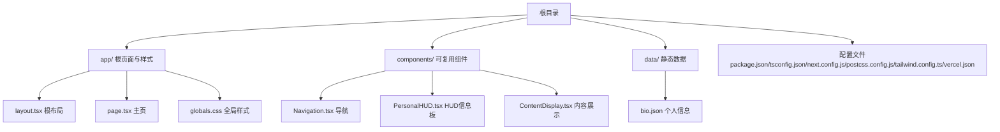
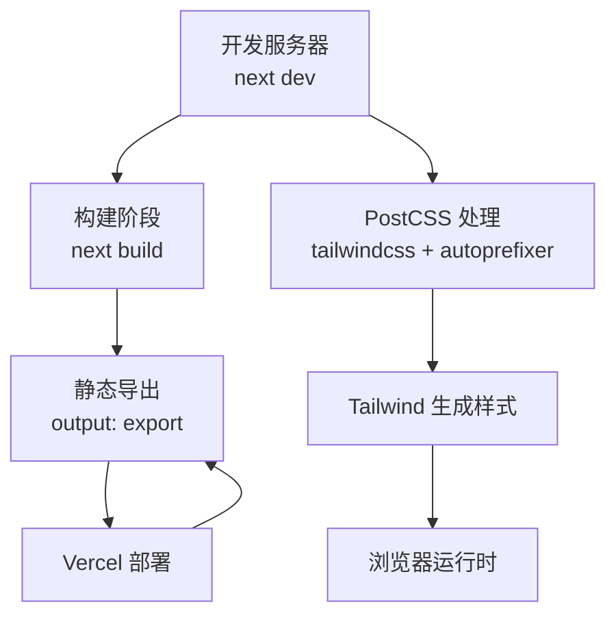
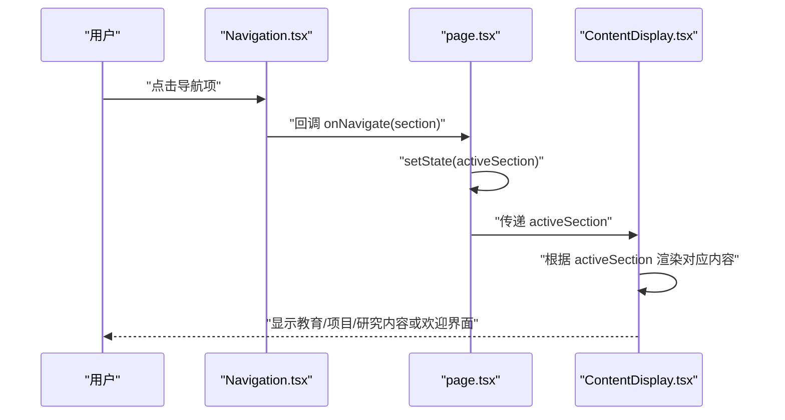
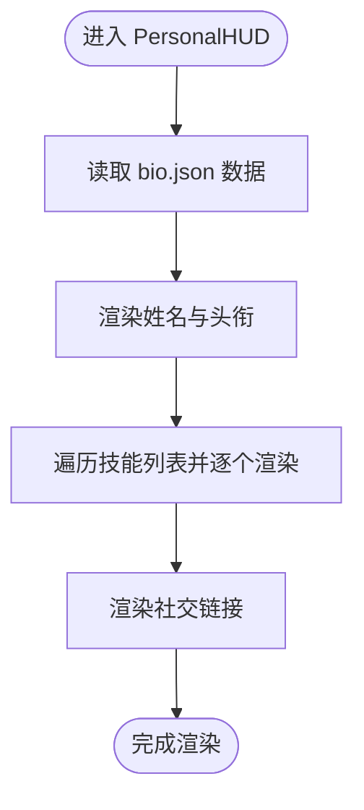
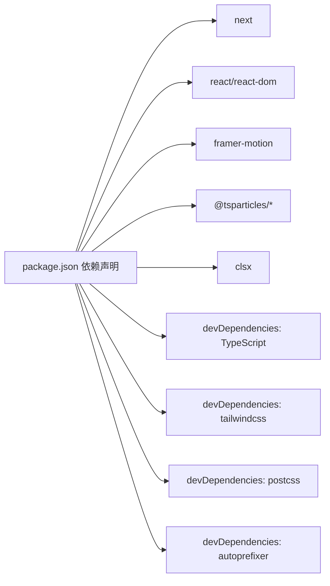

# 开发指南

<cite>
**本文引用的文件**
- [package.json](file://package.json)
- [tsconfig.json](file://tsconfig.json)
- [next.config.js](file://next.config.js)
- [postcss.config.js](file://postcss.config.js)
- [tailwind.config.ts](file://tailwind.config.ts)
- [.gitignore](file://.gitignore)
- [README.md](file://README.md)
- [app/layout.tsx](file://app/layout.tsx)
- [app/page.tsx](file://app/page.tsx)
- [app/globals.css](file://app/globals.css)
- [components/Navigation.tsx](file://components/Navigation.tsx)
- [components/PersonalHUD.tsx](file://components/PersonalHUD.tsx)
- [components/ContentDisplay.tsx](file://components/ContentDisplay.tsx)
- [data/bio.json](file://data/bio.json)
- [vercel.json](file://vercel.json)
</cite>

## 目录
1. [引言](#引言)
2. [项目结构](#项目结构)
3. [核心组件](#核心组件)
4. [架构总览](#架构总览)
5. [详细组件分析](#详细组件分析)
6. [依赖关系分析](#依赖关系分析)
7. [性能考量](#性能考量)
8. [故障排查指南](#故障排查指南)
9. [结论](#结论)
10. [附录](#附录)

## 引言
本指南面向参与“杨天成个人网页”项目的开发者，提供从环境搭建、工具链配置、代码规范到调试与部署的全流程说明。项目采用 Next.js App Router、TypeScript、Tailwind CSS、Framer Motion 与 react-tsparticles，强调赛博朋克风格的视觉与交互体验。本文档将帮助你快速上手开发、高效迭代并保持一致的工程化标准。

## 项目结构
项目采用 Next.js App Router 的目录组织方式，根目录包含配置文件与静态资源，app 目录承载页面与全局样式，components 目录存放可复用 UI 组件，data 目录用于存放静态数据文件。整体结构清晰、职责明确，便于扩展与维护。

图表来源
- [app/layout.tsx:1-37](file://app/layout.tsx#L1-L37)
- [app/page.tsx:1-61](file://app/page.tsx#L1-L61)
- [app/globals.css:1-212](file://app/globals.css#L1-L212)
- [components/Navigation.tsx:1-103](file://components/Navigation.tsx#L1-L103)
- [components/PersonalHUD.tsx:1-132](file://components/PersonalHUD.tsx#L1-L132)
- [components/ContentDisplay.tsx:1-125](file://components/ContentDisplay.tsx#L1-L125)
- [data/bio.json:1-14](file://data/bio.json#L1-L14)

章节来源
- [README.md:146-169](file://README.md#L146-L169)

## 核心组件
- 根布局与元数据：在根布局中集中管理站点元信息与字体资源加载，确保全局样式与 SEO 友好。
- 主页容器：负责协调粒子背景、HUD 信息板、内容展示区与底部导航，统一调度各模块的状态与交互。
- 导航组件：提供赛博朋克风格的导航按钮，支持悬停与激活态的动态效果。
- HUD 信息板：以全息风格展示个人信息、技能矩阵与社交链接，配合扫描线与发光效果增强沉浸感。
- 内容展示区：根据当前选中区域动态渲染教育、项目或研究内容，配合淡入淡出与模糊过渡提升观感。

章节来源
- [app/layout.tsx:1-37](file://app/layout.tsx#L1-L37)
- [app/page.tsx:1-61](file://app/page.tsx#L1-L61)
- [components/Navigation.tsx:1-103](file://components/Navigation.tsx#L1-L103)
- [components/PersonalHUD.tsx:1-132](file://components/PersonalHUD.tsx#L1-L132)
- [components/ContentDisplay.tsx:1-125](file://components/ContentDisplay.tsx#L1-L125)

## 架构总览
下图展示了开发时的请求与构建流程，以及样式管线与静态导出配置的关系。

图表来源
- [next.config.js:1-11](file://next.config.js#L1-L11)
- [postcss.config.js:1-7](file://postcss.config.js#L1-L7)
- [tailwind.config.ts:1-72](file://tailwind.config.ts#L1-L72)
- [vercel.json:1-7](file://vercel.json#L1-L7)

## 详细组件分析

### TypeScript 编译配置
- 严格模式与增量编译：启用严格类型检查与增量编译，提升开发反馈速度与类型安全性。
- 模块解析策略：使用 bundler 解析，适配 App Router 与路径别名。
- 路径别名：通过路径映射简化导入语句，统一项目内引用风格。
- 插件集成：内置 Next 类型插件，确保框架类型支持。

章节来源
- [tsconfig.json:1-27](file://tsconfig.json#L1-L27)

### Next.js 开发服务器与构建配置
- 开发脚本：通过 npm 脚本启动 Next.js 开发服务器。
- 静态导出：配置为静态导出模式，适合托管于 Vercel 或静态 CDN。
- 图片优化：关闭图片优化，结合静态导出避免额外体积与复杂度。
- Trailing slash：开启尾随斜杠，保证路由一致性。

章节来源
- [package.json:5-10](file://package.json#L5-L10)
- [next.config.js:1-11](file://next.config.js#L1-L11)

### PostCSS 与 Tailwind 配置
- 插件链：Tailwind CSS 与 Autoprefixer 顺序执行，确保原子类与浏览器兼容性。
- 内容扫描：Tailwind 配置扫描 app、components 与 pages 下的 TS/JS/MDX 文件，按需生成样式。
- 自定义主题：扩展颜色、字体、阴影、动画与背景图案，满足赛博朋克风格需求。
- 关键帧与背景：内置多种动画与背景网格，供组件按需使用。

章节来源
- [postcss.config.js:1-7](file://postcss.config.js#L1-L7)
- [tailwind.config.ts:1-72](file://tailwind.config.ts#L1-L72)

### 样式与主题系统
- 全局样式：集中定义基础排版、滚动条、选择色与自定义动画，确保跨组件一致性。
- 字体资源：在根布局中预连接并加载 Google Fonts，保障首屏渲染与字体可用性。
- 主题变量：通过 CSS 变量与 Tailwind 扩展颜色体系，统一视觉语言。

章节来源
- [app/globals.css:1-212](file://app/globals.css#L1-L212)
- [app/layout.tsx:24-29](file://app/layout.tsx#L24-L29)

### 组件交互序列（导航切换）

图表来源
- [components/Navigation.tsx:17-103](file://components/Navigation.tsx#L17-L103)
- [app/page.tsx:9-14](file://app/page.tsx#L9-L14)
- [components/ContentDisplay.tsx:12-42](file://components/ContentDisplay.tsx#L12-L42)

### 数据驱动的 HUD 展示

图表来源
- [components/PersonalHUD.tsx:6-132](file://components/PersonalHUD.tsx#L6-L132)
- [data/bio.json:1-14](file://data/bio.json#L1-L14)

### 根布局与元数据
- 元信息：集中定义标题、关键词、作者与 Open Graph，提升 SEO 与分享质量。
- 字体加载：在 head 中预连接并加载所需字体，减少 FOIT/FOFT 风险。
- 语言属性：根 html 设置语言，利于无障碍与搜索引擎识别。

章节来源
- [app/layout.tsx:4-14](file://app/layout.tsx#L4-L14)
- [app/layout.tsx:24-29](file://app/layout.tsx#L24-L29)

## 依赖关系分析
- 运行时依赖：Next.js、React、Framer Motion、react-tsparticles、clsx 等，支撑页面渲染、动画与粒子效果。
- 开发依赖：TypeScript、Tailwind CSS、PostCSS、Autoprefixer，提供类型安全与样式管线。
- 构建与部署：静态导出与 Vercel 配置，简化部署流程。

图表来源
- [package.json:11-28](file://package.json#L11-L28)

章节来源
- [package.json:1-30](file://package.json#L1-L30)

## 性能考量
- 静态导出：启用静态导出可显著降低运行时开销，适合个人主页与静态内容场景。
- 图片优化：关闭图片优化以避免额外处理，结合静态导出更简洁稳定。
- 样式体积：Tailwind 按需扫描内容文件，建议仅保留实际使用的组件与类名，避免无谓膨胀。
- 动画与粒子：合理控制动画数量与复杂度，避免在低端设备上出现掉帧。
- 字体加载：预连接与异步加载字体，减少阻塞；必要时可考虑本地化字体以提升稳定性。

章节来源
- [next.config.js:3-8](file://next.config.js#L3-L8)
- [tailwind.config.ts:4-8](file://tailwind.config.ts#L4-L8)

## 故障排查指南
- 开发服务器无法启动
  - 检查 Node 版本与依赖安装是否正确。
  - 确认端口未被占用，或调整 Next.js 端口配置。
  - 参考脚本定义与 Next 版本约束。
- 样式未生效
  - 确认 PostCSS 插件链与 Tailwind 配置存在且正确。
  - 检查内容扫描路径是否覆盖到目标组件。
  - 验证全局样式文件是否被正确引入。
- 粒子效果不显示
  - 确认粒子组件已正确挂载在根层。
  - 检查窗口尺寸变化与事件绑定是否正常。
- 导航切换无效
  - 检查父组件传递的回调函数与状态是否正确。
  - 确认切换逻辑与 key 值是否匹配。
- 部署异常
  - 确认 Vercel 配置与构建命令一致。
  - 检查静态导出产物是否完整上传。

章节来源
- [package.json:5-10](file://package.json#L5-L10)
- [next.config.js:1-11](file://next.config.js#L1-L11)
- [postcss.config.js:1-7](file://postcss.config.js#L1-L7)
- [tailwind.config.ts:4-8](file://tailwind.config.ts#L4-L8)
- [vercel.json:1-7](file://vercel.json#L1-L7)

## 结论
本项目以 Next.js App Router 为核心，结合 Tailwind CSS 与 Framer Motion，构建了具备赛博朋克风格的交互式个人主页。通过静态导出与 Vercel 零配置部署，实现了快速上线与稳定运行。遵循本文档的开发规范与工具链配置，可确保团队协作的一致性与开发效率。

## 附录

### 开发环境配置清单
- Node.js 与包管理器：使用 npm 并安装依赖。
- 开发命令：使用提供的脚本启动开发服务器。
- TypeScript：启用严格模式与增量编译，使用路径别名。
- PostCSS：启用 Tailwind CSS 与 Autoprefixer。
- Tailwind：按需扫描内容文件，扩展主题与动画。
- Git：忽略构建产物与临时文件，避免污染仓库。

章节来源
- [package.json:5-10](file://package.json#L5-L10)
- [tsconfig.json:1-27](file://tsconfig.json#L1-L27)
- [postcss.config.js:1-7](file://postcss.config.js#L1-L7)
- [tailwind.config.ts:4-8](file://tailwind.config.ts#L4-L8)
- [.gitignore:1-36](file://.gitignore#L1-L36)

### 代码规范与最佳实践
- 文件命名：组件文件使用帕斯卡命名，页面文件使用小写加连字符；数据文件使用小写加下划线。
- 组件结构：功能单一、可复用性强；使用客户端组件标记以启用客户端状态与动画。
- 样式组织：优先使用 Tailwind 原子类；自定义动画与样式集中在全局样式文件中。
- 数据驱动：将可变内容放入 JSON 文件，组件通过导入方式消费，便于非技术成员维护。
- 路由与布局：利用 App Router 的嵌套布局与元数据能力，统一 SEO 与外观。

章节来源
- [components/Navigation.tsx:1-103](file://components/Navigation.tsx#L1-L103)
- [components/PersonalHUD.tsx:1-132](file://components/PersonalHUD.tsx#L1-L132)
- [components/ContentDisplay.tsx:1-125](file://components/ContentDisplay.tsx#L1-L125)
- [data/bio.json:1-14](file://data/bio.json#L1-L14)

### 开发工具链配置
- ESLint：使用 Next.js 推荐规则，确保代码风格一致与潜在问题尽早暴露。
- Prettier：统一缩进、引号与换行等格式，减少审阅分歧。
- Git 钩子：在提交前自动运行格式化与简单检查，保证主分支整洁。

章节来源
- [package.json:5-10](file://package.json#L5-L10)

### 调试技巧与效率提升
- 热重载：Next.js 默认启用，修改任意文件即可即时刷新。
- 源码映射：TypeScript 与 PostCSS 输出均保留映射，便于断点调试与定位样式来源。
- 远程调试：在浏览器中打开 React DevTools 与网络面板，观察组件树与资源加载。
- 动画调试：在低帧率模式下观察动画流畅度，必要时减少复杂动画或降低频率。

章节来源
- [tsconfig.json:6-14](file://tsconfig.json#L6-L14)
- [postcss.config.js:1-7](file://postcss.config.js#L1-L7)

### 开发、测试与生产环境差异
- 开发环境：启用严格类型检查与增量编译，使用开发服务器热重载。
- 测试环境：可沿用开发配置，增加轻量级测试脚本与快照对比。
- 生产环境：启用静态导出与尾随斜杠，关闭图片优化，确保最小化体积与最佳性能。

章节来源
- [next.config.js:3-8](file://next.config.js#L3-L8)
- [vercel.json:1-7](file://vercel.json#L1-L7)

### 团队协作与代码审查标准
- 分支策略：主分支保护，功能开发在特性分支进行合并请求。
- 提交信息：采用清晰的类型前缀与简要描述，便于自动化与回溯。
- 代码审查：至少一名合作者批准，关注可读性、性能与可维护性。
- 文档同步：变更配置或新增功能时同步更新 README 与注释。

章节来源
- [README.md:1-196](file://README.md#L1-L196)