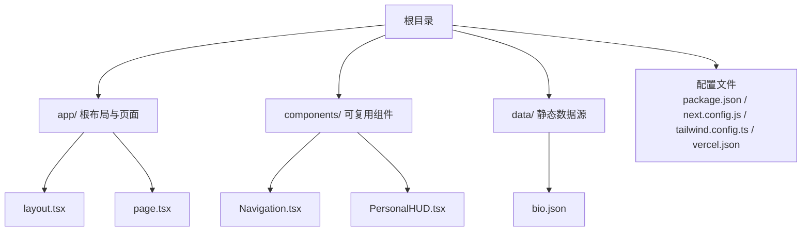
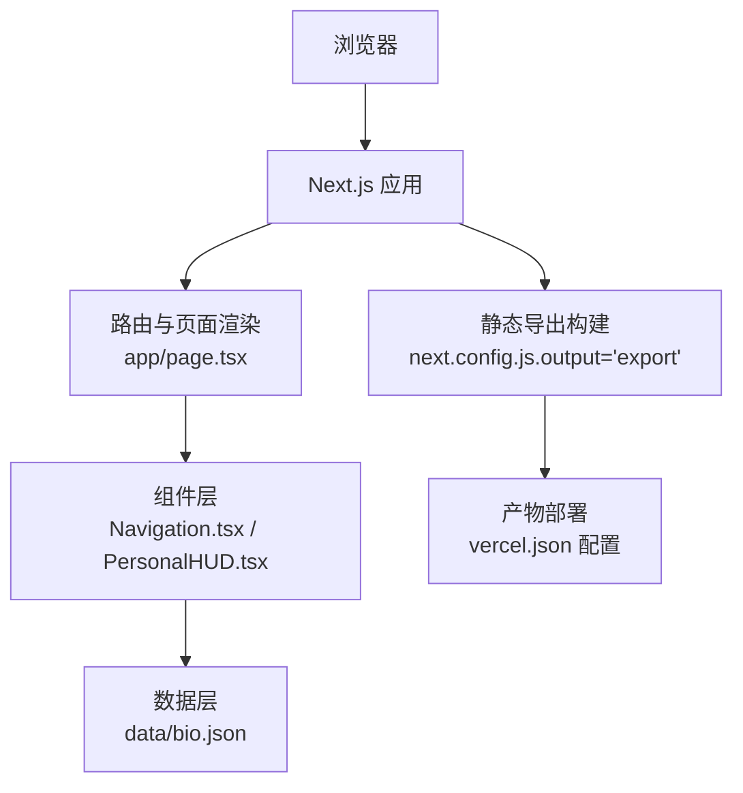
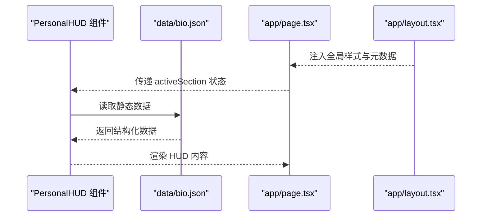
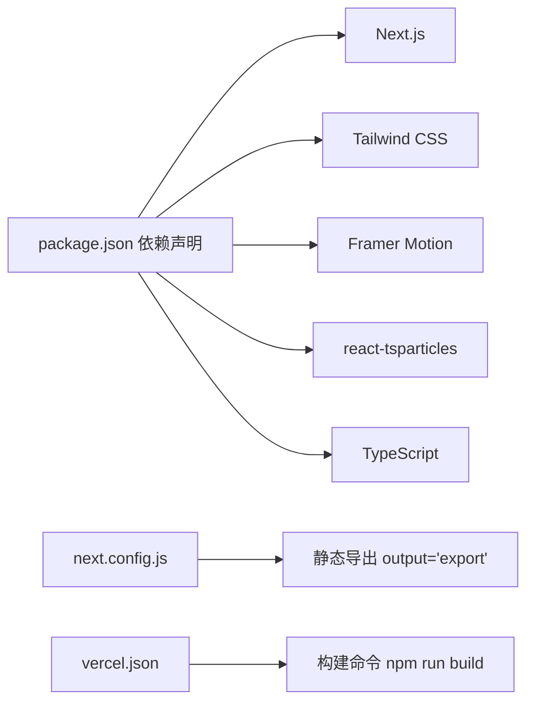

# 开发流程与协作

<cite>
**本文引用的文件**
- [README.md](file://README.md)
- [package.json](file://package.json)
- [vercel.json](file://vercel.json)
- [next.config.js](file://next.config.js)
- [tailwind.config.ts](file://tailwind.config.ts)
- [app/layout.tsx](file://app/layout.tsx)
- [app/page.tsx](file://app/page.tsx)
- [components/Navigation.tsx](file://components/Navigation.tsx)
- [components/PersonalHUD.tsx](file://components/PersonalHUD.tsx)
- [data/bio.json](file://data/bio.json)
</cite>

## 目录
1. [引言](#引言)
2. [项目结构](#项目结构)
3. [核心组件](#核心组件)
4. [架构总览](#架构总览)
5. [详细组件分析](#详细组件分析)
6. [依赖分析](#依赖分析)
7. [性能考虑](#性能考虑)
8. [故障排查指南](#故障排查指南)
9. [结论](#结论)
10. [附录](#附录)

## 引言
本文件面向团队协作与标准化开发流程，结合当前仓库现状，给出一套可落地的 Git 工作流、分支策略、提交规范、代码审查流程、版本控制最佳实践（含标签与发布）、回滚策略、持续集成与自动化测试配置思路、项目管理工具使用建议、团队沟通与知识分享规范、新成员入职与环境搭建指引，以及文档维护与知识库建设方法。由于本仓库为个人项目，部分流程以“最小可行实践”形式呈现，便于后续扩展为团队协作模式。

## 项目结构
该项目采用 Next.js App Router 结构，前端资源按功能模块组织，数据通过 JSON 文件注入组件，构建与部署通过 Vercel 配置驱动。整体结构清晰，职责边界明确，适合逐步引入标准化流程与工具链。

图表来源
- [app/layout.tsx:1-37](file://app/layout.tsx#L1-L37)
- [app/page.tsx:1-61](file://app/page.tsx#L1-L61)
- [components/Navigation.tsx:1-103](file://components/Navigation.tsx#L1-L103)
- [components/PersonalHUD.tsx:1-132](file://components/PersonalHUD.tsx#L1-L132)
- [data/bio.json:1-14](file://data/bio.json#L1-L14)
- [package.json:1-30](file://package.json#L1-L30)
- [next.config.js:1-11](file://next.config.js#L1-L11)
- [tailwind.config.ts:1-72](file://tailwind.config.ts#L1-L72)
- [vercel.json:1-7](file://vercel.json#L1-L7)

章节来源
- [README.md:146-169](file://README.md#L146-L169)
- [package.json:1-30](file://package.json#L1-L30)
- [next.config.js:1-11](file://next.config.js#L1-L11)
- [tailwind.config.ts:1-72](file://tailwind.config.ts#L1-L72)
- [vercel.json:1-7](file://vercel.json#L1-L7)

## 核心组件
- 页面与布局：根布局负责元数据与全局样式注入；主页面组合多个功能组件，统一协调导航、HUD、内容展示与装饰元素。
- 导航组件：提供底部导航栏，支持悬停与点击反馈，配合父组件的状态切换实现内容区的动态展示。
- HUD 组件：顶部右侧信息面板，展示静态数据并带有赛博朋克风格的视觉特效。
- 数据源：通过 JSON 文件提供生物信息等静态数据，便于非技术成员参与内容维护。

章节来源
- [app/layout.tsx:1-37](file://app/layout.tsx#L1-L37)
- [app/page.tsx:1-61](file://app/page.tsx#L1-L61)
- [components/Navigation.tsx:1-103](file://components/Navigation.tsx#L1-L103)
- [components/PersonalHUD.tsx:1-132](file://components/PersonalHUD.tsx#L1-L132)
- [data/bio.json:1-14](file://data/bio.json#L1-L14)

## 架构总览
下图展示了从用户访问到页面渲染的关键路径，以及静态数据注入与构建部署的衔接。

图表来源
- [app/page.tsx:1-61](file://app/page.tsx#L1-L61)
- [components/Navigation.tsx:1-103](file://components/Navigation.tsx#L1-L103)
- [components/PersonalHUD.tsx:1-132](file://components/PersonalHUD.tsx#L1-L132)
- [data/bio.json:1-14](file://data/bio.json#L1-L14)
- [next.config.js:1-11](file://next.config.js#L1-L11)
- [vercel.json:1-7](file://vercel.json#L1-L7)

## 详细组件分析

### 页面与布局
- 职责：设置站点元信息、全局样式与字体资源，作为所有页面的根容器。
- 关键点：通过 Open Graph 字段提升社交分享质量；字体资源在头部预连接，优化首屏渲染。

章节来源
- [app/layout.tsx:1-37](file://app/layout.tsx#L1-L37)

### 主页面与内容编排
- 职责：协调粒子背景、HUD、导航与内容展示区域，维持整体视觉节奏与交互一致性。
- 关键点：使用状态机切换活动区域，避免重复渲染；装饰性扫描线与坐标提示增强赛博朋克氛围。

章节来源
- [app/page.tsx:1-61](file://app/page.tsx#L1-L61)

### 导航组件
- 职责：提供底部导航按钮，响应悬停与点击事件，高亮当前选中项。
- 关键点：使用 Framer Motion 实现渐变光晕、抖动与布局动画；通过 layoutId 实现指示器平滑过渡。

章节来源
- [components/Navigation.tsx:1-103](file://components/Navigation.tsx#L1-L103)

### HUD 组件
- 职责：顶部右侧信息面板，展示姓名、头衔、年龄、地点、状态、技能矩阵与社交链接。
- 关键点：多层发光边框与扫描线效果；技能标签逐个入场动画；外发光边框随时间流动。

章节来源
- [components/PersonalHUD.tsx:1-132](file://components/PersonalHUD.tsx#L1-L132)
- [data/bio.json:1-14](file://data/bio.json#L1-L14)

### 数据注入流程（以生物信息为例）

图表来源
- [components/PersonalHUD.tsx:1-132](file://components/PersonalHUD.tsx#L1-L132)
- [data/bio.json:1-14](file://data/bio.json#L1-L14)
- [app/page.tsx:1-61](file://app/page.tsx#L1-L61)
- [app/layout.tsx:1-37](file://app/layout.tsx#L1-L37)

## 依赖分析
- 构建与运行：Next.js 提供 App Router 与静态导出能力；Vercel 配置简化部署流程。
- 样式与主题：Tailwind CSS 提供实用类与主题扩展，满足赛博朋克风格的配色与动画需求。
- 动画与粒子：Framer Motion 与 react-tsparticles 提供丰富的交互与视觉效果。
- 类型与工具链：TypeScript、PostCSS、Tailwind CSS、Autoprefixer 等保证开发体验与兼容性。

图表来源
- [package.json:1-30](file://package.json#L1-L30)
- [next.config.js:1-11](file://next.config.js#L1-L11)
- [vercel.json:1-7](file://vercel.json#L1-L7)

章节来源
- [package.json:1-30](file://package.json#L1-L30)
- [next.config.js:1-11](file://next.config.js#L1-L11)
- [tailwind.config.ts:1-72](file://tailwind.config.ts#L1-L72)
- [vercel.json:1-7](file://vercel.json#L1-L7)

## 性能考虑
- 静态导出与图片优化：启用静态导出与图片未优化配置，减少运行时开销；在需要时可切换为 CDN 图片优化。
- 字体加载：预连接 Google Fonts，缩短首屏字体加载时间；可考虑本地化关键字体或使用系统字体回退。
- 动画与粒子：合理控制动画数量与复杂度，避免过度消耗 GPU/CPU；在移动设备上可降级为更轻量的动画。
- 构建体积：定期清理未使用依赖与样式，利用 Tree Shaking 与按需导入降低包体。

## 故障排查指南
- 开发服务器无法启动
  - 检查 Node.js 版本与依赖安装是否正确。
  - 章节来源
    - [package.json:1-30](file://package.json#L1-L30)
- 构建失败或部署异常
  - 确认 Vercel 配置与构建命令一致。
  - 章节来源
    - [vercel.json:1-7](file://vercel.json#L1-L7)
- 页面空白或样式缺失
  - 检查全局样式与字体资源是否正确加载。
  - 章节来源
    - [app/layout.tsx:1-37](file://app/layout.tsx#L1-L37)
- 动画不生效或闪烁
  - 检查 Framer Motion 与粒子库版本兼容性，必要时降级或升级至稳定版本。
  - 章节来源
    - [components/Navigation.tsx:1-103](file://components/Navigation.tsx#L1-L103)
    - [components/PersonalHUD.tsx:1-132](file://components/PersonalHUD.tsx#L1-L132)
- 数据未更新
  - 确认 JSON 数据格式与字段名一致，避免拼写错误。
  - 章节来源
    - [data/bio.json:1-14](file://data/bio.json#L1-L14)

## 结论
本项目以简洁清晰的结构实现了赛博朋克风格的个人主页，具备良好的可维护性与扩展性。建议在此基础上逐步引入标准化的开发流程与协作规范，以支撑未来可能的多人协作与持续交付。

## 附录

### Git 工作流程与分支策略
- 分支模型
  - main/master：生产分支，保持稳定，仅接受受控变更。
  - develop：开发分支，集成日常功能开发。
  - feature/<name>：功能开发分支，从 develop 派生，完成后合并回 develop。
  - hotfix/<name>：紧急修复分支，从 main 派生，修复后同时合并回 main 与 develop。
- 提交规范
  - 类型：feat、fix、docs、style、refactor、test、chore、perf、ci、build
  - 格式：type(scope): subject（subject 首字母小写，不超过 50 字）
  - 示例：feat(components): 新增导航组件交互逻辑
- 合并流程
  - 使用 Pull Request/Merge Request 进行代码合并，强制开启 CI 校验与至少一名审查者批准。
  - 合并前确保无冲突、无语法错误、无破坏性变更。

### 代码审查标准
- 正确性：逻辑正确、边界处理完善、无明显缺陷。
- 可读性：命名清晰、注释充分、函数单一职责。
- 兼容性：不破坏现有 API 与行为；必要时提供迁移指南。
- 性能：避免冗余计算与渲染；注意动画与资源占用。
- 安全性：输入校验、权限控制、敏感信息脱敏。

### 版本控制最佳实践
- 标签管理
  - 使用语义化版本（SemVer），遵循主版本.次版本.修订号。
  - 发布前打标签并推送，确保与发布说明一致。
- 发布流程
  - develop 合并至 main 后打标签并触发 CI 构建与部署。
  - 生产环境变更必须有明确的发布计划与回滚预案。
- 回滚策略
  - 若问题紧急，回滚至上一稳定标签；若涉及重大变更，准备灰度发布与快速回滚脚本。

### 持续集成与自动化测试
- CI 配置思路
  - 触发条件：push 到 feature/*、develop、main；PR 打开/更新。
  - 步骤：安装依赖 → Lint → 测试 → 构建 → 部署预览（feature）/生产部署（main）。
- 自动化测试
  - 单元测试：针对纯函数与工具函数。
  - 集成测试：针对组件交互与数据流。
  - 端到端测试：覆盖关键用户路径（如导航切换、数据加载）。

### 项目管理工具使用
- 任务分配
  - 使用 Issue/Backlog 管理需求与缺陷；为每个任务设定优先级与截止日期。
- 进度跟踪
  - 采用看板视图（待办/进行/测试/完成）可视化迭代进展。
  - 每日站会同步阻塞项与风险，周报总结产出与问题。

### 团队沟通与知识分享
- 规范
  - 统一沟通渠道（如企业微信/钉钉群），重要决策记录在案。
  - 知识库：Wiki/Confluence 维护流程文档、FAQ、最佳实践。
- 分享机制
  - 每月技术分享会，鼓励跨模块经验交流。
  - 代码评审会议中沉淀共性问题与改进建议。

### 新成员入职与开发环境搭建
- 环境要求
  - Node.js LTS、包管理器（推荐 pnpm/yarn/npm 一致化）、IDE 插件（ESLint、Prettier、TypeScript）。
- 搭建步骤
  - 克隆仓库 → 安装依赖 → 启动开发服务器 → 访问 http://localhost:3000 验证。
- 上手任务
  - 修改 data/*.json 完成内容更新 → 提交 PR → 评审与合并。

### 文档维护与知识库建设
- 维护策略
  - 随代码变更同步更新 README 与内部 Wiki；重要变更在 Changelog 记录。
- 知识库
  - 分类存储：流程规范、技术方案、常见问题、外部资料链接。
  - 权限与版本控制：限制编辑范围，保留历史版本以便追溯。