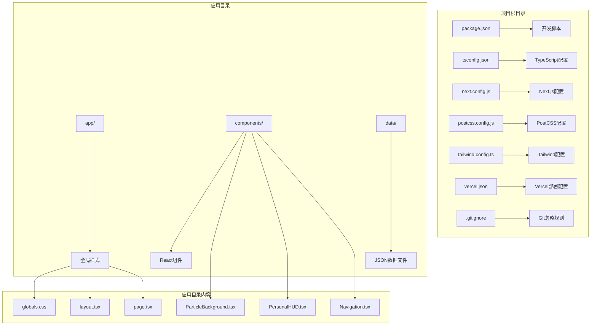
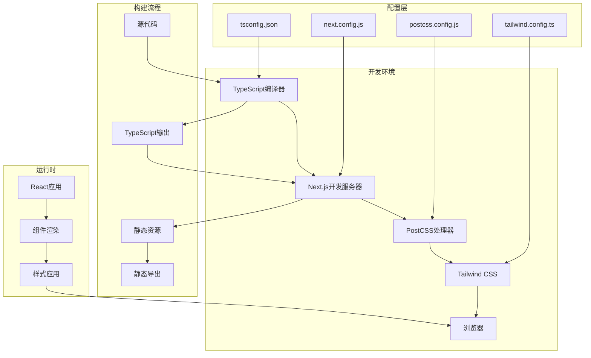
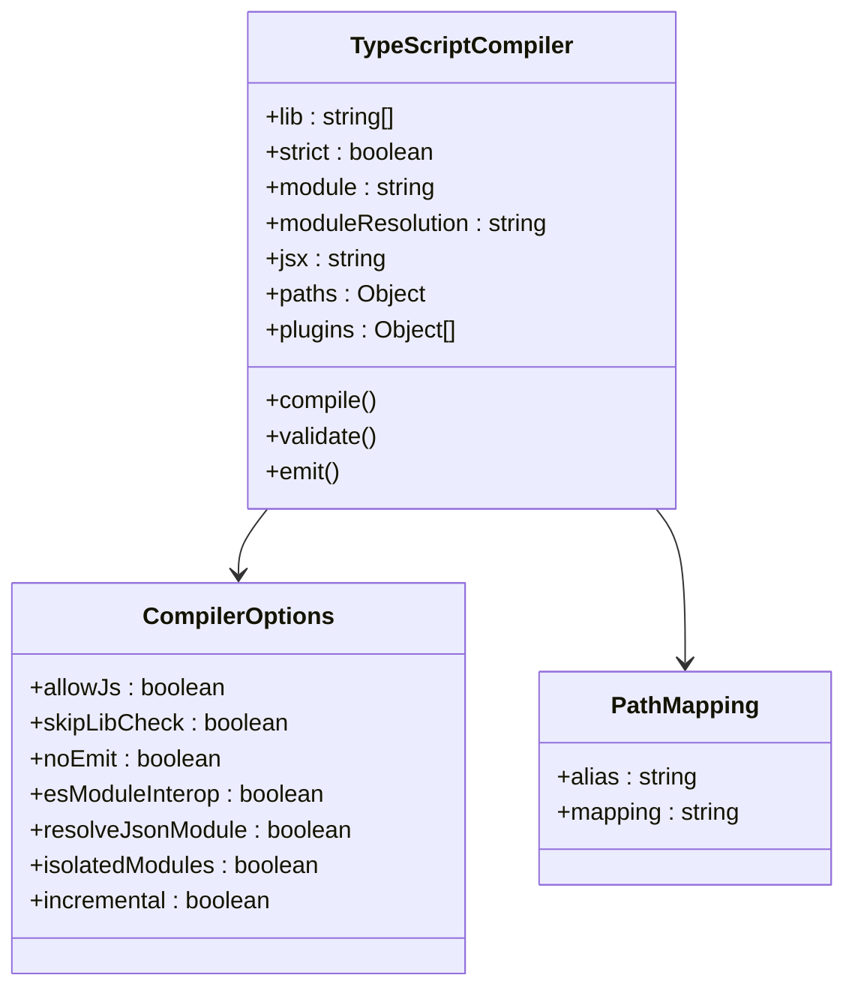
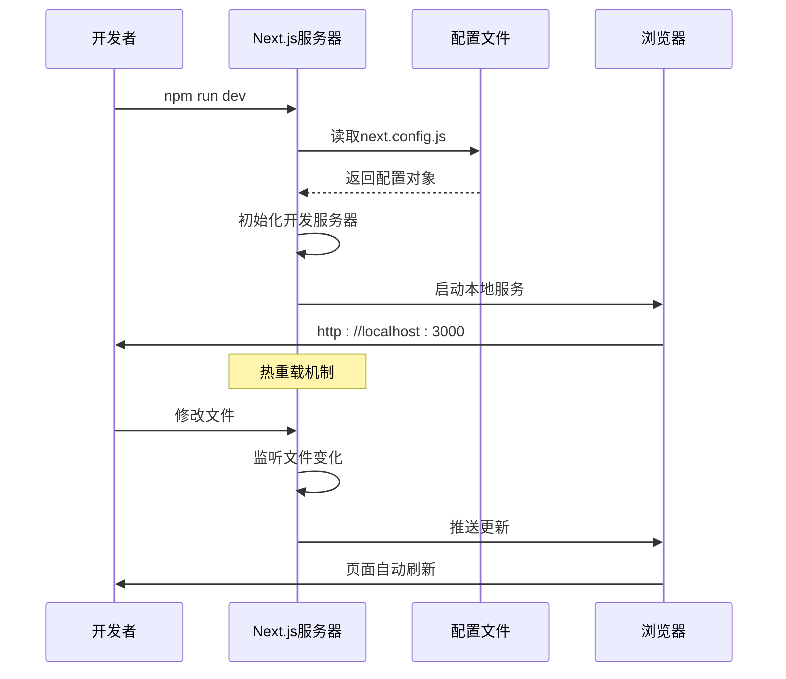
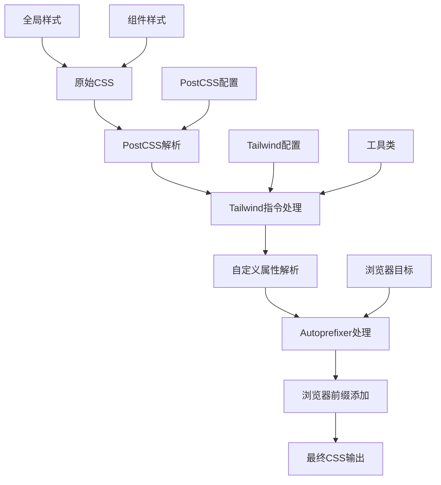
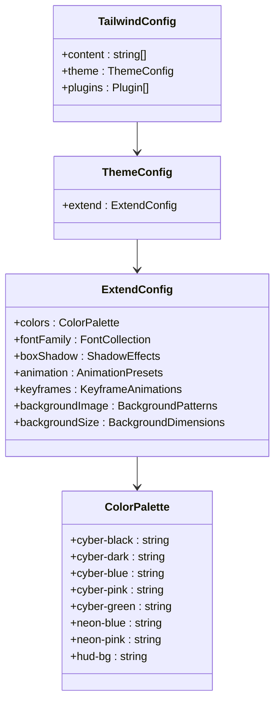
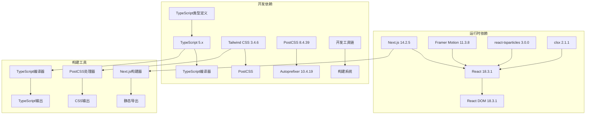

# 开发环境配置

<cite>
**本文档引用的文件**
- [tsconfig.json](file://杨天成个人网页/tsconfig.json)
- [next.config.js](file://杨天成个人网页/next.config.js)
- [postcss.config.js](file://杨天成个人网页/postcss.config.js)
- [tailwind.config.ts](file://杨天成个人网页/tailwind.config.ts)
- [package.json](file://杨天成个人网页/package.json)
- [.gitignore](file://杨天成个人网页/.gitignore)
- [vercel.json](file://杨天成个人网页/vercel.json)
- [app/layout.tsx](file://杨天成个人网页/app/layout.tsx)
- [app/page.tsx](file://杨天成个人网页/app/page.tsx)
- [app/globals.css](file://杨天成个人网页/app/globals.css)
</cite>

## 目录
1. [简介](#简介)
2. [项目结构](#项目结构)
3. [核心组件](#核心组件)
4. [架构概览](#架构概览)
5. [详细组件分析](#详细组件分析)
6. [依赖关系分析](#依赖关系分析)
7. [性能考虑](#性能考虑)
8. [故障排除指南](#故障排除指南)
9. [结论](#结论)

## 简介

这是一个基于Next.js 14构建的赛博朋克风格个人主页项目。该项目采用TypeScript进行类型安全开发，使用Tailwind CSS进行样式设计，结合Framer Motion实现流畅动画效果，以及react-tsparticles创建粒子背景效果。本文档将详细介绍开发环境的配置和最佳实践。

## 项目结构

该项目遵循Next.js App Router的目录结构，主要包含以下关键目录和文件：

**图表来源**
- [package.json:1-30](file://杨天成个人网页/package.json#L1-L30)
- [tsconfig.json:1-27](file://杨天成个人网页/tsconfig.json#L1-L27)
- [next.config.js:1-11](file://杨天成个人网页/next.config.js#L1-L11)

**章节来源**
- [package.json:1-30](file://杨天成个人网页/package.json#L1-L30)
- [README.md:146-169](file://杨天成个人网页/README.md#L146-L169)

## 核心组件

### TypeScript编译配置

项目使用严格的TypeScript配置来确保代码质量：

**编译选项详解**：
- **严格模式**：启用所有严格检查选项，提高代码可靠性
- **模块系统**：使用ESNext模块系统，支持现代JavaScript特性
- **路径映射**：通过`@/*`别名简化导入路径
- **增量编译**：启用增量编译提升开发体验
- **JSX处理**：保留JSX语法用于Next.js渲染

**路径映射配置**：
- `@/*` 映射到项目根目录
- 支持相对路径导入，简化组件引用

**章节来源**
- [tsconfig.json:2-26](file://杨天成个人网页/tsconfig.json#L2-L26)

### Next.js开发服务器配置

项目采用简化的Next.js配置，专注于静态导出功能：

**核心配置项**：
- **静态导出**：配置为`export`模式，适合静态托管平台
- **图片优化**：禁用图片优化以配合静态导出
- **尾部斜杠**：启用尾部斜杠确保URL一致性

**开发服务器行为**：
- 默认端口：3000
- 热重载：自动文件监听和页面刷新
- 错误处理：友好的开发时错误显示

**章节来源**
- [next.config.js:2-8](file://杨天成个人网页/next.config.js#L2-L8)

### PostCSS处理流程

项目使用PostCSS作为CSS预处理器，集成Tailwind CSS和Autoprefixer：

**PostCSS插件配置**：
- **Tailwind CSS**：实用优先的CSS框架
- **Autoprefixer**：自动添加浏览器前缀

**CSS处理流程**：
1. 解析PostCSS配置
2. 应用Tailwind指令
3. 处理CSS自定义属性
4. 添加浏览器兼容性前缀
5. 生成最终CSS文件

**章节来源**
- [postcss.config.js:1-7](file://杨天成个人网页/postcss.config.js#L1-L7)

### Tailwind CSS配置

定制化的Tailwind配置支持赛博朋克主题设计：

**主题扩展**：
- **颜色系统**：赛博朋克配色方案
- **字体系统**：科技感字体组合
- **动画系统**：自定义动画效果
- **背景图案**：网格背景和数据流效果

**内容扫描**：
- 扫描app、components、pages目录
- 自动移除未使用的CSS类

**章节来源**
- [tailwind.config.ts:3-71](file://杨天成个人网页/tailwind.config.ts#L3-L71)

## 架构概览

**图表来源**
- [tsconfig.json:1-27](file://杨天成个人网页/tsconfig.json#L1-L27)
- [next.config.js:1-11](file://杨天成个人网页/next.config.js#L1-L11)
- [postcss.config.js:1-7](file://杨天成个人网页/postcss.config.js#L1-L7)
- [tailwind.config.ts:1-72](file://杨天成个人网页/tailwind.config.ts#L1-L72)

## 详细组件分析

### TypeScript编译器配置分析

**图表来源**
- [tsconfig.json:2-22](file://杨天成个人网页/tsconfig.json#L2-L22)

**配置要点**：
- **模块解析策略**：使用bundler解析器
- **路径别名**：`@/*`到根目录映射
- **插件支持**：内置Next.js TypeScript插件
- **严格类型检查**：确保代码质量

**章节来源**
- [tsconfig.json:2-26](file://杨天成个人网页/tsconfig.json#L2-L26)

### Next.js开发服务器配置分析

**图表来源**
- [next.config.js:2-8](file://杨天成个人网页/next.config.js#L2-L8)
- [package.json:5-10](file://杨天成个人网页/package.json#L5-L10)

**配置特点**：
- **静态导出模式**：适合GitHub Pages等静态托管
- **图片优化**：禁用以避免构建复杂性
- **URL规范化**：尾部斜杠确保链接一致性

**章节来源**
- [next.config.js:2-8](file://杨天成个人网页/next.config.js#L2-L8)

### PostCSS处理流程分析

**图表来源**
- [postcss.config.js:1-7](file://杨天成个人网页/postcss.config.js#L1-L7)
- [tailwind.config.ts:3-71](file://杨天成个人网页/tailwind.config.ts#L3-L71)

**处理流程**：
1. 解析PostCSS配置文件
2. 应用Tailwind CSS指令
3. 处理CSS自定义属性
4. 添加浏览器兼容性前缀
5. 生成最终可执行的CSS

**章节来源**
- [postcss.config.js:1-7](file://杨天成个人网页/postcss.config.js#L1-L7)

### Tailwind CSS配置分析

**图表来源**
- [tailwind.config.ts:3-71](file://杨天成个人网页/tailwind.config.ts#L3-L71)

**主题特色**：
- **赛博朋克色彩**：电光蓝、霓虹粉、荧光绿
- **科技感字体**：Orbitron、Rajdhani、JetBrains Mono
- **动态效果**：脉冲发光、扫描线、数据流动画
- **几何图案**：网格背景、HUD叠加效果

**章节来源**
- [tailwind.config.ts:9-67](file://杨天成个人网页/tailwind.config.ts#L9-L67)

## 依赖关系分析

**图表来源**
- [package.json:11-28](file://杨天成个人网页/package.json#L11-L28)

**依赖特点**：
- **版本锁定**：使用caret符号保持兼容性
- **类型安全**：完整的TypeScript类型定义
- **现代化工具链**：支持最新Web标准
- **轻量级架构**：最小化不必要的依赖

**章节来源**
- [package.json:11-28](file://杨天成个人网页/package.json#L11-L28)

## 性能考虑

### 编译性能优化

**TypeScript编译优化**：
- 启用增量编译减少重复工作
- 使用bundler模块解析器提升性能
- 严格模式下的早期错误检测

**构建性能**：
- 静态导出减少运行时开销
- Tailwind CSS按需生成减少CSS体积
- 图片优化禁用避免额外处理

### 开发体验优化

**热重载机制**：
- 文件变更监听
- 局部组件更新
- 错误边界保护

**调试支持**：
- Source Maps生成
- 类型检查实时反馈
- 构建错误详细信息

## 故障排除指南

### 常见配置问题

**TypeScript编译错误**：
- 检查模块解析配置
- 验证路径映射正确性
- 确认类型定义完整性

**Next.js开发服务器问题**：
- 端口冲突检查（默认3000）
- 静态导出模式确认
- 文件权限问题排查

**CSS处理问题**：
- PostCSS插件顺序检查
- Tailwind内容扫描路径
- 浏览器兼容性前缀

### 环境变量配置

**开发环境变量**：
- `.env.local`用于本地开发
- `.env`用于共享变量
- `.env.production`用于生产环境

**配置管理建议**：
- 区分开发和生产配置
- 使用环境特定的API端点
- 保护敏感信息不提交到版本控制

### 依赖版本冲突

**解决策略**：
- 使用锁定文件确保一致性
- 定期更新依赖检查兼容性
- 使用包管理器的版本解析功能

**章节来源**
- [.gitignore:26-28](file://杨天成个人网页/.gitignore#L26-L28)

## 结论

本项目提供了完整的现代Web开发环境配置，涵盖了从TypeScript编译到CSS处理的完整工具链。通过合理的配置选择，实现了高性能的开发体验和高质量的最终产品。

**关键优势**：
- **类型安全**：完整的TypeScript配置确保代码质量
- **现代化工具链**：支持最新的Web标准和最佳实践
- **性能优化**：静态导出和增量编译提升开发效率
- **主题定制**：灵活的Tailwind CSS配置支持个性化设计

**推荐实践**：
- 保持依赖版本更新
- 利用TypeScript的严格模式
- 定期清理未使用的CSS类
- 使用环境变量管理配置