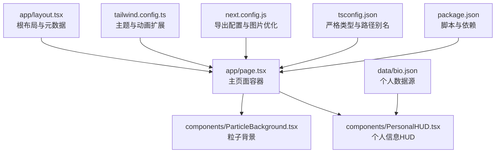
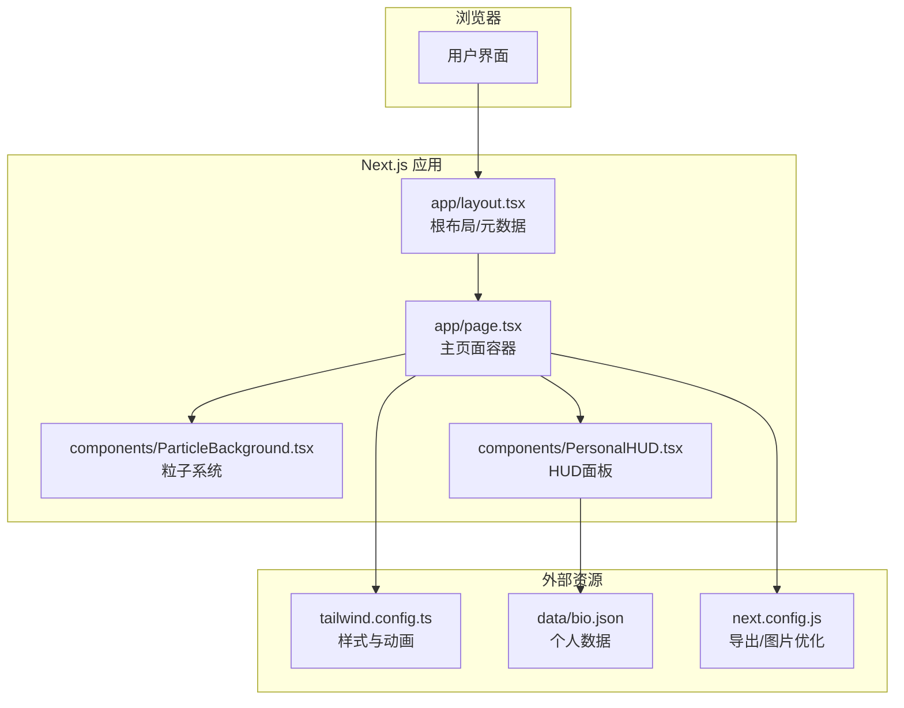
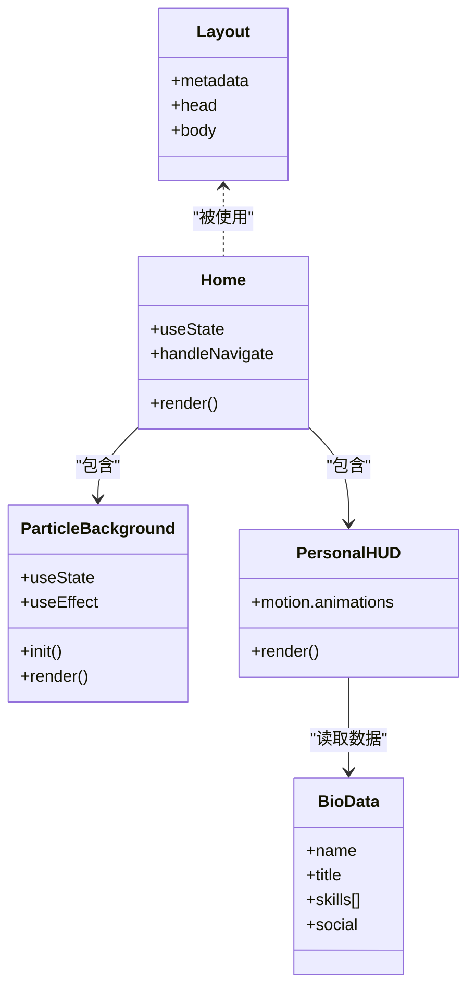
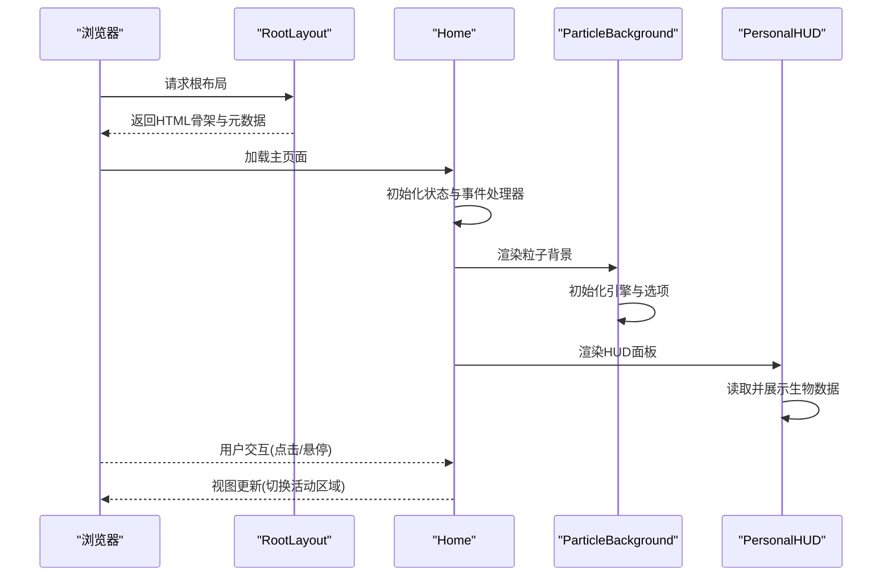
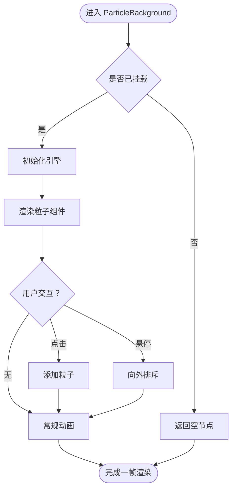
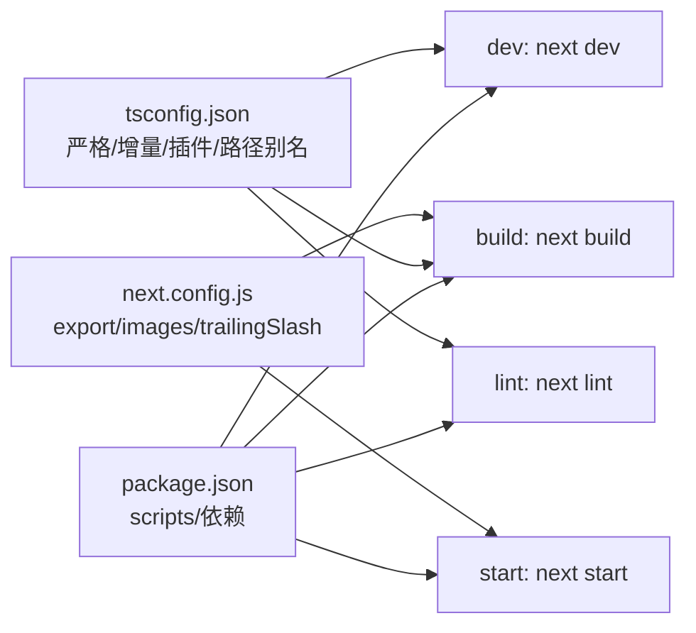

# 调试工具与技巧

<cite>
**本文引用的文件**
- [README.md](file://README.md)
- [package.json](file://package.json)
- [next.config.js](file://next.config.js)
- [tsconfig.json](file://tsconfig.json)
- [app/layout.tsx](file://app/layout.tsx)
- [app/page.tsx](file://app/page.tsx)
- [components/ParticleBackground.tsx](file://components/ParticleBackground.tsx)
- [components/PersonalHUD.tsx](file://components/PersonalHUD.tsx)
- [data/bio.json](file://data/bio.json)
- [tailwind.config.ts](file://tailwind.config.ts)
</cite>

## 目录
1. [引言](#引言)
2. [项目结构](#项目结构)
3. [核心组件](#核心组件)
4. [架构总览](#架构总览)
5. [详细组件分析](#详细组件分析)
6. [依赖分析](#依赖分析)
7. [性能考虑](#性能考虑)
8. [故障排查指南](#故障排查指南)
9. [结论](#结论)
10. [附录](#附录)

## 引言
本指南面向使用 Next.js 14 的前端开发者，围绕浏览器开发者工具、React DevTools、Next.js 开发服务器日志、TypeScript 类型与编译错误、性能分析（Lighthouse 与 Chrome DevTools Performance）、远程/移动端调试以及常见 Bug 定位与修复策略，结合本项目的实际代码结构给出系统化的调试方法论与实操建议。

## 项目结构
该项目采用 Next.js App Router 结构，核心入口为 app/page.tsx，根布局由 app/layout.tsx 提供；样式通过 Tailwind CSS 配置扩展；动画与粒子效果分别由 Framer Motion 与 react-tsparticles 提供；数据来源于 data 目录下的 JSON 文件。

图表来源
- [app/page.tsx:1-61](file://app/page.tsx#L1-L61)
- [components/ParticleBackground.tsx:1-126](file://components/ParticleBackground.tsx#L1-L126)
- [components/PersonalHUD.tsx:1-132](file://components/PersonalHUD.tsx#L1-L132)
- [app/layout.tsx:1-37](file://app/layout.tsx#L1-L37)
- [tailwind.config.ts:1-72](file://tailwind.config.ts#L1-L72)
- [data/bio.json:1-14](file://data/bio.json#L1-L14)
- [next.config.js:1-11](file://next.config.js#L1-L11)
- [tsconfig.json:1-27](file://tsconfig.json#L1-L27)
- [package.json:1-30](file://package.json#L1-L30)

章节来源
- [README.md:146-169](file://README.md#L146-L169)
- [package.json:1-30](file://package.json#L1-L30)
- [next.config.js:1-11](file://next.config.js#L1-L11)
- [tsconfig.json:1-27](file://tsconfig.json#L1-L27)
- [tailwind.config.ts:1-72](file://tailwind.config.ts#L1-L72)

## 核心组件
- 主页面容器：负责状态管理与布局组合，包含粒子背景、HUD、内容展示区与底部导航。
- 粒子背景：基于 react-tsparticles 的高性能粒子系统，支持交互（点击/悬停）与视觉网格叠加。
- 个人信息 HUD：基于 Framer Motion 的全息风格面板，包含扫描线动画与技能矩阵展示，数据来自 bio.json。
- 根布局：提供站点元数据、字体预连接与全局样式入口。
- Tailwind 扩展：自定义颜色、字体、阴影、动画与背景图，支撑赛博朋克视觉风格。
- 数据源：JSON 文件作为静态数据，便于在开发期快速替换与调试。

章节来源
- [app/page.tsx:1-61](file://app/page.tsx#L1-L61)
- [components/ParticleBackground.tsx:1-126](file://components/ParticleBackground.tsx#L1-L126)
- [components/PersonalHUD.tsx:1-132](file://components/PersonalHUD.tsx#L1-L132)
- [app/layout.tsx:1-37](file://app/layout.tsx#L1-L37)
- [tailwind.config.ts:1-72](file://tailwind.config.ts#L1-L72)
- [data/bio.json:1-14](file://data/bio.json#L1-L14)

## 架构总览
下图展示了从浏览器到组件、再到外部资源与数据流的关键路径，有助于定位网络、渲染与交互问题。

图表来源
- [app/page.tsx:1-61](file://app/page.tsx#L1-L61)
- [components/ParticleBackground.tsx:1-126](file://components/ParticleBackground.tsx#L1-L126)
- [components/PersonalHUD.tsx:1-132](file://components/PersonalHUD.tsx#L1-L132)
- [app/layout.tsx:1-37](file://app/layout.tsx#L1-L37)
- [tailwind.config.ts:1-72](file://tailwind.config.ts#L1-L72)
- [data/bio.json:1-14](file://data/bio.json#L1-L14)
- [next.config.js:1-11](file://next.config.js#L1-L11)

## 详细组件分析

### 组件类关系与职责

图表来源
- [app/layout.tsx:1-37](file://app/layout.tsx#L1-L37)
- [app/page.tsx:1-61](file://app/page.tsx#L1-L61)
- [components/ParticleBackground.tsx:1-126](file://components/ParticleBackground.tsx#L1-L126)
- [components/PersonalHUD.tsx:1-132](file://components/PersonalHUD.tsx#L1-L132)
- [data/bio.json:1-14](file://data/bio.json#L1-L14)

章节来源
- [app/layout.tsx:1-37](file://app/layout.tsx#L1-L37)
- [app/page.tsx:1-61](file://app/page.tsx#L1-L61)
- [components/ParticleBackground.tsx:1-126](file://components/ParticleBackground.tsx#L1-L126)
- [components/PersonalHUD.tsx:1-132](file://components/PersonalHUD.tsx#L1-L132)
- [data/bio.json:1-14](file://data/bio.json#L1-L14)

### 页面渲染与交互时序

图表来源
- [app/layout.tsx:1-37](file://app/layout.tsx#L1-L37)
- [app/page.tsx:1-61](file://app/page.tsx#L1-L61)
- [components/ParticleBackground.tsx:1-126](file://components/ParticleBackground.tsx#L1-L126)
- [components/PersonalHUD.tsx:1-132](file://components/PersonalHUD.tsx#L1-L132)

### 复杂逻辑流程（粒子交互）

图表来源
- [components/ParticleBackground.tsx:1-126](file://components/ParticleBackground.tsx#L1-L126)

## 依赖分析
- 运行时依赖：Next.js、React、Framer Motion、react-tsparticles、clsx。
- 开发依赖：TypeScript、Tailwind CSS、PostCSS、Autoprefixer。
- 构建与运行脚本：dev/build/start/lint。
- TypeScript 配置：严格模式、路径别名、增量编译、插件启用等。
- Next.js 配置：静态导出、图片未优化、尾斜杠。

图表来源
- [package.json:1-30](file://package.json#L1-L30)
- [tsconfig.json:1-27](file://tsconfig.json#L1-L27)
- [next.config.js:1-11](file://next.config.js#L1-L11)

章节来源
- [package.json:1-30](file://package.json#L1-L30)
- [tsconfig.json:1-27](file://tsconfig.json#L1-L27)
- [next.config.js:1-11](file://next.config.js#L1-L11)

## 性能考虑
- 粒子系统性能：限制帧率、密度与连线距离，避免过度绘制；在移动设备上可降低粒子数量或禁用连线。
- 动画性能：使用 transform/opacity 等 GPU 加速属性；减少重排与重绘。
- 样式体积：Tailwind 按需扫描范围明确，确保 content 覆盖到实际使用的组件与页面。
- 图片优化：在 next.config.js 中已关闭图片优化以适配静态导出，注意资源体积与加载策略。
- 构建缓存：开启增量编译与严格模式，提升开发体验与类型检查效率。

章节来源
- [components/ParticleBackground.tsx:1-126](file://components/ParticleBackground.tsx#L1-L126)
- [tailwind.config.ts:1-72](file://tailwind.config.ts#L1-L72)
- [next.config.js:1-11](file://next.config.js#L1-L11)
- [tsconfig.json:1-27](file://tsconfig.json#L1-L27)

## 故障排查指南

### 浏览器开发者工具高级用法
- Elements 面板
  - 使用选择器检查 HUD 边框、扫描线与网格叠加层，确认 z-index 与定位层级。
  - 检查粒子容器的尺寸与背景色，定位视觉异常。
- Console 面板
  - 在控制台执行 DOM 查询与变量检查，验证 HUD 数据绑定与状态变化。
  - 使用断点观察粒子交互事件触发链路。
- Sources 面板
  - 设置条件断点于粒子交互回调，逐步跟踪事件传播与状态更新。
  - 利用“黑屏”与“忽略第三方脚本”过滤无关噪音。
- Network 面板
  - 关注静态导出产物与字体资源请求，确认 200/304 状态与缓存命中。
  - 检查 JSON 数据加载是否跨域或路径错误导致 404。

章节来源
- [components/PersonalHUD.tsx:1-132](file://components/PersonalHUD.tsx#L1-L132)
- [components/ParticleBackground.tsx:1-126](file://components/ParticleBackground.tsx#L1-L126)
- [data/bio.json:1-14](file://data/bio.json#L1-L14)
- [app/layout.tsx:1-37](file://app/layout.tsx#L1-L37)

### React DevTools 安装与配置
- 安装：在浏览器扩展商店安装“React Developer Tools”，确保版本与 React 版本兼容。
- 组件树查看：在 Components 标签页中展开应用树，定位 HUD、粒子背景与主页面容器。
- 状态检查：选中组件后查看 props 与 state，核对 HUD 的数据源与粒子引擎初始化参数。
- Profiler：录制交互过程，识别重渲染热点与长任务。

章节来源
- [app/page.tsx:1-61](file://app/page.tsx#L1-L61)
- [components/PersonalHUD.tsx:1-132](file://components/PersonalHUD.tsx#L1-L132)
- [components/ParticleBackground.tsx:1-126](file://components/ParticleBackground.tsx#L1-L126)

### Next.js 开发服务器日志与错误解读
- 启动命令：使用开发脚本启动本地服务，观察启动日志中的端口、构建阶段与热更新提示。
- 常见错误
  - 路径别名解析失败：检查 tsconfig.json 的路径映射与 Next 配置。
  - 样式未生效：确认 Tailwind content 扫描范围覆盖到对应组件。
  - 静态导出冲突：next.config.js 已设置静态导出，注意资源路径与图片优化。
- 日志定位：根据错误堆栈定位到具体文件与行号，结合 Sources 面板断点精确定位。

章节来源
- [package.json:1-30](file://package.json#L1-L30)
- [tsconfig.json:1-27](file://tsconfig.json#L1-L27)
- [next.config.js:1-11](file://next.config.js#L1-L11)

### TypeScript 类型与编译错误调试
- 严格模式：启用严格类型检查，关注未赋值字段、联合类型收窄与异步上下文中的 this 绑定。
- 路径别名：确保 @/* 映射正确，避免模块解析失败。
- 插件与增量编译：保持插件启用与增量编译开启，提高诊断速度。
- 常见问题
  - JSON 模块导入：确保 resolveJsonModule 开启且路径正确。
  - JSX 保留：preserve 模式配合 Next 使用，避免中间转换错误。

章节来源
- [tsconfig.json:1-27](file://tsconfig.json#L1-L27)
- [data/bio.json:1-14](file://data/bio.json#L1-L14)

### 性能分析工具
- Lighthouse
  - 运行审计：检查性能、可访问性、最佳实践与 SEO。
  - 关注指标：首次内容绘制、最大内容绘制、累积布局偏移等。
- Chrome DevTools Performance
  - 录制交互：如点击导航、悬停粒子，观察主线程占用与重绘。
  - 分析火焰图：定位耗时函数与渲染瓶颈，优化动画与粒子密度。

章节来源
- [components/ParticleBackground.tsx:1-126](file://components/ParticleBackground.tsx#L1-L126)
- [tailwind.config.ts:1-72](file://tailwind.config.ts#L1-L72)

### 远程调试与移动端调试
- 远程调试
  - 使用 USB 或 WiFi 将手机接入 Chrome DevTools，启用“发现 USB 设备”与“远程设备”。
  - 在页面顶部添加调试元素，观察响应式布局与触摸事件。
- 移动端调试
  - 使用 Safari Web Inspector 调试 iOS Safari。
  - 在 next.config.js 中适当调整图片与字体加载策略，减少移动端首屏阻塞。

章节来源
- [next.config.js:1-11](file://next.config.js#L1-L11)

### 常见 Bug 定位与修复策略
- HUD 文本不显示
  - 检查数据源路径与键名一致性；确认字体与颜色在 Tailwind 中已定义。
- 粒子不运动或闪烁
  - 核对初始化回调是否执行；检查帧率与密度设置；在移动设备上降低粒子数量。
- 导航切换无效
  - 断点验证状态更新逻辑；确认事件处理函数绑定与作用域。
- 静态导出后资源 404
  - 检查 trailingSlash 与资源相对路径；确保字体与图片按静态导出要求配置。

章节来源
- [components/PersonalHUD.tsx:1-132](file://components/PersonalHUD.tsx#L1-L132)
- [components/ParticleBackground.tsx:1-126](file://components/ParticleBackground.tsx#L1-L126)
- [data/bio.json:1-14](file://data/bio.json#L1-L14)
- [next.config.js:1-11](file://next.config.js#L1-L11)

## 结论
通过系统化运用浏览器开发者工具、React DevTools、Next.js 日志与 TypeScript 类型系统，结合性能分析与远程/移动端调试手段，可以高效定位并解决本项目中的渲染、交互与性能问题。建议在开发过程中持续关注日志与审计报告，形成“发现问题—定位问题—修复验证”的闭环流程。

## 附录
- 快速启动与构建
  - 启动开发服务器：参考项目脚本与 README。
  - 构建生产版本：使用构建脚本生成静态产物。
- 配置清单
  - TypeScript：严格模式、路径别名、增量编译、插件启用。
  - Next.js：静态导出、图片未优化、尾斜杠。
  - Tailwind：content 扫描范围、自定义颜色与动画。

章节来源
- [README.md:11-31](file://README.md#L11-L31)
- [package.json:1-30](file://package.json#L1-L30)
- [tsconfig.json:1-27](file://tsconfig.json#L1-L27)
- [next.config.js:1-11](file://next.config.js#L1-L11)
- [tailwind.config.ts:1-72](file://tailwind.config.ts#L1-L72)