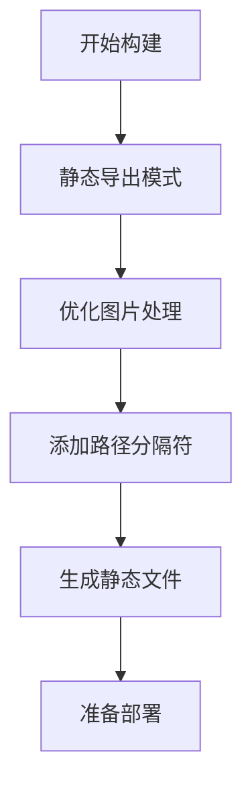
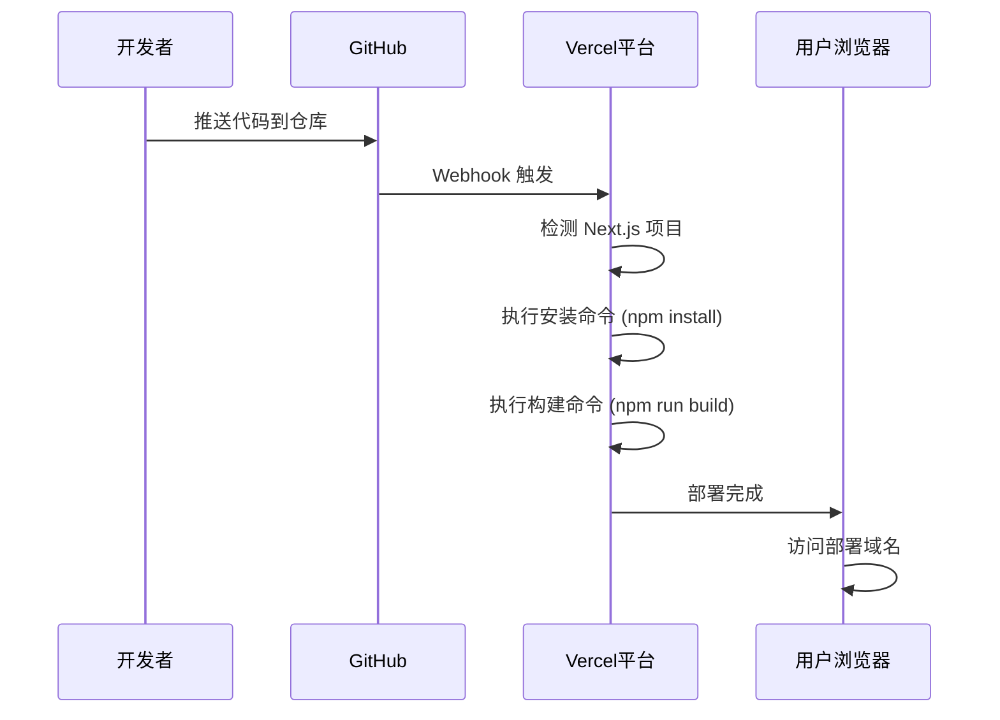

# 快速开始

<cite>
**本文档引用的文件**
- [package.json](file://杨天成个人网页/package.json)
- [README.md](file://杨天成个人网页/README.md)
- [next.config.js](file://杨天成个人网页/next.config.js)
- [tailwind.config.ts](file://杨天成个人网页/tailwind.config.ts)
- [tsconfig.json](file://杨天成个人网页/tsconfig.json)
- [vercel.json](file://杨天成个人网页/vercel.json)
- [postcss.config.js](file://杨天成个人网页/postcss.config.js)
- [app/layout.tsx](file://杨天成个人网页/app/layout.tsx)
- [app/page.tsx](file://杨天成个人网页/app/page.tsx)
- [components/Navigation.tsx](file://杨天成个人网页/components/Navigation.tsx)
- [components/PersonalHUD.tsx](file://杨天成个人网页/components/PersonalHUD.tsx)
- [components/ContentDisplay.tsx](file://杨天成个人网页/components/ContentDisplay.tsx)
- [data/bio.json](file://杨天成个人网页/data/bio.json)
- [app/globals.css](file://杨天成个人网页/app/globals.css)
</cite>

## 目录
1. [简介](#简介)
2. [环境要求](#环境要求)
3. [安装步骤](#安装步骤)
4. [本地开发](#本地开发)
5. [项目结构](#项目结构)
6. [核心功能](#核心功能)
7. [开发命令](#开发命令)
8. [自定义指南](#自定义指南)
9. [部署到 Vercel](#部署到-vercel)
10. [常见问题解决](#常见问题解决)
11. [结语](#结语)

## 简介

这是一个极具未来感的赛博朋克风格个人主页项目，使用 Next.js 14、Tailwind CSS、Framer Motion 和 react-tsparticles 构建。项目采用现代化的前端技术栈，提供了丰富的视觉效果和交互体验，包括粒子背景、全息投影风格的 HUD 面板、动态内容切换等特性。

## 环境要求

### Node.js 版本要求

根据项目配置，需要满足以下环境要求：

- **Node.js**: >= 18.x（推荐使用 LTS 版本）
- **包管理器**: npm 8.x 或更高版本
- **操作系统**: Windows、macOS 或 Linux

### 技术栈版本

项目使用的技术栈版本如下：
- Next.js: 14.2.5
- React: ^18.3.1
- Tailwind CSS: ^3.4.6
- TypeScript: ^5
- Framer Motion: ^11.3.8
- react-tsparticles: ^3.0.0

**章节来源**
- [package.json:11-28](file://杨天成个人网页/package.json#L11-L28)
- [package.json:20-28](file://杨天成个人网页/package.json#L20-L28)

## 安装步骤

### 1. 克隆项目

```bash
# 使用 Git 克隆项目
git clone https://github.com/your-username/yang-tiancheng-portfolio.git
cd yang-tiancheng-portfolio
```

### 2. 安装依赖

```bash
# 使用 npm 安装所有依赖项
npm install
```

### 3. 验证安装

```bash
# 检查 Node.js 和 npm 版本
node --version
npm --version
```

**章节来源**
- [README.md:11-15](file://杨天成个人网页/README.md#L11-L15)

## 本地开发

### 启动开发服务器

```bash
# 启动本地开发服务器
npm run dev
```

开发服务器将在 `http://localhost:3000` 上启动，支持热重载功能。

### 开发服务器配置

项目使用 Next.js 的默认开发配置，支持以下特性：
- 热模块替换 (HMR)
- 即时错误反馈
- 自动类型检查
- 开发工具集成

### 访问应用

打开浏览器访问 [http://localhost:3000](http://localhost:3000) 查看效果。

**章节来源**
- [README.md:17-23](file://杨天成个人网页/README.md#L17-L23)

## 项目结构

项目采用 Next.js App Router 的现代目录结构：

```mermaid
graph TD
root["项目根目录"] --> app["app/ 应用程序入口"]
root --> components["components/ 组件库"]
root --> data["data/ 数据文件"]
root --> configs["配置文件"]
app --> app_globals["globals.css 全局样式"]
app --> app_layout["layout.tsx 根布局"]
app --> app_page["page.tsx 主页面"]
components --> comp_particle["ParticleBackground.tsx 粒子背景"]
components --> comp_hud["PersonalHUD.tsx 个人信息面板"]
components --> comp_nav["Navigation.tsx 导航组件"]
components --> comp_content["ContentDisplay.tsx 内容显示"]
components --> comp_sections["各功能区块组件"]
data --> data_bio["bio.json 个人简介"]
data --> data_edu["education.json 教育经历"]
data --> data_projects["projects.json 项目数据"]
configs --> pkg["package.json 依赖配置"]
configs --> nextcfg["next.config.js Next.js配置"]
configs --> tailwind["tailwind.config.ts Tailwind配置"]
configs --> tsconfig["tsconfig.json TypeScript配置"]
configs --> vercel["vercel.json Vercel配置"]
configs --> postcss["postcss.config.js PostCSS配置"]
```



**图表来源**
- [README.md:146-169](file://杨天成个人网页/README.md#L146-L169)

### 目录说明

- **app/**: Next.js 应用程序入口点，包含全局样式、根布局和主页面
- **components/**: 可复用的 React 组件，包括粒子背景、HUD 面板、导航等
- **data/**: JSON 格式的静态数据文件，用于配置个人简历内容
- **配置文件**: package.json、next.config.js、tailwind.config.ts 等

**章节来源**
- [README.md:146-169](file://杨天成个人网页/README.md#L146-L169)

## 核心功能

### 赛博朋克风格界面

项目实现了多种赛博朋克风格的视觉效果：

1. **粒子背景系统**: 使用 react-tsparticles 创建动态粒子效果
2. **全息投影 HUD**: 个人信息面板具有霓虹灯效果
3. **导航系统**: 底部导航按钮带有发光和故障效果
4. **动画系统**: 使用 Framer Motion 实现流畅的过渡动画

### 数据驱动的内容管理

通过 JSON 文件管理个人内容：

- **个人简介**: bio.json 包含基本信息、技能、社交媒体链接
- **教育经历**: education.json 管理学习背景
- **项目经历**: projects.json 展示项目作品
- **研究内容**: research.json 记录研究进展

**章节来源**
- [README.md:135-144](file://杨天成个人网页/README.md#L135-L144)

## 开发命令

### 核心开发命令

| 命令 | 描述 | 用途 |
|------|------|------|
| `npm run dev` | 启动开发服务器 | 本地开发调试 |
| `npm run build` | 构建生产版本 | 生成静态文件 |
| `npm start` | 启动生产服务器 | 部署后运行 |
| `npm run lint` | 代码质量检查 | 代码规范检查 |

### 构建配置

项目使用 Next.js 的静态导出模式：



**图表来源**
- [next.config.js:3](file://杨天成个人网页/next.config.js#L3)

**章节来源**
- [package.json:5-10](file://杨天成个人网页/package.json#L5-L10)
- [next.config.js:1-11](file://杨天成个人网页/next.config.js#L1-L11)

## 自定义指南

### 颜色主题定制

在 `tailwind.config.ts` 中可以修改赛博朋克配色方案：

- **主要颜色**: cyber-blue (#00d4ff)、cyber-pink (#ff00ff)、cyber-green (#00ff88)
- **背景色**: cyber-black (#0a0a0f)、cyber-dark (#0d1117)
- **特效色**: neon-blue、neon-pink

### 字体配置

项目使用 Google Fonts 提供的科技感字体：
- **标题字体**: Orbitron - 具有未来感的几何字体
- **正文字体**: Rajdhani - 现代几何字体
- **等宽字体**: JetBrains Mono - 代码专用字体

### 动画效果

通过 Tailwind CSS 的动画配置实现：
- 脉冲发光效果 (pulse-glow)
- 扫描线效果 (scan)
- 闪烁效果 (flicker)
- 浮动效果 (float)

**章节来源**
- [tailwind.config.ts:11-63](file://杨天成个人网页/tailwind.config.ts#L11-L63)
- [app/layout.tsx:24-29](file://杨天成个人网页/app/layout.tsx#L24-L29)

## 部署到 Vercel

### 零配置部署

项目已完全配置为 Vercel 零配置部署：



**图表来源**
- [vercel.json:1-6](file://杨天成个人网页/vercel.json#L1-L6)

### 部署步骤

1. **推送代码到 GitHub 仓库**
2. **访问 Vercel 平台**
3. **点击 "New Project"**
4. **导入你的 GitHub 仓库**
5. **点击 "Deploy"**

Vercel 会自动检测 Next.js 项目并完成部署。

### Vercel 配置

项目使用 `vercel.json` 配置文件指定构建行为：
- **框架**: nextjs
- **安装命令**: npm install
- **构建命令**: npm run build
- **开发命令**: npm run dev

**章节来源**
- [README.md:31-41](file://杨天成个人网页/README.md#L31-L41)
- [vercel.json:1-6](file://杨天成个人网页/vercel.json#L1-L6)

## 常见问题解决

### 环境问题

**问题**: Node.js 版本过低
**解决方案**: 升级到 Node.js 18.x 或更高版本

**问题**: npm 安装失败
**解决方案**: 
```bash
# 清理缓存
npm cache clean --force

# 删除 node_modules 和 package-lock.json
rm -rf node_modules package-lock.json

# 重新安装
npm install
```

### 开发服务器问题

**问题**: 端口被占用
**解决方案**: 修改端口号或关闭占用端口的进程

**问题**: 热重载不工作
**解决方案**: 
```bash
# 重启开发服务器
npm run dev

# 检查网络连接
ping localhost
```

### 构建问题

**问题**: 构建失败
**解决方案**:
```bash
# 检查 TypeScript 错误
npm run lint

# 清理构建缓存
rm -rf .next

# 重新构建
npm run build
```

### 样式问题

**问题**: Tailwind CSS 样式不生效
**解决方案**:
```bash
# 检查 Tailwind 配置
cat tailwind.config.ts

# 确保正确导入全局样式
cat app/layout.tsx
```

**章节来源**
- [README.md:11-29](file://杨天成个人网页/README.md#L11-L29)

## 结语

这个赛博朋克风格的个人主页项目展示了现代前端开发的最佳实践，结合了丰富的视觉效果和良好的用户体验。通过本指南，您应该能够快速搭建和运行项目，并根据需要进行个性化定制。

项目的主要优势包括：
- 现代化的技术栈组合
- 丰富的动画和视觉效果
- 易于维护的数据驱动架构
- 简单的部署流程
- 完善的开发工具链

建议在开始开发前熟悉以下技术：
- Next.js App Router 概念
- Tailwind CSS 实用类系统
- TypeScript 类型安全
- Framer Motion 动画库
- React Hooks 和组件化开发

祝您开发顺利！