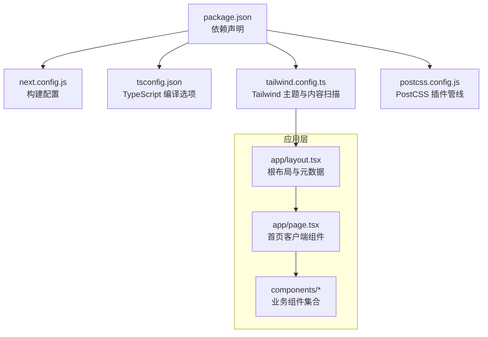
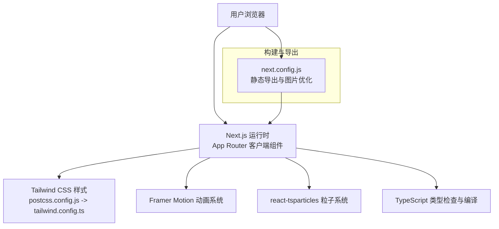
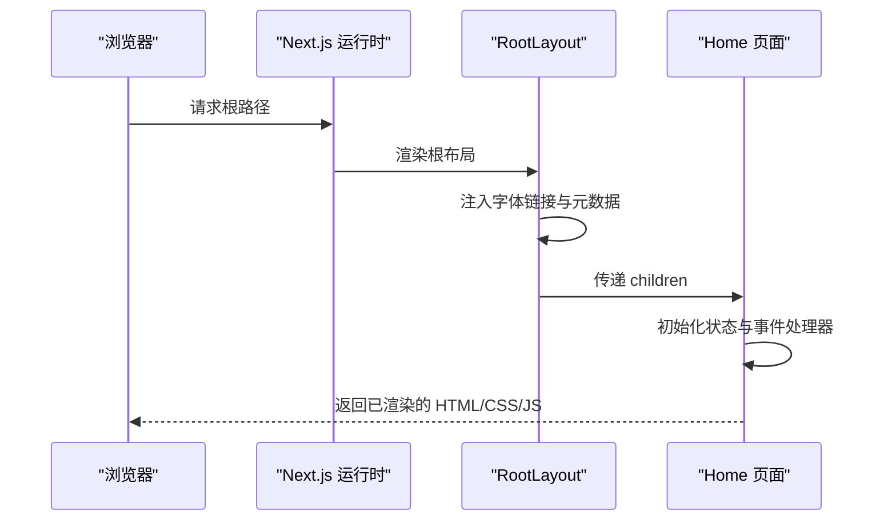
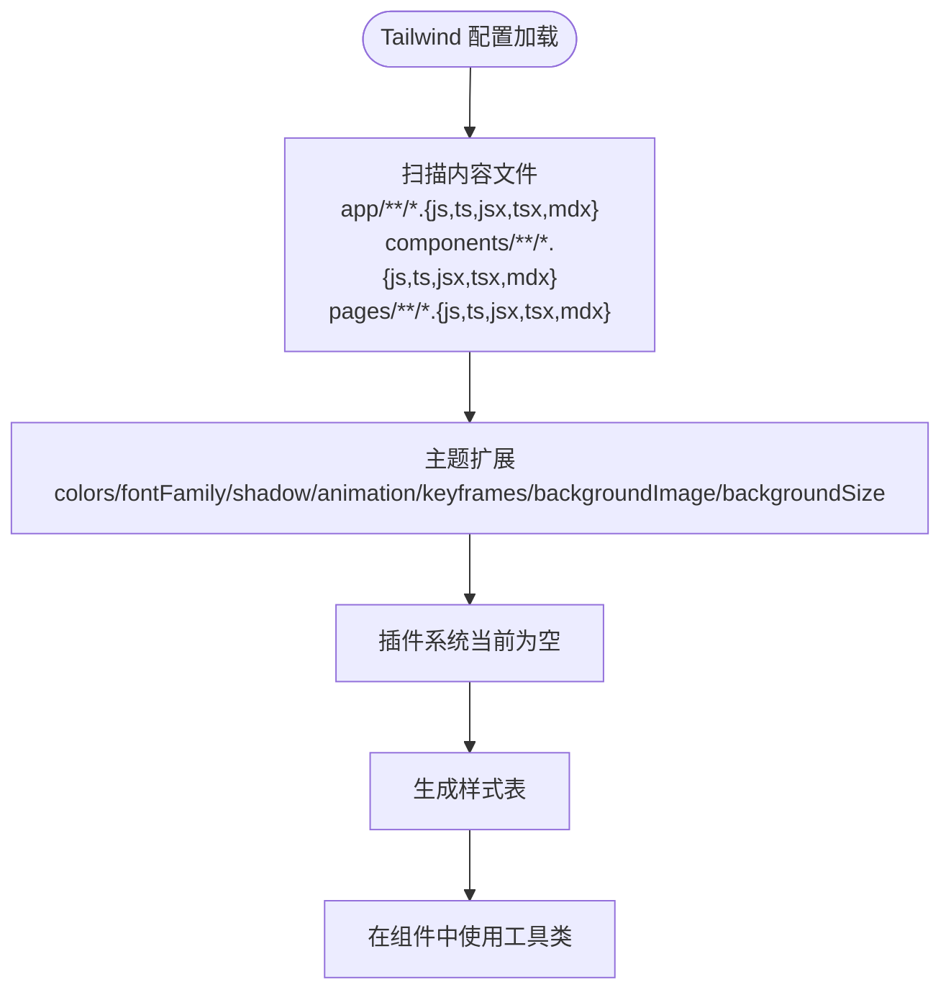
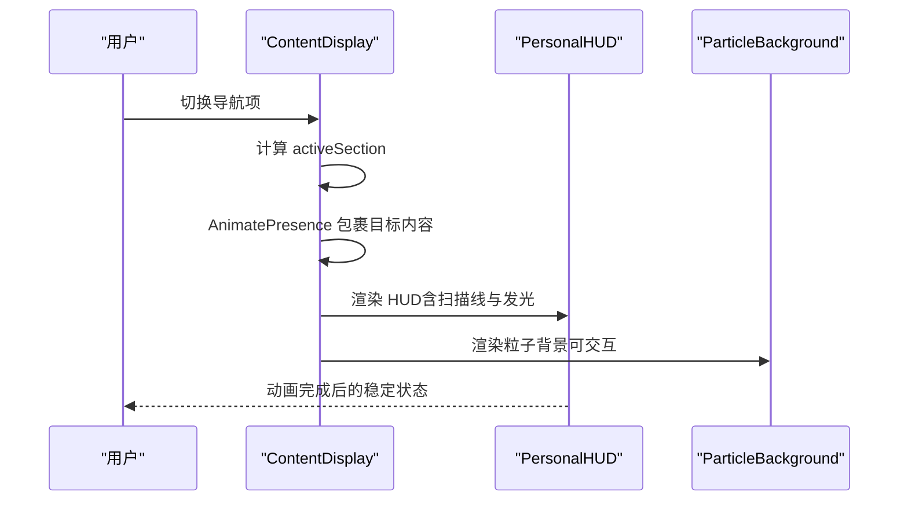
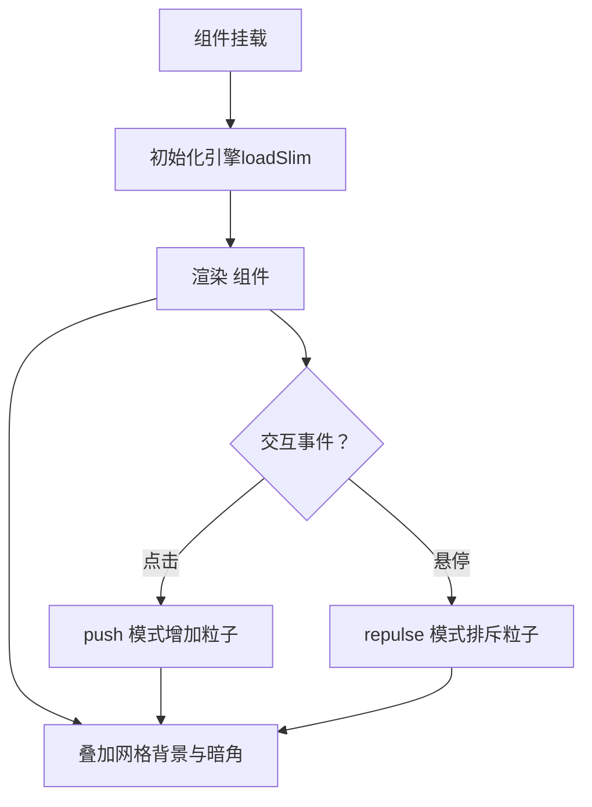
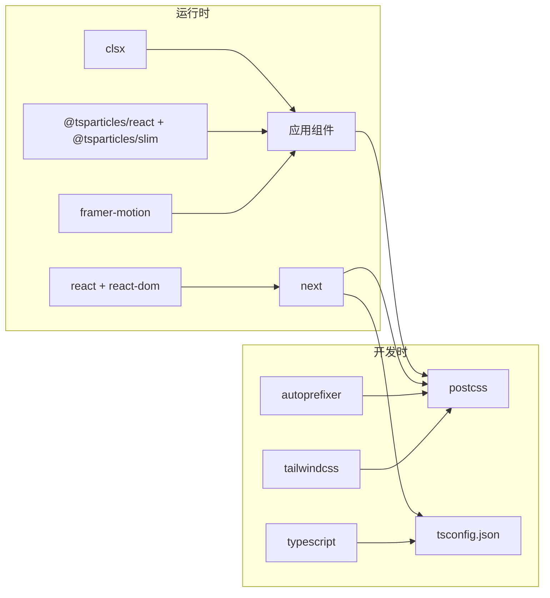

# 技术栈与依赖

<cite>
**本文引用的文件**
- [package.json](file://package.json)
- [next.config.js](file://next.config.js)
- [tailwind.config.ts](file://tailwind.config.ts)
- [tsconfig.json](file://tsconfig.json)
- [postcss.config.js](file://postcss.config.js)
- [app/layout.tsx](file://app/layout.tsx)
- [app/page.tsx](file://app/page.tsx)
- [components/ParticleBackground.tsx](file://components/ParticleBackground.tsx)
- [components/PersonalHUD.tsx](file://components/PersonalHUD.tsx)
- [components/ContentDisplay.tsx](file://components/ContentDisplay.tsx)
</cite>

## 目录
1. [引言](#引言)
2. [项目结构](#项目结构)
3. [核心组件](#核心组件)
4. [架构总览](#架构总览)
5. [详细组件分析](#详细组件分析)
6. [依赖关系分析](#依赖关系分析)
7. [性能考量](#性能考量)
8. [故障排查指南](#故障排查指南)
9. [结论](#结论)
10. [附录](#附录)

## 引言
本文件围绕该项目的技术栈与依赖展开，系统性阐述以下技术组合：Next.js 14 的 App Router 架构与现代构建导出能力；React 18.3.1 的并发渲染与 Hooks 生态；TypeScript 5 在类型安全与工程化上的增强；Tailwind CSS 3.4.6 的实用优先设计与自定义主题体系；Framer Motion 11.3.8 的动画与手势系统；以及 react-tsparticles 3.0.0 的高性能粒子效果实现。同时给出版本兼容性与升级注意事项，并对技术选型理由与替代方案进行对比。

## 项目结构
该仓库采用 Next.js 14 的 App Router 目录结构组织页面与布局，配合 TypeScript、Tailwind CSS 与 PostCSS 实现样式管线，使用 Framer Motion 与 react-tsparticles 提供动效与粒子背景。关键配置集中在根目录的构建与工具链配置文件中。

**图表来源**
- [package.json:11-28](file://package.json#L11-L28)
- [next.config.js:1-11](file://next.config.js#L1-L11)
- [tsconfig.json:1-27](file://tsconfig.json#L1-L27)
- [tailwind.config.ts:1-72](file://tailwind.config.ts#L1-L72)
- [postcss.config.js:1-7](file://postcss.config.js#L1-L7)
- [app/layout.tsx:1-37](file://app/layout.tsx#L1-L37)
- [app/page.tsx:1-61](file://app/page.tsx#L1-L61)

**章节来源**
- [package.json:1-30](file://package.json#L1-L30)
- [next.config.js:1-11](file://next.config.js#L1-L11)
- [tsconfig.json:1-27](file://tsconfig.json#L1-L27)
- [tailwind.config.ts:1-72](file://tailwind.config.ts#L1-L72)
- [postcss.config.js:1-7](file://postcss.config.js#L1-L7)
- [app/layout.tsx:1-37](file://app/layout.tsx#L1-L37)
- [app/page.tsx:1-61](file://app/page.tsx#L1-L61)

## 核心组件
- Next.js 14：提供 App Router、客户端组件、静态导出与图像优化等能力，满足现代 Web 应用开发需求。
- React 18.3.1：支持并发渲染、自动批处理与新 Hooks（如 useId、useSyncExternalStore），提升交互流畅度与可维护性。
- TypeScript 5：严格类型检查、增量编译、路径映射与 Next 内置插件集成，保障大型前端工程的类型安全。
- Tailwind CSS 3.4.6：以工具类驱动的实用优先设计，结合自定义主题、阴影、动画与背景图案，快速实现赛博朋克风格界面。
- Framer Motion 11.3.8：基于动力学与手势的动画系统，用于 HUD、过渡与交互反馈，营造沉浸式体验。
- react-tsparticles 3.0.0：高性能粒子引擎，提供可交互的粒子背景与网格光效，增强视觉层次。

**章节来源**
- [package.json:11-28](file://package.json#L11-L28)
- [app/page.tsx:1-61](file://app/page.tsx#L1-L61)
- [tailwind.config.ts:9-67](file://tailwind.config.ts#L9-L67)
- [components/PersonalHUD.tsx:1-132](file://components/PersonalHUD.tsx#L1-L132)
- [components/ParticleBackground.tsx:1-126](file://components/ParticleBackground.tsx#L1-L126)

## 架构总览
下图展示从浏览器到组件与第三方库的整体调用链路，体现 Next.js 构建导出、客户端渲染、样式管线与动效系统的协同工作方式。

**图表来源**
- [next.config.js:1-11](file://next.config.js#L1-L11)
- [postcss.config.js:1-7](file://postcss.config.js#L1-L7)
- [tailwind.config.ts:1-72](file://tailwind.config.ts#L1-L72)
- [app/page.tsx:1-61](file://app/page.tsx#L1-L61)
- [components/PersonalHUD.tsx:1-132](file://components/PersonalHUD.tsx#L1-L132)
- [components/ParticleBackground.tsx:1-126](file://components/ParticleBackground.tsx#L1-L126)
- [tsconfig.json:1-27](file://tsconfig.json#L1-L27)

## 详细组件分析

### Next.js 14 与 App Router
- 静态导出与图像优化：通过配置导出静态站点并关闭图片优化，适配特定部署环境。
- 客户端组件：页面与组件标记为客户端模式，启用状态管理与第三方库（如动画与粒子）。
- 元数据与字体：根布局集中管理站点元信息与 Google Fonts 预连接，确保首屏加载体验。

**图表来源**
- [next.config.js:1-11](file://next.config.js#L1-L11)
- [app/layout.tsx:1-37](file://app/layout.tsx#L1-L37)
- [app/page.tsx:1-61](file://app/page.tsx#L1-L61)

**章节来源**
- [next.config.js:1-11](file://next.config.js#L1-L11)
- [app/layout.tsx:1-37](file://app/layout.tsx#L1-L37)
- [app/page.tsx:1-61](file://app/page.tsx#L1-L61)

### React 18.3.1 并发与 Hooks
- 并发特性：自动批处理、可中断渲染与 Suspense 协同，提升复杂交互场景下的性能与稳定性。
- 新 Hooks：useId、useSyncExternalStore 等用于标识与外部状态同步，降低心智负担。
- 在本项目中的应用：页面与组件均以客户端模式运行，便于使用状态钩子与第三方库。

**章节来源**
- [app/page.tsx:1-61](file://app/page.tsx#L1-L61)

### TypeScript 5 类型安全
- 严格模式与增量编译：提升开发效率与构建速度。
- 路径别名与内置插件：统一模块解析与 Next 类型集成。
- 工程化优势：减少运行时错误，增强重构信心。

**章节来源**
- [tsconfig.json:1-27](file://tsconfig.json#L1-L27)

### Tailwind CSS 3.4.6 实用优先设计
- 内容扫描范围覆盖 app、components、pages，确保按需生成样式。
- 自定义主题扩展：颜色、字体、阴影、动画、关键帧、背景与背景尺寸，形成统一的赛博朋克视觉语言。
- 响应式与装饰：扫描线、发光边框、渐变与网格背景，强化科技感。

**图表来源**
- [tailwind.config.ts:4-8](file://tailwind.config.ts#L4-L8)
- [tailwind.config.ts:9-67](file://tailwind.config.ts#L9-L67)

**章节来源**
- [tailwind.config.ts:1-72](file://tailwind.config.ts#L1-L72)
- [postcss.config.js:1-7](file://postcss.config.js#L1-L7)

### Framer Motion 11.3.8 动画系统
- 动画与过渡：在 HUD、欢迎页与内容切换中使用 motion 与 AnimatePresence，实现平滑入场、出场与等待模式。
- 手势与交互：结合 hover、click 等交互事件触发动画，提升沉浸感。
- 性能：基于硬件加速与动力学，保证高帧率与流畅体验。

**图表来源**
- [components/ContentDisplay.tsx:1-125](file://components/ContentDisplay.tsx#L1-L125)
- [components/PersonalHUD.tsx:1-132](file://components/PersonalHUD.tsx#L1-L132)
- [components/ParticleBackground.tsx:1-126](file://components/ParticleBackground.tsx#L1-L126)

**章节来源**
- [components/ContentDisplay.tsx:1-125](file://components/ContentDisplay.tsx#L1-L125)
- [components/PersonalHUD.tsx:1-132](file://components/PersonalHUD.tsx#L1-L132)
- [components/ParticleBackground.tsx:1-126](file://components/ParticleBackground.tsx#L1-L126)

### react-tsparticles 3.0.0 粒子效果
- 粒子初始化：在客户端挂载后加载 slim 引擎，避免 SSR 不兼容。
- 可交互事件：点击推动、悬停排斥，增强用户参与感。
- 视觉增强：网格背景、径向暗角与多色粒子，营造赛博朋克氛围。

**图表来源**
- [components/ParticleBackground.tsx:8-17](file://components/ParticleBackground.tsx#L8-L17)
- [components/ParticleBackground.tsx:81-103](file://components/ParticleBackground.tsx#L81-L103)

**章节来源**
- [components/ParticleBackground.tsx:1-126](file://components/ParticleBackground.tsx#L1-L126)

## 依赖关系分析
- 运行时依赖：Next.js 14、React 18.3.1、Framer Motion 11.3.8、react-tsparticles 3.0.0、clsx 2.1.1。
- 开发依赖：Tailwind CSS 3.4.6、PostCSS 8.4.39、Autoprefixer 10.4.19、TypeScript 5、React 类型声明。
- 构建与样式：next.config.js 控制输出与图片优化；postcss.config.js 链接 Tailwind 与 Autoprefixer；tsconfig.json 提供严格类型与路径别名。

**图表来源**
- [package.json:11-28](file://package.json#L11-L28)
- [postcss.config.js:1-7](file://postcss.config.js#L1-L7)
- [tsconfig.json:1-27](file://tsconfig.json#L1-L27)

**章节来源**
- [package.json:1-30](file://package.json#L1-L30)
- [postcss.config.js:1-7](file://postcss.config.js#L1-L7)
- [tsconfig.json:1-27](file://tsconfig.json#L1-L27)

## 性能考量
- Next.js 静态导出：适合单页应用或静态内容展示，减少服务器成本。
- 图片优化关闭：在无需动态优化时可降低构建与运行开销。
- Tailwind 按需生成：通过内容扫描避免无用样式，保持体积可控。
- Framer Motion 与粒子：合理设置帧率与动画数量，避免过度消耗资源。
- TypeScript 增量编译：缩短开发迭代周期，提升整体效率。

## 故障排查指南
- 样式未生效
  - 检查 Tailwind 内容扫描路径是否覆盖到目标组件。
  - 确认 PostCSS 插件顺序与版本兼容。
- 动画异常
  - 确保组件标记为客户端组件，避免在服务端执行 DOM API。
  - 检查 Framer Motion 的初始状态与过渡参数。
- 粒子不显示
  - 确认客户端挂载后再初始化引擎与渲染组件。
  - 检查交互事件绑定与粒子数量配置。
- 构建失败
  - 核对 TypeScript 严格模式与路径别名配置。
  - 检查 Next.js 导出配置与图片优化设置。

**章节来源**
- [tailwind.config.ts:4-8](file://tailwind.config.ts#L4-L8)
- [postcss.config.js:1-7](file://postcss.config.js#L1-L7)
- [components/ParticleBackground.tsx:8-17](file://components/ParticleBackground.tsx#L8-L17)
- [components/PersonalHUD.tsx:1-132](file://components/PersonalHUD.tsx#L1-L132)
- [tsconfig.json:1-27](file://tsconfig.json#L1-L27)
- [next.config.js:1-11](file://next.config.js#L1-L11)

## 结论
本项目以 Next.js 14 为核心，结合 React 18.3.1 的并发能力、TypeScript 5 的类型安全、Tailwind CSS 3.4.6 的实用优先设计、Framer Motion 11.3.8 的动画系统与 react-tsparticles 3.0.0 的粒子效果，构建出兼具性能与视觉冲击力的个人主页。通过合理的配置与组件拆分，实现了赛博朋克风格的沉浸式体验。

## 附录

### 版本兼容性与升级注意事项
- Next.js 14.2.5
  - 注意 App Router 的客户端组件与服务端组件边界。
  - 导出模式下避免使用动态路由与服务端功能。
- React 18.3.1
  - 使用并发特性时关注 Suspense 边界与错误边界。
  - 新 Hooks 在服务端不可用，需在客户端组件中使用。
- TypeScript 5
  - 严格模式下注意未使用的变量与类型断言。
  - 路径别名与 Next 内置插件需保持一致。
- Tailwind CSS 3.4.6
  - 内容扫描路径需覆盖所有组件与页面。
  - 自定义主题扩展建议集中管理，避免冲突。
- Framer Motion 11.3.8
  - 与 Next.js 图像优化共存时注意 SSR 兼容性。
  - 合理设置动画缓动与重复次数，避免性能问题。
- react-tsparticles 3.0.0
  - 客户端挂载后再初始化引擎，避免 SSR 报错。
  - 交互事件与粒子密度需平衡视觉与性能。

### 技术选型理由与替代方案对比
- Next.js 14 vs. 其他框架
  - 优点：App Router、静态导出、图像优化、原生 API 支持。
  - 替代：Vite/React + Vercel 出口、Nuxt 3（若偏好服务端渲染）。
- React 18.3.1 vs. 更早版本
  - 优点：并发渲染、自动批处理、新 Hooks。
  - 替代：继续使用 17.x（失去并发收益）。
- TypeScript 5 vs. JavaScript
  - 优点：类型安全、IDE 智能提示、重构保障。
  - 替代：纯 JS（开发体验下降，大型项目风险上升）。
- Tailwind CSS 3.4.6 vs. CSS Modules/Sass
  - 优点：实用优先、主题一致性、按需生成。
  - 替代：CSS-in-JS（运行时开销大）、传统预处理器（缺乏工具链生态）。
- Framer Motion 11.3.8 vs. CSS 动画
  - 优点：复杂交互、手势集成、物理动画。
  - 替代：纯 CSS（表达力有限）。
- react-tsparticles 3.0.0 vs. 其他粒子库
  - 优点：轻量引擎、可交互、性能稳定。
  - 替代：Three.js（学习成本高）、Canvas 原生（开发成本高）。