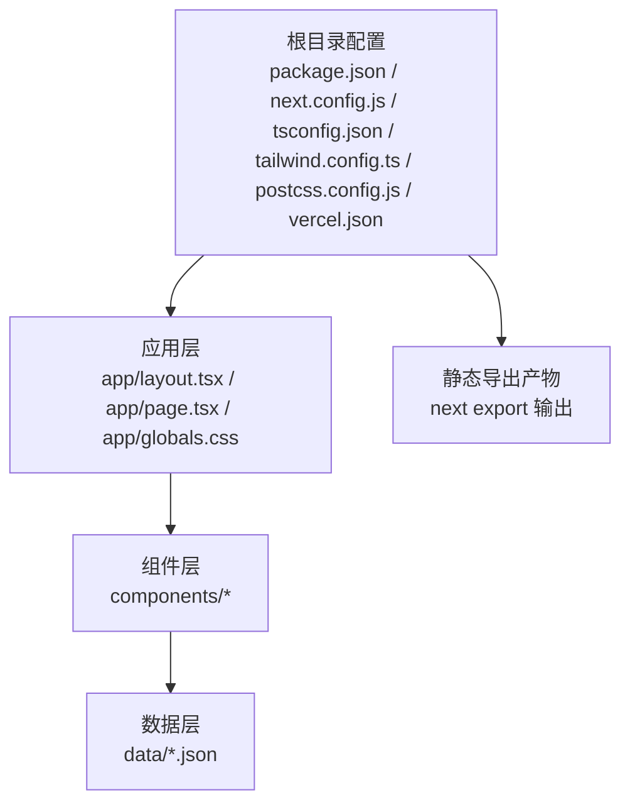
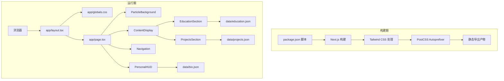
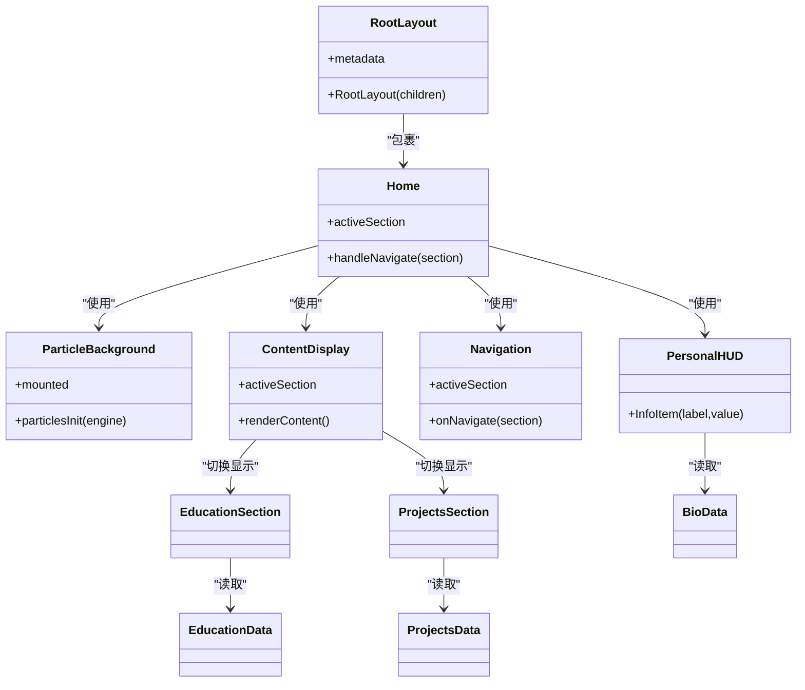
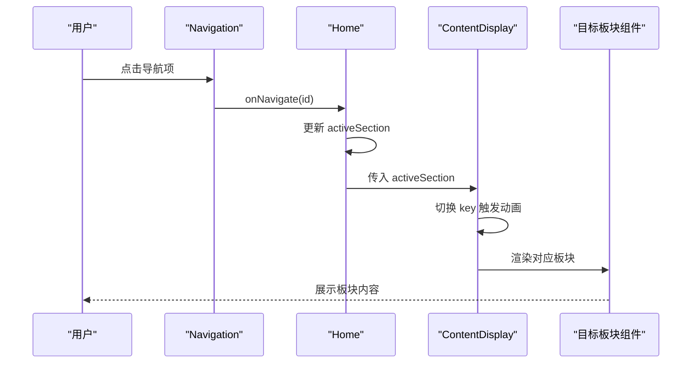
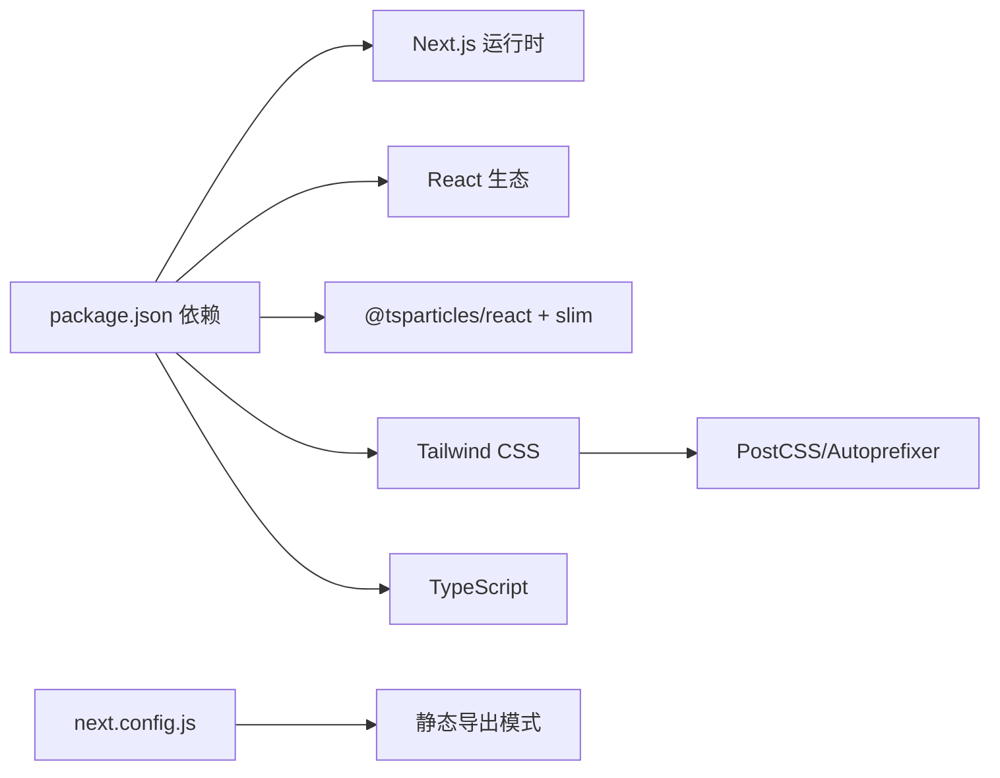

# 故障排除

<cite>
**本文引用的文件**
- [package.json](file://package.json)
- [next.config.js](file://next.config.js)
- [tailwind.config.ts](file://tailwind.config.ts)
- [tsconfig.json](file://tsconfig.json)
- [postcss.config.js](file://postcss.config.js)
- [vercel.json](file://vercel.json)
- [README.md](file://README.md)
- [app/layout.tsx](file://app/layout.tsx)
- [app/page.tsx](file://app/page.tsx)
- [app/globals.css](file://app/globals.css)
- [components/ParticleBackground.tsx](file://components/ParticleBackground.tsx)
- [components/PersonalHUD.tsx](file://components/PersonalHUD.tsx)
- [components/Navigation.tsx](file://components/Navigation.tsx)
- [components/ContentDisplay.tsx](file://components/ContentDisplay.tsx)
- [components/EducationSection.tsx](file://components/EducationSection.tsx)
- [components/ProjectsSection.tsx](file://components/ProjectsSection.tsx)
- [data/bio.json](file://data/bio.json)
- [data/education.json](file://data/education.json)
- [data/projects.json](file://data/projects.json)
</cite>

## 目录
1. [引言](#引言)
2. [项目结构](#项目结构)
3. [核心组件](#核心组件)
4. [架构总览](#架构总览)
5. [详细组件分析](#详细组件分析)
6. [依赖关系分析](#依赖关系分析)
7. [性能考虑](#性能考虑)
8. [故障排除指南](#故障排除指南)
9. [结论](#结论)
10. [附录](#附录)

## 引言
本指南面向维护与部署该赛博朋克风格个人主页的开发者与运维人员，聚焦于安装失败、依赖冲突、构建错误、运行时异常、开发环境问题（TypeScript 编译、样式加载、组件渲染）以及生产部署问题（构建失败、资源加载、性能）。文档提供系统化的诊断方法（日志分析、错误追踪、性能分析），并给出调试工具使用建议、社区与官方支持渠道、问题报告模板与预防性维护策略。

## 项目结构
该项目采用 Next.js App Router 结构，前端由 Tailwind CSS、Framer Motion、react-tsparticles 等技术栈构成，数据通过 JSON 文件注入组件。关键配置集中在根目录的构建与样式配置文件中。

图示来源
- [package.json](file://package.json)
- [next.config.js](file://next.config.js)
- [tailwind.config.ts](file://tailwind.config.ts)
- [tsconfig.json](file://tsconfig.json)
- [postcss.config.js](file://postcss.config.js)
- [vercel.json](file://vercel.json)
- [app/layout.tsx](file://app/layout.tsx)
- [app/page.tsx](file://app/page.tsx)
- [app/globals.css](file://app/globals.css)
- [components/ParticleBackground.tsx](file://components/ParticleBackground.tsx)
- [components/PersonalHUD.tsx](file://components/PersonalHUD.tsx)
- [components/Navigation.tsx](file://components/Navigation.tsx)
- [components/ContentDisplay.tsx](file://components/ContentDisplay.tsx)
- [components/EducationSection.tsx](file://components/EducationSection.tsx)
- [components/ProjectsSection.tsx](file://components/ProjectsSection.tsx)
- [data/bio.json](file://data/bio.json)
- [data/education.json](file://data/education.json)
- [data/projects.json](file://data/projects.json)

章节来源
- [README.md](file://README.md)
- [package.json](file://package.json)
- [next.config.js](file://next.config.js)
- [tailwind.config.ts](file://tailwind.config.ts)
- [tsconfig.json](file://tsconfig.json)
- [postcss.config.js](file://postcss.config.js)
- [vercel.json](file://vercel.json)

## 核心组件
- 应用根布局与元数据：负责站点标题、关键词、OpenGraph、字体预连接与全局样式引入。
- 主页容器：协调粒子背景、HUD、内容区与导航，管理活动板块的状态流转。
- 粒子背景：基于 react-tsparticles 的 WebGL 粒子系统，提供交互与视觉特效。
- HUD 与导航：赛博朋克风格的信息面板与底部导航按钮，配合 Framer Motion 动画。
- 内容展示区：根据活动板块切换教育、项目或研究内容，使用动画过渡。
- 数据驱动：通过 JSON 文件注入生物信息、教育经历与项目列表，组件按需读取。

章节来源
- [app/layout.tsx](file://app/layout.tsx)
- [app/page.tsx](file://app/page.tsx)
- [components/ParticleBackground.tsx](file://components/ParticleBackground.tsx)
- [components/PersonalHUD.tsx](file://components/PersonalHUD.tsx)
- [components/Navigation.tsx](file://components/Navigation.tsx)
- [components/ContentDisplay.tsx](file://components/ContentDisplay.tsx)
- [data/bio.json](file://data/bio.json)
- [data/education.json](file://data/education.json)
- [data/projects.json](file://data/projects.json)

## 架构总览
系统以 Next.js App Router 为核心，结合 Tailwind CSS 实现样式体系，Framer Motion 提供动画，react-tsparticles 提供粒子效果。构建阶段通过 PostCSS 与 Tailwind 处理样式，最终输出静态 HTML/CSS/JS（静态导出模式）。

图示来源
- [package.json](file://package.json)
- [next.config.js](file://next.config.js)
- [tailwind.config.ts](file://tailwind.config.ts)
- [postcss.config.js](file://postcss.config.js)
- [app/layout.tsx](file://app/layout.tsx)
- [app/page.tsx](file://app/page.tsx)
- [app/globals.css](file://app/globals.css)
- [components/ParticleBackground.tsx](file://components/ParticleBackground.tsx)
- [components/PersonalHUD.tsx](file://components/PersonalHUD.tsx)
- [components/Navigation.tsx](file://components/Navigation.tsx)
- [components/ContentDisplay.tsx](file://components/ContentDisplay.tsx)
- [components/EducationSection.tsx](file://components/EducationSection.tsx)
- [components/ProjectsSection.tsx](file://components/ProjectsSection.tsx)
- [data/bio.json](file://data/bio.json)
- [data/education.json](file://data/education.json)
- [data/projects.json](file://data/projects.json)

## 详细组件分析

### 组件类图（代码级）

图示来源
- [app/layout.tsx](file://app/layout.tsx)
- [app/page.tsx](file://app/page.tsx)
- [components/ParticleBackground.tsx](file://components/ParticleBackground.tsx)
- [components/PersonalHUD.tsx](file://components/PersonalHUD.tsx)
- [components/Navigation.tsx](file://components/Navigation.tsx)
- [components/ContentDisplay.tsx](file://components/ContentDisplay.tsx)
- [components/EducationSection.tsx](file://components/EducationSection.tsx)
- [components/ProjectsSection.tsx](file://components/ProjectsSection.tsx)
- [data/bio.json](file://data/bio.json)
- [data/education.json](file://data/education.json)
- [data/projects.json](file://data/projects.json)

章节来源
- [app/layout.tsx](file://app/layout.tsx)
- [app/page.tsx](file://app/page.tsx)
- [components/ParticleBackground.tsx](file://components/ParticleBackground.tsx)
- [components/PersonalHUD.tsx](file://components/PersonalHUD.tsx)
- [components/Navigation.tsx](file://components/Navigation.tsx)
- [components/ContentDisplay.tsx](file://components/ContentDisplay.tsx)
- [components/EducationSection.tsx](file://components/EducationSection.tsx)
- [components/ProjectsSection.tsx](file://components/ProjectsSection.tsx)
- [data/bio.json](file://data/bio.json)
- [data/education.json](file://data/education.json)
- [data/projects.json](file://data/projects.json)

### API/服务组件调用序列（概念示意）
以下序列图展示从用户点击导航到内容切换的典型流程（概念图，非特定源码映射）：

## 依赖关系分析
- 构建与运行时依赖：Next.js、React、Framer Motion、react-tsparticles、clsx。
- 开发依赖：TypeScript、Tailwind CSS、PostCSS、Autoprefixer。
- 样式管线：Tailwind CSS 通过 PostCSS 插件链处理，TS/TSX 由 Next.js 与 TypeScript 编译器处理。
- 静态导出：next.config.js 设置为静态导出，images 未优化且启用尾斜杠，影响资源路径与缓存策略。

图示来源
- [package.json](file://package.json)
- [next.config.js](file://next.config.js)
- [tailwind.config.ts](file://tailwind.config.ts)
- [postcss.config.js](file://postcss.config.js)
- [tsconfig.json](file://tsconfig.json)

章节来源
- [package.json](file://package.json)
- [next.config.js](file://next.config.js)
- [tailwind.config.ts](file://tailwind.config.ts)
- [postcss.config.js](file://postcss.config.js)
- [tsconfig.json](file://tsconfig.json)

## 性能考虑
- 粒子系统性能：粒子数量、链接距离、透明度与帧率限制会影响性能；建议在低端设备上降低粒子密度或禁用链接。
- 动画与重绘：大量 Framer Motion 动画与滤镜可能造成重排与重绘；建议在移动端减少复杂动画或使用 prefers-reduced-motion。
- 样式体积：Tailwind 生成的样式较大，建议在生产环境启用摇树与压缩；静态导出模式下注意资源体积。
- 图片与字体：未优化图片与 Google Fonts 跨域加载可能影响首屏；建议本地托管字体或使用现代格式与合适的缓存策略。

## 故障排除指南

### 一、安装与环境准备
- 症状：安装依赖时报错或卡住
  - 排查要点
    - Node 版本与包管理器兼容性（建议使用 LTS 版本与 npm 8+）
    - 网络代理与 registry 配置
    - 临时目录权限与磁盘空间
  - 解决方案
    - 清理缓存并重试安装
    - 使用国内镜像源或代理
    - 升级包管理器至稳定版本
  - 参考配置
    - [package.json](file://package.json)

- 症状：TypeScript 编译报错
  - 排查要点
    - tsconfig.json 的严格模式、模块解析与路径别名
    - 依赖版本是否与 Next.js 14 兼容
  - 解决方案
    - 对齐 TypeScript 与 React 版本
    - 检查路径别名与模块解析策略
  - 参考配置
    - [tsconfig.json](file://tsconfig.json)
    - [package.json](file://package.json)

- 症状：开发服务器无法启动
  - 排查要点
    - 端口占用（默认 3000）
    - 依赖安装完整性
  - 解决方案
    - 更换端口或释放占用进程
    - 删除 node_modules 与 lockfile 后重新安装
  - 参考命令
    - [package.json](file://package.json)

章节来源
- [package.json](file://package.json)
- [tsconfig.json](file://tsconfig.json)

### 二、构建与静态导出
- 症状：构建失败或产物缺失
  - 排查要点
    - next.config.js 的静态导出设置与 images 配置
    - Tailwind CSS 与 PostCSS 插件链
    - TypeScript 类型检查与 noEmit 配置
  - 解决方案
    - 确认 content 路径覆盖所有组件与页面
    - 修复类型错误后再构建
    - 如需优化图片，移除 unoptimized 或改为 CDN
  - 参考配置
    - [next.config.js](file://next.config.js)
    - [tailwind.config.ts](file://tailwind.config.ts)
    - [postcss.config.js](file://postcss.config.js)
    - [tsconfig.json](file://tsconfig.json)

- 症状：静态导出后资源 404
  - 排查要点
    - trailingSlash: true 与相对路径的关系
    - 静态资源引用是否使用绝对路径或相对路径
  - 解决方案
    - 在静态导出环境下统一使用相对路径或修正路由
  - 参考配置
    - [next.config.js](file://next.config.js)

- 症状：样式未生效或闪烁
  - 排查要点
    - Tailwind content 范围是否包含组件目录
    - 全局 CSS 是否正确引入
    - 字体加载失败导致的 FOIT
  - 解决方案
    - 补充 content 路径或使用 @apply
    - 优化字体加载策略（预连接、字体子集）
  - 参考配置
    - [tailwind.config.ts](file://tailwind.config.ts)
    - [app/globals.css](file://app/globals.css)
    - [app/layout.tsx](file://app/layout.tsx)

章节来源
- [next.config.js](file://next.config.js)
- [tailwind.config.ts](file://tailwind.config.ts)
- [postcss.config.js](file://postcss.config.js)
- [tsconfig.json](file://tsconfig.json)
- [app/globals.css](file://app/globals.css)
- [app/layout.tsx](file://app/layout.tsx)

### 三、运行时异常与交互问题
- 症状：粒子背景不显示或交互无效
  - 排查要点
    - 浏览器对 WebGL 的支持与权限
    - 组件挂载时机与条件渲染
    - react-tsparticles 初始化与引擎加载
  - 解决方案
    - 在客户端组件中按需加载引擎
    - 确保组件在浏览器端渲染后再初始化
  - 参考组件
    - [components/ParticleBackground.tsx](file://components/ParticleBackground.tsx)

- 症状：HUD 或导航样式异常
  - 排查要点
    - Tailwind 自定义颜色与动画类是否正确
    - Framer Motion 动画参数与设备性能
  - 解决方案
    - 检查自定义颜色与动画 keyframes
    - 在低性能设备上降级动画
  - 参考组件
    - [components/PersonalHUD.tsx](file://components/PersonalHUD.tsx)
    - [components/Navigation.tsx](file://components/Navigation.tsx)

- 症状：内容切换无动画或闪烁
  - 排查要点
    - AnimatePresence 的 key 是否随活动板块变化
    - 过渡动画参数与设备性能
  - 解决方案
    - 确保 key 唯一且随状态变化
  - 参考组件
    - [components/ContentDisplay.tsx](file://components/ContentDisplay.tsx)

- 症状：数据未显示或键名不匹配
  - 排查要点
    - JSON 字段与组件读取字段是否一致
    - 数据文件编码与格式
  - 解决方案
    - 对齐字段名与类型，增加默认值与校验
  - 参考数据
    - [data/bio.json](file://data/bio.json)
    - [data/education.json](file://data/education.json)
    - [data/projects.json](file://data/projects.json)

章节来源
- [components/ParticleBackground.tsx](file://components/ParticleBackground.tsx)
- [components/PersonalHUD.tsx](file://components/PersonalHUD.tsx)
- [components/Navigation.tsx](file://components/Navigation.tsx)
- [components/ContentDisplay.tsx](file://components/ContentDisplay.tsx)
- [data/bio.json](file://data/bio.json)
- [data/education.json](file://data/education.json)
- [data/projects.json](file://data/projects.json)

### 四、开发环境问题排查
- TypeScript 编译错误
  - 症状：noEmit 下出现类型错误
  - 排查与解决
    - 在开发时允许 emit 或修复类型错误
    - 检查插件与 bundler 模块解析
  - 参考配置
    - [tsconfig.json](file://tsconfig.json)

- 样式加载失败
  - 症状：Tailwind 类不生效或样式未打包
  - 排查与解决
    - 确认 content 路径包含组件与页面
    - 检查 PostCSS 插件顺序与 Tailwind 版本
  - 参考配置
    - [tailwind.config.ts](file://tailwind.config.ts)
    - [postcss.config.js](file://postcss.config.js)

- 组件渲染问题
  - 症状：SSR/CSR 不一致导致的闪烁或样式错位
  - 排查与解决
    - 确保客户端组件标记与条件渲染逻辑正确
    - 使用 CSS-in-JS 或 CSS 模块避免样式抖动
  - 参考组件
    - [app/layout.tsx](file://app/layout.tsx)
    - [app/page.tsx](file://app/page.tsx)

章节来源
- [tsconfig.json](file://tsconfig.json)
- [tailwind.config.ts](file://tailwind.config.ts)
- [postcss.config.js](file://postcss.config.js)
- [app/layout.tsx](file://app/layout.tsx)
- [app/page.tsx](file://app/page.tsx)

### 五、生产部署问题
- Vercel 部署失败
  - 症状：构建命令失败或超时
  - 排查与解决
    - 确认 vercel.json 的框架与命令配置
    - 检查依赖安装与构建脚本
  - 参考配置
    - [vercel.json](file://vercel.json)
    - [package.json](file://package.json)

- 资源加载错误
  - 症状：静态导出后 CSS/JS/图片 404
  - 排查与解决
    - 检查 trailingSlash 与资源路径
    - 确认静态导出产物目录结构
  - 参考配置
    - [next.config.js](file://next.config.js)

- 性能问题
  - 症状：首屏慢、动画卡顿
  - 排查与解决
    - 降低粒子数量与动画复杂度
    - 优化字体与图片加载
    - 使用缓存与 CDN
  - 参考组件与配置
    - [components/ParticleBackground.tsx](file://components/ParticleBackground.tsx)
    - [tailwind.config.ts](file://tailwind.config.ts)
    - [next.config.js](file://next.config.js)

章节来源
- [vercel.json](file://vercel.json)
- [package.json](file://package.json)
- [next.config.js](file://next.config.js)
- [tailwind.config.ts](file://tailwind.config.ts)
- [components/ParticleBackground.tsx](file://components/ParticleBackground.tsx)

### 六、调试工具与技巧
- 日志与错误追踪
  - 使用浏览器开发者工具的 Console、Network、Performance 面板定位资源与脚本报错
  - 在组件中添加最小可复现分支以隔离问题
- 性能分析
  - 使用 Performance 面板观察动画与重绘
  - 使用 Lighthouse 评估静态导出产物的性能指标
- 样式调试
  - 使用 Elements 面板检查 Tailwind 类是否生效
  - 逐步注释样式以定位冲突
- 数据调试
  - 在组件中打印 JSON 数据结构，确认字段存在与类型正确

### 七、社区与官方支持
- 官方文档与社区
  - Next.js 文档与 GitHub Issues
  - Tailwind CSS 文档与社区讨论
  - Framer Motion 文档与示例
  - react-tsparticles GitHub 仓库与 Issues
- 问题反馈渠道
  - 在对应仓库提交 Issue，附带最小可复现示例与环境信息

### 八、问题报告标准格式
- 标题：简明描述问题
- 环境信息：操作系统、Node 版本、包管理器、浏览器版本
- 复现步骤：清晰的操作顺序与预期/实际结果
- 日志与截图：控制台错误、网络请求失败、关键页面截图
- 附加信息：相关配置文件片段、依赖版本、最近变更

### 九、预防性维护与健康检查
- 依赖更新
  - 定期更新 Next.js、React、Tailwind CSS、TypeScript 与相关插件
- 构建检查
  - 在 CI 中执行构建与 Lint、类型检查
- 性能监控
  - 部署后监控首屏时间、交互延迟与资源体积
- 数据校验
  - 在组件中对 JSON 字段进行默认值与类型校验，避免渲染崩溃

## 结论
本指南围绕安装、构建、运行与部署全流程提供了系统化的故障排除方法与最佳实践。通过理解项目结构与关键配置，结合日志分析、错误追踪与性能分析工具，可快速定位并解决问题。建议在日常维护中纳入健康检查与预防性更新机制，以保障长期稳定运行。

## 附录
- 关键配置与文件索引
  - 构建与运行：[package.json](file://package.json)
  - Next.js 配置：[next.config.js](file://next.config.js)
  - Tailwind 配置：[tailwind.config.ts](file://tailwind.config.ts)
  - TypeScript 配置：[tsconfig.json](file://tsconfig.json)
  - PostCSS 配置：[postcss.config.js](file://postcss.config.js)
  - Vercel 配置：[vercel.json](file://vercel.json)
  - 应用入口与样式：[app/layout.tsx](file://app/layout.tsx)、[app/page.tsx](file://app/page.tsx)、[app/globals.css](file://app/globals.css)
  - 核心组件：[components/ParticleBackground.tsx](file://components/ParticleBackground.tsx)、[components/PersonalHUD.tsx](file://components/PersonalHUD.tsx)、[components/Navigation.tsx](file://components/Navigation.tsx)、[components/ContentDisplay.tsx](file://components/ContentDisplay.tsx)、[components/EducationSection.tsx](file://components/EducationSection.tsx)、[components/ProjectsSection.tsx](file://components/ProjectsSection.tsx)
  - 数据文件：[data/bio.json](file://data/bio.json)、[data/education.json](file://data/education.json)、[data/projects.json](file://data/projects.json)