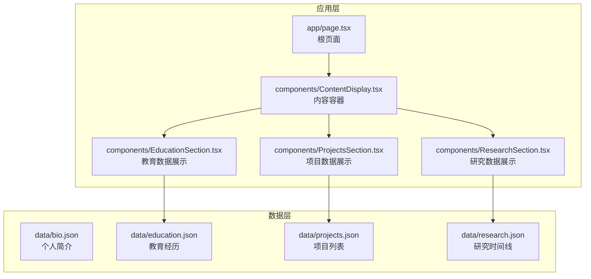
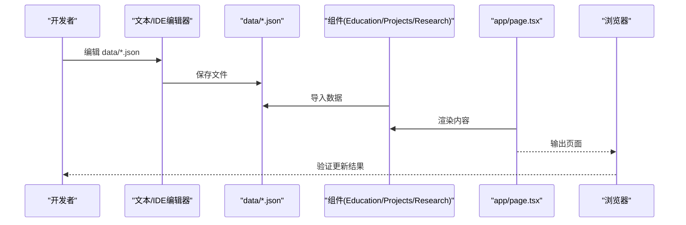
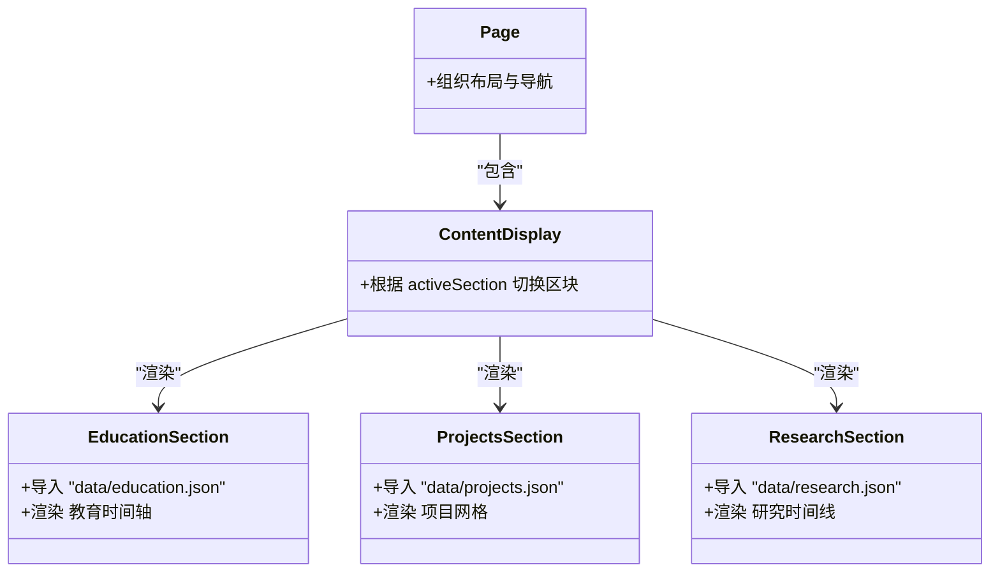
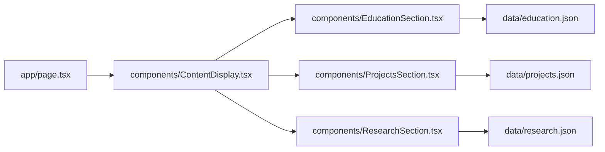

# 数据更新与维护

<cite>
**本文引用的文件**
- [README.md](file://README.md)
- [package.json](file://package.json)
- [app/page.tsx](file://app/page.tsx)
- [components/ContentDisplay.tsx](file://components/ContentDisplay.tsx)
- [components/EducationSection.tsx](file://components/EducationSection.tsx)
- [components/ProjectsSection.tsx](file://components/ProjectsSection.tsx)
- [components/ResearchSection.tsx](file://components/ResearchSection.tsx)
- [data/bio.json](file://data/bio.json)
- [data/education.json](file://data/education.json)
- [data/projects.json](file://data/projects.json)
- [data/research.json](file://data/research.json)
</cite>

## 目录
1. [引言](#引言)
2. [项目结构](#项目结构)
3. [核心组件](#核心组件)
4. [架构总览](#架构总览)
5. [详细组件分析](#详细组件分析)
6. [依赖关系分析](#依赖关系分析)
7. [性能考量](#性能考量)
8. [故障排除指南](#故障排除指南)
9. [结论](#结论)
10. [附录](#附录)

## 引言
本指南面向需要安全更新与维护 JSON 数据文件的用户，涵盖从备份策略、版本控制、变更管理到数据验证、错误处理、同步与一致性、批量更新与自动化脚本、迁移与格式转换、完整性检查与修复、安全性与访问控制，以及故障排除与恢复策略的全流程最佳实践。本项目采用静态 JSON 数据驱动前端展示，数据通过模块导入的方式在客户端组件中消费，因此更新流程以“本地编辑 + 构建发布”为主。

## 项目结构
该项目采用 Next.js App Router 结构，数据集中在 data 目录下的 JSON 文件中，前端组件通过相对路径导入这些数据并在客户端渲染。整体结构清晰、职责分离明确，便于进行数据更新与维护。

图示来源
- [app/page.tsx:1-61](file://app/page.tsx#L1-L61)
- [components/ContentDisplay.tsx:1-125](file://components/ContentDisplay.tsx#L1-L125)
- [components/EducationSection.tsx:1-143](file://components/EducationSection.tsx#L1-L143)
- [components/ProjectsSection.tsx:1-161](file://components/ProjectsSection.tsx#L1-L161)
- [components/ResearchSection.tsx:1-175](file://components/ResearchSection.tsx#L1-L175)
- [data/bio.json:1-14](file://data/bio.json#L1-L14)
- [data/education.json:1-33](file://data/education.json#L1-L33)
- [data/projects.json:1-57](file://data/projects.json#L1-L57)
- [data/research.json:1-37](file://data/research.json#L1-L37)

章节来源
- [README.md:146-169](file://README.md#L146-L169)
- [package.json:1-30](file://package.json#L1-L30)

## 核心组件
- 数据文件：位于 data 目录，包含 bio.json、education.json、projects.json、research.json 四个文件，分别对应个人简介、教育经历、项目列表、研究时间线。
- 展示组件：
  - EducationSection：读取 education.json 并渲染教育时间轴。
  - ProjectsSection：读取 projects.json 并渲染项目网格卡片。
  - ResearchSection：读取 research.json 并渲染研究进度时间线。
  - ContentDisplay：根据导航状态切换不同内容区块。
- 页面入口：app/page.tsx 负责组织布局、粒子背景、HUD、导航与内容显示。

章节来源
- [components/EducationSection.tsx:1-143](file://components/EducationSection.tsx#L1-L143)
- [components/ProjectsSection.tsx:1-161](file://components/ProjectsSection.tsx#L1-L161)
- [components/ResearchSection.tsx:1-175](file://components/ResearchSection.tsx#L1-L175)
- [components/ContentDisplay.tsx:1-125](file://components/ContentDisplay.tsx#L1-L125)
- [app/page.tsx:1-61](file://app/page.tsx#L1-L61)

## 架构总览
数据从 JSON 文件导入到组件，再由组件渲染到页面。由于使用客户端组件与静态导入，更新流程为“编辑 JSON → 重新构建 → 发布”。

图示来源
- [components/EducationSection.tsx:4](file://components/EducationSection.tsx#L4)
- [components/ProjectsSection.tsx:5](file://components/ProjectsSection.tsx#L5)
- [components/ResearchSection.tsx:4](file://components/ResearchSection.tsx#L4)
- [app/page.tsx:9-29](file://app/page.tsx#L9-L29)

## 详细组件分析

### 数据文件与导入关系
- EducationSection 导入并消费 education.json 的 education 数组。
- ProjectsSection 导入并消费 projects.json 的 projects 数组。
- ResearchSection 导入并消费 research.json 的 research 数组。
- ContentDisplay 根据导航状态决定渲染哪个区块；EducationSection 与 ProjectsSection 由 ContentDisplay 组织。

图示来源
- [components/EducationSection.tsx:4](file://components/EducationSection.tsx#L4)
- [components/ProjectsSection.tsx:5](file://components/ProjectsSection.tsx#L5)
- [components/ResearchSection.tsx:4](file://components/ResearchSection.tsx#L4)
- [components/ContentDisplay.tsx:12-42](file://components/ContentDisplay.tsx#L12-L42)
- [app/page.tsx:9-29](file://app/page.tsx#L9-L29)

章节来源
- [components/EducationSection.tsx:1-143](file://components/EducationSection.tsx#L1-L143)
- [components/ProjectsSection.tsx:1-161](file://components/ProjectsSection.tsx#L1-L161)
- [components/ResearchSection.tsx:1-175](file://components/ResearchSection.tsx#L1-L175)
- [components/ContentDisplay.tsx:1-125](file://components/ContentDisplay.tsx#L1-L125)
- [app/page.tsx:1-61](file://app/page.tsx#L1-L61)

### 数据更新流程（最佳实践）
- 备份策略
  - 在修改前复制一份原始 JSON 文件作为备份，或使用版本控制系统保留历史快照。
  - 推荐在本地分支进行修改，合并后再推送。
- 版本控制与变更管理
  - 使用 Git 对 data 目录进行版本控制，提交信息清晰描述变更内容与影响范围。
  - 对于多人协作，建议通过 Pull Request 审查后再合并。
- 数据验证与错误处理
  - 本地编辑时保持 JSON 语法正确性，避免遗漏逗号、多余的逗号、未闭合括号等。
  - 在组件层面，可增加对必需字段的校验与默认值兜底，避免渲染异常。
- 同步与一致性
  - 所有数据文件在同一构建周期内生效，避免部分数据更新导致的不一致。
  - 若需跨环境同步，建议统一通过 CI/CD 流水线触发构建与部署。
- 批量更新与自动化
  - 可编写脚本对多个 JSON 文件进行批量格式化、字段补全或字段重命名。
  - 结合工具链（如 Prettier、ESLint）在提交前自动格式化与检查。
- 迁移与格式转换
  - 当字段名或结构变化时，先在脚本中做映射转换，再批量替换旧文件。
  - 保持向后兼容的过渡期，逐步替换旧引用。
- 完整性检查与修复
  - 使用 JSON Schema 或类型定义（TypeScript）约束数据结构。
  - 对数组项进行唯一性校验（如 id），对必填字段进行非空校验。
- 安全性与访问控制
  - 仅在本地编辑 JSON，避免在公开仓库暴露敏感信息。
  - 如需私有数据，建议使用环境变量或服务端接口，而非直接暴露在前端。
- 故障排除与恢复
  - 若页面渲染异常，回滚到上一个稳定版本的 JSON 文件。
  - 通过本地构建验证无误后再上线。

章节来源
- [README.md:43-125](file://README.md#L43-L125)
- [package.json:5-9](file://package.json#L5-L9)

### 数据验证与错误处理（组件侧）
- EducationSection、ProjectsSection、ResearchSection 分别从对应 JSON 文件导入数据并渲染。
- 建议在组件内部增加基础校验：
  - 确认数组存在且非空，避免渲染空列表。
  - 对缺失字段使用默认值或条件渲染，防止报错。
  - 对 id 等关键字段进行存在性与类型校验。
- 错误边界与降级：可在组件外层包裹错误边界，出现异常时显示占位或提示信息。

章节来源
- [components/EducationSection.tsx:39-137](file://components/EducationSection.tsx#L39-L137)
- [components/ProjectsSection.tsx:26-156](file://components/ProjectsSection.tsx#L26-L156)
- [components/ResearchSection.tsx:39-168](file://components/ResearchSection.tsx#L39-L168)

### 批量数据更新与自动化脚本示例（思路）
- JSON 格式化与校验
  - 使用工具对 data 目录下所有 JSON 文件进行格式化与语法检查。
- 字段补全
  - 为新增字段提供默认值，确保现有组件仍能正常渲染。
- 字段重命名
  - 通过正则替换或专用脚本批量更新字段名，同时更新组件中的引用。
- 批量测试
  - 在本地启动开发服务器，逐一验证各区块是否正常渲染。
- 提交与发布
  - 通过 CI/CD 触发构建与部署，确保更新一次性生效。

章节来源
- [README.md:43-125](file://README.md#L43-L125)

### 数据迁移与格式转换（步骤）
- 评估变更影响：确定哪些组件依赖该数据结构。
- 设计迁移脚本：输出新格式的 JSON 文件，保留兼容字段。
- 逐步替换：先在本地验证，再替换线上文件。
- 回归测试：确认页面渲染与交互无异常。

章节来源
- [README.md:106-125](file://README.md#L106-L125)

### 同步与一致性保证
- 单次构建周期内更新所有相关 JSON 文件，避免部分更新导致的不一致。
- 使用版本控制记录每次变更，必要时可快速回滚。

章节来源
- [README.md:43-125](file://README.md#L43-L125)

## 依赖关系分析
- 组件与数据文件的依赖关系清晰：每个展示组件仅依赖其对应的 JSON 文件。
- 页面入口负责组织布局与导航，内容展示由 ContentDisplay 统一调度。

图示来源
- [app/page.tsx:9-29](file://app/page.tsx#L9-L29)
- [components/ContentDisplay.tsx:12-42](file://components/ContentDisplay.tsx#L12-L42)
- [components/EducationSection.tsx:4](file://components/EducationSection.tsx#L4)
- [components/ProjectsSection.tsx:5](file://components/ProjectsSection.tsx#L5)
- [components/ResearchSection.tsx:4](file://components/ResearchSection.tsx#L4)

章节来源
- [app/page.tsx:1-61](file://app/page.tsx#L1-L61)
- [components/ContentDisplay.tsx:1-125](file://components/ContentDisplay.tsx#L1-L125)
- [components/EducationSection.tsx:1-143](file://components/EducationSection.tsx#L1-L143)
- [components/ProjectsSection.tsx:1-161](file://components/ProjectsSection.tsx#L1-L161)
- [components/ResearchSection.tsx:1-175](file://components/ResearchSection.tsx#L1-L175)

## 性能考量
- 数据体积：JSON 文件应尽量精简，避免冗余字段与大段文本，减少客户端传输与解析开销。
- 渲染优化：组件内部已使用动画库进行渲染优化，建议避免在数据中嵌入过大的二进制数据。
- 构建与缓存：通过 Next.js 的构建与缓存机制提升页面加载速度。

## 故障排除指南
- JSON 语法错误
  - 现象：页面空白或组件渲染异常。
  - 处理：使用 JSON 校验工具检查语法，修正后重新构建。
- 字段缺失或类型不符
  - 现象：组件渲染报错或显示异常。
  - 处理：在组件内增加默认值与类型校验，或修正数据文件。
- 导入路径错误
  - 现象：组件无法找到数据文件。
  - 处理：确认相对路径正确，避免大小写与拼写错误。
- 构建失败
  - 现象：本地构建或 CI 构建报错。
  - 处理：查看错误日志定位具体文件与行号，修正后重试。

章节来源
- [components/EducationSection.tsx:39-137](file://components/EducationSection.tsx#L39-L137)
- [components/ProjectsSection.tsx:26-156](file://components/ProjectsSection.tsx#L26-L156)
- [components/ResearchSection.tsx:39-168](file://components/ResearchSection.tsx#L39-L168)

## 结论
本项目的数据更新与维护以“本地编辑 + 构建发布”为核心流程。通过严格的备份、版本控制与变更管理，配合组件侧的基础校验与错误处理，可以有效保障数据更新的安全性与稳定性。建议在团队协作中引入自动化脚本与 CI/CD 流程，进一步提升效率与一致性。

## 附录

### 数据文件清单与用途
- data/bio.json：个人简介与社交信息
- data/education.json：教育经历列表
- data/projects.json：项目列表
- data/research.json：研究时间线

章节来源
- [data/bio.json:1-14](file://data/bio.json#L1-L14)
- [data/education.json:1-33](file://data/education.json#L1-L33)
- [data/projects.json:1-57](file://data/projects.json#L1-L57)
- [data/research.json:1-37](file://data/research.json#L1-L37)