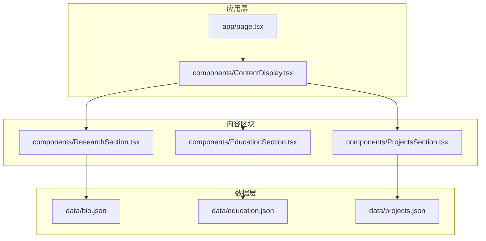
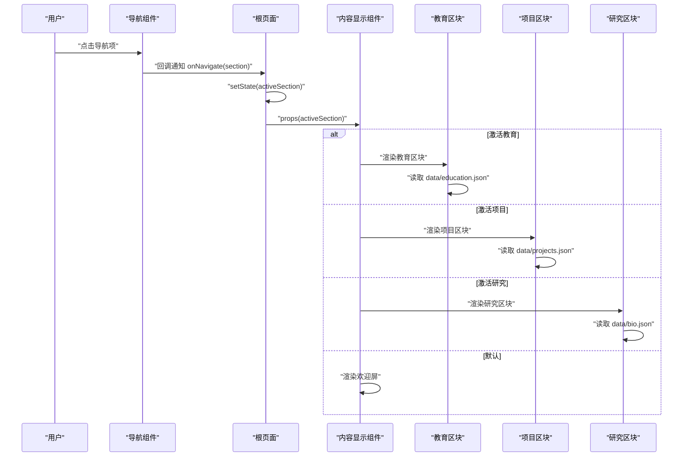
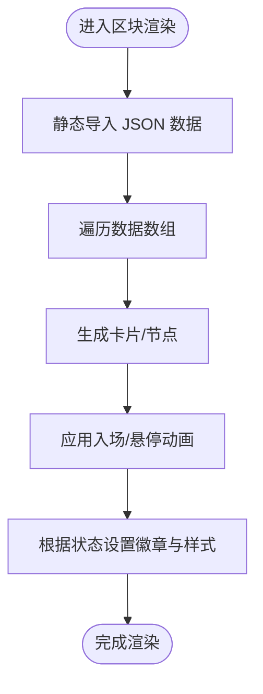
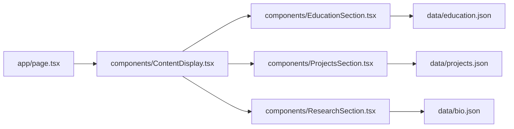

# 数据管理

<cite>
**本文引用的文件**
- [app/page.tsx](file://app/page.tsx)
- [components/ContentDisplay.tsx](file://components/ContentDisplay.tsx)
- [components/EducationSection.tsx](file://components/EducationSection.tsx)
- [components/ProjectsSection.tsx](file://components/ProjectsSection.tsx)
- [components/ResearchSection.tsx](file://components/ResearchSection.tsx)
- [data/bio.json](file://data/bio.json)
- [data/education.json](file://data/education.json)
- [data/projects.json](file://data/projects.json)
</cite>

## 目录
1. [引言](#引言)
2. [项目结构](#项目结构)
3. [核心组件](#核心组件)
4. [架构总览](#架构总览)
5. [详细组件分析](#详细组件分析)
6. [依赖关系分析](#依赖关系分析)
7. [性能考量](#性能考量)
8. [故障排查指南](#故障排查指南)
9. [结论](#结论)
10. [附录](#附录)

## 引言
本文件面向“数据驱动的内容管理系统”，聚焦于 JSON 数据文件的结构设计、数据模型定义与前端渲染绑定方式。系统通过 Next.js 应用中的页面组件与内容区块组件，以静态导入的方式消费 data 目录下的 JSON 文件，实现个人信息、教育经历、项目作品与研究进展等模块的数据驱动展示。文档将从数据模型、加载与状态管理、渲染流程、扩展与迁移、安全与隐私等方面进行全面说明。

## 项目结构
该仓库采用按功能分层的组织方式：
- app：应用入口与根页面，负责状态管理与布局组合
- components：页面级组件（导航、HUD、粒子背景）与内容区块组件（教育、项目、研究）
- data：静态 JSON 数据文件，承载各模块数据

图示来源
- [app/page.tsx:1-61](file://app/page.tsx#L1-L61)
- [components/ContentDisplay.tsx:1-125](file://components/ContentDisplay.tsx#L1-L125)
- [components/EducationSection.tsx:1-143](file://components/EducationSection.tsx#L1-L143)
- [components/ProjectsSection.tsx:1-161](file://components/ProjectsSection.tsx#L1-L161)
- [components/ResearchSection.tsx:1-175](file://components/ResearchSection.tsx#L1-L175)
- [data/education.json:1-33](file://data/education.json#L1-L33)
- [data/projects.json:1-57](file://data/projects.json#L1-L57)
- [data/bio.json:1-14](file://data/bio.json#L1-L14)

章节来源
- [app/page.tsx:1-61](file://app/page.tsx#L1-L61)
- [components/ContentDisplay.tsx:1-125](file://components/ContentDisplay.tsx#L1-L125)

## 核心组件
- 页面容器与状态管理
  - 根页面负责维护当前激活的内容区块，并将状态传递给内容显示组件
  - 导航组件接收用户选择，触发状态切换
- 内容显示组件
  - 根据激活状态决定渲染教育、项目或研究区块；默认显示欢迎屏
  - 使用动画库实现进入/退出过渡效果
- 区块组件
  - 教育区块：时间轴样式展示教育经历
  - 项目区块：网格卡片展示项目信息，支持悬停展开细节
  - 研究区块：时间线样式展示研究进展、进度与成果

章节来源
- [app/page.tsx:9-29](file://app/page.tsx#L9-L29)
- [components/ContentDisplay.tsx:12-42](file://components/ContentDisplay.tsx#L12-L42)
- [components/EducationSection.tsx:6-142](file://components/EducationSection.tsx#L6-L142)
- [components/ProjectsSection.tsx:7-160](file://components/ProjectsSection.tsx#L7-L160)
- [components/ResearchSection.tsx:6-174](file://components/ResearchSection.tsx#L6-L174)

## 架构总览
系统采用“页面状态驱动内容区块”的单向数据流：
- 用户在底部导航选择目标区块
- 页面组件更新激活状态
- 内容显示组件根据状态切换区块
- 各区块组件静态导入对应 JSON 数据并渲染

图示来源
- [app/page.tsx:12-29](file://app/page.tsx#L12-L29)
- [components/ContentDisplay.tsx:14-24](file://components/ContentDisplay.tsx#L14-L24)
- [components/EducationSection.tsx:4](file://components/EducationSection.tsx#L4)
- [components/ProjectsSection.tsx:5](file://components/ProjectsSection.tsx#L5)
- [components/ResearchSection.tsx:4](file://components/ResearchSection.tsx#L4)
- [data/education.json:1-33](file://data/education.json#L1-L33)
- [data/projects.json:1-57](file://data/projects.json#L1-L57)
- [data/bio.json:1-14](file://data/bio.json#L1-L14)

## 详细组件分析

### 数据模型与结构设计
- 个人信息（bio.json）
  - 字段：姓名、头衔、年龄、家乡、当前状态、简介、技能列表、社交链接
  - 用途：作为研究区块的通用数据源，支撑研究时间线与标签展示
- 教育经历（education.json）
  - 结构：顶层对象包含教育数组，每条记录含唯一标识、学校、学位、专业、时间段、GPA、描述、成就列表
  - 用途：时间轴卡片展示，支持交错布局与逐项动画
- 项目作品（projects.json）
  - 结构：顶层对象包含项目数组，每条记录含唯一标识、名称、描述、技术栈、状态、链接、亮点列表
  - 用途：网格卡片展示，支持悬停展开与状态徽章

章节来源
- [data/bio.json:1-14](file://data/bio.json#L1-L14)
- [data/education.json:1-33](file://data/education.json#L1-L33)
- [data/projects.json:1-57](file://data/projects.json#L1-L57)

### 数据加载与状态管理
- 加载方式
  - 区块组件通过静态导入 JSON 文件的方式在构建时注入数据
  - 导入语句位于各区块组件顶部，直接解构访问数据对象
- 状态管理
  - 根页面使用本地状态保存当前激活的区块
  - 内容显示组件根据状态条件渲染对应区块或默认欢迎屏
- 实时更新机制
  - 当前实现为静态数据导入，不包含运行时热更新
  - 如需实时更新，可在后续引入服务端数据拉取或客户端缓存刷新策略

章节来源
- [components/EducationSection.tsx:4](file://components/EducationSection.tsx#L4)
- [components/ProjectsSection.tsx:5](file://components/ProjectsSection.tsx#L5)
- [components/ResearchSection.tsx:4](file://components/ResearchSection.tsx#L4)
- [app/page.tsx:10-14](file://app/page.tsx#L10-L14)
- [components/ContentDisplay.tsx:14-24](file://components/ContentDisplay.tsx#L14-L24)

### 渲染逻辑与组件绑定
- 绑定关系
  - ContentDisplay 根据 activeSection 绑定到 EducationSection、ProjectsSection 或 ResearchSection
  - 各区块组件绑定到对应的 JSON 数据对象
- 渲染流程
  - 遍历数据数组生成卡片/节点元素
  - 使用动画库实现入场、悬停与扫描线等视觉效果
  - 基于状态字段动态设置徽章颜色与样式

图示来源
- [components/EducationSection.tsx:39-137](file://components/EducationSection.tsx#L39-L137)
- [components/ProjectsSection.tsx:26-156](file://components/ProjectsSection.tsx#L26-L156)
- [components/ResearchSection.tsx:39-169](file://components/ResearchSection.tsx#L39-L169)

章节来源
- [components/ContentDisplay.tsx:12-42](file://components/ContentDisplay.tsx#L12-L42)
- [components/EducationSection.tsx:6-142](file://components/EducationSection.tsx#L6-L142)
- [components/ProjectsSection.tsx:7-160](file://components/ProjectsSection.tsx#L7-L160)
- [components/ResearchSection.tsx:6-174](file://components/ResearchSection.tsx#L6-L174)

### 不同类型数据的组织方式
- 个人信息：扁平键值对，适合直接展示与引用
- 教育经历：数组嵌套对象，便于时间轴排序与交错布局
- 项目作品：数组嵌套对象，便于网格布局与悬停细节展开

章节来源
- [data/bio.json:1-14](file://data/bio.json#L1-L14)
- [data/education.json:2-31](file://data/education.json#L2-L31)
- [data/projects.json:2-55](file://data/projects.json#L2-L55)

### 扩展性与新增数据类型
- 新增数据类型步骤
  - 在 data 目录新增 JSON 文件，定义顶层对象与数组结构
  - 在对应区块组件中添加静态导入与渲染逻辑
  - 在内容显示组件中增加路由映射与切换逻辑
  - 在导航组件中添加新选项并绑定回调
- 数据模型建议
  - 保持每条记录具备稳定唯一标识（id），便于动画与交互
  - 对外显字段统一使用语义化命名，避免硬编码颜色与尺寸

章节来源
- [components/ContentDisplay.tsx:14-24](file://components/ContentDisplay.tsx#L14-L24)
- [components/EducationSection.tsx:4](file://components/EducationSection.tsx#L4)
- [components/ProjectsSection.tsx:5](file://components/ProjectsSection.tsx#L5)
- [components/ResearchSection.tsx:4](file://components/ResearchSection.tsx#L4)

### 数据迁移与格式转换
- 迁移策略
  - 保留旧 JSON 的关键字段映射到新结构
  - 提供转换脚本批量处理历史数据
  - 在区块组件中兼容旧字段名或做字段重映射
- 版本控制
  - 在 JSON 文件中加入版本号字段，便于升级检测
  - 逐步替换旧字段，避免一次性破坏兼容

章节来源
- [data/education.json:1-33](file://data/education.json#L1-L33)
- [data/projects.json:1-57](file://data/projects.json#L1-L57)
- [data/bio.json:1-14](file://data/bio.json#L1-L14)

### 安全性与隐私保护
- 当前实现
  - 数据以静态 JSON 文件形式存在，构建期打包进产物
  - 不涉及运行时敏感数据处理
- 建议
  - 若引入用户输入或敏感信息，应避免将其提交至前端产物
  - 使用环境变量与服务端接口隔离敏感数据
  - 对外公开数据遵循最小化原则，仅暴露必要字段

章节来源
- [components/EducationSection.tsx:4](file://components/EducationSection.tsx#L4)
- [components/ProjectsSection.tsx:5](file://components/ProjectsSection.tsx#L5)
- [components/ResearchSection.tsx:4](file://components/ResearchSection.tsx#L4)

## 依赖关系分析
- 组件耦合
  - ContentDisplay 与各区块组件松耦合，通过字符串状态驱动
  - 区块组件与数据文件之间为单向依赖，导入即消费
- 外部依赖
  - 动画与过渡效果依赖第三方动画库
  - 样式依赖 UI 框架与主题变量

图示来源
- [app/page.tsx:1-61](file://app/page.tsx#L1-L61)
- [components/ContentDisplay.tsx:1-125](file://components/ContentDisplay.tsx#L1-L125)
- [components/EducationSection.tsx:1-143](file://components/EducationSection.tsx#L1-L143)
- [components/ProjectsSection.tsx:1-161](file://components/ProjectsSection.tsx#L1-L161)
- [components/ResearchSection.tsx:1-175](file://components/ResearchSection.tsx#L1-L175)
- [data/education.json:1-33](file://data/education.json#L1-L33)
- [data/projects.json:1-57](file://data/projects.json#L1-L57)
- [data/bio.json:1-14](file://data/bio.json#L1-L14)

章节来源
- [app/page.tsx:1-61](file://app/page.tsx#L1-L61)
- [components/ContentDisplay.tsx:1-125](file://components/ContentDisplay.tsx#L1-L125)

## 性能考量
- 静态导入优势
  - 构建期注入数据，减少运行时 IO 与解析开销
  - 利于 Tree Shaking 与产物体积优化
- 渲染优化
  - 使用动画库的入场/出场过渡，避免频繁重排
  - 卡片内部使用相对定位与遮罩，减少复杂布局抖动
- 可扩展优化点
  - 对大型数据集可考虑分页或虚拟滚动
  - 将重复的样式与动画参数抽取为常量，降低内存占用

## 故障排查指南
- 数据未显示
  - 检查 JSON 文件语法是否正确，确认顶层对象与数组字段名一致
  - 确认区块组件导入路径与文件名匹配
- 样式异常
  - 检查主题变量与样式类是否正确拼接
  - 确认动画库依赖已安装且版本兼容
- 交互无效
  - 确认根页面状态切换逻辑与导航回调绑定正确
  - 检查内容显示组件的状态分支与默认渲染逻辑

章节来源
- [components/ContentDisplay.tsx:14-24](file://components/ContentDisplay.tsx#L14-L24)
- [components/EducationSection.tsx:39-137](file://components/EducationSection.tsx#L39-L137)
- [components/ProjectsSection.tsx:26-156](file://components/ProjectsSection.tsx#L26-L156)
- [components/ResearchSection.tsx:39-169](file://components/ResearchSection.tsx#L39-L169)

## 结论
本系统通过静态 JSON 数据与区块组件的解耦设计，实现了清晰、可维护的数据驱动内容管理。当前以教育、项目、研究为核心模块，具备良好的扩展性。建议在后续迭代中引入服务端数据拉取、版本化数据模型与更完善的错误处理与监控体系，以进一步提升可用性与可维护性。

## 附录
- 最佳实践清单
  - 为每条记录提供稳定唯一标识
  - 统一字段命名与数据类型，便于迁移与扩展
  - 将样式与动画参数集中管理，避免散落配置
  - 对外公开数据遵循最小化原则，避免泄露敏感信息