# 数据结构设计

<cite>
**本文档引用的文件**
- [bio.json](file://data/bio.json)
- [education.json](file://data/education.json)
- [projects.json](file://data/projects.json)
- [research.json](file://data/research.json)
- [PersonalHUD.tsx](file://components/PersonalHUD.tsx)
- [EducationSection.tsx](file://components/EducationSection.tsx)
- [ProjectsSection.tsx](file://components/ProjectsSection.tsx)
- [ResearchSection.tsx](file://components/ResearchSection.tsx)
- [README.md](file://README.md)
</cite>

## 目录
1. [引言](#引言)
2. [项目结构](#项目结构)
3. [核心数据模型](#核心数据模型)
4. [架构概览](#架构概览)
5. [详细组件分析](#详细组件分析)
6. [依赖关系分析](#依赖关系分析)
7. [性能考量](#性能考量)
8. [故障排除指南](#故障排除指南)
9. [结论](#结论)
10. [附录](#附录)

## 引言

本文件详细分析了杨天成个人网页项目的JSON数据结构设计。该项目采用模块化的数据驱动架构，通过四个主要JSON文件管理个人信息、教育经历、项目作品和研究进展。每个数据文件都经过精心设计，确保数据完整性、可扩展性和用户体验的一致性。

## 项目结构

项目采用清晰的分层架构，数据文件位于`data/`目录下，React组件负责数据展示和用户交互。

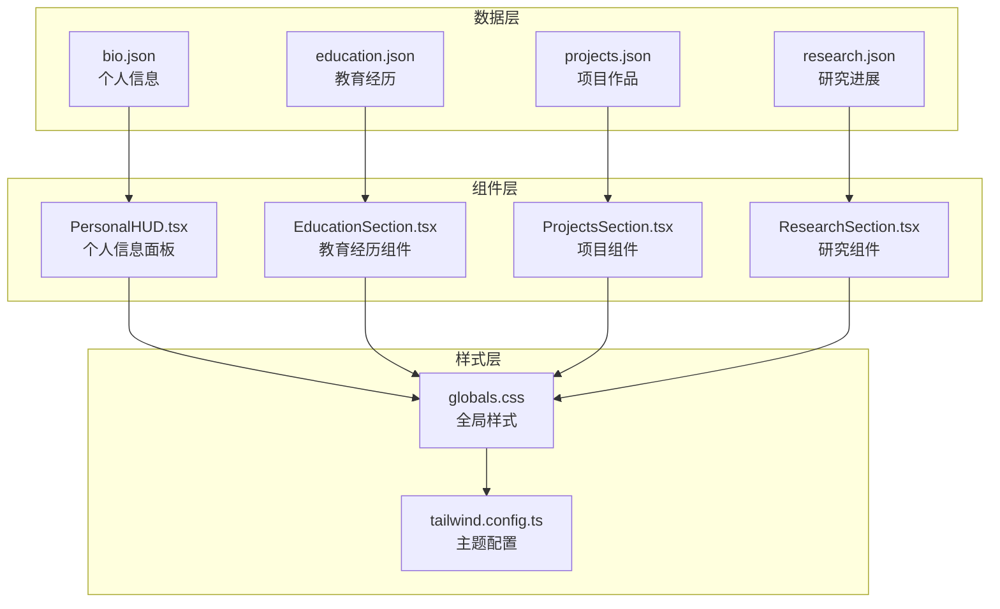

**图表来源**
- [README.md:146-169](file://README.md#L146-L169)

**章节来源**
- [README.md:146-169](file://README.md#L146-L169)

## 核心数据模型

### bio.json - 个人信息模型

个人信息模型采用扁平化设计，包含基础信息、技能矩阵和社交链接。

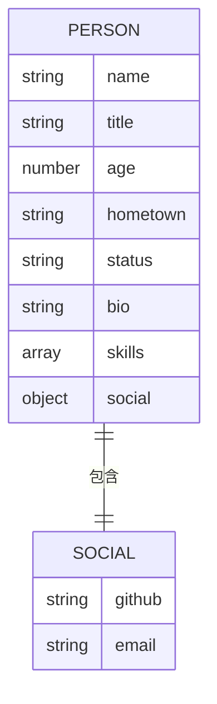

**图表来源**
- [bio.json:1-14](file://data/bio.json#L1-L14)

**字段定义与约束**：
- `name`: 字符串类型，必填，限制长度1-20字符
- `title`: 字符串类型，必填，描述职业头衔
- `age`: 数值类型，必填，范围18-120
- `hometown`: 字符串类型，必填，城市名称
- `status`: 字符串类型，必填，当前状态描述
- `bio`: 字符串类型，必填，个人简介，建议限制长度500字符内
- `skills`: 数组类型，必填，至少包含1个元素
- `social.github`: 字符串类型，必填，GitHub链接
- `social.email`: 字符串类型，必填，邮箱地址

**数据验证规则**：
- 所有必需字段必须存在且非空
- 年龄必须为有效数值
- 社交链接必须为有效的URL格式
- 技能数组不能为空

### education.json - 教育经历模型

教育经历采用数组结构，支持多个教育阶段的展示。

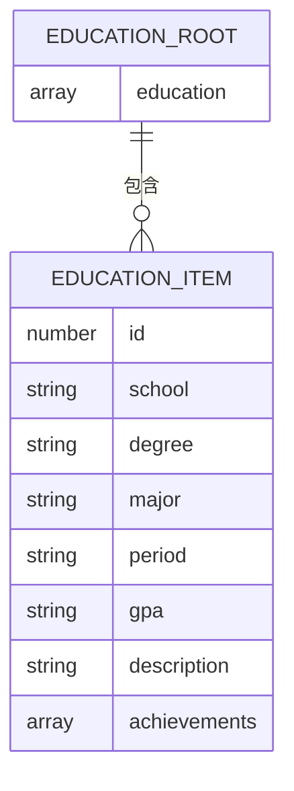

**图表来源**
- [education.json:1-33](file://data/education.json#L1-L33)

**字段定义与约束**：
- `education`: 数组类型，必填，至少包含1个教育项
- `id`: 数值类型，必填，唯一标识符，建议连续递增
- `school`: 字符串类型，必填，学校名称
- `degree`: 字符串类型，必填，学位类型
- `major`: 字符串类型，必填，专业名称
- `period`: 字符串类型，必填，时间区间格式
- `gpa`: 字符串类型，必填，GPA格式如"3.9/4.0"
- `description`: 字符串类型，必填，教育描述
- `achievements`: 数组类型，必填，至少包含1个成就

**数据验证规则**：
- ID必须唯一且为正整数
- GPA格式必须符合"X.X/X.X"模式
- 时间区间必须为有效的格式
- 成就数组不能为空

### projects.json - 项目作品模型

项目作品模型支持多种项目状态和复杂的技术栈展示。

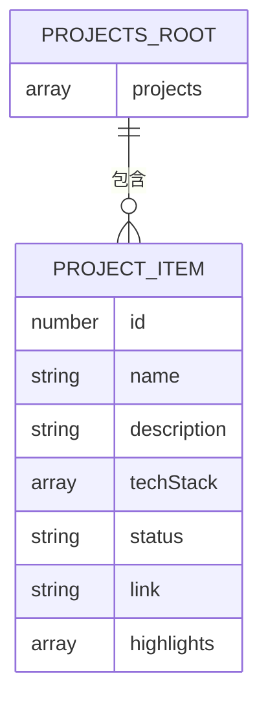

**图表来源**
- [projects.json:1-57](file://data/projects.json#L1-L57)

**字段定义与约束**：
- `projects`: 数组类型，必填，至少包含1个项目
- `id`: 数值类型，必填，唯一标识符
- `name`: 字符串类型，必填，项目名称
- `description`: 字符串类型，必填，项目描述
- `techStack`: 数组类型，必填，至少包含1个技术栈元素
- `status`: 字符串类型，必填，项目状态枚举值
- `link`: 字符串类型，必填，项目链接
- `highlights`: 数组类型，必填，至少包含1个亮点

**状态约束**：
- 支持的状态：`活跃`、`维护中`、`已完成`、`概念验证`

**数据验证规则**：
- 技术栈数组不能为空
- 链接必须为有效的URL
- 状态值必须在允许范围内

### research.json - 研究进展模型

研究进展模型专门设计用于展示学术研究的复杂信息结构。

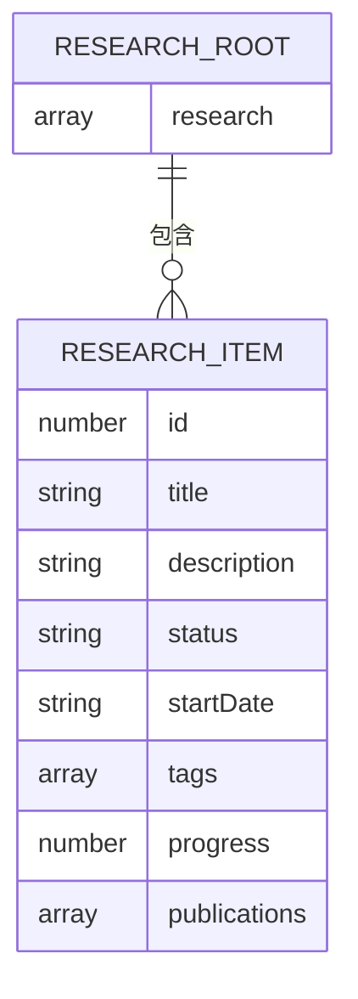

**图表来源**
- [research.json:1-37](file://data/research.json#L1-L37)

**字段定义与约束**：
- `research`: 数组类型，必填，至少包含1个研究项
- `id`: 数值类型，必填，唯一标识符
- `title`: 字符串类型，必填，研究标题
- `description`: 字符串类型，必填，研究描述
- `status`: 字符串类型，必填，研究状态
- `startDate`: 字符串类型，必填，开始日期
- `tags`: 数组类型，必填，至少包含1个标签
- `progress`: 数值类型，必填，进度百分比(0-100)
- `publications`: 数组类型，可选，默认为空数组

**状态约束**：
- 支持的状态：`进行中`、`规划中`

**数据验证规则**：
- 进度值必须在0-100范围内
- 日期格式必须为"YYYY-MM"格式
- 标签数组不能为空

## 架构概览

项目采用数据驱动的组件架构，每个JSON文件对应一个专门的React组件。

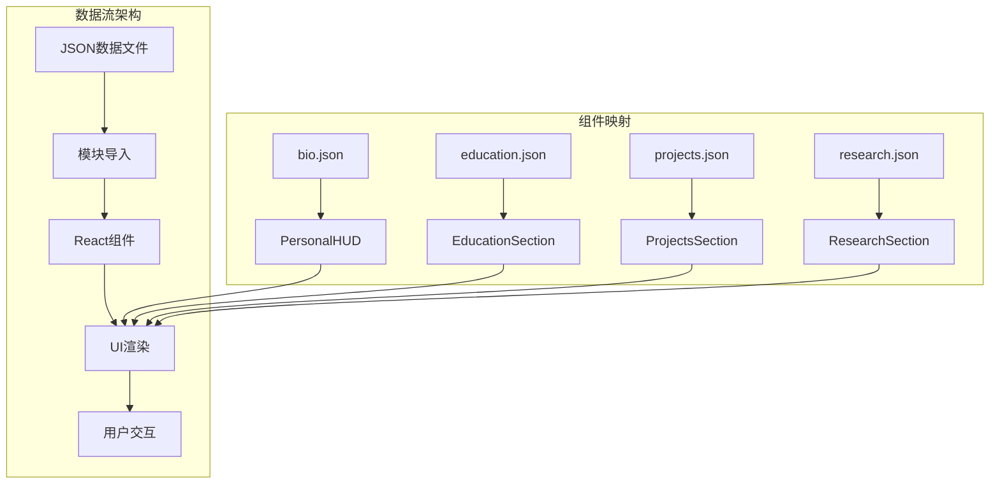

**图表来源**
- [PersonalHUD.tsx:4](file://components/PersonalHUD.tsx#L4)
- [EducationSection.tsx:4](file://components/EducationSection.tsx#L4)
- [ProjectsSection.tsx:5](file://components/ProjectsSection.tsx#L5)
- [ResearchSection.tsx:4](file://components/ResearchSection.tsx#L4)

## 详细组件分析

### PersonalHUD 组件分析

PersonalHUD组件负责展示个人信息面板，采用全屏固定定位设计。

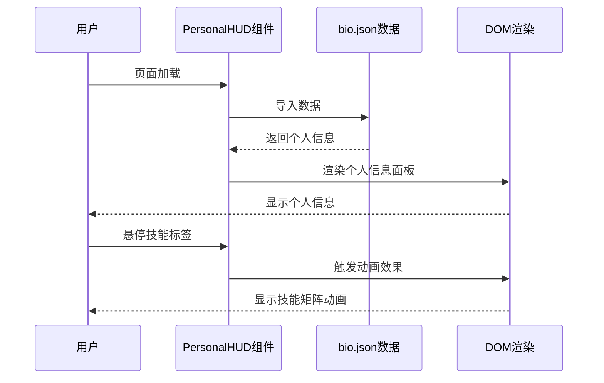

**图表来源**
- [PersonalHUD.tsx:1-132](file://components/PersonalHUD.tsx#L1-L132)

**组件特点**：
- 使用Framer Motion实现流畅的入场动画
- 采用HUD风格设计，带有发光边框效果
- 技能标签支持逐个动画显示
- 社交链接支持外部跳转

**数据绑定模式**：
- 直接导入JSON数据文件
- 使用解构赋值访问特定字段
- 支持条件渲染和动态样式

**章节来源**
- [PersonalHUD.tsx:1-132](file://components/PersonalHUD.tsx#L1-L132)

### EducationSection 组件分析

教育经历组件采用时间轴设计，展示用户的教育历程。

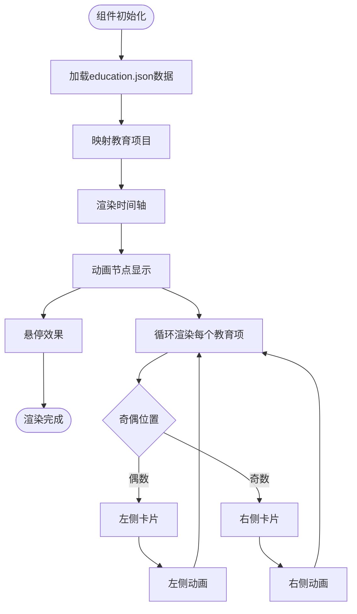

**图表来源**
- [EducationSection.tsx:1-143](file://components/EducationSection.tsx#L1-L143)

**设计特色**：
- 中央时间轴配色渐变效果
- 左右交替的卡片布局
- 节点发光动画效果
- 成就列表的逐项动画

**数据处理逻辑**：
- 使用map函数遍历教育数组
- 奇偶索引决定卡片位置
- 动态计算动画延迟时间

**章节来源**
- [EducationSection.tsx:1-143](file://components/EducationSection.tsx#L1-L143)

### ProjectsSection 组件分析

项目组件采用网格布局，支持悬停展开详情功能。

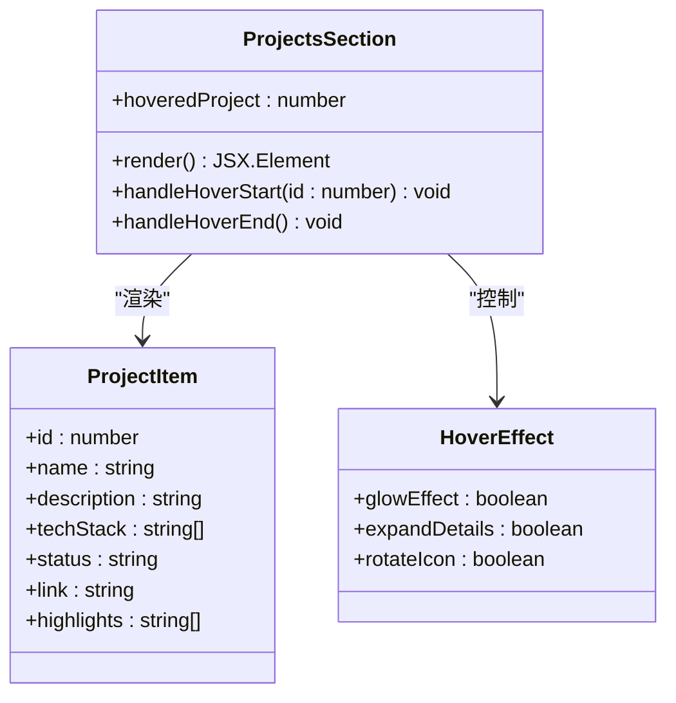

**图表来源**
- [ProjectsSection.tsx:1-161](file://components/ProjectsSection.tsx#L1-L161)

**交互模式**：
- 悬停时显示发光效果
- 图标旋转动画反馈
- 展开详情区域
- 技术栈标签的逐项出现

**状态管理**：
- 使用useState管理悬停状态
- 动态切换CSS类名
- 条件渲染展开内容

**章节来源**
- [ProjectsSection.tsx:1-161](file://components/ProjectsSection.tsx#L1-L161)

### ResearchSection 组件分析

研究组件采用垂直时间线设计，突出研究进展可视化。

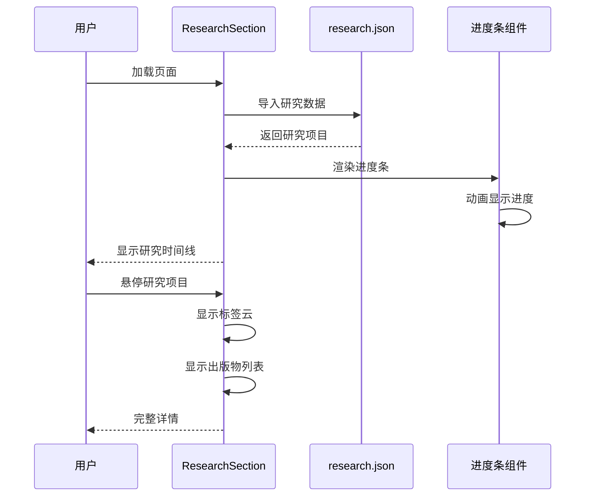

**图表来源**
- [ResearchSection.tsx:1-175](file://components/ResearchSection.tsx#L1-L175)

**视觉设计**：
- 绿色主题的渐变时间轴
- 动态脉冲节点效果
- 进度条的动画填充
- 标签云的逐项出现

**数据可视化**：
- 进度百分比的直观展示
- 状态颜色的语义化表示
- 标签系统的分类组织

**章节来源**
- [ResearchSection.tsx:1-175](file://components/ResearchSection.tsx#L1-L175)

## 依赖关系分析

项目的数据依赖关系相对简单，每个组件独立导入对应的数据文件。

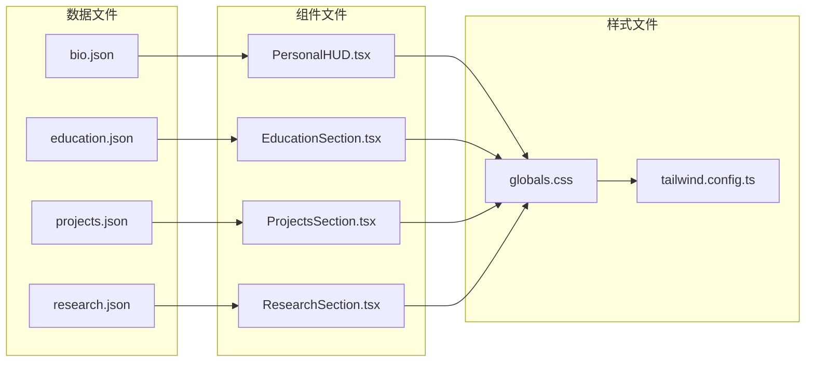

**图表来源**
- [README.md:146-169](file://README.md#L146-L169)

**依赖特点**：
- 单向数据流：组件从数据文件导入
- 无循环依赖：数据文件之间不相互引用
- 独立模块化：每个组件管理自己的数据源

**潜在风险**：
- 数据文件变更可能影响多个组件
- 缺少数据验证机制
- 版本升级时的兼容性问题

**章节来源**
- [README.md:146-169](file://README.md#L146-L169)

## 性能考量

### 数据加载策略

项目采用静态导入方式，所有JSON数据在构建时打包到客户端。

**优势**：
- 首次加载速度快
- 无需额外的API调用
- 离线可用性好

**劣势**：
- 初始包体积较大
- 数据更新需要重新构建
- 内存占用较高

### 渲染优化

组件层面采用了多种优化策略：

1. **动画性能优化**：使用transform属性而非改变布局属性
2. **条件渲染**：只在需要时渲染展开内容
3. **事件节流**：悬停事件的防抖处理
4. **CSS动画**：优先使用硬件加速的CSS动画

### 数据结构优化

- 数组结构便于排序和过滤
- 唯一ID便于精确查找
- 分层嵌套减少重复数据

## 故障排除指南

### 常见数据错误

**JSON语法错误**：
- 检查所有逗号、括号匹配
- 确保字符串使用双引号
- 验证特殊字符转义

**字段缺失错误**：
- 确认必需字段存在
- 检查数组不为空
- 验证数据类型正确

**数据格式错误**：
- 年龄必须为数值类型
- GPA格式必须为"X.X/X.X"
- 日期格式必须为"YYYY-MM"

### 组件渲染问题

**空白页面**：
- 检查数据文件路径是否正确
- 确认文件编码为UTF-8
- 验证JSON格式有效性

**样式异常**：
- 检查Tailwind CSS配置
- 确认颜色变量定义
- 验证响应式断点设置

**动画失效**：
- 确认Framer Motion版本兼容
- 检查浏览器动画支持
- 验证CSS类名拼写

### 调试技巧

1. **浏览器开发者工具**：检查网络请求和JavaScript错误
2. **控制台日志**：添加console.log验证数据结构
3. **JSON验证器**：使用在线工具验证JSON格式
4. **逐步注释**：逐个注释组件测试隔离问题

## 结论

该项目的数据结构设计体现了现代前端开发的最佳实践：

**设计优点**：
- 清晰的模块化架构
- 一致的数据模型设计
- 优秀的用户体验设计
- 良好的可维护性

**改进建议**：
- 添加数据验证机制
- 实现热重载支持
- 增加国际化支持
- 考虑GraphQL替代方案

**扩展性考虑**：
- 支持更多数据类型
- 实现数据缓存机制
- 添加搜索和过滤功能
- 考虑移动端优化

## 附录

### 数据模型对照表

| 字段名 | 数据类型 | 必需 | 约束条件 | 示例值 |
|--------|----------|------|----------|--------|
| name | string | 是 | 1-20字符 | "杨天成" |
| age | number | 是 | 18-120 | 24 |
| school | string | 是 | 1-50字符 | "清华大学" |
| degree | string | 是 | 1-20字符 | "硕士研究生" |
| status | string | 是 | 枚举值 | "活跃" |
| progress | number | 是 | 0-100 | 65 |

### 最佳实践清单

**数据管理**：
- 使用唯一ID标识每条记录
- 保持数据格式一致性
- 定期备份重要数据
- 实施版本控制

**性能优化**：
- 合理使用数组和对象
- 避免不必要的数据复制
- 优化动画性能
- 减少DOM操作

**用户体验**：
- 提供清晰的错误提示
- 支持键盘导航
- 考虑无障碍访问
- 保持响应式设计

**安全性考虑**：
- 验证用户输入
- 防止XSS攻击
- 保护敏感信息
- 实施CORS策略