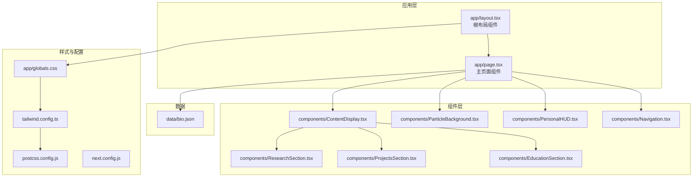
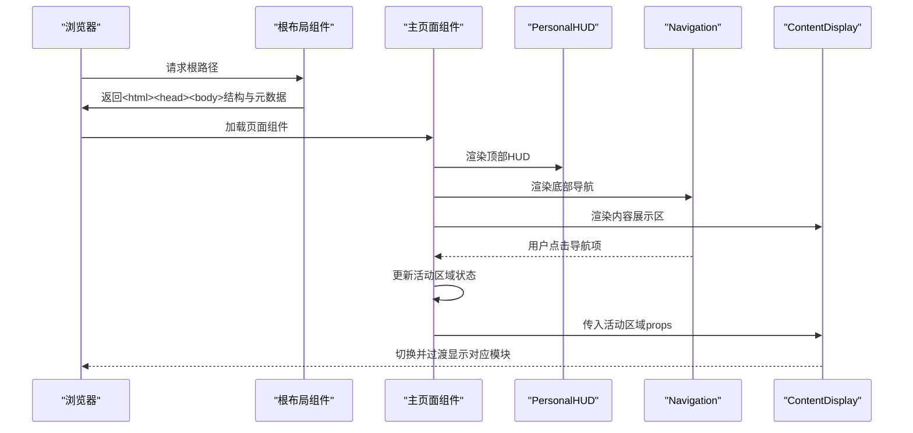
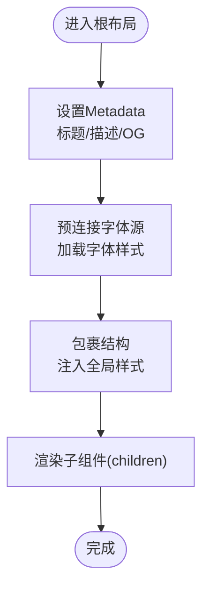
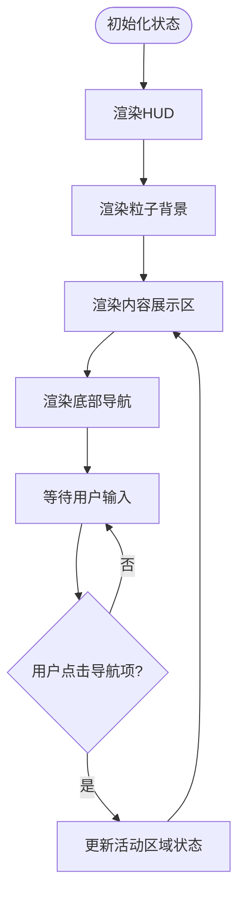
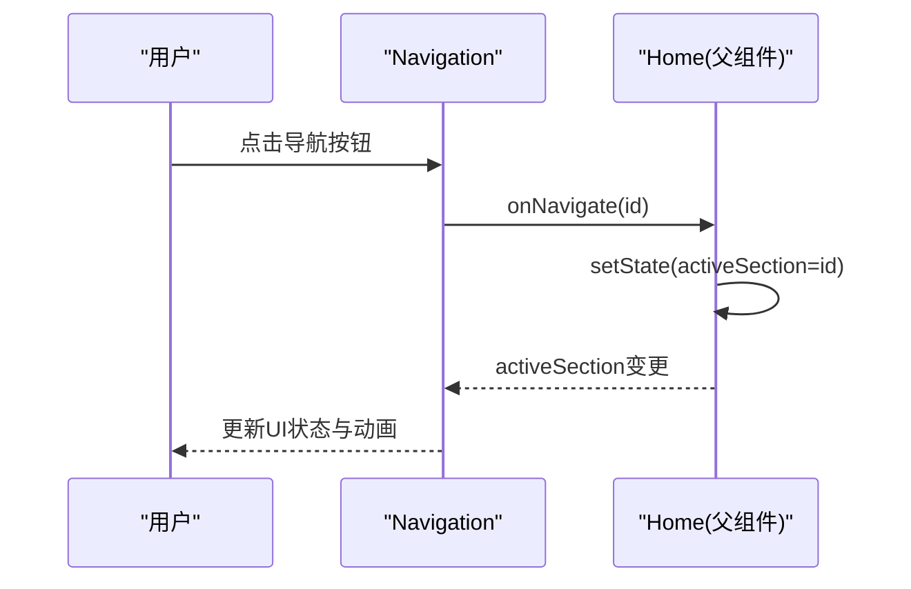
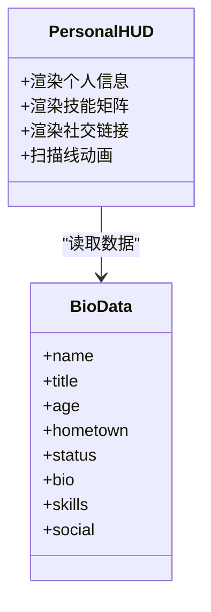
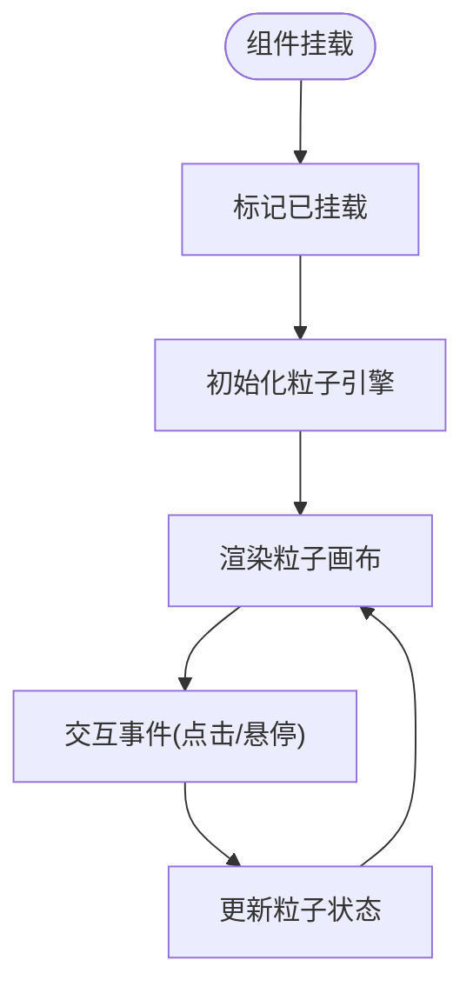
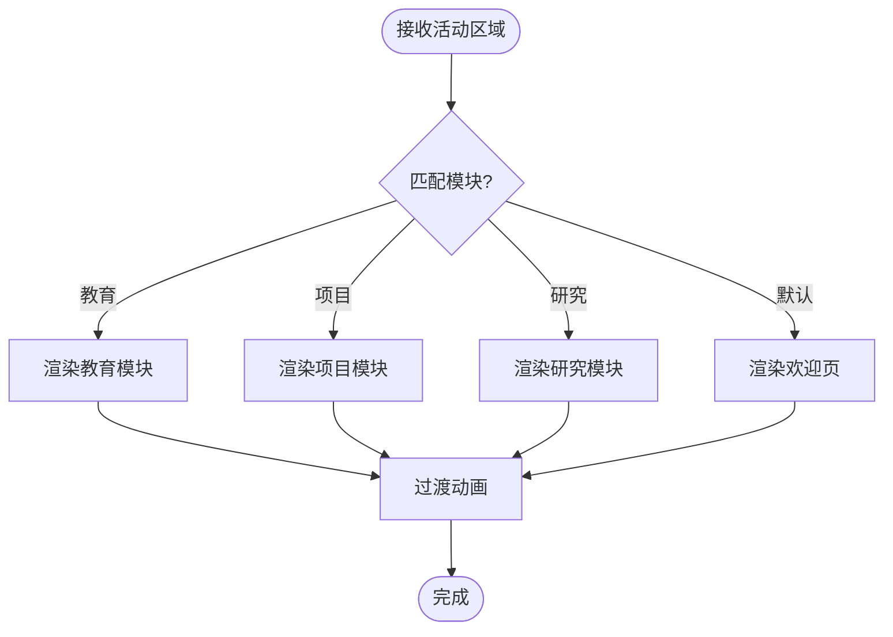
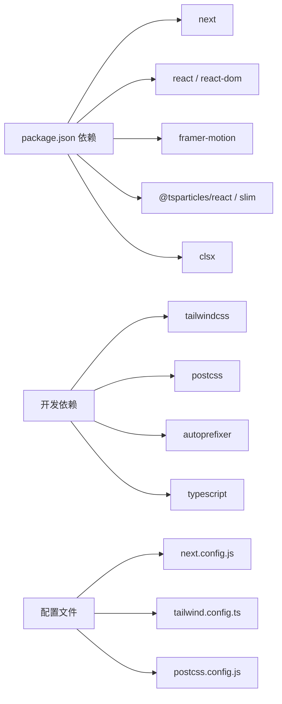

# 应用架构

<cite>
**本文引用的文件**
- [app/layout.tsx](file://app/layout.tsx)
- [app/page.tsx](file://app/page.tsx)
- [app/globals.css](file://app/globals.css)
- [components/Navigation.tsx](file://components/Navigation.tsx)
- [components/ParticleBackground.tsx](file://components/ParticleBackground.tsx)
- [components/PersonalHUD.tsx](file://components/PersonalHUD.tsx)
- [components/ContentDisplay.tsx](file://components/ContentDisplay.tsx)
- [components/EducationSection.tsx](file://components/EducationSection.tsx)
- [components/ProjectsSection.tsx](file://components/ProjectsSection.tsx)
- [components/ResearchSection.tsx](file://components/ResearchSection.tsx)
- [data/bio.json](file://data/bio.json)
- [tailwind.config.ts](file://tailwind.config.ts)
- [next.config.js](file://next.config.js)
- [package.json](file://package.json)
- [postcss.config.js](file://postcss.config.js)
</cite>

## 目录
1. [简介](#简介)
2. [项目结构](#项目结构)
3. [核心组件](#核心组件)
4. [架构总览](#架构总览)
5. [详细组件分析](#详细组件分析)
6. [依赖关系分析](#依赖关系分析)
7. [性能考量](#性能考量)
8. [故障排查指南](#故障排查指南)
9. [结论](#结论)
10. [附录](#附录)

## 简介
本项目是一个基于 Next.js App Router 的个人主页应用，采用赛博朋克风格的视觉语言与交互设计，结合客户端组件、服务器组件与混合渲染策略，实现高性能、可扩展且具备沉浸式体验的前端界面。应用通过文件系统路由约定组织页面结构，利用根布局组件统一注入元数据、字体与全局样式；主页面负责状态管理与组件协调，配合动画库与粒子系统提升视觉表现。

## 项目结构
应用采用 Next.js App Router 的目录约定，核心入口为 app 目录下的布局与页面文件，组件与样式分别位于 components 与 app 目录，数据资源位于 data 目录。Tailwind CSS 与 PostCSS 提供样式工具链支持，配置文件定义主题色、字体族与动画扩展。

图表来源
- [app/layout.tsx:1-37](file://app/layout.tsx#L1-L37)
- [app/page.tsx:1-61](file://app/page.tsx#L1-L61)
- [components/Navigation.tsx:1-103](file://components/Navigation.tsx#L1-L103)
- [components/PersonalHUD.tsx:1-132](file://components/PersonalHUD.tsx#L1-L132)
- [components/ParticleBackground.tsx:1-126](file://components/ParticleBackground.tsx#L1-L126)
- [components/ContentDisplay.tsx:1-125](file://components/ContentDisplay.tsx#L1-L125)
- [components/EducationSection.tsx:1-143](file://components/EducationSection.tsx#L1-L143)
- [components/ProjectsSection.tsx:1-161](file://components/ProjectsSection.tsx#L1-L161)
- [components/ResearchSection.tsx:1-175](file://components/ResearchSection.tsx#L1-L175)
- [app/globals.css:1-212](file://app/globals.css#L1-L212)
- [tailwind.config.ts:1-72](file://tailwind.config.ts#L1-L72)
- [postcss.config.js:1-7](file://postcss.config.js#L1-L7)
- [next.config.js:1-11](file://next.config.js#L1-L11)
- [data/bio.json:1-14](file://data/bio.json#L1-L14)

章节来源
- [app/layout.tsx:1-37](file://app/layout.tsx#L1-L37)
- [app/page.tsx:1-61](file://app/page.tsx#L1-L61)
- [app/globals.css:1-212](file://app/globals.css#L1-L212)
- [tailwind.config.ts:1-72](file://tailwind.config.ts#L1-L72)
- [postcss.config.js:1-7](file://postcss.config.js#L1-L7)
- [next.config.js:1-11](file://next.config.js#L1-L11)
- [data/bio.json:1-14](file://data/bio.json#L1-L14)

## 核心组件
- 根布局组件（RootLayout）
  - 职责：统一注入元数据、预连接字体源、加载字体样式、提供根 html/body 结构与全局样式入口。
  - 关键点：使用 Metadata 配置 SEO 信息；在 head 中引入 Google Fonts 并设置跨域属性；body 使用抗锯齿类名以优化显示。
- 主页面组件（Home）
  - 职责：集中管理导航状态、协调顶部 HUD、粒子背景、内容展示区与底部导航；提供装饰性扫描线与坐标提示等视觉元素。
  - 关键点：声明客户端组件；使用状态切换控制内容区域展示；通过 props 将状态传递给子组件。
- 组件生态
  - Navigation：底部导航条，响应用户点击切换活动区域。
  - PersonalHUD：顶部右上角 HUD，展示个人信息、技能矩阵与社交链接。
  - ParticleBackground：全屏粒子背景，支持点击/悬停交互与网格叠加效果。
  - ContentDisplay：中心内容容器，根据活动区域动态切换教育、项目或研究模块，配合过渡动画。
  - EducationSection/ProjectsSection/ResearchSection：对应模块的数据驱动展示，包含时间轴、卡片、进度条与高亮信息。

章节来源
- [app/layout.tsx:1-37](file://app/layout.tsx#L1-L37)
- [app/page.tsx:1-61](file://app/page.tsx#L1-L61)
- [components/Navigation.tsx:1-103](file://components/Navigation.tsx#L1-L103)
- [components/PersonalHUD.tsx:1-132](file://components/PersonalHUD.tsx#L1-L132)
- [components/ParticleBackground.tsx:1-126](file://components/ParticleBackground.tsx#L1-L126)
- [components/ContentDisplay.tsx:1-125](file://components/ContentDisplay.tsx#L1-L125)
- [components/EducationSection.tsx:1-143](file://components/EducationSection.tsx#L1-L143)
- [components/ProjectsSection.tsx:1-161](file://components/ProjectsSection.tsx#L1-L161)
- [components/ResearchSection.tsx:1-175](file://components/ResearchSection.tsx#L1-L175)

## 架构总览
Next.js App Router 通过文件系统路由约定自动解析页面路径，根布局组件贯穿所有页面，提供一致的元数据与样式环境。主页面作为客户端组件，承载状态与交互逻辑，向下分发到各功能模块。Tailwind CSS 与自定义主题扩展为组件提供一致的视觉语言与动画能力。

图表来源
- [app/layout.tsx:1-37](file://app/layout.tsx#L1-L37)
- [app/page.tsx:1-61](file://app/page.tsx#L1-L61)
- [components/PersonalHUD.tsx:1-132](file://components/PersonalHUD.tsx#L1-L132)
- [components/Navigation.tsx:1-103](file://components/Navigation.tsx#L1-L103)
- [components/ContentDisplay.tsx:1-125](file://components/ContentDisplay.tsx#L1-L125)

## 详细组件分析

### 根布局组件（RootLayout）设计原理
- 元数据管理：通过 Metadata 对象集中配置标题、描述、关键词与 Open Graph 信息，确保 SEO 与社交分享一致性。
- 字体加载：在 head 中预连接 Google Fonts 源并加载 Orbitron、Rajdhani、JetBrains Mono 等字体，提升首屏可读性。
- 全局样式注入：在根布局中引入全局 CSS，确保主题变量、动画与通用样式在整站生效。
- 语言与结构：设置 html lang 属性，包裹 body 内容，保证无障碍与国际化基础。

图表来源
- [app/layout.tsx:1-37](file://app/layout.tsx#L1-L37)
- [app/globals.css:1-212](file://app/globals.css#L1-L212)

章节来源
- [app/layout.tsx:1-37](file://app/layout.tsx#L1-L37)
- [app/globals.css:1-212](file://app/globals.css#L1-L212)

### 主页面组件（Home）职责分工
- 状态管理：使用 useState 维护当前活动区域，处理导航切换逻辑。
- 组件协调：将状态通过 props 下发至 ContentDisplay 与 Navigation，实现解耦与复用。
- 生命周期处理：在主页面内集中处理顶层布局与装饰元素（HUD、粒子背景、扫描线），避免子组件重复实现。
- 客户端渲染：声明为客户端组件，启用交互与动画能力。

图表来源
- [app/page.tsx:1-61](file://app/page.tsx#L1-L61)
- [components/PersonalHUD.tsx:1-132](file://components/PersonalHUD.tsx#L1-L132)
- [components/ParticleBackground.tsx:1-126](file://components/ParticleBackground.tsx#L1-L126)
- [components/ContentDisplay.tsx:1-125](file://components/ContentDisplay.tsx#L1-L125)
- [components/Navigation.tsx:1-103](file://components/Navigation.tsx#L1-L103)

章节来源
- [app/page.tsx:1-61](file://app/page.tsx#L1-L61)

### Navigation 组件（底部导航）
- 功能：提供教育、项目、研究三个导航项，支持悬停发光、点击切换与活动指示器动画。
- 交互：使用 Framer Motion 实现入场动画、悬停效果与布局动画；通过回调函数通知父组件切换活动区域。
- 视觉：采用赛博朋克配色与圆角模糊背景，增强科技感。

图表来源
- [components/Navigation.tsx:1-103](file://components/Navigation.tsx#L1-L103)
- [app/page.tsx:1-61](file://app/page.tsx#L1-L61)

章节来源
- [components/Navigation.tsx:1-103](file://components/Navigation.tsx#L1-L103)

### PersonalHUD 组件（顶部HUD）
- 功能：展示姓名、头衔、年龄、地点、状态、个人简介与技能矩阵，提供社交链接入口。
- 视觉：采用渐变边框、扫描线与发光效果，营造赛博朋克风格的 HUD 感。
- 数据：从生物数据 JSON 文件读取信息，实现内容与展示分离。

图表来源
- [components/PersonalHUD.tsx:1-132](file://components/PersonalHUD.tsx#L1-L132)
- [data/bio.json:1-14](file://data/bio.json#L1-L14)

章节来源
- [components/PersonalHUD.tsx:1-132](file://components/PersonalHUD.tsx#L1-L132)
- [data/bio.json:1-14](file://data/bio.json#L1-L14)

### ParticleBackground 组件（粒子背景）
- 功能：全屏粒子系统，支持点击/悬停交互、连线效果与网格叠加。
- 性能：通过 mounted 标志避免服务端渲染时的不必要挂载；限制帧率以平衡性能与视觉质量。
- 视觉：使用多种颜色与透明度变化，营造赛博朋克氛围。

图表来源
- [components/ParticleBackground.tsx:1-126](file://components/ParticleBackground.tsx#L1-L126)

章节来源
- [components/ParticleBackground.tsx:1-126](file://components/ParticleBackground.tsx#L1-L126)

### ContentDisplay 组件（内容展示区）
- 功能：根据活动区域动态渲染欢迎页或三大模块之一，配合过渡动画实现平滑切换。
- 协调：接收来自父组件的状态，决定渲染内容与动画参数。

图表来源
- [components/ContentDisplay.tsx:1-125](file://components/ContentDisplay.tsx#L1-L125)
- [components/EducationSection.tsx:1-143](file://components/EducationSection.tsx#L1-L143)
- [components/ProjectsSection.tsx:1-161](file://components/ProjectsSection.tsx#L1-L161)
- [components/ResearchSection.tsx:1-175](file://components/ResearchSection.tsx#L1-L175)

章节来源
- [components/ContentDisplay.tsx:1-125](file://components/ContentDisplay.tsx#L1-L125)

### EducationSection 组件（教育经历）
- 功能：以时间轴形式展示教育经历，包含学校信息、专业、时间段、GPA 与成就列表。
- 视觉：中心时间线与数据流动画，卡片带发光与扫描线效果，增强科技感。

章节来源
- [components/EducationSection.tsx:1-143](file://components/EducationSection.tsx#L1-L143)

### ProjectsSection 组件（项目经历）
- 功能：网格化展示项目卡片，支持悬停展开高亮信息与技术栈标签，提供外部链接入口。
- 视觉：状态徽章区分项目状态，网格背景动画与图标旋转增强交互反馈。

章节来源
- [components/ProjectsSection.tsx:1-161](file://components/ProjectsSection.tsx#L1-L161)

### ResearchSection 组件（目前研究）
- 功能：研究时间线展示，包含开始日期、标题、状态、进度条与标签、论文列表等。
- 视觉：多色节点与能量流动画，进度条与扫描线效果强化数据可视化。

章节来源
- [components/ResearchSection.tsx:1-175](file://components/ResearchSection.tsx#L1-L175)

## 依赖关系分析
- 运行时依赖
  - Next.js、React、React DOM：框架与运行时基础。
  - framer-motion：提供流畅的动画与布局动画能力。
  - @tsparticles/react 与 @tsparticles/slim：粒子系统渲染与交互。
  - clsx：条件类名合并工具。
- 开发依赖
  - Tailwind CSS、PostCSS、Autoprefixer：样式工具链。
  - TypeScript：类型安全与开发体验。
- 配置
  - next.config.js：静态导出、图片未优化与尾斜杠配置。
  - tailwind.config.ts：主题扩展、字体族、动画与背景图配置。
  - postcss.config.js：启用 Tailwind 与 Autoprefixer 插件。

图表来源
- [package.json:1-30](file://package.json#L1-L30)
- [next.config.js:1-11](file://next.config.js#L1-L11)
- [tailwind.config.ts:1-72](file://tailwind.config.ts#L1-L72)
- [postcss.config.js:1-7](file://postcss.config.js#L1-L7)

章节来源
- [package.json:1-30](file://package.json#L1-L30)
- [next.config.js:1-11](file://next.config.js#L1-L11)
- [tailwind.config.ts:1-72](file://tailwind.config.ts#L1-L72)
- [postcss.config.js:1-7](file://postcss.config.js#L1-L7)

## 性能考量
- 客户端组件与动画
  - 使用 Framer Motion 的布局动画与过渡时应控制复杂度，避免在同一帧内触发过多重排。
  - 粒子系统通过帧率限制与条件挂载减少不必要的计算开销。
- 字体加载
  - 在根布局中预连接字体源并加载关键字体，有助于降低首屏阻塞与 FOIT/FOFT 风险。
- 样式与主题
  - Tailwind 工具类与主题扩展减少自定义样式的体积，但需注意按需生成与裁剪未使用类。
- 构建与部署
  - 静态导出配置适合托管于静态站点平台，减少运行时成本；图片未优化配置需在本地开发与生产间权衡。

## 故障排查指南
- 根布局元数据未生效
  - 检查 Metadata 对象字段是否正确；确认根布局返回的 html/head/body 结构完整。
- 字体加载异常
  - 确认预连接与跨域属性设置；检查网络访问与 CDN 可达性。
- 粒子系统不显示
  - 确认组件已挂载；检查初始化引擎回调是否执行；查看控制台错误与网络请求。
- 导航切换无效
  - 检查父组件状态更新逻辑与 props 传递；确认子组件回调是否被正确调用。
- 动画卡顿
  - 减少同时运行的动画数量；调整帧率与缓动曲线；避免在动画期间频繁重排。

章节来源
- [app/layout.tsx:1-37](file://app/layout.tsx#L1-L37)
- [components/ParticleBackground.tsx:1-126](file://components/ParticleBackground.tsx#L1-L126)
- [components/Navigation.tsx:1-103](file://components/Navigation.tsx#L1-L103)
- [app/page.tsx:1-61](file://app/page.tsx#L1-L61)

## 结论
该应用以 Next.js App Router 为基础，通过根布局统一注入元数据与样式，主页面承担状态与交互协调，配合丰富的动画与粒子系统，构建出具有赛博朋克风格的沉浸式个人主页。组件间职责清晰、耦合度低，便于扩展与维护。建议在保持现有架构的基础上，持续优化动画性能与数据驱动展示的一致性。

## 附录
- 最佳实践
  - 将数据与展示分离，使用 JSON 文件管理静态内容，便于维护与版本控制。
  - 合理拆分客户端与服务器组件，仅在需要交互的区域声明客户端组件。
  - 使用 Tailwind 工具类与主题扩展统一视觉语言，避免重复定义样式。
  - 控制动画复杂度与数量，确保在低端设备上的流畅体验。
  - 善用静态导出与图片优化策略，在不同环境下取得最佳性能与体验平衡。