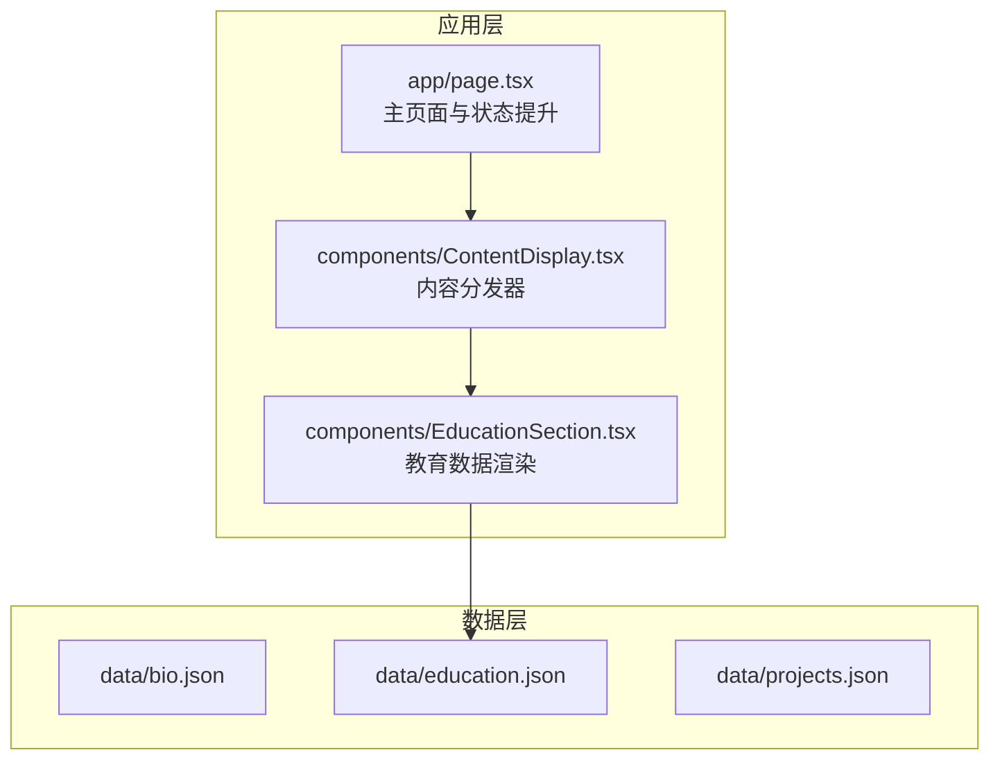
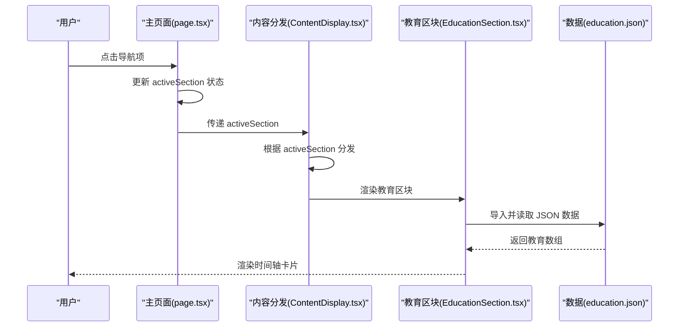
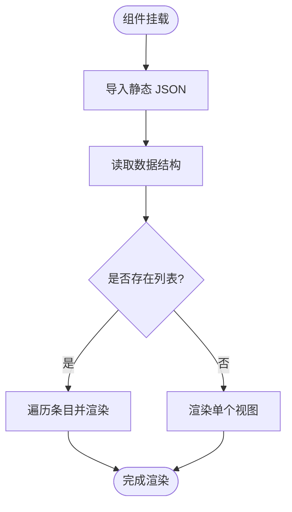
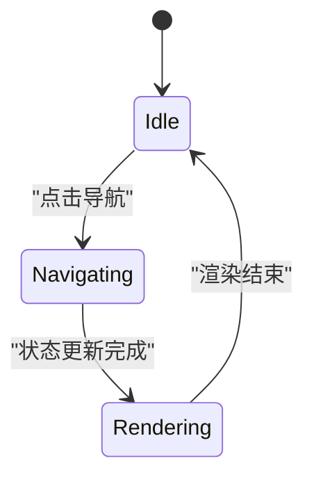
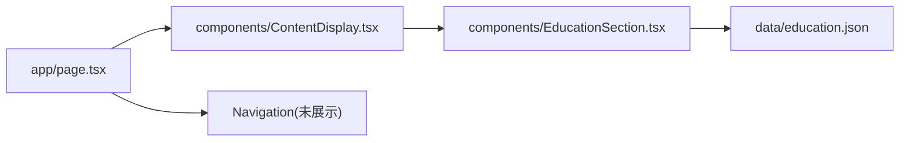

# 数据流架构

<cite>
**本文引用的文件**
- [README.md](file://README.md)
- [package.json](file://package.json)
- [app/page.tsx](file://app/page.tsx)
- [components/ContentDisplay.tsx](file://components/ContentDisplay.tsx)
- [components/EducationSection.tsx](file://components/EducationSection.tsx)
- [data/bio.json](file://data/bio.json)
- [data/education.json](file://data/education.json)
- [data/projects.json](file://data/projects.json)
</cite>

## 目录
1. [引言](#引言)
2. [项目结构](#项目结构)
3. [核心组件](#核心组件)
4. [架构总览](#架构总览)
5. [详细组件分析](#详细组件分析)
6. [依赖关系分析](#依赖关系分析)
7. [性能考量](#性能考量)
8. [故障排查指南](#故障排查指南)
9. [结论](#结论)
10. [附录](#附录)

## 引言
本文件聚焦于该个人主页项目的“数据流架构”，系统阐述数据驱动设计的实现方式，包括静态数据文件的组织结构与 JSON 数据模型设计；解释数据从文件到组件的流转过程（加载、状态管理、渲染）；分析数据流的单向性与状态提升模式；讨论数据验证与类型安全策略；给出数据缓存与性能优化建议，并提供数据架构图与时序图。目标是帮助维护者与扩展者以一致的方式管理与演进数据。

## 项目结构
该项目采用 Next.js App Router 的前端单页应用结构，数据通过静态 JSON 文件提供，组件通过客户端渲染消费数据。关键目录与文件如下：
- app：应用入口与根布局
  - page.tsx：主页面，负责状态提升与路由式内容切换
- components：可复用 UI 组件
  - ContentDisplay.tsx：根据激活状态渲染不同内容区块
  - EducationSection.tsx：消费教育数据并渲染时间轴
- data：静态数据源
  - bio.json、education.json、projects.json：分别承载个人信息、教育经历、项目经历等数据

**图表来源**
- [app/page.tsx:1-61](file://app/page.tsx#L1-L61)
- [components/ContentDisplay.tsx:1-125](file://components/ContentDisplay.tsx#L1-L125)
- [components/EducationSection.tsx:1-143](file://components/EducationSection.tsx#L1-L143)
- [data/education.json:1-33](file://data/education.json#L1-L33)

**章节来源**
- [README.md:146-169](file://README.md#L146-L169)
- [package.json:1-30](file://package.json#L1-L30)

## 核心组件
- 主页面（app/page.tsx）
  - 使用客户端状态 activeSection 控制当前显示的内容区块
  - 提供导航回调 handleNavigate，实现状态提升与单向数据流
- 内容分发器（components/ContentDisplay.tsx）
  - 根据 activeSection 渲染对应区块（默认欢迎屏）
  - 使用动画库实现内容切换的过渡效果
- 教育数据区块（components/EducationSection.tsx）
  - 直接导入 data/education.json 并遍历渲染
  - 使用动画库为每个条目添加入场动画

上述组件共同构成“状态提升 + 单向数据流”的基础：父组件持有状态，子组件只读消费数据。

**章节来源**
- [app/page.tsx:1-61](file://app/page.tsx#L1-L61)
- [components/ContentDisplay.tsx:1-125](file://components/ContentDisplay.tsx#L1-L125)
- [components/EducationSection.tsx:1-143](file://components/EducationSection.tsx#L1-L143)

## 架构总览
下图展示了数据从静态 JSON 到组件渲染的端到端流程，以及状态提升与单向数据流的控制方向。

**图表来源**
- [app/page.tsx:10-14](file://app/page.tsx#L10-L14)
- [components/ContentDisplay.tsx:12-24](file://components/ContentDisplay.tsx#L12-L24)
- [components/EducationSection.tsx:4-4](file://components/EducationSection.tsx#L4-L4)
- [data/education.json:1-33](file://data/education.json#L1-L33)

## 详细组件分析

### 数据模型与静态文件组织
- 数据文件位置与职责
  - data/bio.json：个人信息与社交链接
  - data/education.json：教育经历列表（含学校、学位、时间、GPA、描述、成就）
  - data/projects.json：项目列表（含名称、描述、技术栈、状态、链接、亮点）
- 数据模型特征
  - 结构清晰、键值语义明确，适合直接映射到组件属性
  - 列表型数据统一使用数组字段（如 education、projects），便于组件循环渲染
  - 嵌套对象（如 bio.social）用于表达关联信息
- 扩展建议
  - 为新增数据源预留统一的命名规范（如 data/research.json）
  - 保持字段一致性，避免在不同条目间出现字段漂移

**章节来源**
- [README.md:43-125](file://README.md#L43-L125)
- [data/bio.json:1-14](file://data/bio.json#L1-L14)
- [data/education.json:1-33](file://data/education.json#L1-L33)
- [data/projects.json:1-57](file://data/projects.json#L1-L57)

### 数据加载与渲染流程
- 加载路径
  - 组件通过相对路径导入 JSON 文件（如 components/EducationSection.tsx 导入 data/education.json）
  - 导入在构建期被打包工具处理，运行时直接可用
- 渲染逻辑
  - 主页面持有 activeSection 状态，向下传递给内容分发器
  - 内容分发器根据状态选择区块并渲染
  - 区块组件直接消费导入的数据，进行列表渲染与细节展示

**图表来源**
- [components/EducationSection.tsx:39-137](file://components/EducationSection.tsx#L39-L137)
- [data/education.json:2-32](file://data/education.json#L2-L32)

**章节来源**
- [components/EducationSection.tsx:1-143](file://components/EducationSection.tsx#L1-L143)
- [components/ContentDisplay.tsx:1-125](file://components/ContentDisplay.tsx#L1-L125)

### 单向数据流与状态提升
- 状态提升
  - 主页面 app/page.tsx 维护 activeSection，作为单一事实来源
  - 通过 props 向下传递，保证数据流向自上而下
- 单向数据流
  - 导航事件仅更新父组件状态，不反向回传
  - 子组件仅消费数据，不直接修改状态
- 优势
  - 易于追踪数据变化来源
  - 降低耦合，便于测试与调试

**图表来源**
- [app/page.tsx:10-14](file://app/page.tsx#L10-L14)
- [components/ContentDisplay.tsx:12-24](file://components/ContentDisplay.tsx#L12-L24)

**章节来源**
- [app/page.tsx:1-61](file://app/page.tsx#L1-L61)
- [components/ContentDisplay.tsx:1-125](file://components/ContentDisplay.tsx#L1-L125)

### 数据验证与类型安全
- 当前实现
  - 未引入运行时校验或编译期类型约束
  - 组件直接读取 JSON 字段，依赖数据源的正确性
- 推荐策略
  - TypeScript 接口约束：为每个数据模型定义接口，组件在导入时进行类型断言或转换
  - 运行时校验：使用 Zod 或 Joi 对 JSON 数据进行 schema 校验，失败时抛错或降级
  - 构建期检查：在 CI 中增加 JSON schema 校验步骤，确保提交的数据符合规范
- 价值
  - 提升健壮性，减少因字段缺失或类型错误导致的渲染异常
  - 为后续自动化工具（如 IDE 提示、文档生成）提供基础

[本节为通用最佳实践说明，不直接分析具体文件，故无“章节来源”]

### 数据缓存与性能优化
- 缓存策略
  - 静态 JSON 由构建工具打包，运行时无需额外缓存
  - 若未来引入远程数据，可在客户端使用内存缓存或浏览器存储，结合时间戳与 etag 策略
- 性能优化
  - 列表渲染：对长列表启用虚拟滚动（如 react-window）
  - 图片资源：对占位图使用低质量内联占位（LQIP）或骨架屏
  - 动画：合理设置动画帧率与过渡时长，避免过度动画影响性能
  - 代码分割：按需加载区块组件，减少首屏体积
- 交付优化
  - 启用 Gzip/Brotli 压缩
  - 使用 CDN 加速静态资源

[本节为通用性能建议，不直接分析具体文件，故无“章节来源”]

## 依赖关系分析
- 组件依赖
  - EducationSection 依赖 education.json
  - ContentDisplay 依赖 EducationSection/ProjectsSection/ResearchSection（按需）
  - 主页面依赖 ContentDisplay 与 Navigation
- 外部依赖
  - Next.js 生态（App Router、客户端指令）
  - Framer Motion（动画）
  - react-tsparticles（粒子背景）

**图表来源**
- [app/page.tsx:1-61](file://app/page.tsx#L1-L61)
- [components/ContentDisplay.tsx:1-125](file://components/ContentDisplay.tsx#L1-L125)
- [components/EducationSection.tsx:1-143](file://components/EducationSection.tsx#L1-L143)
- [data/education.json:1-33](file://data/education.json#L1-L33)

**章节来源**
- [package.json:11-28](file://package.json#L11-L28)

## 性能考量
- 静态数据加载
  - JSON 作为静态资源随应用一起打包，启动即用，无需网络请求
- 渲染性能
  - 使用 Framer Motion 的硬件加速动画，注意避免在长列表中同时触发大量复杂动画
- 资源体积
  - 控制 JSON 数据体量，避免冗余字段；必要时拆分数据源
- 交互体验
  - 使用过渡动画与骨架屏提升感知性能

[本节为通用性能建议，不直接分析具体文件，故无“章节来源”]

## 故障排查指南
- 常见问题
  - 字段缺失或拼写错误：导致渲染异常或空白
  - 数据类型不符：如字符串与数字混用
  - 列表 id 冲突：导致 React key 警告或重排异常
- 排查步骤
  - 校验 JSON 语法与 schema
  - 在组件中打印关键字段，确认数据结构
  - 使用最小化示例定位问题区块
- 预防措施
  - 引入 schema 校验与类型约束
  - 在 CI 中加入静态检查与单元测试

[本节为通用排查建议，不直接分析具体文件，故无“章节来源”]

## 结论
该数据流架构以“静态 JSON + 客户端渲染 + 单向数据流”为核心，结构简洁、易于维护。通过状态提升与组件解耦，实现了清晰的数据流向与可控的渲染边界。建议在未来引入类型约束与运行时校验，以进一步增强类型安全与健壮性；同时结合虚拟滚动、骨架屏与 CDN 等手段持续优化性能与体验。

## 附录
- 数据模型设计最佳实践
  - 字段命名采用小驼峰或下划线风格，保持一致性
  - 列表统一使用 id 作为唯一标识，避免索引作为 key
  - 嵌套对象尽量扁平化，减少层级深度
  - 为每个数据源编写 schema 文档与示例
- 扩展指导
  - 新增数据源时，先定义 schema 与类型，再实现组件消费
  - 对长列表与重型组件采用懒加载与虚拟化
  - 在 CI 中集成 JSON 校验与类型检查任务

[本节为通用最佳实践与扩展建议，不直接分析具体文件，故无“章节来源”]