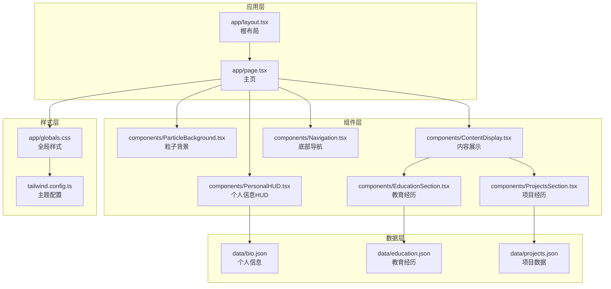
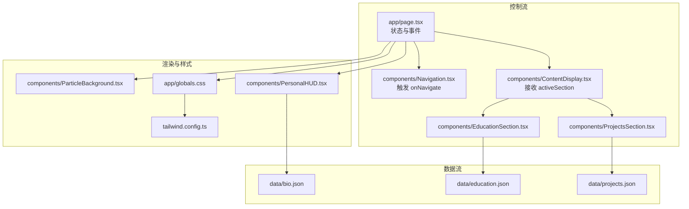
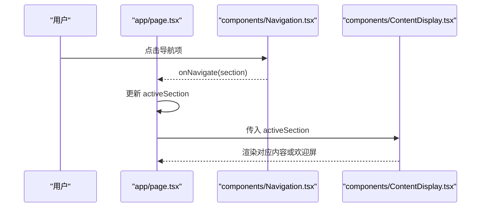
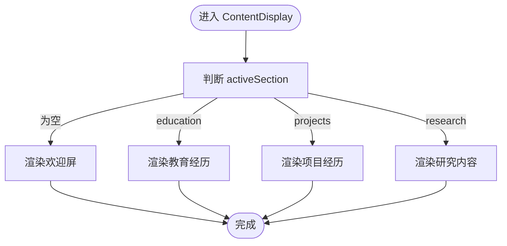
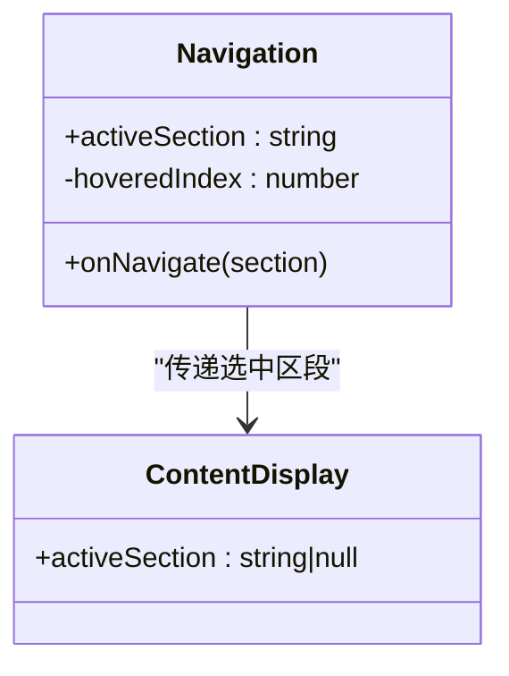
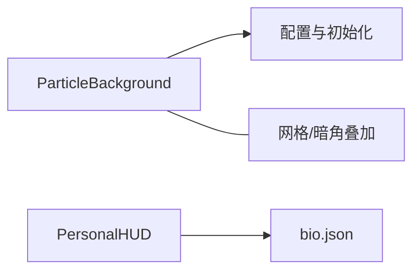
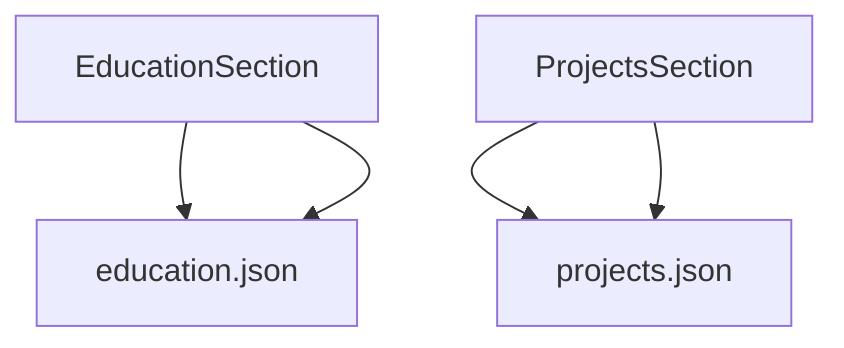
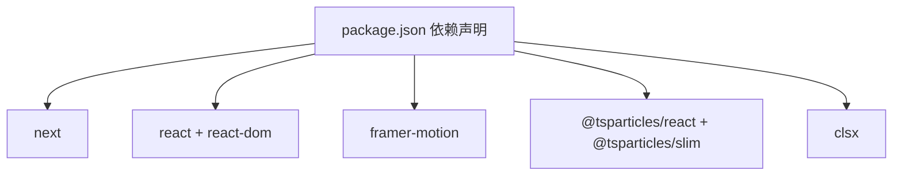

# 架构设计

<cite>
**本文引用的文件**
- [app/layout.tsx](file://app/layout.tsx)
- [app/page.tsx](file://app/page.tsx)
- [components/ContentDisplay.tsx](file://components/ContentDisplay.tsx)
- [components/Navigation.tsx](file://components/Navigation.tsx)
- [components/ParticleBackground.tsx](file://components/ParticleBackground.tsx)
- [components/PersonalHUD.tsx](file://components/PersonalHUD.tsx)
- [components/EducationSection.tsx](file://components/EducationSection.tsx)
- [components/ProjectsSection.tsx](file://components/ProjectsSection.tsx)
- [data/bio.json](file://data/bio.json)
- [data/education.json](file://data/education.json)
- [data/projects.json](file://data/projects.json)
- [app/globals.css](file://app/globals.css)
- [tailwind.config.ts](file://tailwind.config.ts)
- [package.json](file://package.json)
- [README.md](file://README.md)
</cite>

## 目录
1. [引言](#引言)
2. [项目结构](#项目结构)
3. [核心组件](#核心组件)
4. [架构总览](#架构总览)
5. [详细组件分析](#详细组件分析)
6. [依赖分析](#依赖分析)
7. [性能考虑](#性能考虑)
8. [故障排查指南](#故障排查指南)
9. [结论](#结论)
10. [附录](#附录)

## 引言
本项目是一个基于 Next.js App Router 的现代前端架构示例，采用文件系统路由、客户端组件与流式传输相结合的方式，构建了一个赛博朋克风格的个人主页。整体设计强调组件化、数据驱动与视觉动效，通过 Tailwind CSS 提供一致的样式体系，并结合 Framer Motion 与 react-tsparticles 实现丰富的交互与动画效果。

## 项目结构
项目采用 Next.js App Router 推荐的目录结构，将页面与组件分离，配合数据文件实现内容驱动的设计。关键目录与职责如下：
- app：应用根布局与页面入口，负责全局元数据与顶层容器。
- components：可复用的功能组件，按领域拆分（如导航、内容展示、背景、信息面板等）。
- data：静态 JSON 数据文件，承载生物信息、教育经历、项目与研究内容等。
- 样式与主题：通过 Tailwind CSS 与自定义主题配置统一视觉语言。

**图表来源**
- [app/layout.tsx:1-37](file://app/layout.tsx#L1-L37)
- [app/page.tsx:1-61](file://app/page.tsx#L1-L61)
- [components/ParticleBackground.tsx:1-126](file://components/ParticleBackground.tsx#L1-L126)
- [components/PersonalHUD.tsx:1-132](file://components/PersonalHUD.tsx#L1-L132)
- [components/ContentDisplay.tsx:1-125](file://components/ContentDisplay.tsx#L1-L125)
- [components/Navigation.tsx:1-103](file://components/Navigation.tsx#L1-L103)
- [components/EducationSection.tsx:1-143](file://components/EducationSection.tsx#L1-L143)
- [components/ProjectsSection.tsx:1-161](file://components/ProjectsSection.tsx#L1-L161)
- [data/bio.json:1-14](file://data/bio.json#L1-L14)
- [data/education.json:1-33](file://data/education.json#L1-L33)
- [data/projects.json:1-57](file://data/projects.json#L1-L57)
- [app/globals.css:1-212](file://app/globals.css#L1-L212)
- [tailwind.config.ts:1-72](file://tailwind.config.ts#L1-L72)

**章节来源**
- [README.md:146-169](file://README.md#L146-L169)

## 核心组件
- 根布局与页面
  - 根布局负责站点元数据、字体资源与全局样式注入；页面作为客户端组件，协调背景、HUD、内容展示与导航。
- 背景与动效
  - 粒子背景提供沉浸式交互体验；HUD 展示个人信息与技能矩阵；导航提供内容区段切换。
- 内容展示
  - 内容展示组件根据激活区段动态渲染不同模块，并通过动画实现平滑过渡。
- 数据驱动
  - 通过 JSON 文件组织静态数据，组件内直接导入并在渲染时绑定到 UI。

**章节来源**
- [app/layout.tsx:1-37](file://app/layout.tsx#L1-L37)
- [app/page.tsx:1-61](file://app/page.tsx#L1-L61)
- [components/ParticleBackground.tsx:1-126](file://components/ParticleBackground.tsx#L1-L126)
- [components/PersonalHUD.tsx:1-132](file://components/PersonalHUD.tsx#L1-L132)
- [components/ContentDisplay.tsx:1-125](file://components/ContentDisplay.tsx#L1-L125)
- [components/Navigation.tsx:1-103](file://components/Navigation.tsx#L1-L103)
- [data/bio.json:1-14](file://data/bio.json#L1-L14)
- [data/education.json:1-33](file://data/education.json#L1-L33)
- [data/projects.json:1-57](file://data/projects.json#L1-L57)

## 架构总览
该架构遵循“页面即入口”的 App Router 设计，页面组件承担状态管理与事件处理，子组件通过 props 接收数据与回调，形成清晰的单向数据流。样式系统通过 Tailwind CSS 与自定义主题实现一致性与可扩展性。

**图表来源**
- [app/page.tsx:9-28](file://app/page.tsx#L9-L28)
- [components/Navigation.tsx:17-31](file://components/Navigation.tsx#L17-L31)
- [components/ContentDisplay.tsx:12-38](file://components/ContentDisplay.tsx#L12-L38)
- [components/ParticleBackground.tsx:22-104](file://components/ParticleBackground.tsx#L22-L104)
- [components/PersonalHUD.tsx:6-107](file://components/PersonalHUD.tsx#L6-L107)
- [data/bio.json:1-14](file://data/bio.json#L1-L14)
- [data/education.json:1-33](file://data/education.json#L1-L33)
- [data/projects.json:1-57](file://data/projects.json#L1-L57)
- [app/globals.css:1-212](file://app/globals.css#L1-L212)
- [tailwind.config.ts:1-72](file://tailwind.config.ts#L1-L72)

## 详细组件分析

### 页面与根布局
- 根布局负责站点元数据与字体资源加载，确保全局样式与字体可用。
- 主页作为客户端组件，集中管理激活区段状态与导航事件，协调各子组件渲染。

**图表来源**
- [app/page.tsx:9-28](file://app/page.tsx#L9-L28)
- [components/Navigation.tsx:17-31](file://components/Navigation.tsx#L17-L31)
- [components/ContentDisplay.tsx:12-38](file://components/ContentDisplay.tsx#L12-L38)

**章节来源**
- [app/layout.tsx:1-37](file://app/layout.tsx#L1-L37)
- [app/page.tsx:1-61](file://app/page.tsx#L1-L61)

### 内容展示与切换
- 使用条件渲染与动画封装，实现区段内容的平滑过渡与视觉焦点聚焦。
- 默认显示欢迎屏，增强首次访问的引导体验。

**图表来源**
- [components/ContentDisplay.tsx:12-42](file://components/ContentDisplay.tsx#L12-L42)

**章节来源**
- [components/ContentDisplay.tsx:1-125](file://components/ContentDisplay.tsx#L1-L125)

### 导航组件
- 底部导航提供三个区段入口，支持悬停发光、点击切换与活动指示器的布局动画。
- 通过事件回调向上游传递选择状态，保持组件间解耦。

**图表来源**
- [components/Navigation.tsx:6-15](file://components/Navigation.tsx#L6-L15)
- [components/ContentDisplay.tsx:8-10](file://components/ContentDisplay.tsx#L8-L10)

**章节来源**
- [components/Navigation.tsx:1-103](file://components/Navigation.tsx#L1-L103)

### 粒子背景与 HUD
- 粒子背景通过外部库初始化与选项配置，提供交互反馈（点击/悬停）与网格、暗角等叠加效果。
- HUD 从 JSON 数据读取个人信息，展示技能矩阵与社交链接，配合扫描线与发光边框营造赛博朋克氛围。

**图表来源**
- [components/ParticleBackground.tsx:8-104](file://components/ParticleBackground.tsx#L8-L104)
- [components/PersonalHUD.tsx:6-107](file://components/PersonalHUD.tsx#L6-L107)
- [data/bio.json:1-14](file://data/bio.json#L1-L14)

**章节来源**
- [components/ParticleBackground.tsx:1-126](file://components/ParticleBackground.tsx#L1-L126)
- [components/PersonalHUD.tsx:1-132](file://components/PersonalHUD.tsx#L1-L132)

### 教育与项目模块
- 教育模块以时间轴形式呈现，强调左右交替的卡片布局与数据流动画。
- 项目模块采用网格布局，卡片支持悬停展开高亮内容与外链跳转。

**图表来源**
- [components/EducationSection.tsx:6-142](file://components/EducationSection.tsx#L6-L142)
- [components/ProjectsSection.tsx:7-159](file://components/ProjectsSection.tsx#L7-L159)
- [data/education.json:1-33](file://data/education.json#L1-L33)
- [data/projects.json:1-57](file://data/projects.json#L1-L57)

**章节来源**
- [components/EducationSection.tsx:1-143](file://components/EducationSection.tsx#L1-L143)
- [components/ProjectsSection.tsx:1-161](file://components/ProjectsSection.tsx#L1-L161)
- [data/education.json:1-33](file://data/education.json#L1-L33)
- [data/projects.json:1-57](file://data/projects.json#L1-L57)

## 依赖分析
- 运行时依赖
  - Next.js、React、Framer Motion、react-tsparticles、clsx 等，支撑页面框架、动画与粒子效果。
- 开发依赖
  - TypeScript、Tailwind CSS、PostCSS、Autoprefixer 等，保障类型安全与样式构建。
- 组件间耦合
  - 页面与导航之间通过事件回调解耦；内容展示与具体模块之间通过 props 解耦；数据与组件之间通过导入解耦。

**图表来源**
- [package.json:11-28](file://package.json#L11-L28)

**章节来源**
- [package.json:1-30](file://package.json#L1-L30)

## 性能考虑
- 客户端组件与动画
  - 使用 Framer Motion 与粒子库时需关注帧率与交互复杂度，建议在低端设备上适当降低动画强度或延迟加载。
- 样式体积
  - Tailwind CSS 与自定义主题配置应避免无用类名，保持构建产物精简。
- 数据加载
  - 当前为静态 JSON 导入，适合小体量数据；若数据增长，可考虑服务端渲染或增量加载策略。

## 故障排查指南
- 样式未生效
  - 检查全局样式是否正确引入与 Tailwind 配置的扫描路径是否覆盖组件目录。
- 动画异常
  - 确认客户端组件标记与动画库版本兼容，检查浏览器对硬件加速的支持情况。
- 导航不响应
  - 核查事件回调是否正确传递至页面组件，确认状态更新逻辑与渲染分支。

**章节来源**
- [app/globals.css:1-212](file://app/globals.css#L1-L212)
- [tailwind.config.ts:1-72](file://tailwind.config.ts#L1-L72)
- [components/Navigation.tsx:17-31](file://components/Navigation.tsx#L17-L31)

## 结论
该项目以 Next.js App Router 为基础，结合 Tailwind CSS、Framer Motion 与 react-tsparticles，构建了具备赛博朋克风格的现代化个人主页。其架构强调组件化、数据驱动与动效体验，通过清晰的层次与解耦设计，既保证了开发效率也兼顾了用户体验。后续可在数据规模扩大时引入服务端渲染或缓存策略，进一步优化性能与可维护性。

## 附录
- 项目结构与职责参考：[README.md:146-169](file://README.md#L146-L169)
- 技术栈与功能特性：[README.md:127-145](file://README.md#L127-L145)