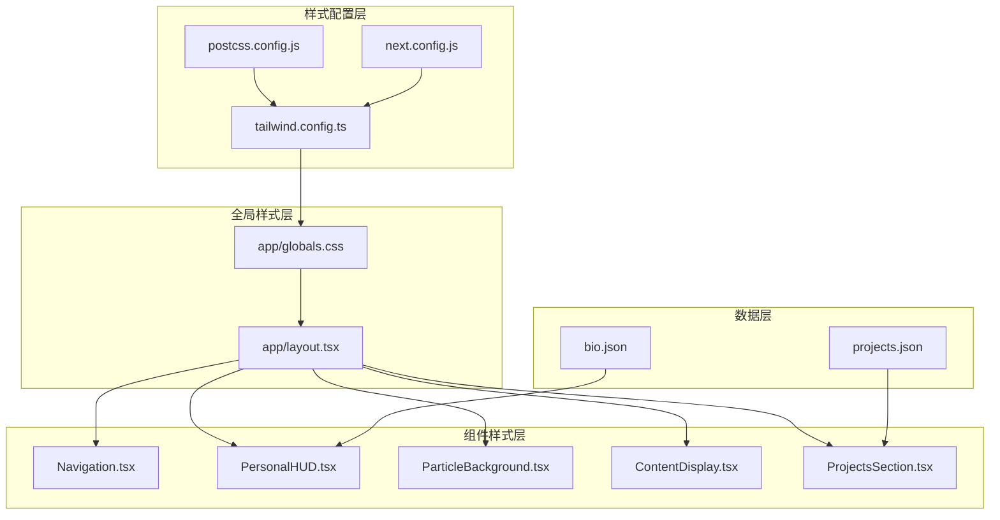
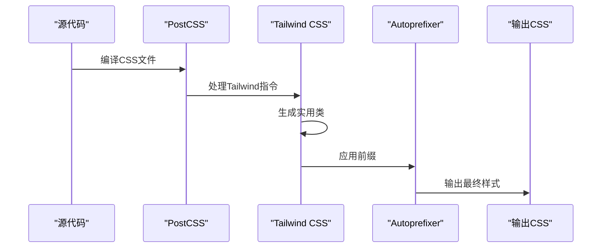
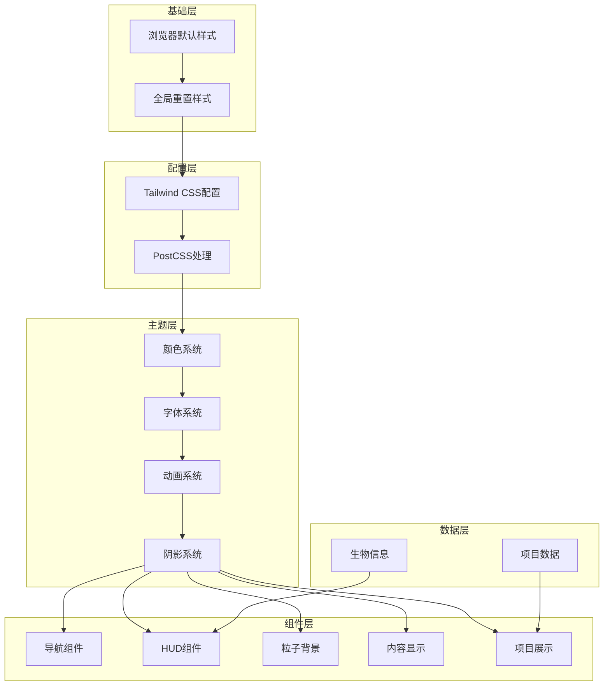
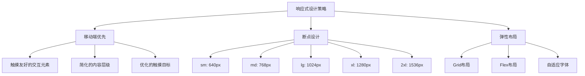
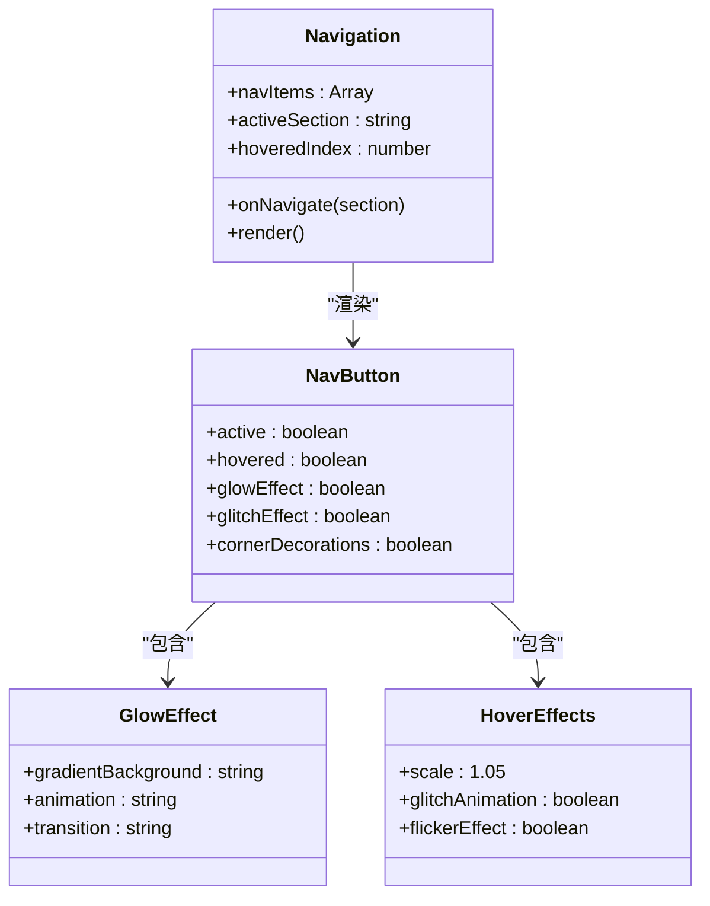
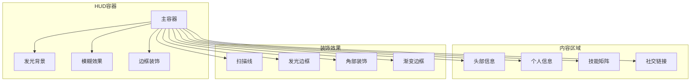
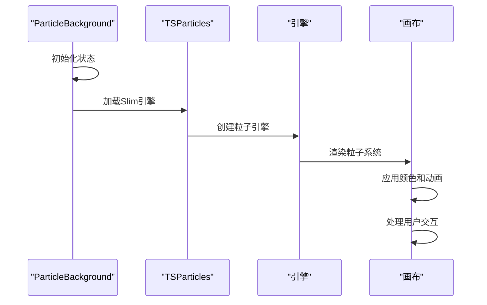
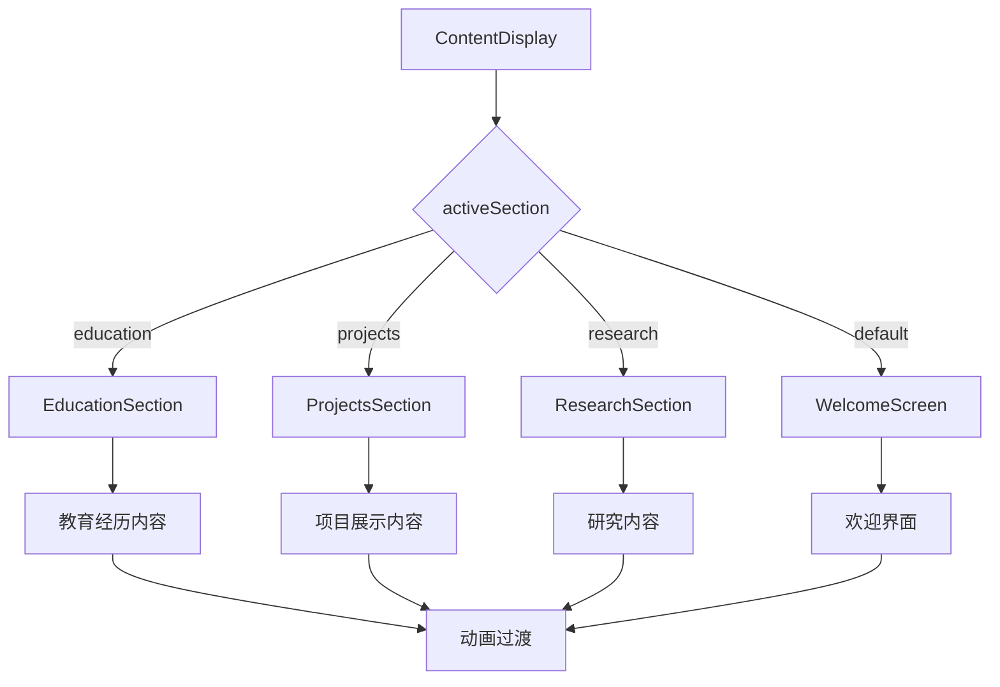
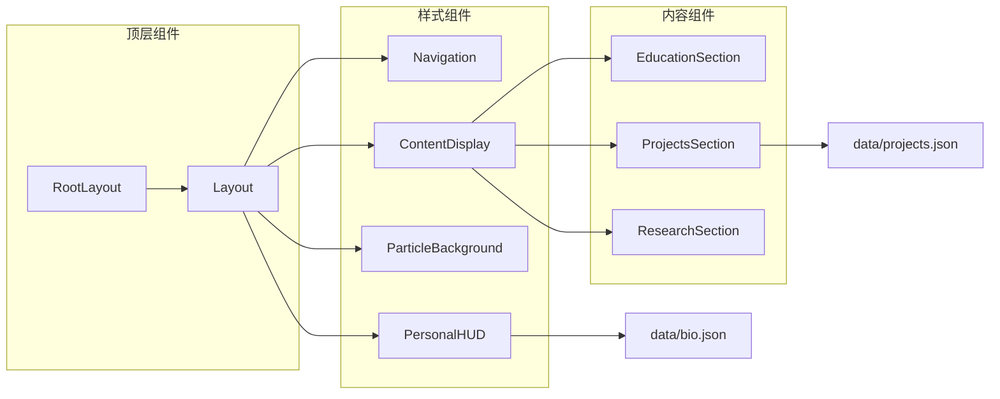
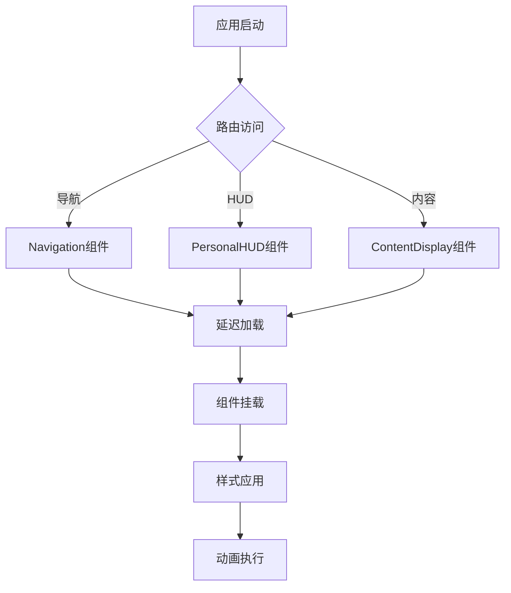

# 样式架构

<cite>
**本文档引用的文件**
- [tailwind.config.ts](file://tailwind.config.ts)
- [postcss.config.js](file://postcss.config.js)
- [app/globals.css](file://app/globals.css)
- [next.config.js](file://next.config.js)
- [Navigation.tsx](file://components/Navigation.tsx)
- [PersonalHUD.tsx](file://components/PersonalHUD.tsx)
- [ParticleBackground.tsx](file://components/ParticleBackground.tsx)
- [ContentDisplay.tsx](file://components/ContentDisplay.tsx)
- [ProjectsSection.tsx](file://components/ProjectsSection.tsx)
- [layout.tsx](file://app/layout.tsx)
- [package.json](file://package.json)
- [bio.json](file://data/bio.json)
- [projects.json](file://data/projects.json)
</cite>

## 目录
1. [简介](#简介)
2. [项目结构](#项目结构)
3. [核心组件](#核心组件)
4. [架构概览](#架构概览)
5. [详细组件分析](#详细组件分析)
6. [依赖关系分析](#依赖关系分析)
7. [性能考虑](#性能考虑)
8. [故障排除指南](#故障排除指南)
9. [结论](#结论)

## 简介

本项目采用现代化的样式架构，以Tailwind CSS为核心，结合赛博朋克风格的设计语言，构建了一个充满未来科技感的个人主页。该架构通过实用类系统、自定义主题配置和响应式设计策略，实现了高度可定制且性能优化的样式解决方案。

项目的核心特色包括：
- **赛博朋克主题设计**：以深色背景配以霓虹色彩的视觉风格
- **动画系统集成**：结合Framer Motion实现流畅的交互动画
- **粒子效果**：使用@tsparticles/react创建动态背景
- **响应式设计**：适配各种设备尺寸的屏幕
- **性能优化**：通过Tree Shaking和按需加载提升加载速度

## 项目结构

项目采用Next.js的应用程序目录结构，样式相关的核心文件分布如下：



**图表来源**
- [tailwind.config.ts:1-72](file://tailwind.config.ts#L1-L72)
- [postcss.config.js:1-7](file://postcss.config.js#L1-L7)
- [app/globals.css:1-212](file://app/globals.css#L1-L212)
- [app/layout.tsx:1-37](file://app/layout.tsx#L1-L37)

**章节来源**
- [tailwind.config.ts:1-72](file://tailwind.config.ts#L1-L72)
- [postcss.config.js:1-7](file://postcss.config.js#L1-L7)
- [app/globals.css:1-212](file://app/globals.css#L1-L212)
- [app/layout.tsx:1-37](file://app/layout.tsx#L1-L37)

## 核心组件

### Tailwind CSS配置架构

项目的核心样式配置集中在tailwind.config.ts文件中，该配置文件定义了完整的赛博朋克主题系统：

#### 颜色系统设计
项目建立了完整的赛博朋克色彩体系，包含基础色板和功能色：

```mermaid
graph LR
subgraph "基础色板"
A[cyber-black<br/>#0a0a0f]
B[cyber-dark<br/>#0d1117]
end
subgraph "霓虹色系"
C[cyber-blue<br/>#00d4ff]
D[cyber-pink<br/>#ff00ff]
E[cyber-green<br/>#00ff88]
end
subgraph "辅助色"
F[neon-blue<br/>#00bfff]
G[neon-pink<br/>#ff1493]
H[hud-bg<br/>rgba(0, 20, 40, 0.6)]
end
A --> C
B --> D
C --> E
D --> F
E --> G
F --> H
```

**图表来源**
- [tailwind.config.ts:11-20](file://tailwind.config.ts#L11-L20)

#### 字体系统架构
项目集成了三种专门的字体系统：

1. **科技感字体 (tech)**：Orbitron + Rajdhani，用于标题和重要信息
2. **等宽字体 (mono)**：JetBrains Mono + Fira Code，用于代码和数据展示
3. **系统字体**：sans-serif作为后备方案

#### 动画系统设计
项目实现了完整的动画系统，包含六种自定义动画：

| 动画名称 | 描述 | 使用场景 |
|---------|------|----------|
| pulse-glow | 脉冲发光效果 | 按钮激活状态 |
| scan | 扫描线效果 | HUD界面装饰 |
| flicker | 闪烁效果 | 即时状态指示 |
| float | 浮动效果 | 悬浮元素 |
| data-flow | 数据流效果 | 背景装饰 |

**章节来源**
- [tailwind.config.ts:9-72](file://tailwind.config.ts#L9-L72)

### PostCSS处理流程

项目使用PostCSS进行样式预处理，配置相对简洁但功能完整：



**图表来源**
- [postcss.config.js:1-7](file://postcss.config.js#L1-L7)

**章节来源**
- [postcss.config.js:1-7](file://postcss.config.js#L1-L7)

## 架构概览

### 整体样式架构设计

项目采用了分层的样式架构，从底层的基础配置到上层的组件样式，形成了清晰的层次结构：



**图表来源**
- [app/globals.css:1-212](file://app/globals.css#L1-L212)
- [tailwind.config.ts:1-72](file://tailwind.config.ts#L1-L72)

### 响应式设计策略

项目实现了多层次的响应式设计：



**图表来源**
- [tailwind.config.ts:25-37](file://tailwind.config.ts#L25-L37)

## 详细组件分析

### 导航组件样式架构

导航组件是赛博朋克风格的重要体现，采用了复杂的样式组合：



**图表来源**
- [Navigation.tsx:17-103](file://components/Navigation.tsx#L17-L103)

#### 样式组织原则

导航组件体现了以下样式组织原则：

1. **条件样式管理**：根据activeSection和hoveredIndex动态切换样式
2. **渐变效果应用**：使用多重渐变创建霓虹发光效果
3. **动画集成**：结合Framer Motion实现平滑的交互动画
4. **装饰元素**：通过绝对定位添加角部装饰和边框

**章节来源**
- [Navigation.tsx:17-103](file://components/Navigation.tsx#L17-L103)

### HUD组件设计系统

个人HUD组件是赛博朋克风格的核心体现，采用了复杂的视觉效果：



**图表来源**
- [PersonalHUD.tsx:6-132](file://components/PersonalHUD.tsx#L6-L132)

#### 视觉层次设计

HUD组件实现了清晰的视觉层次：

1. **背景层次**：主容器背景 + 发光背景 + 模糊效果
2. **内容层次**：信息卡片 + 技能标签 + 社交链接
3. **装饰层次**：扫描线 + 发光边框 + 角部装饰

**章节来源**
- [PersonalHUD.tsx:6-132](file://components/PersonalHUD.tsx#L6-L132)

### 粒子背景系统

粒子背景系统提供了动态的视觉效果：



**图表来源**
- [ParticleBackground.tsx:8-126](file://components/ParticleBackground.tsx#L8-L126)

#### 性能优化策略

粒子系统采用了多项性能优化：

1. **帧率限制**：设置fpsLimit为120，平衡性能和视觉效果
2. **粒子数量控制**：限制粒子数量在合理范围内
3. **动态加载**：仅在组件挂载后初始化粒子系统
4. **内存管理**：自动清理粒子资源

**章节来源**
- [ParticleBackground.tsx:8-126](file://components/ParticleBackground.tsx#L8-L126)

### 内容展示系统

内容展示系统负责不同页面内容的切换和动画：



**图表来源**
- [ContentDisplay.tsx:12-125](file://components/ContentDisplay.tsx#L12-L125)

**章节来源**
- [ContentDisplay.tsx:12-125](file://components/ContentDisplay.tsx#L12-L125)

## 依赖关系分析

### 样式依赖架构

项目中的样式依赖关系形成了清晰的层次结构：

```mermaid
graph TB
subgraph "外部依赖"
A[Tailwind CSS]
B[Framer Motion]
C[@tsparticles/react]
D[clsx]
end
subgraph "配置依赖"
E[tailwind.config.ts]
F[postcss.config.js]
G[next.config.js]
end
subgraph "样式文件"
H[app/globals.css]
I[components/*.tsx]
end
subgraph "数据文件"
J[data/*.json]
end
A --> E
B --> I
C --> I
D --> I
E --> H
F --> E
G --> E
H --> I
J --> I
```

**图表来源**
- [package.json:11-28](file://package.json#L11-L28)
- [tailwind.config.ts:1-72](file://tailwind.config.ts#L1-L72)

### 组件间样式交互

组件间的样式交互体现了良好的模块化设计：



**图表来源**
- [app/layout.tsx:16-37](file://app/layout.tsx#L16-L37)
- [ContentDisplay.tsx:3-7](file://components/ContentDisplay.tsx#L3-L7)

**章节来源**
- [package.json:11-28](file://package.json#L11-L28)
- [app/layout.tsx:16-37](file://app/layout.tsx#L16-L37)

## 性能考虑

### Tree Shaking优化

项目通过以下方式实现Tree Shaking：

1. **模块化导入**：每个组件独立导入所需的样式类
2. **按需编译**：Tailwind只编译实际使用的类名
3. **无副作用模块**：样式文件标记为无副作用，便于优化

### 按需加载策略



**图表来源**
- [Navigation.tsx:17-103](file://components/Navigation.tsx#L17-L103)
- [PersonalHUD.tsx:6-132](file://components/PersonalHUD.tsx#L6-L132)

### 缓存策略

项目采用了多层次的缓存策略：

1. **字体缓存**：Google Fonts字体预连接
2. **组件缓存**：已渲染的组件保持状态
3. **样式缓存**：编译后的CSS文件缓存

**章节来源**
- [layout.tsx:23-30](file://app/layout.tsx#L23-L30)

## 故障排除指南

### 常见样式问题

#### 颜色不匹配问题
**症状**：某些元素的颜色不符合预期
**解决方案**：
1. 检查tailwind.config.ts中的颜色定义
2. 验证CSS变量是否正确应用
3. 确认颜色类名拼写正确

#### 动画异常问题
**症状**：动画效果不流畅或不显示
**解决方案**：
1. 检查Framer Motion的版本兼容性
2. 验证CSS动画属性是否被覆盖
3. 确认硬件加速是否启用

#### 响应式问题
**症状**：在移动设备上显示异常
**解决方案**：
1. 检查断点设置是否正确
2. 验证媒体查询的优先级
3. 确认视口设置正确

### 性能问题诊断

#### 加载缓慢问题
**症状**：页面加载时间过长
**解决方案**：
1. 分析打包后的CSS大小
2. 检查是否有未使用的样式类
3. 优化图片和字体加载

#### 内存泄漏问题
**症状**：长时间使用后内存占用增加
**解决方案**：
1. 检查粒子系统的清理机制
2. 验证事件监听器的移除
3. 确认组件卸载时的状态清理

**章节来源**
- [tailwind.config.ts:1-72](file://tailwind.config.ts#L1-L72)
- [ParticleBackground.tsx:8-126](file://components/ParticleBackground.tsx#L8-L126)

## 结论

本项目的样式架构展现了现代前端开发的最佳实践，通过Tailwind CSS的强大功能和赛博朋克风格的独特设计，成功构建了一个既美观又实用的个人主页。

### 主要成就

1. **主题一致性**：完整的赛博朋克主题设计，从颜色到动画都保持一致的视觉语言
2. **性能优化**：通过Tree Shaking和按需加载实现了优秀的性能表现
3. **可扩展性**：模块化的组件设计使得样式系统易于扩展和维护
4. **用户体验**：流畅的动画效果和响应式设计提升了用户体验

### 技术亮点

- **实用类系统**：充分利用Tailwind的实用类特性，减少自定义CSS编写
- **动画集成**：成功整合Framer Motion和原生CSS动画
- **粒子效果**：创新地使用@tsparticles/react创建动态背景
- **响应式设计**：完善的移动端适配方案

### 改进建议

1. **样式文档化**：建议为常用样式类建立更详细的文档
2. **主题变量**：可以考虑将更多颜色值提取为CSS变量
3. **组件库化**：将重复使用的样式模式抽象为可复用的组件
4. **测试覆盖**：为关键样式组件添加视觉回归测试

这个样式架构为未来的项目开发奠定了坚实的基础，既满足了当前的需求，也为后续的功能扩展预留了充足的空间。