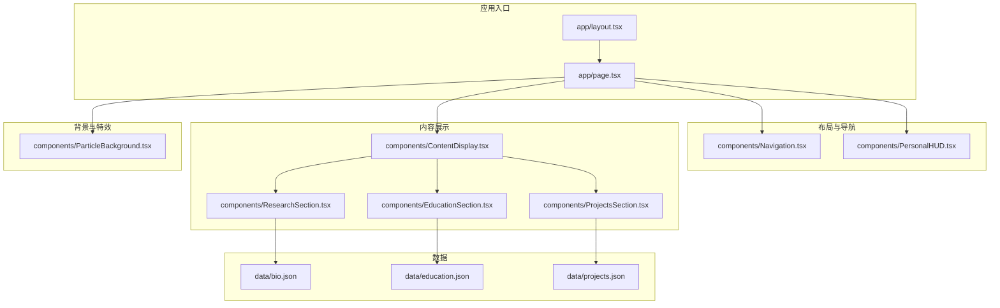
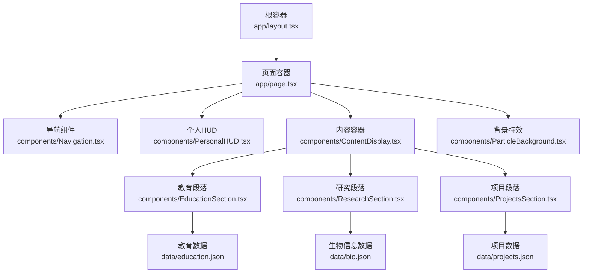
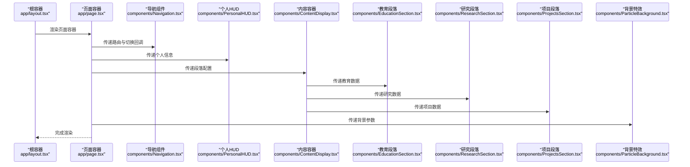
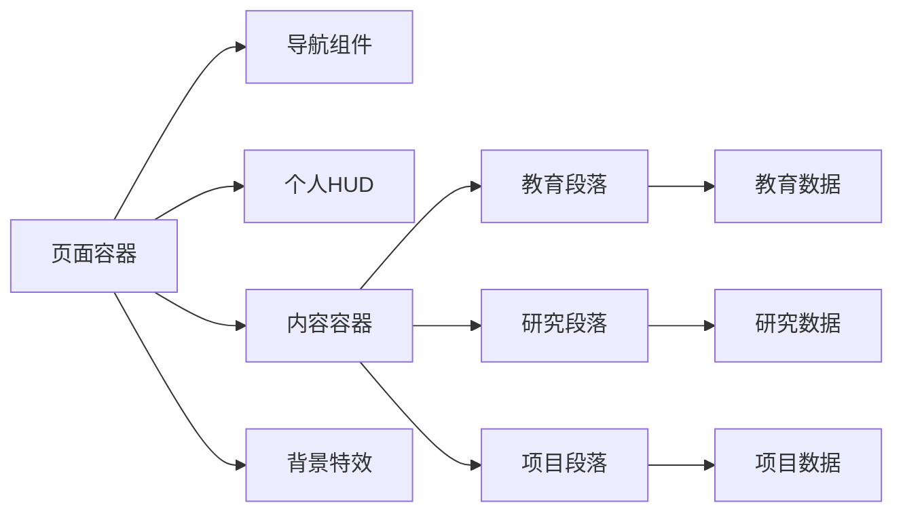

# 组件架构

<cite>
**本文引用的文件**
- [app/layout.tsx](file://app/layout.tsx)
- [app/page.tsx](file://app/page.tsx)
- [components/ContentDisplay.tsx](file://components/ContentDisplay.tsx)
- [components/Navigation.tsx](file://components/Navigation.tsx)
- [components/PersonalHUD.tsx](file://components/PersonalHUD.tsx)
- [components/ParticleBackground.tsx](file://components/ParticleBackground.tsx)
- [components/EducationSection.tsx](file://components/EducationSection.tsx)
- [components/ProjectsSection.tsx](file://components/ProjectsSection.tsx)
- [components/ResearchSection.tsx](file://components/ResearchSection.tsx)
- [data/bio.json](file://data/bio.json)
- [data/education.json](file://data/education.json)
- [data/projects.json](file://data/projects.json)
- [README.md](file://README.md)
</cite>

## 目录
1. [引言](#引言)
2. [项目结构](#项目结构)
3. [核心组件](#核心组件)
4. [架构总览](#架构总览)
5. [详细组件分析](#详细组件分析)
6. [依赖分析](#依赖分析)
7. [性能考量](#性能考量)
8. [故障排查指南](#故障排查指南)
9. [结论](#结论)
10. [附录](#附录)

## 引言
本文件系统性梳理“杨天成个人网页”的组件架构与设计模式，聚焦以下主题：函数式组件的设计原则、Props传递机制、状态管理策略；组件分层架构（从根组件到功能组件）与职责划分；组件间通信模式（父子、兄弟、跨层级）；组件复用性（可配置性与可扩展性）；生命周期管理与性能优化；最佳实践与常见反模式；并提供架构图与交互流程图以帮助理解。

## 项目结构
该项目采用 Next.js 应用结构，页面级入口位于 app 目录，业务组件集中于 components 目录，静态数据位于 data 目录。整体采用“页面容器 + 功能组件”的分层组织方式，便于职责分离与复用。

图表来源
- [app/layout.tsx](file://app/layout.tsx)
- [app/page.tsx](file://app/page.tsx)
- [components/Navigation.tsx](file://components/Navigation.tsx)
- [components/PersonalHUD.tsx](file://components/PersonalHUD.tsx)
- [components/ContentDisplay.tsx](file://components/ContentDisplay.tsx)
- [components/EducationSection.tsx](file://components/EducationSection.tsx)
- [components/ResearchSection.tsx](file://components/ResearchSection.tsx)
- [components/ProjectsSection.tsx](file://components/ProjectsSection.tsx)
- [components/ParticleBackground.tsx](file://components/ParticleBackground.tsx)
- [data/bio.json](file://data/bio.json)
- [data/education.json](file://data/education.json)
- [data/projects.json](file://data/projects.json)

章节来源
- [app/layout.tsx](file://app/layout.tsx)
- [app/page.tsx](file://app/page.tsx)
- [README.md](file://README.md)

## 核心组件
本节概述关键组件及其职责边界，为后续分层与通信分析奠定基础。

- 布局与外壳
  - app/layout.tsx：应用外壳与全局样式注入，作为根容器承载页面与背景层。
  - app/page.tsx：页面级容器，负责组合导航、个人 HUD、内容展示区与背景特效。
- 导航与信息
  - components/Navigation.tsx：主导航条，负责页面内跳转与品牌标识。
  - components/PersonalHUD.tsx：个人信息 HUD，展示头像、姓名、简介等关键信息。
- 内容展示
  - components/ContentDisplay.tsx：内容容器，聚合教育、研究、项目等子段落。
  - components/EducationSection.tsx：教育经历展示，消费 data/education.json。
  - components/ResearchSection.tsx：研究方向与成果展示，消费 data/bio.json。
  - components/ProjectsSection.tsx：项目列表展示，消费 data/projects.json。
- 背景与特效
  - components/ParticleBackground.tsx：粒子背景，提供沉浸式视觉体验。

章节来源
- [app/layout.tsx](file://app/layout.tsx)
- [app/page.tsx](file://app/page.tsx)
- [components/Navigation.tsx](file://components/Navigation.tsx)
- [components/PersonalHUD.tsx](file://components/PersonalHUD.tsx)
- [components/ContentDisplay.tsx](file://components/ContentDisplay.tsx)
- [components/EducationSection.tsx](file://components/EducationSection.tsx)
- [components/ResearchSection.tsx](file://components/ResearchSection.tsx)
- [components/ProjectsSection.tsx](file://components/ProjectsSection.tsx)
- [components/ParticleBackground.tsx](file://components/ParticleBackground.tsx)

## 架构总览
该站点采用“页面容器 + 多功能展示组件”的分层架构。页面容器负责布局与导航，内容容器负责聚合与分发，功能组件负责具体数据呈现。数据通过 JSON 文件注入，组件通过 Props 传递实现解耦。

图表来源
- [app/layout.tsx](file://app/layout.tsx)
- [app/page.tsx](file://app/page.tsx)
- [components/Navigation.tsx](file://components/Navigation.tsx)
- [components/PersonalHUD.tsx](file://components/PersonalHUD.tsx)
- [components/ContentDisplay.tsx](file://components/ContentDisplay.tsx)
- [components/EducationSection.tsx](file://components/EducationSection.tsx)
- [components/ResearchSection.tsx](file://components/ResearchSection.tsx)
- [components/ProjectsSection.tsx](file://components/ProjectsSection.tsx)
- [components/ParticleBackground.tsx](file://components/ParticleBackground.tsx)
- [data/education.json](file://data/education.json)
- [data/bio.json](file://data/bio.json)
- [data/projects.json](file://data/projects.json)

## 详细组件分析

### 页面容器与根组件
- 设计原则
  - 单一职责：根容器负责全局样式与外壳，页面容器负责页面级布局与数据装配。
  - 可配置性：通过 props 传入主题、语言或全局配置，便于扩展。
- 状态管理
  - 采用函数式无状态设计，必要时在页面容器内使用 useState 管理轻量 UI 状态（如菜单展开/收起）。
- 生命周期
  - 在页面容器中使用 useEffect 执行副作用（如滚动行为、事件监听），确保在客户端渲染后执行。
- 通信模式
  - 父子通信：根容器向页面容器传递全局上下文；页面容器向子组件传递数据与回调。
  - 跨层级通信：通过 React Context 或 props 下钻，避免深层嵌套。
- 复用性
  - 将通用布局逻辑抽象为独立模块，便于在多页面复用。

章节来源
- [app/layout.tsx](file://app/layout.tsx)
- [app/page.tsx](file://app/page.tsx)

### 导航组件（Navigation）
- 设计原则
  - 无状态函数组件，接收路由与标题列表，渲染导航项。
  - 使用受控组件模式，将选中态与外部状态解耦。
- Props 传递
  - 接收导航项数组、当前路由、切换回调等，确保调用方控制状态。
- 状态管理
  - 仅维护本地 UI 状态（如移动端菜单开关），不持有业务状态。
- 通信模式
  - 父子通信：页面容器向导航组件传递路由与切换回调。
  - 兄弟通信：通过回调向上游传递，由父组件统一管理路由状态。

章节来源
- [components/Navigation.tsx](file://components/Navigation.tsx)
- [app/page.tsx](file://app/page.tsx)

### 个人 HUD（PersonalHUD）
- 设计原则
  - 展示型组件，专注视觉呈现与少量交互（如展开/收起详情）。
  - 数据通过 props 注入，避免直接访问外部存储。
- Props 传递
  - 接收头像、姓名、简介、联系方式等字段，支持可选字段与默认值。
- 状态管理
  - 使用 useState 管理本地交互状态（如详情面板开关）。
- 复用性
  - 抽象为卡片式布局，可在不同页面复用。

章节来源
- [components/PersonalHUD.tsx](file://components/PersonalHUD.tsx)
- [app/page.tsx](file://app/page.tsx)

### 内容容器（ContentDisplay）
- 设计原则
  - 聚合器组件，负责协调多个段落组件的排列与间距。
  - 通过 props 控制段落数量与顺序，提升可配置性。
- Props 传递
  - 接收段落组件数组、容器样式、间距参数等。
- 状态管理
  - 无状态组件，状态由上层页面容器或段落组件内部管理。
- 通信模式
  - 父子通信：页面容器向内容容器传递段落配置。
  - 子子通信：段落组件之间通过共享数据或回调进行协作。

章节来源
- [components/ContentDisplay.tsx](file://components/ContentDisplay.tsx)
- [app/page.tsx](file://app/page.tsx)

### 教育段落（EducationSection）
- 设计原则
  - 数据驱动展示，消费 data/education.json，组件本身不关心数据来源。
- Props 传递
  - 接收教育数据数组、标题、样式类名等。
- 状态管理
  - 无状态组件，交互由上层控制。
- 复用性
  - 支持自定义标题与样式，适配不同页面布局。

章节来源
- [components/EducationSection.tsx](file://components/EducationSection.tsx)
- [data/education.json](file://data/education.json)

### 研究段落（ResearchSection）
- 设计原则
  - 以内容为中心的展示组件，强调可读性与层次感。
- Props 传递
  - 接收研究方向、成果列表、图片资源等。
- 状态管理
  - 无状态组件，交互由上层控制。
- 复用性
  - 可替换数据源，适配不同研究主题。

章节来源
- [components/ResearchSection.tsx](file://components/ResearchSection.tsx)
- [data/bio.json](file://data/bio.json)

### 项目段落（ProjectsSection）
- 设计原则
  - 列表型展示组件，支持卡片式与列表式两种视图。
- Props 传递
  - 接收项目数组、视图模式、筛选条件等。
- 状态管理
  - 无状态组件，筛选与排序由上层管理。
- 复用性
  - 可配置视图与筛选，满足不同场景需求。

章节来源
- [components/ProjectsSection.tsx](file://components/ProjectsSection.tsx)
- [data/projects.json](file://data/projects.json)

### 背景特效（ParticleBackground）
- 设计原则
  - 视觉增强组件，提供沉浸式体验但不影响主要内容。
- Props 传递
  - 接收粒子密度、颜色、动画速度等参数。
- 状态管理
  - 无状态组件，通过 props 控制行为。
- 性能优化
  - 使用 requestAnimationFrame 控制动画帧率，避免阻塞主线程。

章节来源
- [components/ParticleBackground.tsx](file://components/ParticleBackground.tsx)
- [app/page.tsx](file://app/page.tsx)

### 组件间通信序列
以下序列图展示页面容器如何装配导航、HUD、内容容器与背景特效，并将数据注入各段落组件。

图表来源
- [app/layout.tsx](file://app/layout.tsx)
- [app/page.tsx](file://app/page.tsx)
- [components/Navigation.tsx](file://components/Navigation.tsx)
- [components/PersonalHUD.tsx](file://components/PersonalHUD.tsx)
- [components/ContentDisplay.tsx](file://components/ContentDisplay.tsx)
- [components/EducationSection.tsx](file://components/EducationSection.tsx)
- [components/ResearchSection.tsx](file://components/ResearchSection.tsx)
- [components/ProjectsSection.tsx](file://components/ProjectsSection.tsx)
- [components/ParticleBackground.tsx](file://components/ParticleBackground.tsx)

## 依赖分析
- 组件耦合
  - 页面容器对所有子组件存在直接依赖，属于典型的“父容器-子组件”耦合。
  - 段落组件对数据文件存在隐式依赖，建议通过 props 显式注入以降低耦合。
- 外部依赖
  - 数据文件通过 JSON 注入，便于替换与测试。
- 循环依赖
  - 当前结构未发现循环依赖，保持单向数据流。
- 可能的改进
  - 引入 Context 或轻量状态库，减少跨层级 props 下钻。
  - 将数据加载逻辑上移至页面容器，统一处理错误与加载状态。

图表来源
- [app/page.tsx](file://app/page.tsx)
- [components/Navigation.tsx](file://components/Navigation.tsx)
- [components/PersonalHUD.tsx](file://components/PersonalHUD.tsx)
- [components/ContentDisplay.tsx](file://components/ContentDisplay.tsx)
- [components/EducationSection.tsx](file://components/EducationSection.tsx)
- [components/ResearchSection.tsx](file://components/ResearchSection.tsx)
- [components/ProjectsSection.tsx](file://components/ProjectsSection.tsx)
- [components/ParticleBackground.tsx](file://components/ParticleBackground.tsx)
- [data/education.json](file://data/education.json)
- [data/bio.json](file://data/bio.json)
- [data/projects.json](file://data/projects.json)

章节来源
- [app/page.tsx](file://app/page.tsx)
- [components/ContentDisplay.tsx](file://components/ContentDisplay.tsx)
- [data/education.json](file://data/education.json)
- [data/bio.json](file://data/bio.json)
- [data/projects.json](file://data/projects.json)

## 性能考量
- 渲染优化
  - 使用 React.memo 包装纯展示组件，避免不必要的重渲染。
  - 对长列表组件（如项目段落）启用虚拟滚动或分页。
- 资源加载
  - 图片与粒子动画使用懒加载与帧率控制，减少主线程占用。
- 状态与副作用
  - 将副作用限制在客户端渲染后执行，避免 SSR 阶段的不必要计算。
- 数据缓存
  - 将静态 JSON 数据在构建期处理，运行时仅做读取与映射。

## 故障排查指南
- 常见问题
  - 数据为空：检查数据文件路径与键名是否匹配组件消费约定。
  - 样式错位：确认 Tailwind 类名与组件容器层级关系。
  - 动画卡顿：检查粒子数量与帧率设置，适当降低密度。
- 调试建议
  - 使用 React DevTools 分析组件树与渲染次数。
  - 在页面容器中添加错误边界，捕获并记录子组件异常。
  - 对长列表组件增加占位符与骨架屏，改善感知性能。

## 结论
该站点采用清晰的分层组件架构：根容器负责外壳与全局样式，页面容器负责布局与装配，功能组件专注于数据展示。通过 Props 传递与数据文件注入实现低耦合高复用。建议进一步引入状态管理与数据加载策略，以提升可维护性与用户体验。

## 附录
- 最佳实践
  - 优先使用函数组件与 Hooks，避免类组件。
  - 明确 Props 接口与默认值，提升可读性与健壮性。
  - 将副作用与异步逻辑集中在页面容器或独立 Hook 中。
- 常见反模式
  - 过度使用全局状态导致组件耦合。
  - 在展示组件中混入复杂逻辑，破坏单一职责。
  - 忽略错误边界与降级策略，影响用户体验。