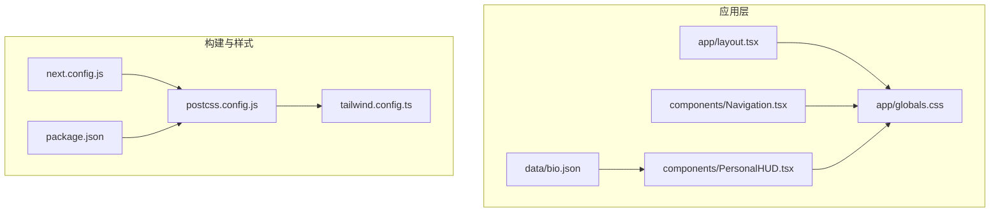
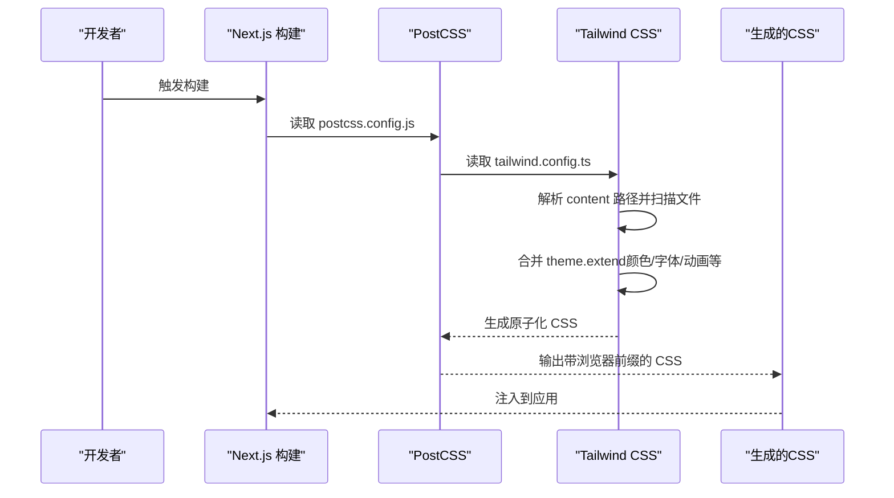
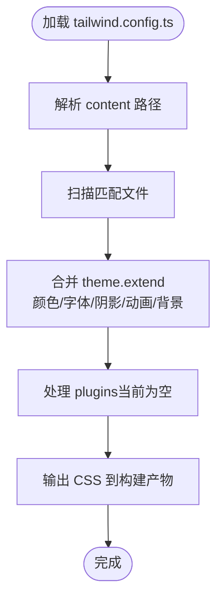
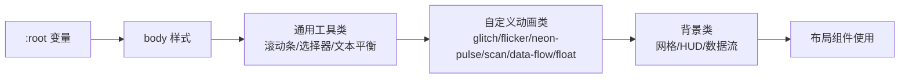
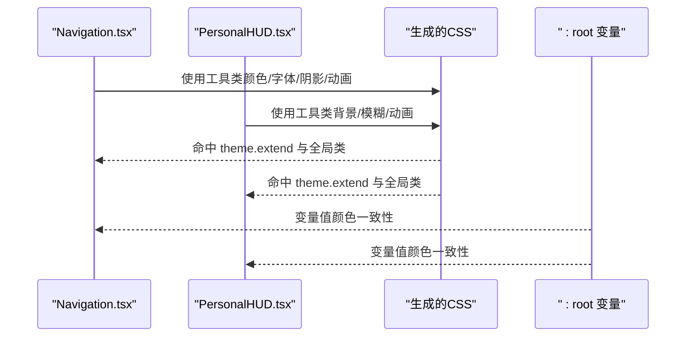
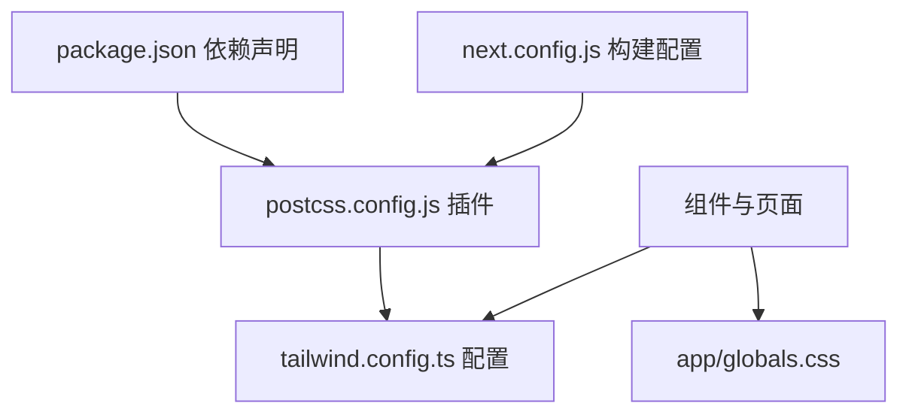

# Tailwind CSS配置

<cite>
**本文引用的文件**
- [tailwind.config.ts](file://tailwind.config.ts)
- [postcss.config.js](file://postcss.config.js)
- [next.config.js](file://next.config.js)
- [app/globals.css](file://app/globals.css)
- [app/layout.tsx](file://app/layout.tsx)
- [components/Navigation.tsx](file://components/Navigation.tsx)
- [components/PersonalHUD.tsx](file://components/PersonalHUD.tsx)
- [data/bio.json](file://data/bio.json)
- [package.json](file://package.json)
- [tsconfig.json](file://tsconfig.json)
</cite>

## 目录
1. [简介](#简介)
2. [项目结构](#项目结构)
3. [核心组件](#核心组件)
4. [架构总览](#架构总览)
5. [详细组件分析](#详细组件分析)
6. [依赖关系分析](#依赖关系分析)
7. [性能考量](#性能考量)
8. [故障排查指南](#故障排查指南)
9. [结论](#结论)
10. [附录](#附录)

## 简介
本文件面向使用 Tailwind CSS 的开发者，围绕项目中的 tailwind.config.ts 配置展开，系统性解析颜色系统、字体族、动画与背景图等主题扩展，说明全局样式与 CSS 变量的协同方式，并给出扩展工具类、动态属性支持、性能优化与常见问题的解决方案。文档同时结合实际组件与构建配置，帮助读者在 Next.js 环境下高效落地赛博朋克风格的现代网页设计。

## 项目结构
该项目采用 Next.js 应用程序目录结构，Tailwind CSS 通过 PostCSS 在构建阶段处理，样式入口位于应用级全局样式文件中，组件内直接使用 Tailwind 工具类与自定义扩展。

图表来源
- [app/layout.tsx:1-37](file://app/layout.tsx#L1-L37)
- [app/globals.css:1-212](file://app/globals.css#L1-L212)
- [components/Navigation.tsx:1-103](file://components/Navigation.tsx#L1-L103)
- [components/PersonalHUD.tsx:1-132](file://components/PersonalHUD.tsx#L1-L132)
- [data/bio.json:1-14](file://data/bio.json#L1-L14)
- [next.config.js:1-11](file://next.config.js#L1-L11)
- [tailwind.config.ts:1-72](file://tailwind.config.ts#L1-L72)
- [postcss.config.js:1-7](file://postcss.config.js#L1-L7)
- [package.json:1-30](file://package.json#L1-L30)

章节来源
- [app/layout.tsx:1-37](file://app/layout.tsx#L1-L37)
- [app/globals.css:1-212](file://app/globals.css#L1-L212)
- [tailwind.config.ts:1-72](file://tailwind.config.ts#L1-L72)
- [postcss.config.js:1-7](file://postcss.config.js#L1-L7)
- [next.config.js:1-11](file://next.config.js#L1-L11)
- [package.json:1-30](file://package.json#L1-L30)

## 核心组件
本节聚焦 tailwind.config.ts 的配置项与作用机制，涵盖内容扫描范围、主题扩展（颜色、字体、阴影、动画、关键帧、背景图与尺寸）以及插件配置。

- 内容扫描范围（content）
  - 作用：控制 Tailwind 收集哪些文件以生成所需工具类，避免无用类进入产物。
  - 当前范围：页面、组件与应用目录下的多种脚本与标记文件类型。
  - 影响：若新增文件未被扫描到，对应工具类可能不会生成；反之会增加构建体积与时间。

- 主题扩展（theme.extend）
  - 颜色系统（colors）
    - 定义了赛博朋克风格的主色系与半透明背景色，如“cyber-*”、“neon-*”及 HUD 背景色。
    - 组件中广泛使用这些别名，例如导航按钮边框、悬停渐变、HUD 背景等。
  - 字体族（fontFamily）
    - “tech”用于科技感标题与标签，包含 Orbitron、Rajdhani 等。
    - “mono”用于代码与信息展示，包含 JetBrains Mono、Fira Code 等。
  - 阴影（boxShadow）
    - 定义了“neon-*”与“glow”等发光阴影，配合动画实现脉冲与扫描效果。
  - 动画（animation）与关键帧（keyframes）
    - 提供“pulse-glow”“scan”“flicker”“float”“data-flow”等动画名称，组件中通过工具类或自定义类引用。
    - 关键帧定义了动画的中间态，确保构建时生成对应 CSS。
  - 背景（backgroundImage、backgroundSize）
    - 定义网格背景与数据流背景，组件中通过工具类复用。
  - 扩展原则：仅在现有工具类基础上追加，不破坏默认值，便于按需组合。

- 插件（plugins）
  - 当前为空数组，预留扩展点。可接入官方或第三方插件以增强功能（如自定义工具类、排序规则等）。

章节来源
- [tailwind.config.ts:1-72](file://tailwind.config.ts#L1-L72)

## 架构总览
Tailwind 在本项目中的工作流如下：PostCSS 加载 tailwindcss 与 autoprefixer 插件，读取 tailwind.config.ts 中的主题与内容扫描范围，结合 app/globals.css 中的 @tailwind 指令生成最终 CSS。组件通过类名直接消费这些工具类与扩展。

图表来源
- [postcss.config.js:1-7](file://postcss.config.js#L1-L7)
- [tailwind.config.ts:1-72](file://tailwind.config.ts#L1-L72)
- [app/globals.css:1-3](file://app/globals.css#L1-L3)

章节来源
- [postcss.config.js:1-7](file://postcss.config.js#L1-L7)
- [tailwind.config.ts:1-72](file://tailwind.config.ts#L1-L72)
- [app/globals.css:1-3](file://app/globals.css#L1-L3)

## 详细组件分析

### 配置文件结构与作用机制
- 文件定位与导出
  - 导出默认配置对象，类型为 Tailwind Config，供 PostCSS 插件读取。
- 内容扫描（content）
  - 控制构建时的文件扫描范围，影响产物大小与构建时间。
- 主题扩展（theme.extend）
  - colors：定义品牌色与视觉元素色值，组件中以工具类形式使用。
  - fontFamily：定义科技感与等宽字体族，组件中通过字体类名应用。
  - boxShadow：定义发光阴影，常与动画组合使用。
  - animation/keyframes：定义动画序列，组件中通过类名或自定义类引用。
  - backgroundImage/backgroundSize：定义背景图案与尺寸，组件中通过类名复用。
- 插件（plugins）
  - 留白，后续可扩展。

图表来源
- [tailwind.config.ts:1-72](file://tailwind.config.ts#L1-L72)

章节来源
- [tailwind.config.ts:1-72](file://tailwind.config.ts#L1-L72)

### 全局样式与 CSS 变量
- 全局样式入口
  - app/globals.css 引入 Tailwind 三大指令，确保基础、组件与工具类均被生成。
  - 通过 @import 链接 Google Fonts，加载 Orbitron、Rajdhani、JetBrains Mono 等字体。
- CSS 变量（:root）
  - 定义与配置文件中“cyber-*”颜色一致的变量，便于在原生 CSS 与组件中统一使用。
- 基础样式重置与通用规则
  - 重置内外边距、盒模型，平滑滚动，隐藏滚动条的工具类，选择器高亮等。
- 自定义动画与装饰
  - 定义 glitch、flicker、neon-pulse、scan、data-flow、float 等动画与效果类。
  - 提供网格背景、HUD 叠加、裁剪角、六边形等实用类。
- 与布局组件的协作
  - app/layout.tsx 引入全局样式并在 body 上添加抗锯齿类名，保证渲染质量。
  - 组件通过工具类消费配置扩展，形成一致的视觉语言。

图表来源
- [app/globals.css:1-212](file://app/globals.css#L1-L212)
- [app/layout.tsx:1-37](file://app/layout.tsx#L1-L37)

章节来源
- [app/globals.css:1-212](file://app/globals.css#L1-L212)
- [app/layout.tsx:1-37](file://app/layout.tsx#L1-L37)

### 组件中的工具类使用示例
- 导航组件（Navigation）
  - 使用“font-tech”“border-*”“rounded-*”“backdrop-blur-*”“shadow-neon-*”等工具类。
  - 通过“bg-cyber-blue/20”“text-cyber-pink”等颜色别名实现高亮与状态指示。
  - 结合 Framer Motion 实现悬停与点击反馈。
- HUD 组件（PersonalHUD）
  - 使用“bg-hud-bg”“border-*”“backdrop-blur-*”等工具类构建半透明发光面板。
  - 通过“animate-scan”“text-glow”等类名应用动画与发光效果。
  - 使用“cut-corner”“hexagon”等装饰类实现几何图形。

图表来源
- [components/Navigation.tsx:1-103](file://components/Navigation.tsx#L1-L103)
- [components/PersonalHUD.tsx:1-132](file://components/PersonalHUD.tsx#L1-L132)
- [app/globals.css:1-212](file://app/globals.css#L1-L212)
- [tailwind.config.ts:1-72](file://tailwind.config.ts#L1-L72)

章节来源
- [components/Navigation.tsx:1-103](file://components/Navigation.tsx#L1-L103)
- [components/PersonalHUD.tsx:1-132](file://components/PersonalHUD.tsx#L1-L132)
- [app/globals.css:1-212](file://app/globals.css#L1-L212)
- [tailwind.config.ts:1-72](file://tailwind.config.ts#L1-L72)

### 扩展 Tailwind 的方法
- 自定义工具类
  - 在 app/globals.css 中使用 @layer utilities 定义响应式或语义化工具类（如文本平衡），组件可直接使用。
- 动态属性支持
  - 通过 CSS 变量与 Tailwind 类组合，实现运行时的颜色切换与主题适配。
  - 组件内部使用 Framer Motion 的动画属性与 Tailwind 类共同实现复杂动效。
- 插件扩展
  - 在 plugins 数组中引入插件，以获得更丰富的工具类或定制化能力（当前为空）。

章节来源
- [app/globals.css:206-212](file://app/globals.css#L206-L212)
- [tailwind.config.ts:69-70](file://tailwind.config.ts#L69-L70)

## 依赖关系分析
- 构建链路
  - package.json 声明 tailwindcss、postcss、autoprefixer 版本，next.config.js 配置静态导出与图片优化策略。
  - postcss.config.js 指定 tailwindcss 与 autoprefixer 插件顺序。
- 运行时依赖
  - 组件使用 Framer Motion 实现流畅动画，CLSX 用于条件类名拼接，TS 路径映射简化导入。

图表来源
- [package.json:1-30](file://package.json#L1-L30)
- [postcss.config.js:1-7](file://postcss.config.js#L1-L7)
- [tailwind.config.ts:1-72](file://tailwind.config.ts#L1-L72)
- [next.config.js:1-11](file://next.config.js#L1-L11)
- [app/globals.css:1-3](file://app/globals.css#L1-L3)

章节来源
- [package.json:1-30](file://package.json#L1-L30)
- [postcss.config.js:1-7](file://postcss.config.js#L1-L7)
- [tailwind.config.ts:1-72](file://tailwind.config.ts#L1-L72)
- [next.config.js:1-11](file://next.config.js#L1-L11)
- [app/globals.css:1-3](file://app/globals.css#L1-L3)

## 性能考量
- 内容扫描范围优化
  - 将 content 限制在实际使用的目录与文件类型，避免扫描 node_modules 或未使用模板。
- 构建产物体积控制
  - 仅启用必要的主题扩展与动画，减少未使用的关键帧与背景图。
- 图片与字体加载
  - 使用 Next.js 图片优化与字体预连接，降低首屏阻塞。
- 动画与特效
  - 合理使用 backdrop-blur 与阴影，避免在低端设备上造成掉帧。
- CSS 变量与工具类
  - 通过 CSS 变量统一颜色，减少重复定义，提升维护效率。

## 故障排查指南
- 工具类无效
  - 检查 tailwind.config.ts 的 content 是否包含该文件路径，确保构建后类名被生成。
  - 确认 app/globals.css 中已引入 @tailwind 指令且未被注释。
- 颜色/字体不生效
  - 确认 colors 与 fontFamily 的键名正确，组件中使用的是扩展后的别名而非原始值。
  - 检查 app/layout.tsx 是否正确引入 app/globals.css。
- 动画未播放
  - 确认 animation 与 keyframes 已在 theme.extend 中定义，组件中使用的是对应类名。
  - 检查是否遗漏了全局 CSS 中的自定义动画类（如 .animate-scan）。
- 构建失败或样式异常
  - 检查 postcss.config.js 中 tailwindcss 与 autoprefixer 的版本兼容性。
  - 确认 next.config.js 的 export 与图片优化设置符合预期。
- TypeScript 路径别名
  - 确保 tsconfig.json 的路径映射与项目结构一致，避免导入错误导致样式未加载。

章节来源
- [tailwind.config.ts:1-72](file://tailwind.config.ts#L1-L72)
- [app/globals.css:1-3](file://app/globals.css#L1-L3)
- [app/layout.tsx:1-37](file://app/layout.tsx#L1-L37)
- [postcss.config.js:1-7](file://postcss.config.js#L1-L7)
- [next.config.js:1-11](file://next.config.js#L1-L11)
- [tsconfig.json:1-27](file://tsconfig.json#L1-L27)

## 结论
本项目通过 tailwind.config.ts 的主题扩展与 app/globals.css 的全局样式协同，实现了统一的赛博朋克视觉体系。借助 CSS 变量、自定义动画与装饰类，组件能够以最小成本实现复杂的动效与排版。建议在保持 content 范围精准的前提下，逐步引入插件与更多动画/背景资源，持续优化构建性能与运行时表现。

## 附录
- 数据驱动的组件
  - PersonalHUD 从 data/bio.json 读取个人信息，组件通过工具类渲染技能标签与社交链接，体现数据与样式的解耦。
- Next.js 集成要点
  - 静态导出与图片优化已在 next.config.js 中配置，确保部署与加载体验。
- TypeScript 路径映射
  - tsconfig.json 的路径别名简化了模块导入，有助于大型项目的组织与维护。

章节来源
- [components/PersonalHUD.tsx:1-132](file://components/PersonalHUD.tsx#L1-L132)
- [data/bio.json:1-14](file://data/bio.json#L1-L14)
- [next.config.js:1-11](file://next.config.js#L1-L11)
- [tsconfig.json:1-27](file://tsconfig.json#L1-L27)