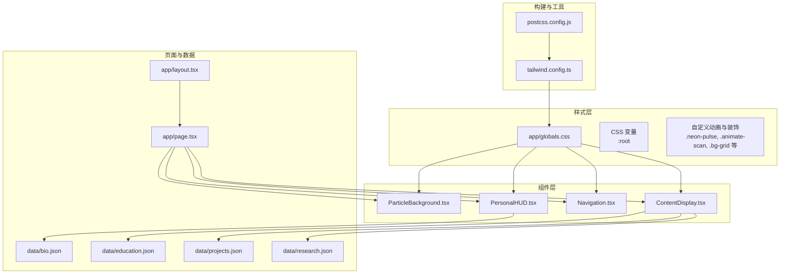
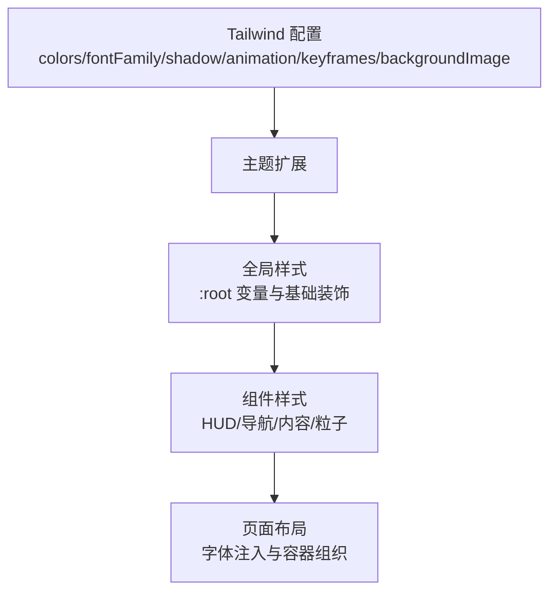
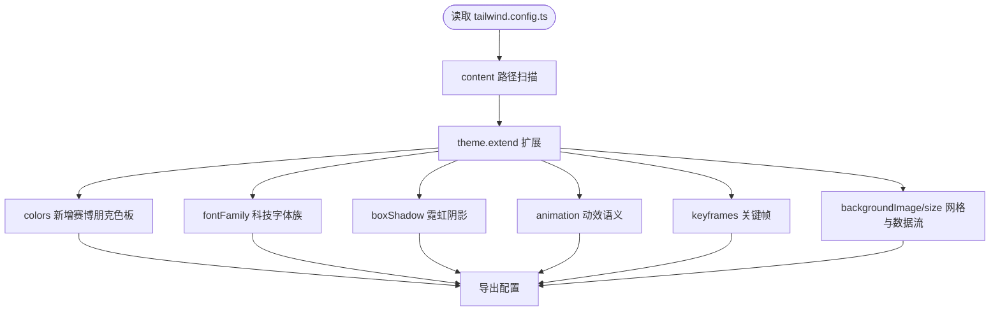
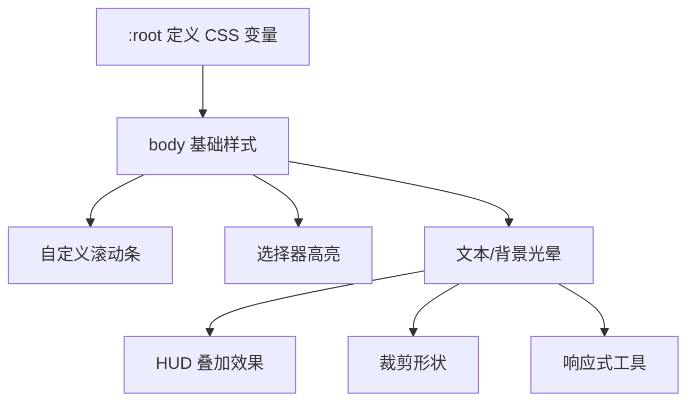
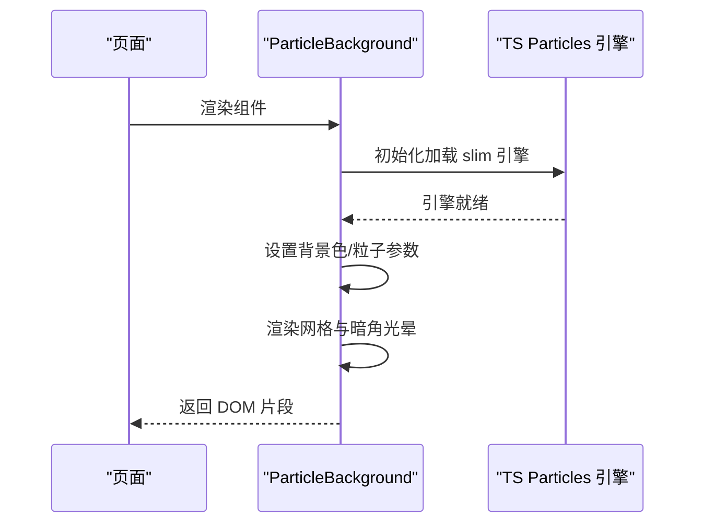
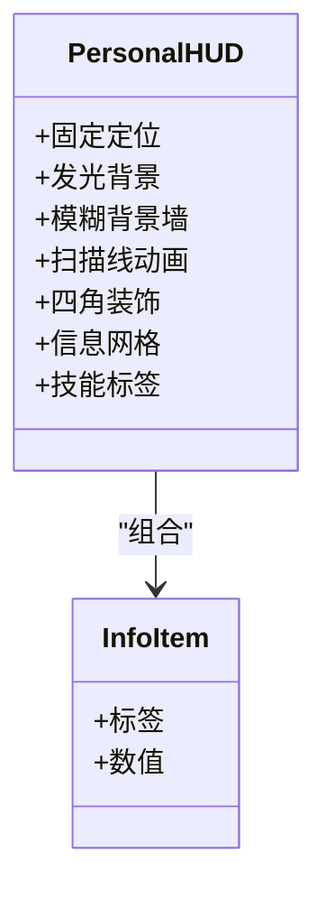
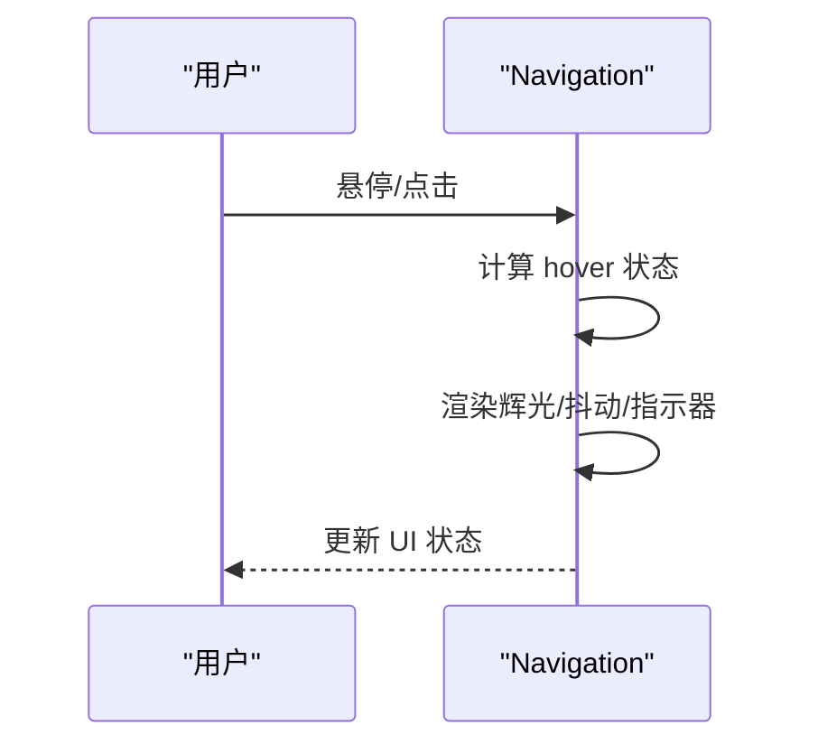
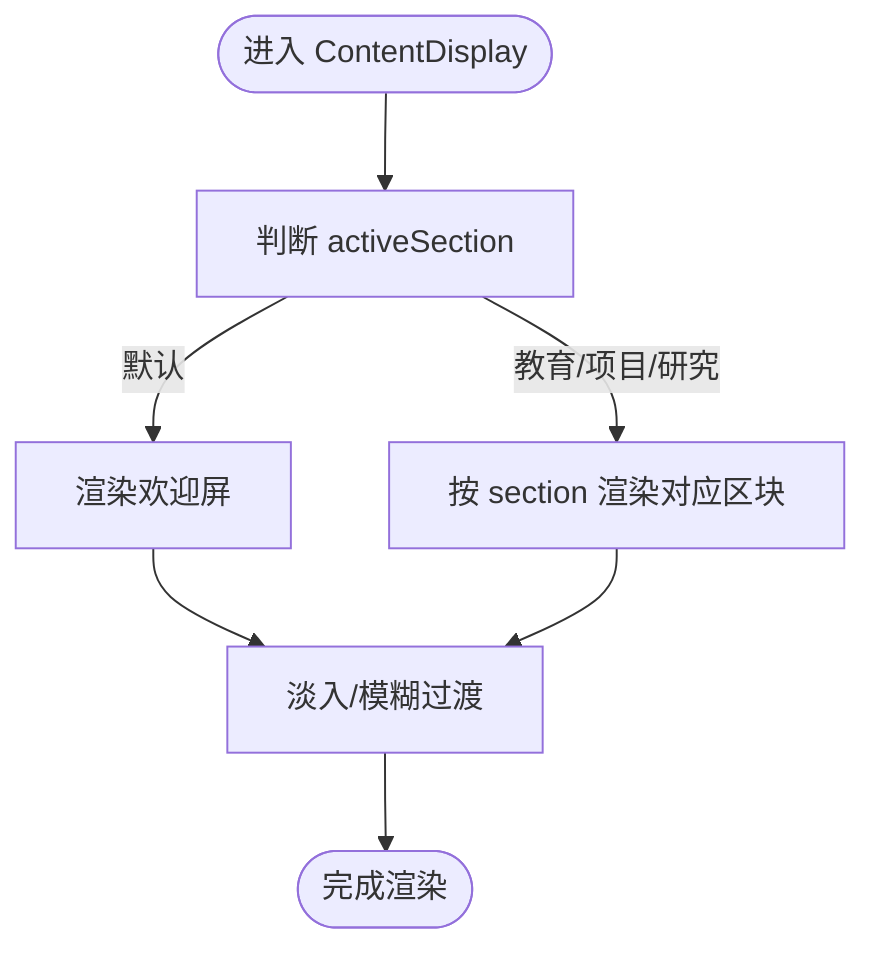
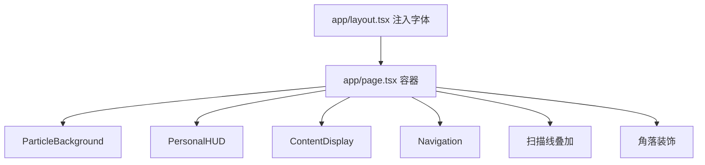
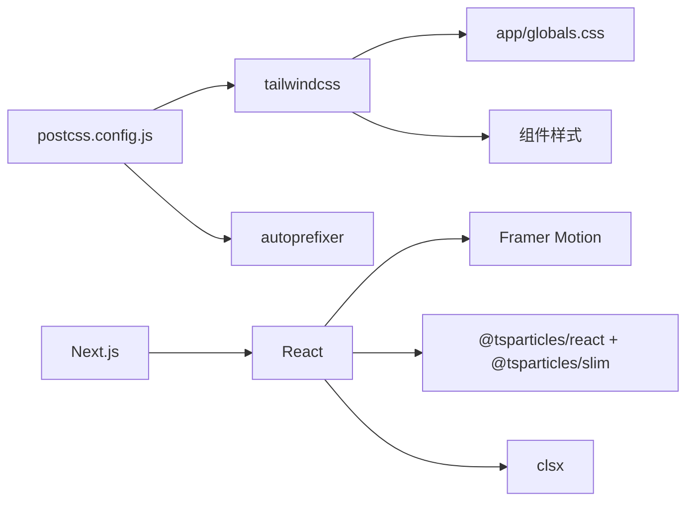

# 样式系统

<cite>
**本文引用的文件**
- [tailwind.config.ts](file://tailwind.config.ts)
- [postcss.config.js](file://postcss.config.js)
- [app/globals.css](file://app/globals.css)
- [package.json](file://package.json)
- [app/layout.tsx](file://app/layout.tsx)
- [app/page.tsx](file://app/page.tsx)
- [components/PersonalHUD.tsx](file://components/PersonalHUD.tsx)
- [components/ParticleBackground.tsx](file://components/ParticleBackground.tsx)
- [components/Navigation.tsx](file://components/Navigation.tsx)
- [components/ContentDisplay.tsx](file://components/ContentDisplay.tsx)
- [data/bio.json](file://data/bio.json)
- [data/education.json](file://data/education.json)
- [data/projects.json](file://data/projects.json)
- [data/research.json](file://data/research.json)
</cite>

## 目录
1. [简介](#简介)
2. [项目结构](#项目结构)
3. [核心组件](#核心组件)
4. [架构总览](#架构总览)
5. [详细组件分析](#详细组件分析)
6. [依赖关系分析](#依赖关系分析)
7. [性能考量](#性能考量)
8. [故障排查指南](#故障排查指南)
9. [结论](#结论)
10. [附录](#附录)

## 简介
本文件系统性梳理“杨天成个人网页”的样式系统，围绕 Tailwind CSS 配置与定制、赛博朋克风格实现（霓虹色彩、渐变与特效）、自定义样式与组件隔离、响应式策略、调试与性能优化、主题与动态样式、以及样式与组件的集成模式与最佳实践展开。文档同时提供扩展与品牌定制指导，帮助读者快速理解并复用该样式体系。

## 项目结构
样式系统由以下层次构成：
- 构建与工具链：PostCSS + Tailwind CSS
- 主题与扩展：Tailwind 配置文件扩展颜色、字体、阴影、动画、背景图与关键帧
- 全局样式：根 CSS 变量、基础排版、滚动条、选择器高亮、自定义动画与装饰
- 组件层：粒子背景、HUD、导航、内容区等组件通过 Tailwind 类与自定义 CSS 实现赛博朋克视觉
- 页面布局：根布局注入字体资源，页面容器组织组件层级与叠加效果

**图表来源**
- [postcss.config.js:1-7](file://postcss.config.js#L1-L7)
- [tailwind.config.ts:1-72](file://tailwind.config.ts#L1-L72)
- [app/globals.css:1-212](file://app/globals.css#L1-L212)
- [app/layout.tsx:1-37](file://app/layout.tsx#L1-L37)
- [app/page.tsx:1-61](file://app/page.tsx#L1-L61)
- [components/ParticleBackground.tsx:1-126](file://components/ParticleBackground.tsx#L1-L126)
- [components/PersonalHUD.tsx:1-132](file://components/PersonalHUD.tsx#L1-L132)
- [components/Navigation.tsx:1-103](file://components/Navigation.tsx#L1-L103)
- [components/ContentDisplay.tsx:1-125](file://components/ContentDisplay.tsx#L1-L125)
- [data/bio.json:1-14](file://data/bio.json#L1-L14)
- [data/education.json:1-33](file://data/education.json#L1-L33)
- [data/projects.json:1-57](file://data/projects.json#L1-L57)
- [data/research.json:1-37](file://data/research.json#L1-L37)

**章节来源**
- [postcss.config.js:1-7](file://postcss.config.js#L1-L7)
- [tailwind.config.ts:1-72](file://tailwind.config.ts#L1-L72)
- [app/globals.css:1-212](file://app/globals.css#L1-L212)
- [app/layout.tsx:1-37](file://app/layout.tsx#L1-L37)
- [app/page.tsx:1-61](file://app/page.tsx#L1-L61)

## 核心组件
- Tailwind 主题扩展：颜色、字体族、阴影、动画、关键帧、背景图与背景尺寸
- 全局 CSS：根变量、基础排版、滚动条、选择器高亮、文本/背景光晕、网格背景、HUD 叠加、裁剪形状、响应式工具
- 组件样式：HUD 的发光边框与扫描线、导航按钮的渐变与抖动、内容区的欢迎屏与命令提示、粒子背景的链接与光晕

**章节来源**
- [tailwind.config.ts:9-68](file://tailwind.config.ts#L9-L68)
- [app/globals.css:7-212](file://app/globals.css#L7-L212)
- [components/PersonalHUD.tsx:14-121](file://components/PersonalHUD.tsx#L14-L121)
- [components/Navigation.tsx:27-92](file://components/Navigation.tsx#L27-L92)
- [components/ContentDisplay.tsx:44-124](file://components/ContentDisplay.tsx#L44-L124)
- [components/ParticleBackground.tsx:27-125](file://components/ParticleBackground.tsx#L27-L125)

## 架构总览
样式系统采用“配置驱动 + 自定义扩展 + 组件化实现”的分层架构：
- 配置层：Tailwind 扩展颜色、字体、阴影、动画、背景图与关键帧，统一色板与动效语义
- 基础层：全局 CSS 提供根变量与通用装饰，保证一致性与可维护性
- 组件层：各组件按语义类名组合，局部使用内联样式或自定义动画，实现赛博朋克风格
- 页面层：布局注入字体资源，页面容器组织组件层级与叠加效果

**图表来源**
- [tailwind.config.ts:9-68](file://tailwind.config.ts#L9-L68)
- [app/globals.css:7-212](file://app/globals.css#L7-L212)
- [app/layout.tsx:24-30](file://app/layout.tsx#L24-L30)
- [app/page.tsx:16-59](file://app/page.tsx#L16-L59)

## 详细组件分析

### Tailwind 配置与定制
- 内容扫描路径：自动发现 pages/components/app 下的模板文件，确保仅打包使用到的样式
- 主题扩展
  - 颜色：新增赛博朋克色板与 HUD 背景，配合 CSS 变量保持一致
  - 字体：科技感字体族 tech 与等宽字体族 mono
  - 阴影：霓虹蓝/粉/绿与整体辉光
  - 动画：脉冲辉光、扫描线、闪烁、浮动、数据流
  - 关键帧：与动画名称一一对应，形成统一动效语义
  - 背景：网格图案、数据流渐变、背景尺寸
- 插件：当前未启用插件，保持最小依赖

**图表来源**
- [tailwind.config.ts:3-72](file://tailwind.config.ts#L3-L72)

**章节来源**
- [tailwind.config.ts:3-72](file://tailwind.config.ts#L3-L72)

### 全局样式与 CSS 变量
- 根变量：在 :root 定义赛博朋克主色，供全局与组件共享
- 基础排版：重置盒模型、平滑滚动、最小高度、无溢出
- 滚动条：细小半透明滚动条，悬停高亮
- 选择器高亮：选中文本的半透明白色高亮
- 文本/背景光晕：文本发光与背景网格
- HUD 叠加：网格 + 辐射渐变的 HUD 装饰
- 形状裁剪：数字角切与六边形
- 响应式工具：文本换行平衡

**图表来源**
- [app/globals.css:7-212](file://app/globals.css#L7-L212)

**章节来源**
- [app/globals.css:7-212](file://app/globals.css#L7-L212)

### ParticleBackground 组件（粒子背景）
- 使用 TSParticles 在全屏容器中渲染粒子，颜色来自主题色板，链接与透明度营造赛博朋克网格感
- 通过内联样式叠加网格背景与暗角光晕，增强空间层次
- FPS 限制与交互事件（点击/悬停）提升性能与趣味性

**图表来源**
- [components/ParticleBackground.tsx:8-125](file://components/ParticleBackground.tsx#L8-L125)

**章节来源**
- [components/ParticleBackground.tsx:8-125](file://components/ParticleBackground.tsx#L8-L125)

### PersonalHUD 组件（个人 HUD）
- 外层发光背景与内层模糊背景墙，配合半透明边框与渐变描边
- 四角装饰与扫描线动画，营造显示器般的视觉质感
- 内容区网格信息与技能标签，使用主题色与等宽字体
- 动态边框与逐项出现的技能标签，增强进入感

**图表来源**
- [components/PersonalHUD.tsx:6-132](file://components/PersonalHUD.tsx#L6-L132)

**章节来源**
- [components/PersonalHUD.tsx:6-132](file://components/PersonalHUD.tsx#L6-L132)

### Navigation 组件（导航栏）
- 底部居中布局，按钮具备半透明边框、模糊背景与渐变过渡
- 悬停时的辉光与抖动（glitch）效果，激活状态带霓虹边条
- 角落装饰与动态指示器，使用 layoutId 实现平滑切换

**图表来源**
- [components/Navigation.tsx:17-103](file://components/Navigation.tsx#L17-L103)

**章节来源**
- [components/Navigation.tsx:17-103](file://components/Navigation.tsx#L17-L103)

### ContentDisplay 组件（内容区）
- 使用 Framer Motion 的 AnimatePresence 与淡入/模糊过渡，营造系统启动的进入感
- 欢迎屏包含标题抖动、命令提示与闪烁光标，强调赛博朋克终端风格
- 默认显示欢迎屏，切换至各模块时按 section 渲染对应区块

**图表来源**
- [components/ContentDisplay.tsx:12-42](file://components/ContentDisplay.tsx#L12-L42)

**章节来源**
- [components/ContentDisplay.tsx:12-42](file://components/ContentDisplay.tsx#L12-L42)

### 页面与布局集成
- 根布局注入 Google Fonts 资源，确保科技字体可用
- 页面容器组织粒子背景、HUD、内容区与导航，叠加扫描线与角落装饰
- 使用主题色作为背景，保证整体色调一致

**图表来源**
- [app/layout.tsx:24-30](file://app/layout.tsx#L24-L30)
- [app/page.tsx:16-59](file://app/page.tsx#L16-L59)

**章节来源**
- [app/layout.tsx:1-37](file://app/layout.tsx#L1-L37)
- [app/page.tsx:1-61](file://app/page.tsx#L1-L61)

## 依赖关系分析
- 工具链：PostCSS 启用 Tailwind 与 Autoprefixer，确保现代 CSS 语法与兼容性
- 运行时依赖：Next.js、React、Framer Motion、TSParticles、clsx 等
- 样式依赖：Tailwind CSS 主题扩展与全局 CSS

**图表来源**
- [postcss.config.js:1-7](file://postcss.config.js#L1-L7)
- [package.json:11-29](file://package.json#L11-L29)
- [tailwind.config.ts:1-72](file://tailwind.config.ts#L1-L72)
- [app/globals.css:1-3](file://app/globals.css#L1-L3)

**章节来源**
- [postcss.config.js:1-7](file://postcss.config.js#L1-L7)
- [package.json:11-29](file://package.json#L11-L29)

## 性能考量
- 动画与特效
  - 控制动画数量与频率，避免过度使用高成本阴影与模糊
  - 使用 Framer Motion 的 layoutId 与预合成动画，减少重排
- 粒子系统
  - 限制 FPS、粒子数量与透明度范围，降低 GPU 压力
  - 合理设置链接距离与透明度，避免密集连线造成卡顿
- 字体与资源
  - 预连接字体域名，减少首屏阻塞
  - 仅引入必要字体权重，避免超集加载
- 样式体积
  - 利用 Tailwind 的 content 扫描，确保仅打包使用到的类
  - 将重复装饰抽离为组件或工具类，减少重复样式

[本节为通用性能建议，无需特定文件引用]

## 故障排查指南
- 字体不生效
  - 检查根布局是否正确注入字体资源
  - 确认字体家族名称与 tailwind.config 中的字体族一致
- 动画异常
  - 确认 keyframes 与 animation 名称匹配
  - 检查组件是否在客户端渲染（需要 use client）
- 颜色不一致
  - 对照 :root 变量与主题扩展颜色，确保命名一致
- 粒子卡顿
  - 适当降低粒子数量、透明度范围与移动速度
  - 关闭不必要的交互模式或降低交互强度

**章节来源**
- [app/layout.tsx:24-30](file://app/layout.tsx#L24-L30)
- [tailwind.config.ts:38-59](file://tailwind.config.ts#L38-L59)
- [components/ParticleBackground.tsx:33-103](file://components/ParticleBackground.tsx#L33-L103)

## 结论
该样式系统以 Tailwind CSS 为核心，通过主题扩展与全局 CSS 实现统一的赛博朋克视觉语言；组件层以语义类名与局部动画实现丰富的交互与特效。整体架构清晰、可维护性强，适合进一步扩展为品牌化组件库与主题系统。

[本节为总结性内容，无需特定文件引用]

## 附录

### 响应式设计策略
- 使用 Tailwind 断点与自定义工具类平衡文本换行
- 组件内部使用相对单位与弹性布局，保证在不同屏幕尺寸下的可读性与布局稳定性
- 导航与 HUD 采用固定定位与 z-index 层级管理，避免遮挡与层级冲突

**章节来源**
- [app/globals.css:207-212](file://app/globals.css#L207-L212)
- [components/Navigation.tsx:25-92](file://components/Navigation.tsx#L25-L92)
- [components/PersonalHUD.tsx:12-121](file://components/PersonalHUD.tsx#L12-L121)

### 主题切换与动态样式
- 建议在 :root 中根据主题变量切换颜色值，组件通过类名或 CSS 变量引用
- 使用 Tailwind 的 dark: 前缀或自定义属性控制主题切换
- 将常用颜色与动效语义抽象为工具类，便于批量切换

**章节来源**
- [app/globals.css:7-13](file://app/globals.css#L7-L13)
- [tailwind.config.ts:11-30](file://tailwind.config.ts#L11-L30)

### 样式调试技巧
- 使用浏览器开发者工具检查元素的 Tailwind 类与最终样式
- 临时禁用动画与阴影以定位性能瓶颈
- 分层查看 z-index 与定位，确保叠加顺序正确

**章节来源**
- [components/PersonalHUD.tsx:16-118](file://components/PersonalHUD.tsx#L16-L118)
- [components/Navigation.tsx:48-83](file://components/Navigation.tsx#L48-L83)

### 样式与组件集成最佳实践
- 组件内部尽量使用语义化类名，避免内联样式污染
- 将公共装饰（如网格、光晕、裁剪）抽取为可复用的工具类
- 通过 props 或上下文传递状态，避免硬编码动画参数

**章节来源**
- [components/ContentDisplay.tsx:26-42](file://components/ContentDisplay.tsx#L26-L42)
- [components/ParticleBackground.tsx:106-125](file://components/ParticleBackground.tsx#L106-L125)

### 样式扩展与品牌定制
- 新增品牌色时，同步扩展 :root 变量与 Tailwind colors，并补充对应阴影与动画
- 为品牌字体建立字体族映射，统一科技感与等宽风格
- 抽象常用动效为 keyframes 与 animation，形成品牌动效库

**章节来源**
- [tailwind.config.ts:11-66](file://tailwind.config.ts#L11-L66)
- [app/globals.css:207-212](file://app/globals.css#L207-L212)