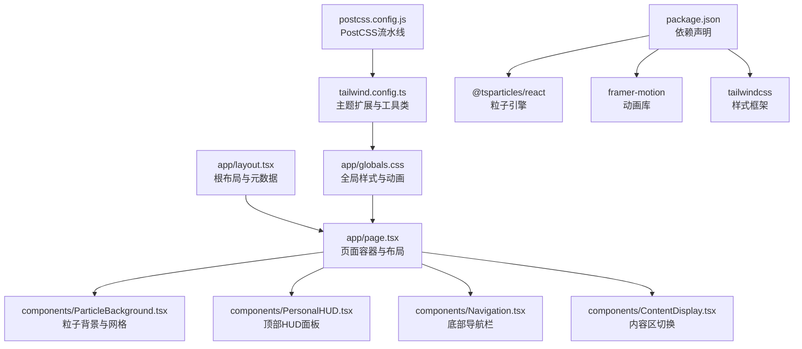
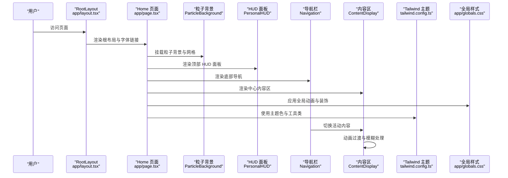
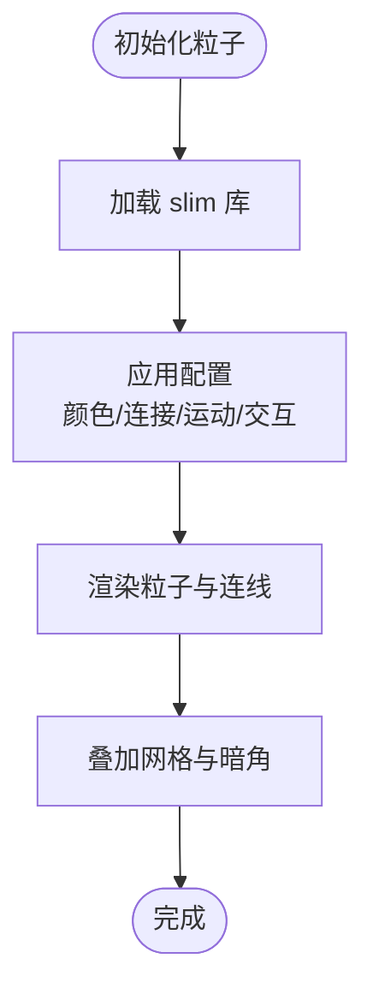
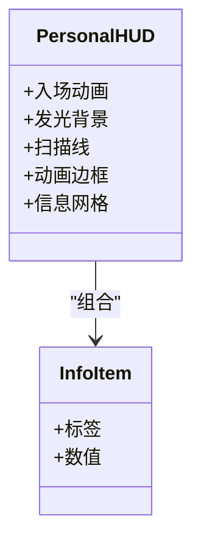
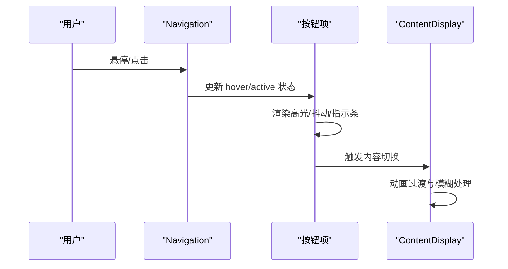
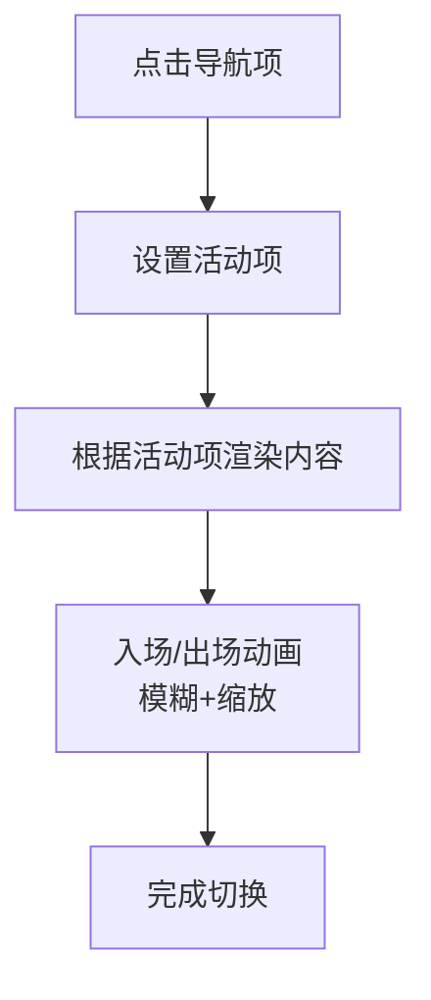
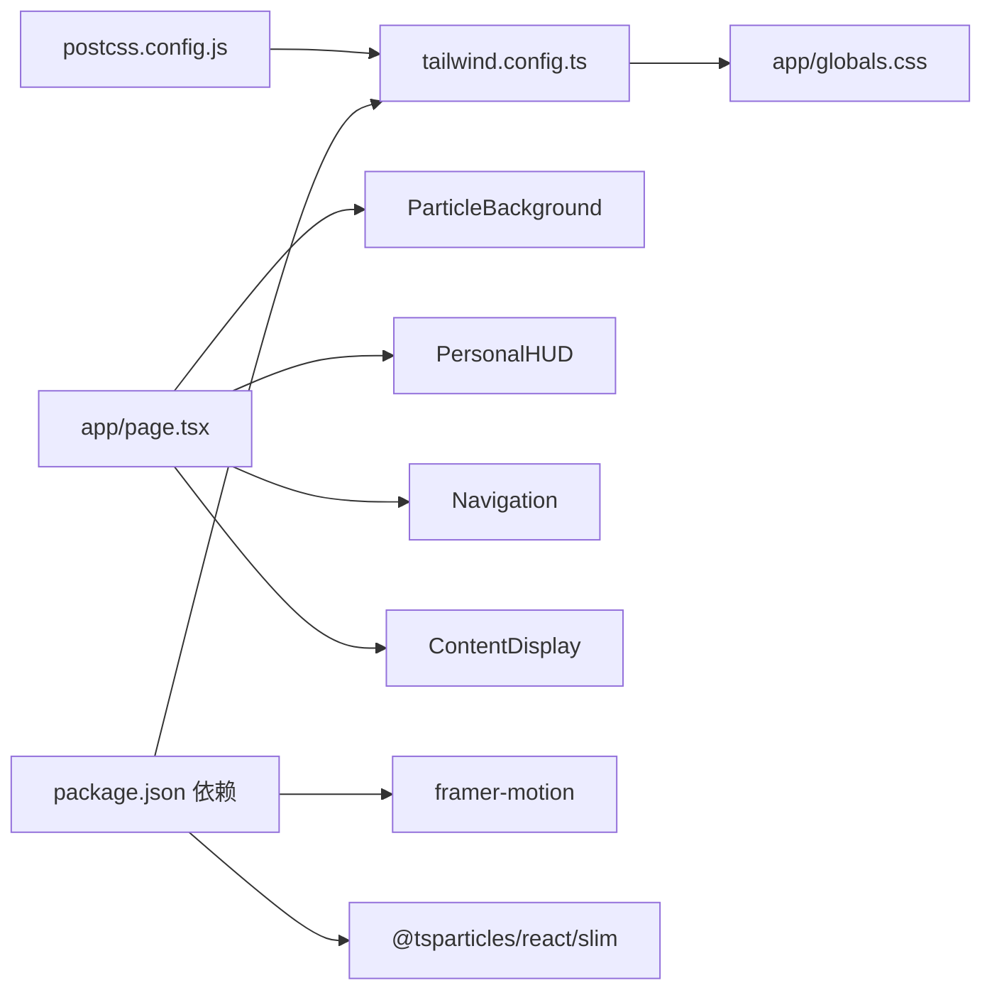

# 赛博朋克风格设计

<cite>
**本文引用的文件**
- [app/globals.css](file://app/globals.css)
- [tailwind.config.ts](file://tailwind.config.ts)
- [postcss.config.js](file://postcss.config.js)
- [app/layout.tsx](file://app/layout.tsx)
- [app/page.tsx](file://app/page.tsx)
- [components/ParticleBackground.tsx](file://components/ParticleBackground.tsx)
- [components/PersonalHUD.tsx](file://components/PersonalHUD.tsx)
- [components/Navigation.tsx](file://components/Navigation.tsx)
- [components/ContentDisplay.tsx](file://components/ContentDisplay.tsx)
- [package.json](file://package.json)
</cite>

## 目录
1. [引言](#引言)
2. [项目结构](#项目结构)
3. [核心组件](#核心组件)
4. [架构总览](#架构总览)
5. [详细组件分析](#详细组件分析)
6. [依赖分析](#依赖分析)
7. [性能考虑](#性能考虑)
8. [故障排查指南](#故障排查指南)
9. [结论](#结论)
10. [附录](#附录)

## 引言
本项目以赛博朋克美学为核心，通过现代前端技术栈（Next.js + Tailwind CSS + Framer Motion + @tsparticles）构建一个沉浸式的数字界面体验。设计语言围绕“暗黑底色 + 霓虹高亮 + 科技字体 + 动态光效”展开，强调未来感与交互性。本文档从样式系统、颜色体系、字体系统、视觉特效、动画与性能、一致性与可维护性等维度，系统化阐述该风格在工程中的落地方式。

## 项目结构
项目采用 Next.js App Router 结构，样式与主题通过 Tailwind CSS 扩展与全局 CSS 定义相结合；组件层使用 Framer Motion 实现流畅动画，粒子系统提供动态背景。

图示来源
- [app/layout.tsx:1-37](file://app/layout.tsx#L1-L37)
- [app/page.tsx:1-61](file://app/page.tsx#L1-L61)
- [components/ParticleBackground.tsx:1-126](file://components/ParticleBackground.tsx#L1-L126)
- [components/PersonalHUD.tsx:1-132](file://components/PersonalHUD.tsx#L1-L132)
- [components/Navigation.tsx:1-103](file://components/Navigation.tsx#L1-L103)
- [components/ContentDisplay.tsx:1-125](file://components/ContentDisplay.tsx#L1-L125)
- [app/globals.css:1-212](file://app/globals.css#L1-L212)
- [tailwind.config.ts:1-72](file://tailwind.config.ts#L1-L72)
- [postcss.config.js:1-7](file://postcss.config.js#L1-L7)
- [package.json:1-30](file://package.json#L1-L30)

章节来源
- [app/layout.tsx:1-37](file://app/layout.tsx#L1-L37)
- [app/page.tsx:1-61](file://app/page.tsx#L1-L61)
- [tailwind.config.ts:1-72](file://tailwind.config.ts#L1-L72)
- [postcss.config.js:1-7](file://postcss.config.js#L1-L7)
- [app/globals.css:1-212](file://app/globals.css#L1-L212)
- [package.json:1-30](file://package.json#L1-L30)

## 核心组件
- 样式与主题：通过 Tailwind 主题扩展定义赛博朋克色板与工具类，配合全局 CSS 的动画与装饰样式，形成统一的视觉语言。
- 粒子背景：使用 @tsparticles 提供的动态粒子与连线，营造数据流与能量场的氛围。
- HUD 面板：顶部右上角的个人信息面板，采用渐变发光、扫描线、剪角边框等元素强化赛博朋克质感。
- 导航栏：底部居中导航，结合悬停发光、图标闪烁与角标装饰，体现交互科技感。
- 内容区：中心内容区域随导航切换，配合入场/出场动画与模糊过渡，提升沉浸感。

章节来源
- [tailwind.config.ts:9-67](file://tailwind.config.ts#L9-L67)
- [app/globals.css:7-212](file://app/globals.css#L7-L212)
- [components/ParticleBackground.tsx:21-125](file://components/ParticleBackground.tsx#L21-L125)
- [components/PersonalHUD.tsx:6-121](file://components/PersonalHUD.tsx#L6-L121)
- [components/Navigation.tsx:17-102](file://components/Navigation.tsx#L17-L102)
- [components/ContentDisplay.tsx:12-42](file://components/ContentDisplay.tsx#L12-L42)

## 架构总览
下图展示页面渲染到视觉特效的端到端流程，以及样式与动画的协同关系。

图示来源
- [app/layout.tsx:16-36](file://app/layout.tsx#L16-L36)
- [app/page.tsx:9-60](file://app/page.tsx#L9-L60)
- [components/ParticleBackground.tsx:8-125](file://components/ParticleBackground.tsx#L8-L125)
- [components/PersonalHUD.tsx:6-121](file://components/PersonalHUD.tsx#L6-L121)
- [components/Navigation.tsx:17-102](file://components/Navigation.tsx#L17-L102)
- [components/ContentDisplay.tsx:12-42](file://components/ContentDisplay.tsx#L12-L42)
- [tailwind.config.ts:9-67](file://tailwind.config.ts#L9-L67)
- [app/globals.css:1-212](file://app/globals.css#L1-L212)

## 详细组件分析

### 样式系统与主题扩展
- 色彩体系
  - 基础色：深黑与深蓝作为背景基调，确保高对比度与科技感。
  - 霓虹主色：电蓝色、霓虹粉、赛博绿作为强调色，用于高亮、边框与光晕。
  - HUD 背景：半透明蓝绿色，兼顾通透与层次。
- 字体系统
  - 科技字体族：轨道（Orbitron）用于标题，强调未来感与机械感。
  - 等宽字体：JetBrains Mono/Fira Code，保证代码与信息密度场景的清晰度。
- 阴影与发光
  - 通过主题阴影与文本发光组合，实现“霓虹光晕”效果。
- 动画与关键帧
  - 在 Tailwind 中扩展动画名称与关键帧，统一管理脉冲、扫描、闪烁、浮动与数据流等动效。
- 装饰与背景
  - 网格背景、径向暗角、扫描线叠加，增强屏幕感与深度。

章节来源
- [tailwind.config.ts:11-66](file://tailwind.config.ts#L11-L66)
- [app/globals.css:7-212](file://app/globals.css#L7-L212)

### 粒子背景与网格
- 粒子参数
  - 颜色：三种霓虹色随机分布，增强活力与连接感。
  - 连接：低不透明度的蓝色连线，形成网络数据流。
  - 运动：随机移动与边界反弹，模拟微观粒子运动。
  - 交互：点击推动、悬停排斥，提升参与感。
- 装饰叠加
  - 网格背景与径向暗角，强化屏幕纹理与聚焦中心。

图示来源
- [components/ParticleBackground.tsx:15-104](file://components/ParticleBackground.tsx#L15-L104)
- [components/ParticleBackground.tsx:105-122](file://components/ParticleBackground.tsx#L105-L122)

章节来源
- [components/ParticleBackground.tsx:8-125](file://components/ParticleBackground.tsx#L8-L125)

### HUD 面板（PersonalHUD）
- 视觉构成
  - 发光背景：三色渐变的模糊光晕，营造能量场包围感。
  - 边框与剪角：四角剪角与霓虹色边框，强化赛博朋克边框语言。
  - 扫描线：水平光条在面板内纵向扫描，模拟显示器扫描线。
  - 动画边框：渐变横向流动，强调激活状态。
- 信息组织
  - 标题、副标题、技能矩阵、社交链接等模块化排布，保持信息层级清晰。
- 动画细节
  - 入场淡入与位移、呼吸式光点、技能标签逐个弹入，增强节奏感。

图示来源
- [components/PersonalHUD.tsx:6-121](file://components/PersonalHUD.tsx#L6-L121)
- [components/PersonalHUD.tsx:124-131](file://components/PersonalHUD.tsx#L124-L131)

章节来源
- [components/PersonalHUD.tsx:6-121](file://components/PersonalHUD.tsx#L6-L121)

### 导航栏（Navigation）
- 交互设计
  - 悬停时从左至右的渐变高光，配合轻微抖动反馈。
  - 活动项带从蓝到粉的渐变指示条，使用 layoutId 保证平滑过渡。
  - 角标装饰与边框透传主题色，保持一致的霓虹风格。
- 动画细节
  - 悬停时的“故障”抖动层，增加赛博朋克的不稳定感与趣味性。
  - 顶部装饰线条的呼吸式明灭，强化底部信息区的动态感。

图示来源
- [components/Navigation.tsx:17-102](file://components/Navigation.tsx#L17-L102)
- [components/ContentDisplay.tsx:12-42](file://components/ContentDisplay.tsx#L12-L42)

章节来源
- [components/Navigation.tsx:17-102](file://components/Navigation.tsx#L17-L102)
- [components/ContentDisplay.tsx:12-42](file://components/ContentDisplay.tsx#L12-L42)

### 内容显示区（ContentDisplay）
- 切换机制
  - 使用 AnimatePresence 与布局键控，确保每次切换有明确的入场/出场动画。
  - 默认欢迎屏包含标题故障效果、命令提示符闪烁与呼吸式圆点，强化“系统启动”主题。
- 动画策略
  - 模糊与缩放的组合，降低视觉冲击同时保持焦点集中。
  - 文字光晕与抖动层交替出现，营造“系统就绪”的氛围。

图示来源
- [components/ContentDisplay.tsx:12-42](file://components/ContentDisplay.tsx#L12-L42)
- [components/ContentDisplay.tsx:44-124](file://components/ContentDisplay.tsx#L44-L124)

章节来源
- [components/ContentDisplay.tsx:12-42](file://components/ContentDisplay.tsx#L12-L42)
- [components/ContentDisplay.tsx:44-124](file://components/ContentDisplay.tsx#L44-L124)

### 全局样式与动画
- 动画类型
  - 故障抖动、闪烁、脉冲、扫描、数据流、浮动等，覆盖文本、背景与装饰层。
- 装饰元素
  - 网格背景、HUD 叠加层、剪角与六角形裁切、扫描线遮罩等。
- 响应式与可访问性
  - 使用文本平衡与滚动条美化，兼顾不同设备与阅读习惯。

章节来源
- [app/globals.css:69-212](file://app/globals.css#L69-L212)

## 依赖分析
- 样式管线
  - PostCSS 通过 Tailwind CSS 生成最终样式，再由浏览器渲染。
- 动画与粒子
  - Framer Motion 提供高性能的 DOM/Canvas 动画能力。
  - @tsparticles/react 与 @tsparticles/slim 提供轻量级粒子系统，支持复杂交互与性能优化。
- 主题一致性
  - Tailwind 主题集中定义颜色、字体、阴影、动画与背景，避免分散配置带来的不一致。

图示来源
- [postcss.config.js:1-7](file://postcss.config.js#L1-L7)
- [tailwind.config.ts:1-72](file://tailwind.config.ts#L1-L72)
- [app/globals.css:1-212](file://app/globals.css#L1-L212)
- [app/page.tsx:1-61](file://app/page.tsx#L1-L61)
- [components/ParticleBackground.tsx:1-126](file://components/ParticleBackground.tsx#L1-L126)
- [components/PersonalHUD.tsx:1-132](file://components/PersonalHUD.tsx#L1-L132)
- [components/Navigation.tsx:1-103](file://components/Navigation.tsx#L1-L103)
- [components/ContentDisplay.tsx:1-125](file://components/ContentDisplay.tsx#L1-L125)
- [package.json:11-19](file://package.json#L11-L19)

章节来源
- [package.json:11-19](file://package.json#L11-L19)
- [postcss.config.js:1-7](file://postcss.config.js#L1-L7)
- [tailwind.config.ts:1-72](file://tailwind.config.ts#L1-L72)

## 性能考虑
- 粒子性能
  - 控制粒子数量与动画帧率，避免过度消耗 GPU/CPU。
  - 合理设置透明度与连接距离，减少重绘开销。
- 动画优化
  - 优先使用 transform 与 opacity，避免频繁触发布局与绘制。
  - 对高频动画（如扫描线、数据流）控制持续时间与缓动曲线。
- 样式与资源
  - 字体按需加载与预连接，减少阻塞。
  - 使用 Tailwind 工具类替代内联样式，提高复用与打包效率。
- 响应式与交互
  - 在低端设备上可降低动画频率或禁用部分特效，保证可用性。

## 故障排查指南
- 字体未生效
  - 检查根布局是否正确引入字体链接与跨域属性。
  - 确认 Tailwind 主题中字体族定义与实际字体名一致。
- 动画卡顿
  - 检查是否有过多元素同时执行复杂动画。
  - 适当降低帧率或减少动画时长。
- 粒子性能问题
  - 减少粒子数量、降低连接距离与透明度。
  - 关闭不必要的交互模式或限制交互范围。
- 颜色不一致
  - 统一使用主题变量与 Tailwind 工具类，避免硬编码颜色值。

章节来源
- [app/layout.tsx:24-29](file://app/layout.tsx#L24-L29)
- [tailwind.config.ts:21-24](file://tailwind.config.ts#L21-L24)
- [components/ParticleBackground.tsx:59-64](file://components/ParticleBackground.tsx#L59-L64)
- [tailwind.config.ts:11-20](file://tailwind.config.ts#L11-L20)

## 结论
本项目通过 Tailwind 主题扩展与全局 CSS 动画，结合 Framer Motion 与粒子系统，完整实现了赛博朋克风格的视觉与交互语言。色彩、字体、光影与动画在工程层面得到统一管理，既保证了设计的一致性，也为后续扩展提供了清晰的边界与最佳实践。

## 附录
- 设计原则速览
  - 色彩：深色背景 + 霓虹高亮 + 半透明叠加。
  - 字体：科技字体用于标题，等宽字体用于代码与信息密度场景。
  - 动效：脉冲、扫描、闪烁、浮动、数据流，强调“活”的界面。
  - 装饰：网格、剪角、扫描线、HUD 叠层，强化屏幕感与层次。
- 维护建议
  - 将常用颜色与动效抽象为主题变量与工具类，避免散落配置。
  - 对动画与粒子参数建立性能基线，定期评估设备兼容性。
  - 以组件为中心拆分样式与逻辑，确保职责单一、易于替换。