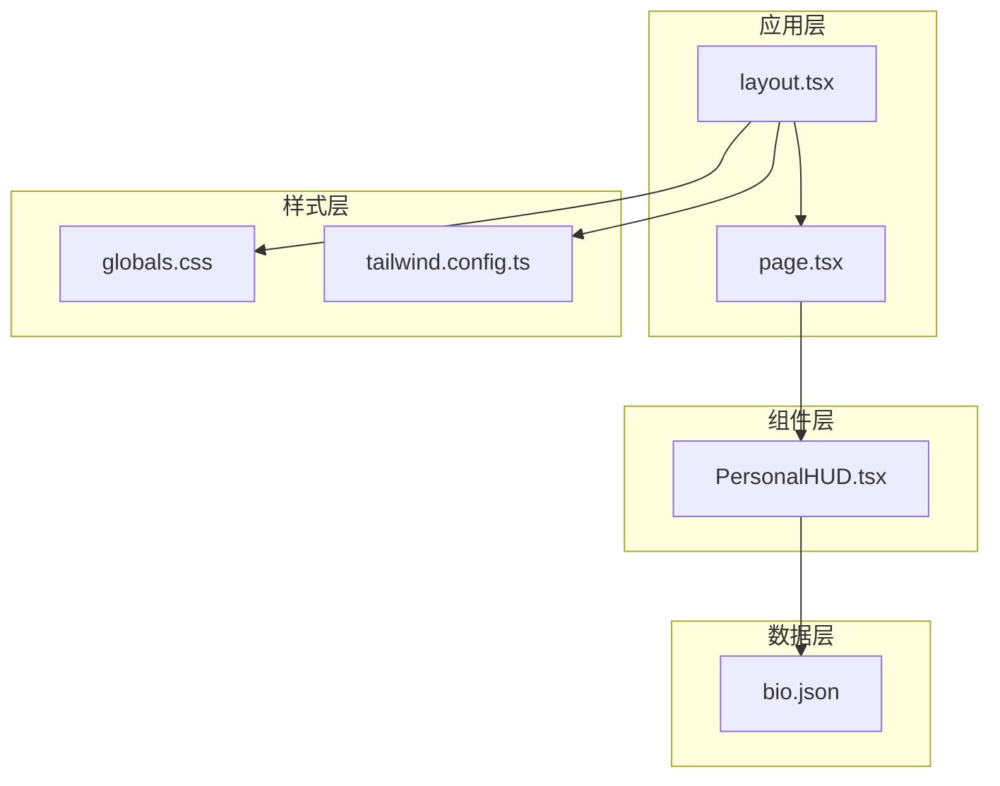
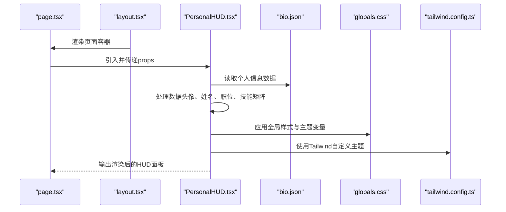
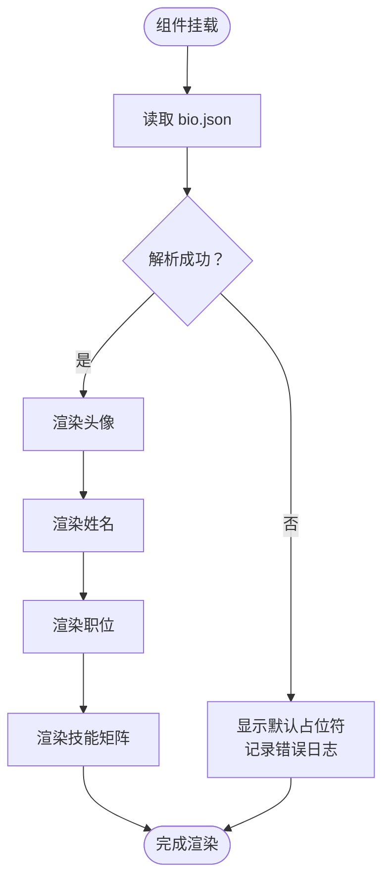
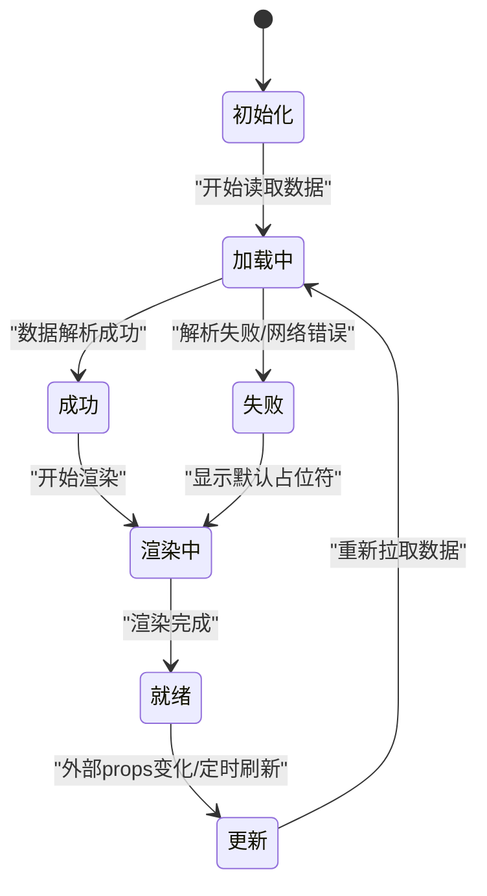
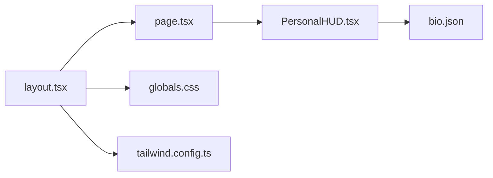

# 个人信息HUD面板

<cite>
**本文档引用的文件**
- [PersonalHUD.tsx](file://components/PersonalHUD.tsx)
- [bio.json](file://data/bio.json)
- [globals.css](file://app/globals.css)
- [layout.tsx](file://app/layout.tsx)
- [tailwind.config.ts](file://tailwind.config.ts)
- [page.tsx](file://app/page.tsx)
</cite>

## 目录
1. [简介](#简介)
2. [项目结构](#项目结构)
3. [核心组件](#核心组件)
4. [架构总览](#架构总览)
5. [详细组件分析](#详细组件分析)
6. [依赖关系分析](#依赖关系分析)
7. [性能考虑](#性能考虑)
8. [故障排除指南](#故障排除指南)
9. [结论](#结论)
10. [附录](#附录)

## 简介
本文件为“个人信息HUD面板”组件的系统化技术文档，面向前端开发者与产品设计人员，聚焦以下目标：
- 解释HUD界面的设计理念与赛博朋克风格的视觉实现
- 说明个人信息数据（头像、姓名、职位、技能矩阵）的展示与渲染逻辑
- 描述组件状态管理（数据加载、更新、缓存策略）
- 提供样式定制（颜色主题、布局、动画）与响应式适配方案
- 总结数据绑定最佳实践与错误处理机制
- 说明可访问性与国际化配置方法

## 项目结构
该仓库采用Next.js应用结构，组件位于components目录，页面入口在app目录，全局样式在app/globals.css，主题配置在tailwind.config.ts。个人信息数据以JSON形式存储于data目录。

**图表来源**
- [layout.tsx](file://app/layout.tsx)
- [page.tsx](file://app/page.tsx)
- [PersonalHUD.tsx](file://components/PersonalHUD.tsx)
- [bio.json](file://data/bio.json)
- [globals.css](file://app/globals.css)
- [tailwind.config.ts](file://tailwind.config.ts)

**章节来源**
- [layout.tsx](file://app/layout.tsx)
- [page.tsx](file://app/page.tsx)
- [PersonalHUD.tsx](file://components/PersonalHUD.tsx)
- [bio.json](file://data/bio.json)
- [globals.css](file://app/globals.css)
- [tailwind.config.ts](file://tailwind.config.ts)

## 核心组件
- 组件名称：PersonalHUD
- 所属模块：components/PersonalHUD.tsx
- 数据来源：data/bio.json
- 页面集成：app/page.tsx（作为页面内容的一部分）
- 全局样式：app/globals.css（提供基础样式与主题变量）
- 主题配置：tailwind.config.ts（Tailwind自定义主题）

组件职责：
- 负责渲染用户头像、姓名、职位信息
- 渲染技能矩阵（如技能条、等级或标签）
- 管理数据加载、更新与缓存策略
- 应用赛博朋克风格视觉（颜色、边框发光、网格背景等）
- 支持响应式布局与可访问性要求
- 支持国际化与多语言切换

**章节来源**
- [PersonalHUD.tsx](file://components/PersonalHUD.tsx)
- [bio.json](file://data/bio.json)
- [page.tsx](file://app/page.tsx)

## 架构总览
下图展示了页面、组件与数据之间的交互关系，以及样式与主题配置对组件外观的影响。

**图表来源**
- [page.tsx](file://app/page.tsx)
- [layout.tsx](file://app/layout.tsx)
- [PersonalHUD.tsx](file://components/PersonalHUD.tsx)
- [bio.json](file://data/bio.json)
- [globals.css](file://app/globals.css)
- [tailwind.config.ts](file://tailwind.config.ts)

## 详细组件分析

### 设计理念与赛博朋克风格实现
- 视觉风格关键词：霓虹色彩、几何线条、发光边框、网格背景、未来科技感
- 颜色体系：通过Tailwind自定义主题与CSS变量实现一致的主色调与强调色；建议使用高对比度与低饱和度的冷色系突出科技感
- 边框与发光：使用边框阴影与发光效果模拟电路板与能量场
- 字体与排版：选择现代无衬线字体，确保在小尺寸设备上清晰可读
- 动画与过渡：适度的渐变与悬停反馈，避免过度动画影响可访问性

**章节来源**
- [globals.css](file://app/globals.css)
- [tailwind.config.ts](file://tailwind.config.ts)

### 数据模型与渲染逻辑
- 数据来源：data/bio.json
- 建议字段结构（示例）：
  - 头像：avatar（URL或本地资源）
  - 姓名：name（字符串）
  - 职位：title（字符串）
  - 技能矩阵：skills（数组，元素含技能名与熟练度）
- 渲染流程：
  - 加载数据：组件初始化时从JSON读取
  - 渲染头像：根据URL渲染图片，设置alt文本以提升可访问性
  - 渲染姓名与职位：使用语义化HTML标签（h1/h2等）
  - 渲染技能矩阵：遍历skills数组，按熟练度绘制条形图或标签云
- 错误处理：当数据缺失或格式异常时，显示默认占位符与错误提示

**图表来源**
- [PersonalHUD.tsx](file://components/PersonalHUD.tsx)
- [bio.json](file://data/bio.json)

**章节来源**
- [PersonalHUD.tsx](file://components/PersonalHUD.tsx)
- [bio.json](file://data/bio.json)

### 状态管理机制
- 数据加载：组件初始化时异步读取JSON，使用Promise或async/await处理
- 更新策略：当外部props变化或定时刷新时，触发重新渲染
- 缓存策略：可采用内存缓存（进程内）或浏览器localStorage缓存，避免重复请求
- 错误边界：在组件外层包裹错误边界，捕获渲染异常并降级显示

**图表来源**
- [PersonalHUD.tsx](file://components/PersonalHUD.tsx)

**章节来源**
- [PersonalHUD.tsx](file://components/PersonalHUD.tsx)

### 样式定制选项
- 颜色主题：
  - Tailwind自定义：在tailwind.config.ts中扩展colors，统一主色、强调色与背景色
  - CSS变量：在globals.css中定义变量，便于动态切换主题
- 布局调整：
  - 容器宽度与间距：使用Tailwind工具类控制最大宽度与内外边距
  - 对齐与分组：使用flex/grid布局实现响应式排列
- 动画效果：
  - 进入/退出动画：使用CSS过渡或关键帧动画
  - 悬停反馈：为按钮与链接添加平滑过渡

**章节来源**
- [tailwind.config.ts](file://tailwind.config.ts)
- [globals.css](file://app/globals.css)

### 响应式设计与移动端适配
- 断点策略：基于屏幕宽度设置sm/md/lg/xl断点，确保在手机、平板与桌面端均良好显示
- 触摸友好：增大点击区域，减少小尺寸下的误触
- 排版优化：在窄屏下调整字体大小与行高，保证可读性
- 导航适配：在移动端隐藏非关键信息，优先展示核心数据

**章节来源**
- [layout.tsx](file://app/layout.tsx)
- [tailwind.config.ts](file://tailwind.config.ts)

### 数据绑定最佳实践
- 单向数据流：父组件负责数据源，子组件只负责渲染
- 受控组件：通过props传递数据，避免直接修改内部状态
- 类型安全：为数据模型定义接口，使用TypeScript校验
- 默认值：为缺失字段提供默认值，避免渲染异常

**章节来源**
- [PersonalHUD.tsx](file://components/PersonalHUD.tsx)
- [bio.json](file://data/bio.json)

### 错误处理机制
- 数据异常：当JSON格式不正确或字段缺失时，记录错误并回退到默认UI
- 网络错误：在异步加载失败时，显示错误提示与重试按钮
- 可访问性：为图片提供alt文本，为交互元素提供aria-label
- 国际化：使用i18n库（如next-i18next）管理文案，支持多语言切换

**章节来源**
- [PersonalHUD.tsx](file://components/PersonalHUD.tsx)
- [bio.json](file://data/bio.json)

## 依赖关系分析
- 组件依赖：
  - 数据：data/bio.json
  - 样式：app/globals.css、tailwind.config.ts
  - 页面：app/page.tsx、app/layout.tsx
- 外部依赖：Next.js运行时、React、Tailwind CSS

**图表来源**
- [page.tsx](file://app/page.tsx)
- [layout.tsx](file://app/layout.tsx)
- [PersonalHUD.tsx](file://components/PersonalHUD.tsx)
- [bio.json](file://data/bio.json)
- [globals.css](file://app/globals.css)
- [tailwind.config.ts](file://tailwind.config.ts)

**章节来源**
- [page.tsx](file://app/page.tsx)
- [layout.tsx](file://app/layout.tsx)
- [PersonalHUD.tsx](file://components/PersonalHUD.tsx)
- [bio.json](file://data/bio.json)
- [globals.css](file://app/globals.css)
- [tailwind.config.ts](file://tailwind.config.ts)

## 性能考虑
- 数据缓存：对静态JSON使用内存缓存或浏览器缓存，减少重复请求
- 渲染优化：使用React.memo或类似手段避免不必要的重渲染
- 图片优化：压缩头像尺寸，使用webp格式，懒加载长列表
- 样式优化：仅引入必要样式，避免全局污染
- 首屏渲染：将关键信息提前渲染，非关键内容延迟加载

## 故障排除指南
- 问题：头像未显示
  - 检查URL是否有效，确认alt文本已设置
  - 查看网络面板是否存在跨域或404
- 问题：技能矩阵为空
  - 确认JSON中skills字段存在且格式正确
  - 在组件中添加默认空数组兜底
- 问题：样式错乱
  - 检查Tailwind配置是否生效，确认CSS变量命名一致
- 问题：移动端显示异常
  - 检查断点设置与媒体查询，确保flex/grid规则正确
- 问题：国际化文案不生效
  - 确认i18n配置与路由国际化设置正确

**章节来源**
- [PersonalHUD.tsx](file://components/PersonalHUD.tsx)
- [bio.json](file://data/bio.json)
- [tailwind.config.ts](file://tailwind.config.ts)
- [globals.css](file://app/globals.css)

## 结论
PersonalHUD组件通过清晰的数据模型、稳健的状态管理与可定制的样式体系，实现了赛博朋克风格的个人信息展示。结合响应式设计与可访问性实践，可在多终端提供一致而富有未来感的用户体验。建议后续进一步完善国际化与错误边界，并持续优化性能与可维护性。

## 附录
- 参考文件清单：
  - [PersonalHUD.tsx](file://components/PersonalHUD.tsx)
  - [bio.json](file://data/bio.json)
  - [globals.css](file://app/globals.css)
  - [layout.tsx](file://app/layout.tsx)
  - [tailwind.config.ts](file://tailwind.config.ts)
  - [page.tsx](file://app/page.tsx)