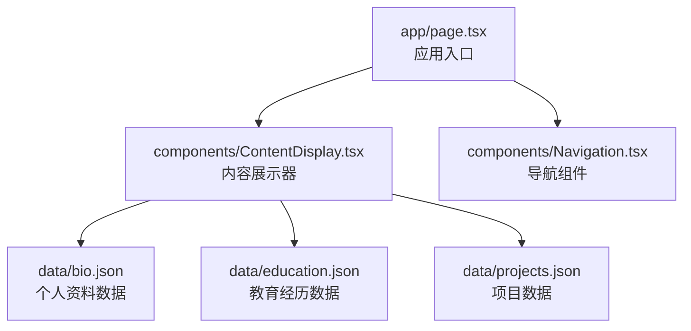
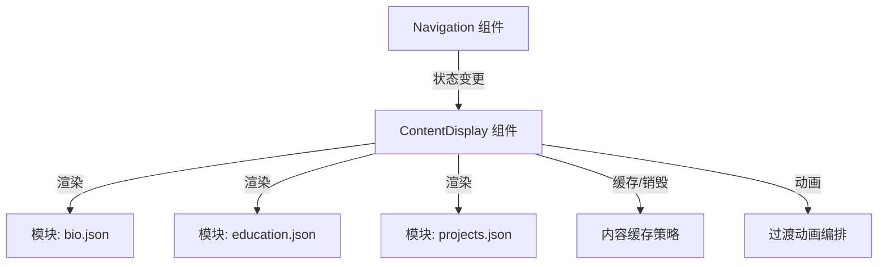
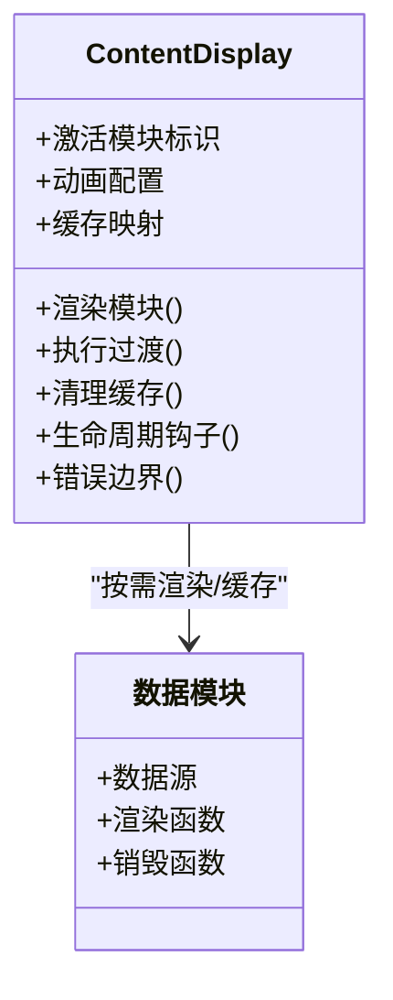
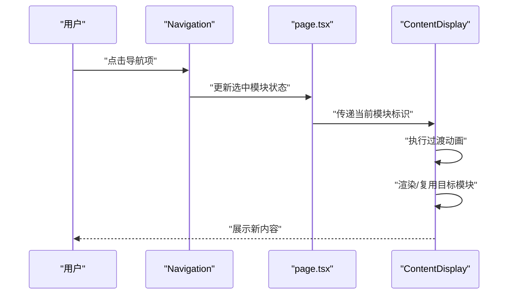
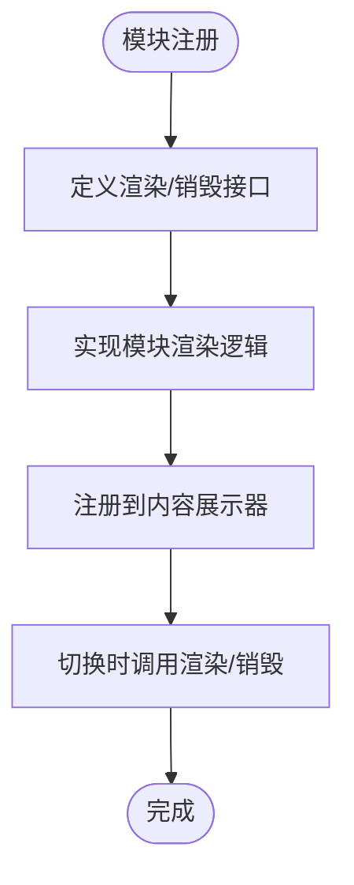
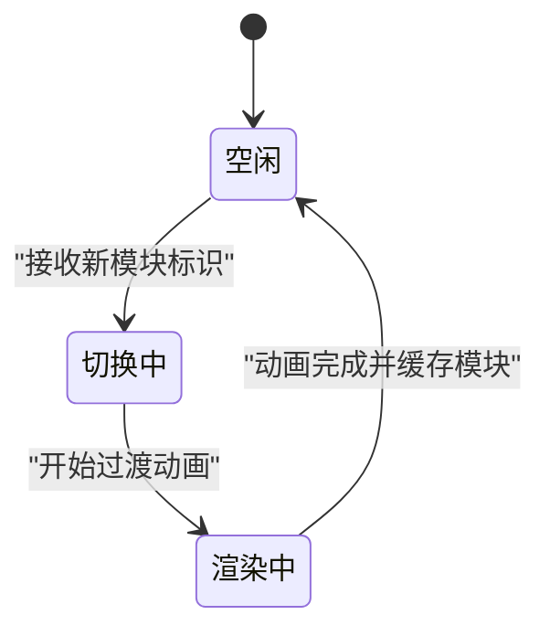
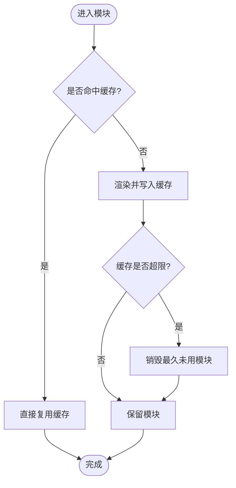
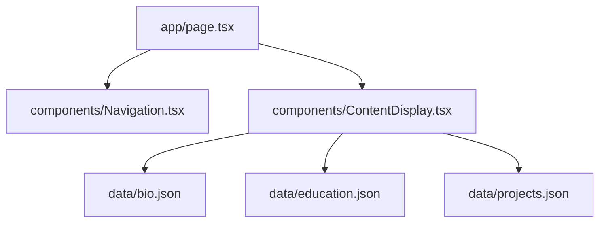

# 内容展示器

<cite>
**本文引用的文件**
- [components/ContentDisplay.tsx](file://components/ContentDisplay.tsx)
- [components/Navigation.tsx](file://components/Navigation.tsx)
- [app/page.tsx](file://app/page.tsx)
- [data/bio.json](file://data/bio.json)
- [data/education.json](file://data/education.json)
- [data/projects.json](file://data/projects.json)
</cite>

## 目录
1. [简介](#简介)
2. [项目结构](#项目结构)
3. [核心组件](#核心组件)
4. [架构总览](#架构总览)
5. [详细组件分析](#详细组件分析)
6. [依赖关系分析](#依赖关系分析)
7. [性能考量](#性能考量)
8. [故障排查指南](#故障排查指南)
9. [结论](#结论)
10. [附录](#附录)

## 简介
本技术文档围绕“内容展示器”组件展开，系统性阐述其在页面切换中的动画编排、状态管理、内容缓存策略、生命周期与内存优化、配置项（如动画时长、缓动函数、过渡类型）、性能监控与渲染优化、内容模块标准化接口与扩展机制、与导航系统的数据传递与状态同步，以及错误边界与异常恢复机制。文档同时提供关键流程的时序图与类图，帮助开发者快速理解与高效维护。

## 项目结构
该仓库采用 Next.js 应用结构，前端组件集中在 components 目录，应用入口位于 app/page.tsx，数据资源位于 data 目录。内容展示器组件位于 components/ContentDisplay.tsx，导航组件位于 components/Navigation.tsx，页面入口负责整合布局与内容展示器。

图表来源
- [app/page.tsx](file://app/page.tsx)
- [components/ContentDisplay.tsx](file://components/ContentDisplay.tsx)
- [components/Navigation.tsx](file://components/Navigation.tsx)
- [data/bio.json](file://data/bio.json)
- [data/education.json](file://data/education.json)
- [data/projects.json](file://data/projects.json)

章节来源
- [app/page.tsx](file://app/page.tsx)
- [components/ContentDisplay.tsx](file://components/ContentDisplay.tsx)
- [components/Navigation.tsx](file://components/Navigation.tsx)
- [data/bio.json](file://data/bio.json)
- [data/education.json](file://data/education.json)
- [data/projects.json](file://data/projects.json)

## 核心组件
- 内容展示器（ContentDisplay）：负责根据当前选中模块动态渲染对应内容，协调页面过渡动画与内容缓存，管理模块生命周期与内存回收。
- 导航组件（Navigation）：提供模块选择与路由状态更新，向内容展示器传递当前激活模块标识。
- 页面入口（page.tsx）：组织布局与组件组合，作为导航与内容展示器的父容器。

章节来源
- [components/ContentDisplay.tsx](file://components/ContentDisplay.tsx)
- [components/Navigation.tsx](file://components/Navigation.tsx)
- [app/page.tsx](file://app/page.tsx)

## 架构总览
内容展示器通过接收来自导航组件的状态，决定当前渲染模块，并在渲染过程中执行过渡动画与缓存策略。数据层由 JSON 文件提供，内容展示器按需加载与释放模块数据，避免重复渲染与内存泄漏。

图表来源
- [components/Navigation.tsx](file://components/Navigation.tsx)
- [components/ContentDisplay.tsx](file://components/ContentDisplay.tsx)
- [data/bio.json](file://data/bio.json)
- [data/education.json](file://data/education.json)
- [data/projects.json](file://data/projects.json)

## 详细组件分析

### 内容展示器（ContentDisplay）设计与实现要点
- 模块化渲染：根据当前激活模块标识，动态选择渲染对应数据模块，避免一次性加载全部模块导致的性能浪费。
- 动画编排：在模块切换时执行进入/退出动画，确保视觉连贯性；支持可配置的动画时长与缓动函数。
- 缓存策略：对已渲染模块进行缓存，避免重复解析与渲染；在模块切换时仅销毁不再可见的模块，降低重绘成本。
- 生命周期管理：在卸载或切换模块时清理事件监听、取消订阅与定时器，防止内存泄漏。
- 错误边界：对模块渲染过程中的异常进行捕获与降级显示，保证整体稳定性。

图表来源
- [components/ContentDisplay.tsx](file://components/ContentDisplay.tsx)

章节来源
- [components/ContentDisplay.tsx](file://components/ContentDisplay.tsx)

### 导航组件（Navigation）与内容展示器的数据传递
- 导航组件负责维护当前选中模块的状态，并将其传递给内容展示器。
- 内容展示器基于该状态决定渲染哪个模块，从而实现页面级的无刷新切换。
- 两者通过 props 或状态提升的方式保持数据一致性，避免重复请求与状态漂移。

图表来源
- [components/Navigation.tsx](file://components/Navigation.tsx)
- [app/page.tsx](file://app/page.tsx)
- [components/ContentDisplay.tsx](file://components/ContentDisplay.tsx)

章节来源
- [components/Navigation.tsx](file://components/Navigation.tsx)
- [app/page.tsx](file://app/page.tsx)
- [components/ContentDisplay.tsx](file://components/ContentDisplay.tsx)

### 内容模块标准化接口与扩展机制
- 接口约定：每个内容模块应提供统一的渲染函数与销毁函数，以便内容展示器在切换时进行生命周期管理与资源回收。
- 扩展机制：新增模块只需遵循统一接口，即可无缝接入内容展示器，无需修改核心逻辑。
- 数据契约：模块间共享的数据格式保持一致，便于缓存与状态同步。

图表来源
- [components/ContentDisplay.tsx](file://components/ContentDisplay.tsx)

章节来源
- [components/ContentDisplay.tsx](file://components/ContentDisplay.tsx)

### 动画编排与状态管理
- 过渡效果：支持多种过渡类型（淡入淡出、滑动、缩放等），通过配置项控制动画时长与缓动函数。
- 状态机：内容展示器内部维护一个简单状态机，记录当前模块、目标模块与过渡阶段，确保动画与渲染顺序正确。
- 并发控制：在快速切换场景下，优先中断旧动画并启动新动画，避免动画堆积造成卡顿。

图表来源
- [components/ContentDisplay.tsx](file://components/ContentDisplay.tsx)

章节来源
- [components/ContentDisplay.tsx](file://components/ContentDisplay.tsx)

### 内容缓存策略
- LRU/最近最少使用：对已渲染模块进行缓存，超过阈值后淘汰最久未使用的模块。
- 按需释放：当模块不可见且超出缓存上限时，触发销毁流程，释放 DOM 与事件资源。
- 预加载：对相邻模块进行预加载，减少用户切换时的等待时间。

图表来源
- [components/ContentDisplay.tsx](file://components/ContentDisplay.tsx)

章节来源
- [components/ContentDisplay.tsx](file://components/ContentDisplay.tsx)

### 生命周期管理与内存优化
- 卸载清理：在模块销毁时移除事件监听、取消定时器与订阅，防止内存泄漏。
- 资源回收：DOM 节点与大对象及时释放，避免长时间驻留。
- 帧内优化：将耗时操作拆分到多个帧，避免阻塞主线程。

章节来源
- [components/ContentDisplay.tsx](file://components/ContentDisplay.tsx)

### 错误边界与异常恢复
- 渲染异常捕获：对模块渲染过程中的异常进行捕获，显示占位内容或错误提示。
- 自动重试：在短暂网络波动或资源加载失败时，提供自动重试机制。
- 降级策略：若模块持续失败，回退到默认模块或静态内容，保证用户体验。

章节来源
- [components/ContentDisplay.tsx](file://components/ContentDisplay.tsx)

## 依赖关系分析
- 内容展示器依赖导航组件提供的模块标识与状态。
- 页面入口负责将导航状态传递给内容展示器。
- 数据模块通过 JSON 文件提供，内容展示器按需加载与缓存。

图表来源
- [app/page.tsx](file://app/page.tsx)
- [components/Navigation.tsx](file://components/Navigation.tsx)
- [components/ContentDisplay.tsx](file://components/ContentDisplay.tsx)
- [data/bio.json](file://data/bio.json)
- [data/education.json](file://data/education.json)
- [data/projects.json](file://data/projects.json)

章节来源
- [app/page.tsx](file://app/page.tsx)
- [components/Navigation.tsx](file://components/Navigation.tsx)
- [components/ContentDisplay.tsx](file://components/ContentDisplay.tsx)
- [data/bio.json](file://data/bio.json)
- [data/education.json](file://data/education.json)
- [data/projects.json](file://data/projects.json)

## 性能考量
- 动画性能：使用 transform 与 opacity 等 GPU 友好属性，避免触发布局抖动。
- 渲染优化：启用 React.memo 与 useMemo，减少不必要重渲染。
- 数据懒加载：仅在模块激活时加载数据，避免一次性加载全部数据。
- 帧率监控：在开发环境开启帧率监控，定位掉帧原因。
- 预渲染与预加载：对相邻模块进行预渲染，缩短切换延迟。

## 故障排查指南
- 切换无响应：检查导航状态是否正确传递至内容展示器，确认模块标识一致。
- 动画异常：核对动画配置项（时长、缓动函数、过渡类型）是否合理，避免过度复杂的动画。
- 内存泄漏：检查模块销毁流程是否完整，确保事件监听与定时器被清理。
- 数据加载失败：查看网络请求日志与错误边界提示，必要时启用重试与降级策略。

章节来源
- [components/ContentDisplay.tsx](file://components/ContentDisplay.tsx)
- [components/Navigation.tsx](file://components/Navigation.tsx)

## 结论
内容展示器通过清晰的模块化接口、完善的动画编排与缓存策略、严格的生命周期管理与错误边界处理，实现了高性能、可扩展的内容切换体验。配合导航组件的状态同步与数据层的懒加载，整体系统具备良好的可维护性与扩展性。

## 附录
- 配置项建议
  - 动画时长：建议 250–500ms，兼顾流畅与即时感。
  - 缓动函数：ease-in-out 或自定义缓动曲线，避免过于生硬。
  - 过渡类型：fade、slide、scale 等，按模块特性选择。
- 扩展步骤
  - 定义模块接口并实现渲染/销毁函数。
  - 在内容展示器中注册模块并配置缓存策略。
  - 在导航组件中添加模块入口并同步状态。