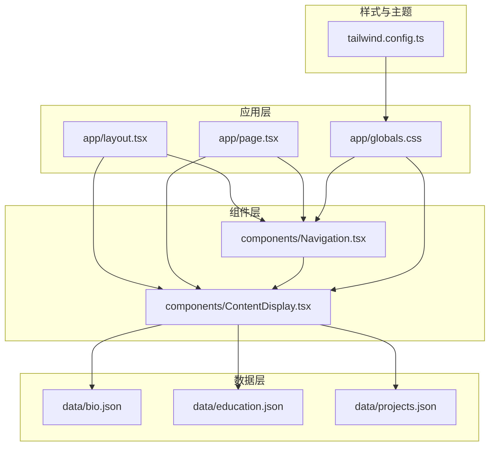
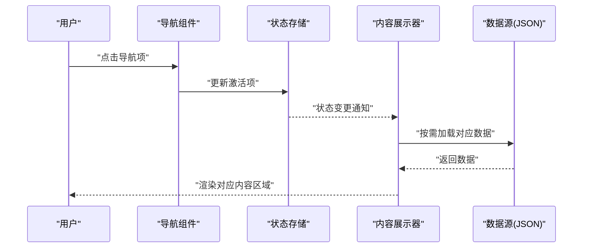
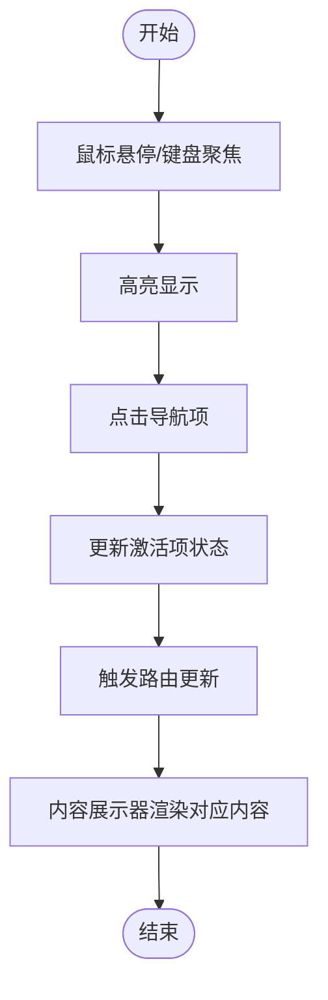
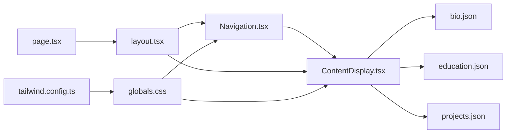

# 导航系统

<cite>
**本文引用的文件**
- [components/Navigation.tsx](file://components/Navigation.tsx)
- [components/ContentDisplay.tsx](file://components/ContentDisplay.tsx)
- [app/layout.tsx](file://app/layout.tsx)
- [app/page.tsx](file://app/page.tsx)
- [tailwind.config.ts](file://tailwind.config.ts)
- [app/globals.css](file://app/globals.css)
- [data/bio.json](file://data/bio.json)
- [data/education.json](file://data/education.json)
- [data/projects.json](file://data/projects.json)
</cite>

## 目录
1. [简介](#简介)
2. [项目结构](#项目结构)
3. [核心组件](#核心组件)
4. [架构总览](#架构总览)
5. [详细组件分析](#详细组件分析)
6. [依赖分析](#依赖分析)
7. [性能考虑](#性能考虑)
8. [故障排除指南](#故障排除指南)
9. [结论](#结论)
10. [附录](#附录)

## 简介
本文件面向“导航系统”组件，围绕底部导航的设计架构与交互逻辑展开，重点涵盖以下方面：
- 导航项的状态管理与路由切换机制
- 动画效果（悬停、选中、过渡）的实现思路
- 导航项配置方法（图标、文本、链接目标）
- 可扩展性设计（动态增删导航项）
- 键盘导航与无障碍访问支持
- 组件与内容展示器的协作与状态同步
- 主题定制与样式覆盖

该导航系统采用 React 组件化实现，结合 Next.js 应用布局与 Tailwind CSS 样式体系，确保在现代浏览器中具备良好的可用性与可维护性。

## 项目结构
导航系统位于 components 目录下，页面级布局与入口位于 app 目录，样式通过 Tailwind 配置与全局 CSS 控制，数据来源于 data 目录下的 JSON 文件。

**图表来源**
- [app/layout.tsx](file://app/layout.tsx)
- [app/page.tsx](file://app/page.tsx)
- [components/Navigation.tsx](file://components/Navigation.tsx)
- [components/ContentDisplay.tsx](file://components/ContentDisplay.tsx)
- [tailwind.config.ts](file://tailwind.config.ts)
- [app/globals.css](file://app/globals.css)
- [data/bio.json](file://data/bio.json)
- [data/education.json](file://data/education.json)
- [data/projects.json](file://data/projects.json)

**章节来源**
- [app/layout.tsx](file://app/layout.tsx)
- [app/page.tsx](file://app/page.tsx)
- [components/Navigation.tsx](file://components/Navigation.tsx)
- [components/ContentDisplay.tsx](file://components/ContentDisplay.tsx)
- [tailwind.config.ts](file://tailwind.config.ts)
- [app/globals.css](file://app/globals.css)
- [data/bio.json](file://data/bio.json)
- [data/education.json](file://data/education.json)
- [data/projects.json](file://data/projects.json)

## 核心组件
- 导航组件：负责底部导航渲染、状态管理与交互事件处理
- 内容展示器：根据当前导航状态选择并渲染对应内容区域
- 布局与入口：定义页面整体布局与根组件挂载点
- 样式与主题：通过 Tailwind 配置与全局 CSS 提供主题与动画基线
- 数据源：JSON 文件承载静态内容数据，供内容展示器消费

关键职责划分：
- Navigation：接收导航项列表，维护当前激活项，处理点击与键盘事件，触发路由更新
- ContentDisplay：依据当前激活项决定渲染模块，加载对应数据并呈现
- layout/page：作为容器，将 Navigation 与 ContentDisplay 组合到页面中
- Tailwind/globals：提供统一的视觉与动效基线，便于主题定制

**章节来源**
- [components/Navigation.tsx](file://components/Navigation.tsx)
- [components/ContentDisplay.tsx](file://components/ContentDisplay.tsx)
- [app/layout.tsx](file://app/layout.tsx)
- [app/page.tsx](file://app/page.tsx)
- [tailwind.config.ts](file://tailwind.config.ts)
- [app/globals.css](file://app/globals.css)

## 架构总览
导航系统采用“状态驱动”的单向数据流：导航组件维护当前激活项，内容展示器基于该状态选择内容模块并渲染。布局层负责将导航与内容组合，Tailwind 提供一致的视觉与动效基础。

**图表来源**
- [components/Navigation.tsx](file://components/Navigation.tsx)
- [components/ContentDisplay.tsx](file://components/ContentDisplay.tsx)
- [data/bio.json](file://data/bio.json)
- [data/education.json](file://data/education.json)
- [data/projects.json](file://data/projects.json)

## 详细组件分析

### 导航组件（底部导航）
职责与特性：
- 渲染底部导航条，包含多个导航项
- 维护当前激活项状态，支持点击切换与键盘导航
- 触发路由更新，驱动内容展示器切换内容
- 支持动画效果：悬停高亮、选中强调、过渡动画
- 支持无障碍访问：键盘可达、ARIA 属性、焦点管理
- 支持动态配置：通过外部传入的导航项数组动态增删

交互流程（点击切换）：

**图表来源**
- [components/Navigation.tsx](file://components/Navigation.tsx)
- [components/ContentDisplay.tsx](file://components/ContentDisplay.tsx)

可扩展性设计：
- 导航项通过数组配置，新增/删除项仅需修改配置数组
- 每个导航项包含标识、图标、文本与目标等字段，便于扩展更多属性
- 通过 props 将配置传递给导航组件，保持低耦合

动画与样式：
- 使用 Tailwind 类控制悬停、选中态与过渡动画
- 全局 CSS 提供基础动效与主题变量，便于统一风格
- 可通过 Tailwind 配置文件扩展颜色、尺寸与动效参数

键盘导航与无障碍：
- 支持 Tab 切换、Enter/Space 触发
- 为导航项设置合适的 ARIA 属性与角色
- 焦点管理确保键盘可达性与可预测性

**章节来源**
- [components/Navigation.tsx](file://components/Navigation.tsx)
- [tailwind.config.ts](file://tailwind.config.ts)
- [app/globals.css](file://app/globals.css)

### 内容展示器（内容切换）
职责与特性：
- 接收当前激活的导航项，决定渲染哪个内容模块
- 加载对应数据源（如 bio、education、projects），并呈现
- 与导航组件状态保持同步，避免不一致渲染
- 支持过渡动画，提升内容切换体验

协作关系：
- 导航组件负责状态变更；内容展示器监听状态并渲染
- 数据源由 JSON 文件提供，内容展示器按需读取

**章节来源**
- [components/ContentDisplay.tsx](file://components/ContentDisplay.tsx)
- [data/bio.json](file://data/bio.json)
- [data/education.json](file://data/education.json)
- [data/projects.json](file://data/projects.json)

### 布局与入口
- layout.tsx 定义页面整体布局，将导航与内容展示器组合
- page.tsx 作为根页面组件，挂载到布局中，形成最终渲染树

**章节来源**
- [app/layout.tsx](file://app/layout.tsx)
- [app/page.tsx](file://app/page.tsx)

## 依赖分析
组件间依赖关系如下：
- Navigation 依赖 ContentDisplay 进行内容切换
- ContentDisplay 依赖 data 目录下的 JSON 文件提供数据
- 布局层（layout/page）组合 Navigation 与 ContentDisplay
- 样式层（Tailwind/globals）为导航与内容提供统一视觉与动效基线

**图表来源**
- [components/Navigation.tsx](file://components/Navigation.tsx)
- [components/ContentDisplay.tsx](file://components/ContentDisplay.tsx)
- [app/layout.tsx](file://app/layout.tsx)
- [app/page.tsx](file://app/page.tsx)
- [tailwind.config.ts](file://tailwind.config.ts)
- [app/globals.css](file://app/globals.css)
- [data/bio.json](file://data/bio.json)
- [data/education.json](file://data/education.json)
- [data/projects.json](file://data/projects.json)

**章节来源**
- [components/Navigation.tsx](file://components/Navigation.tsx)
- [components/ContentDisplay.tsx](file://components/ContentDisplay.tsx)
- [app/layout.tsx](file://app/layout.tsx)
- [app/page.tsx](file://app/page.tsx)
- [tailwind.config.ts](file://tailwind.config.ts)
- [app/globals.css](file://app/globals.css)
- [data/bio.json](file://data/bio.json)
- [data/education.json](file://data/education.json)
- [data/projects.json](file://data/projects.json)

## 性能考虑
- 路由切换应避免不必要的重渲染，建议使用稳定键值与浅比较策略
- 内容展示器按需加载数据，减少初始负载
- 动画与过渡应使用硬件加速友好的属性（如 transform、opacity），避免频繁触发布局抖动
- Tailwind 类应尽量复用，减少未使用的样式体积
- 对于大量导航项，可考虑虚拟滚动或分页加载

## 故障排除指南
- 导航项点击无响应：检查导航组件是否正确更新状态并触发路由更新
- 内容未随导航切换：确认内容展示器已监听状态变化并正确渲染对应模块
- 动画异常：检查 Tailwind 类与全局 CSS 是否正确引入，确认动画属性是否被覆盖
- 无障碍问题：验证键盘可达性与 ARIA 属性设置，确保焦点顺序合理
- 主题不一致：核对 Tailwind 配置与全局 CSS 的颜色、字体与间距变量

## 结论
该导航系统通过清晰的职责划分与状态驱动的数据流，实现了底部导航的交互与内容切换。配合 Tailwind 样式体系与全局 CSS，提供了良好的可定制性与一致性。通过合理的可扩展设计与无障碍支持，系统能够满足多样化的使用场景，并具备良好的可维护性。

## 附录

### 导航项配置方法
- 图标设置：在导航项配置中指定图标资源或类名
- 文本标签：在导航项配置中指定显示文本
- 链接目标：在导航项配置中指定路由或锚点
- 动态增删：通过修改导航项数组实现动态扩展

### 主题定制与样式覆盖
- 颜色与配色：通过 Tailwind 配置文件扩展颜色映射
- 字体与字号：在 Tailwind 配置中定义字体族与字号变量
- 动画参数：在 Tailwind 配置中调整过渡时长与缓动函数
- 全局样式：在全局 CSS 中覆盖默认样式或补充自定义动画