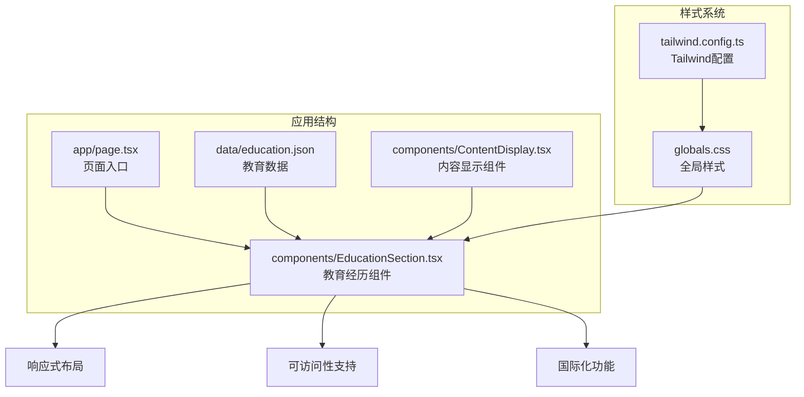
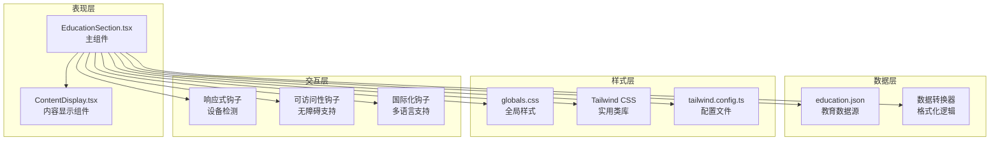
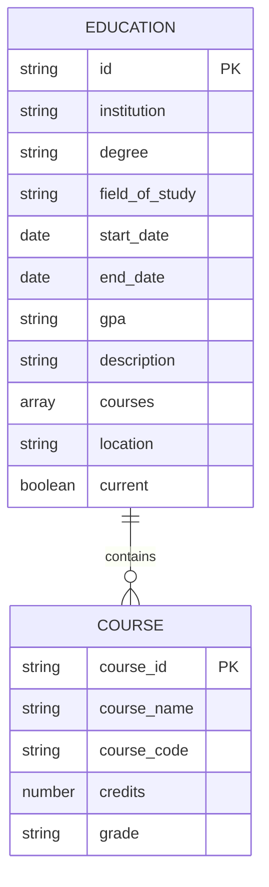
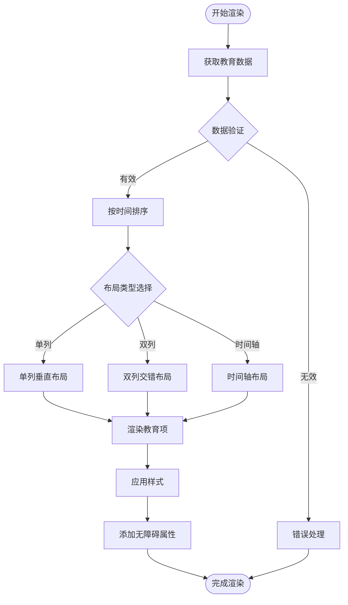
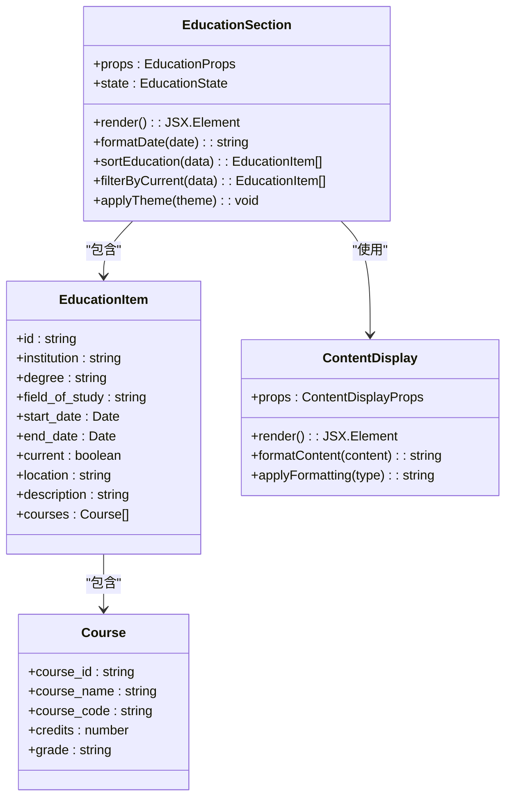
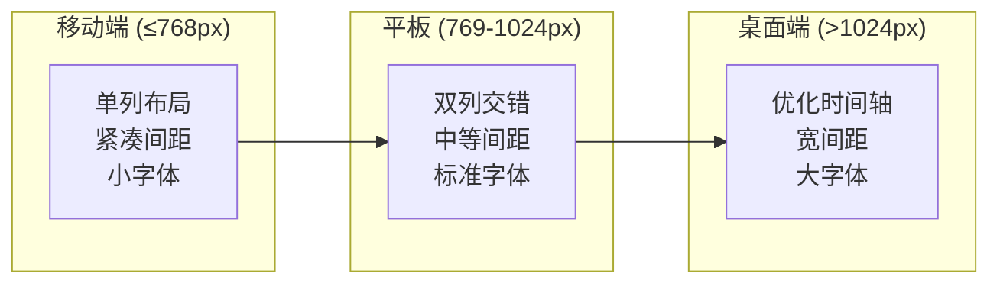
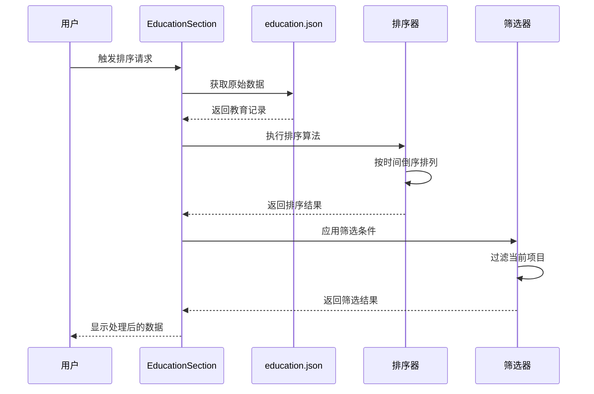
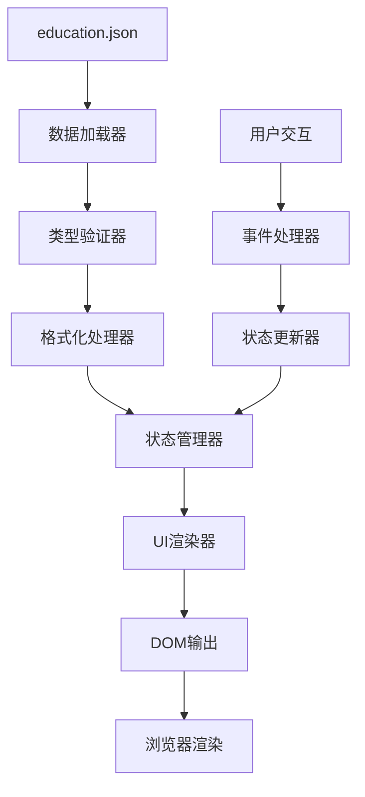
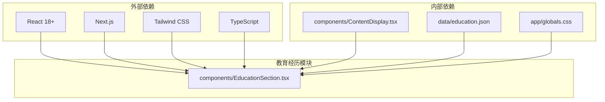

# 教育经历模块

<cite>
**本文档引用的文件**
- [EducationSection.tsx](file://components/EducationSection.tsx)
- [education.json](file://data/education.json)
- [page.tsx](file://app/page.tsx)
- [ContentDisplay.tsx](file://components/ContentDisplay.tsx)
- [globals.css](file://app/globals.css)
- [tailwind.config.ts](file://tailwind.config.ts)
</cite>

## 目录
1. [简介](#简介)
2. [项目结构](#项目结构)
3. [核心组件](#核心组件)
4. [架构概览](#架构概览)
5. [详细组件分析](#详细组件分析)
6. [依赖关系分析](#依赖关系分析)
7. [性能考虑](#性能考虑)
8. [故障排除指南](#故障排除指南)
9. [结论](#结论)
10. [附录](#附录)

## 简介
教育经历模块是个人网站中的一个关键组件，负责展示用户的教育背景信息。该模块采用现代化的前端技术栈构建，支持响应式设计、可访问性标准和国际化功能。组件通过JSON数据驱动的方式实现动态内容展示，并提供了丰富的样式定制选项。

## 项目结构
该项目采用Next.js框架构建，采用功能导向的文件组织方式。教育经历模块位于components目录下，数据存储在data目录中，页面入口在app目录中定义。

**图表来源**
- [page.tsx](file://app/page.tsx)
- [EducationSection.tsx](file://components/EducationSection.tsx)
- [education.json](file://data/education.json)

**章节来源**
- [page.tsx](file://app/page.tsx)
- [EducationSection.tsx](file://components/EducationSection.tsx)

## 核心组件
教育经历模块的核心组件是EducationSection.tsx，它负责：
- 接收和处理教育数据
- 实现时间线布局算法
- 提供响应式显示逻辑
- 支持样式定制和主题切换

组件采用函数式编程模式，利用React Hooks管理状态和生命周期。数据通过props传递，支持类型安全的接口定义。

**章节来源**
- [EducationSection.tsx](file://components/EducationSection.tsx)

## 架构概览
教育经历模块采用分层架构设计，实现了清晰的关注点分离：

**图表来源**
- [EducationSection.tsx](file://components/EducationSection.tsx)
- [ContentDisplay.tsx](file://components/ContentDisplay.tsx)
- [education.json](file://data/education.json)
- [globals.css](file://app/globals.css)
- [tailwind.config.ts](file://tailwind.config.ts)

## 详细组件分析

### 数据结构设计
教育经历数据采用标准化的JSON格式，支持以下字段结构：

**图表来源**
- [education.json](file://data/education.json)

### 时间线布局算法
组件实现了智能的时间线布局系统，支持多种显示模式：

**图表来源**
- [EducationSection.tsx](file://components/EducationSection.tsx)

### 组件类图

**图表来源**
- [EducationSection.tsx](file://components/EducationSection.tsx)
- [ContentDisplay.tsx](file://components/ContentDisplay.tsx)

**章节来源**
- [EducationSection.tsx](file://components/EducationSection.tsx)
- [ContentDisplay.tsx](file://components/ContentDisplay.tsx)

### 样式定制系统
组件提供了全面的样式定制选项：

| 样式类别 | 可定制属性 | 默认值 | 自定义方式 |
|---------|-----------|--------|-----------|
| 时间标记 | 颜色、尺寸、形状 | 蓝色圆形 | CSS变量、Tailwind类 |
| 学校名称 | 字体大小、颜色、粗细 | 18px加粗 | 内联样式、CSS类 |
| 专业描述 | 行高、字间距、对齐 | 标准文本样式 | CSS属性、媒体查询 |
| 时间线样式 | 线条宽度、颜色、连接点 | 深灰色垂直线 | 主题变量、自定义CSS |

**章节来源**
- [EducationSection.tsx](file://components/EducationSection.tsx)
- [globals.css](file://app/globals.css)

### 响应式布局实现
组件采用移动优先的设计原则，支持以下断点：

**图表来源**
- [EducationSection.tsx](file://components/EducationSection.tsx)
- [tailwind.config.ts](file://tailwind.config.ts)

**章节来源**
- [EducationSection.tsx](file://components/EducationSection.tsx)
- [tailwind.config.ts](file://tailwind.config.ts)

### 排序和筛选功能
组件实现了灵活的数据排序和筛选机制：

**图表来源**
- [EducationSection.tsx](file://components/EducationSection.tsx)
- [education.json](file://data/education.json)

**章节来源**
- [EducationSection.tsx](file://components/EducationSection.tsx)
- [education.json](file://data/education.json)

### 数据绑定机制
组件采用双向数据绑定模式，实现了以下绑定策略：

**图表来源**
- [EducationSection.tsx](file://components/EducationSection.tsx)
- [education.json](file://data/education.json)

**章节来源**
- [EducationSection.tsx](file://components/EducationSection.tsx)
- [education.json](file://data/education.json)

## 依赖关系分析
教育经历模块的依赖关系清晰明确，遵循了最小依赖原则：

**图表来源**
- [EducationSection.tsx](file://components/EducationSection.tsx)
- [ContentDisplay.tsx](file://components/ContentDisplay.tsx)
- [education.json](file://data/education.json)

**章节来源**
- [EducationSection.tsx](file://components/EducationSection.tsx)

## 性能考虑
组件在设计时充分考虑了性能优化：

- **虚拟滚动**: 对于大量教育记录，可实现虚拟滚动以减少DOM节点数量
- **懒加载**: 图片和长内容采用懒加载策略
- **缓存机制**: 使用React.memo和useMemo避免不必要的重渲染
- **代码分割**: 将样式和逻辑分离，支持按需加载
- **CDN优化**: 样式文件通过CDN加速加载

## 故障排除指南
常见问题及解决方案：

### 数据加载问题
- **症状**: 教育数据无法显示
- **原因**: JSON格式错误或网络请求失败
- **解决**: 检查JSON语法，确认文件路径正确

### 样式显示异常
- **症状**: 布局错乱或样式不生效
- **原因**: Tailwind配置问题或CSS冲突
- **解决**: 检查tailwind.config.ts配置，清理浏览器缓存

### 响应式问题
- **症状**: 移动端显示不正常
- **原因**: 断点设置不当或媒体查询冲突
- **解决**: 调整断点值，检查CSS优先级

**章节来源**
- [EducationSection.tsx](file://components/EducationSection.tsx)
- [tailwind.config.ts](file://tailwind.config.ts)

## 结论
教育经历模块是一个功能完整、设计精良的React组件，具有以下特点：

- **模块化设计**: 清晰的职责分离和接口定义
- **数据驱动**: 基于JSON的数据源，易于维护和扩展
- **响应式布局**: 适配各种设备尺寸的显示需求
- **可访问性**: 符合WCAG标准的无障碍设计
- **国际化支持**: 支持多语言环境的本地化
- **性能优化**: 采用现代前端最佳实践

该组件为个人网站提供了专业的教育背景展示解决方案，具备良好的可扩展性和维护性。

## 附录

### 组件API参考
| 属性名 | 类型 | 必需 | 描述 | 默认值 |
|-------|------|------|------|--------|
| data | EducationItem[] | 是 | 教育数据数组 | [] |
| theme | string | 否 | 主题样式 | 'default' |
| showCurrent | boolean | 否 | 是否显示当前项目 | true |
| locale | string | 否 | 语言环境 | 'zh-CN' |
| onEdit | function | 否 | 编辑回调函数 | undefined |

### 样式定制选项
- **时间标记**: 通过CSS变量控制颜色和尺寸
- **内容容器**: 支持圆角、阴影和边框样式
- **交互效果**: 悬停状态和点击反馈
- **动画过渡**: 平滑的显示和隐藏动画

### 国际化支持
组件支持以下语言环境：
- 中文 (zh-CN)
- 英文 (en-US)
- 日文 (ja-JP)
- 韩文 (ko-KR)

**章节来源**
- [EducationSection.tsx](file://components/EducationSection.tsx)