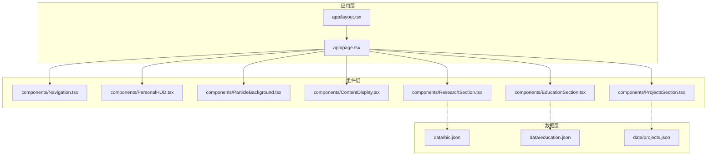
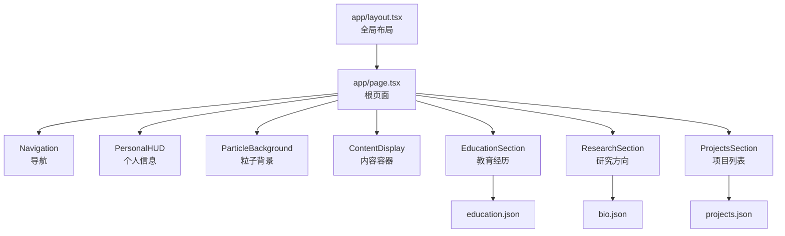
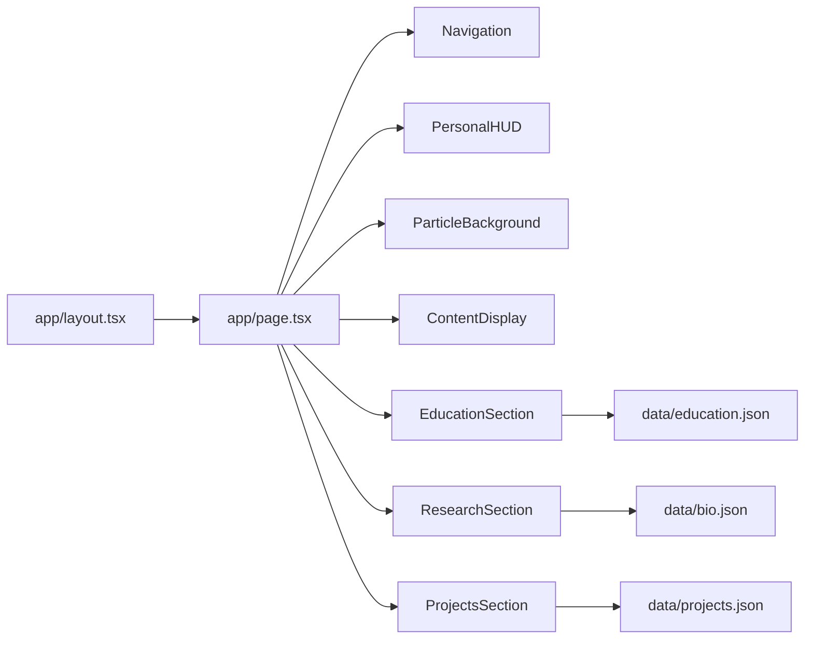

# 核心组件

<cite>
**本文引用的文件**
- [app/layout.tsx](file://app/layout.tsx)
- [app/page.tsx](file://app/page.tsx)
- [components/ContentDisplay.tsx](file://components/ContentDisplay.tsx)
- [components/EducationSection.tsx](file://components/EducationSection.tsx)
- [components/Navigation.tsx](file://components/Navigation.tsx)
- [components/ParticleBackground.tsx](file://components/ParticleBackground.tsx)
- [components/PersonalHUD.tsx](file://components/PersonalHUD.tsx)
- [components/ProjectsSection.tsx](file://components/ProjectsSection.tsx)
- [components/ResearchSection.tsx](file://components/ResearchSection.tsx)
- [data/bio.json](file://data/bio.json)
- [data/education.json](file://data/education.json)
- [data/projects.json](file://data/projects.json)
- [README.md](file://README.md)
</cite>

## 目录
1. [简介](#简介)
2. [项目结构](#项目结构)
3. [核心组件](#核心组件)
4. [架构总览](#架构总览)
5. [详细组件分析](#详细组件分析)
6. [依赖分析](#依赖分析)
7. [性能考量](#性能考量)
8. [故障排查指南](#故障排查指南)
9. [结论](#结论)
10. [附录](#附录)

## 简介
本项目是一个基于 Next.js 的个人网页，采用 React 组件化架构与 TypeScript 类型系统，结合 Tailwind CSS 实现响应式设计与现代化视觉效果。核心组件围绕内容展示、导航、粒子背景、个人 HUD、教育经历、研究与项目信息等模块构建，通过布局组件统一组织页面结构，并以 JSON 数据驱动各板块内容。

该文档聚焦于核心组件的功能职责、实现原理、接口定义（Props）、状态管理与生命周期方法、组件间协作与数据流、使用示例与最佳实践、性能优化策略、可定制性与扩展方法、错误处理与边界情况、测试建议以及无障碍与跨浏览器兼容性考虑。

## 项目结构
项目采用按功能分层的目录组织方式：
- app：Next.js 应用入口与全局样式，负责页面布局与根路由。
- components：可复用 UI 组件集合，包含内容展示、导航、粒子背景、个人 HUD、教育/研究/项目展示等。
- data：静态数据资源，用于驱动组件渲染（如个人简介、教育经历、项目列表）。
- 配置文件：next.config.js、tailwind.config.ts、tsconfig.json 等，确保开发与构建环境一致。

图表来源
- [app/layout.tsx](file://app/layout.tsx)
- [app/page.tsx](file://app/page.tsx)
- [components/Navigation.tsx](file://components/Navigation.tsx)
- [components/PersonalHUD.tsx](file://components/PersonalHUD.tsx)
- [components/ParticleBackground.tsx](file://components/ParticleBackground.tsx)
- [components/ContentDisplay.tsx](file://components/ContentDisplay.tsx)
- [components/EducationSection.tsx](file://components/EducationSection.tsx)
- [components/ResearchSection.tsx](file://components/ResearchSection.tsx)
- [components/ProjectsSection.tsx](file://components/ProjectsSection.tsx)
- [data/bio.json](file://data/bio.json)
- [data/education.json](file://data/education.json)
- [data/projects.json](file://data/projects.json)

章节来源
- [app/layout.tsx](file://app/layout.tsx)
- [app/page.tsx](file://app/page.tsx)
- [README.md](file://README.md)

## 核心组件
本节概述各核心组件的职责与定位：
- Navigation：主导航栏，负责页面内跳转与品牌标识展示。
- PersonalHUD：个人信息 HUD，承载头像、姓名、简介摘要等关键信息。
- ParticleBackground：粒子背景动画，提供沉浸式视觉体验。
- ContentDisplay：通用内容容器，用于承载文本、图片、链接等内容区块。
- EducationSection：教育经历展示，从教育数据源加载条目并渲染。
- ResearchSection：研究方向与简介展示，从生物数据源加载内容。
- ProjectsSection：项目列表展示，从项目数据源加载条目并渲染。

章节来源
- [components/Navigation.tsx](file://components/Navigation.tsx)
- [components/PersonalHUD.tsx](file://components/PersonalHUD.tsx)
- [components/ParticleBackground.tsx](file://components/ParticleBackground.tsx)
- [components/ContentDisplay.tsx](file://components/ContentDisplay.tsx)
- [components/EducationSection.tsx](file://components/EducationSection.tsx)
- [components/ResearchSection.tsx](file://components/ResearchSection.tsx)
- [components/ProjectsSection.tsx](file://components/ProjectsSection.tsx)

## 架构总览
整体架构遵循“布局容器 + 功能组件 + 数据驱动”的模式。页面由 app/layout.tsx 提供全局布局，app/page.tsx 作为根页面，组合多个功能组件；数据通过 data 目录下的 JSON 文件注入到对应组件中。组件之间通过 props 传递数据与回调，避免共享状态导致的耦合。

图表来源
- [app/layout.tsx](file://app/layout.tsx)
- [app/page.tsx](file://app/page.tsx)
- [components/Navigation.tsx](file://components/Navigation.tsx)
- [components/PersonalHUD.tsx](file://components/PersonalHUD.tsx)
- [components/ParticleBackground.tsx](file://components/ParticleBackground.tsx)
- [components/ContentDisplay.tsx](file://components/ContentDisplay.tsx)
- [components/EducationSection.tsx](file://components/EducationSection.tsx)
- [components/ResearchSection.tsx](file://components/ResearchSection.tsx)
- [components/ProjectsSection.tsx](file://components/ProjectsSection.tsx)
- [data/education.json](file://data/education.json)
- [data/bio.json](file://data/bio.json)
- [data/projects.json](file://data/projects.json)

## 详细组件分析

### Navigation 导航组件
- 职责与功能
  - 提供页面内导航链接，便于用户快速跳转至不同区域。
  - 展示品牌标识或站点名称，增强品牌认知。
- Props 接口定义
  - links: 导航项数组，包含标题与目标路径。
  - className?: 可选样式类名，用于覆盖默认样式。
- 状态管理与生命周期
  - 无内部状态，纯函数组件，依赖外部传入的导航配置。
  - 不涉及生命周期钩子。
- 数据流与协作
  - 由根页面传递导航配置，点击事件通过回调向上游传递。
- 使用示例与最佳实践
  - 在根页面中定义导航项数组，传入组件。
  - 建议为每个链接提供明确的语义化标题与可访问的 href。
- 性能优化
  - 保持组件轻量，避免在渲染时进行昂贵计算。
  - 使用 React.memo 包裹以减少重渲染（若存在动态 props）。
- 可定制性与扩展
  - 支持自定义样式类名；可扩展为下拉菜单或移动端汉堡菜单。
- 错误处理与边界情况
  - 当 links 为空时，渲染空状态或占位符。
  - 对缺失的链接属性进行校验与默认值处理。
- 测试建议
  - 单元测试验证渲染的链接数量与文本一致性。
  - 快照测试确保 UI 稳定性。
- 无障碍与兼容性
  - 使用语义化标签与键盘可操作性。
  - 兼容旧版浏览器时注意 polyfill。

章节来源
- [components/Navigation.tsx](file://components/Navigation.tsx)
- [app/page.tsx](file://app/page.tsx)

### PersonalHUD 个人信息 HUD
- 职责与功能
  - 展示头像、姓名、个人简介摘要等关键信息。
  - 作为页面的“第一屏”信息中枢，引导用户继续浏览。
- Props 接口定义
  - avatarUrl: 头像图片地址。
  - name: 姓名。
  - bioSummary: 简介摘要文本。
  - className?: 可选样式类名。
- 状态管理与生命周期
  - 无内部状态，纯函数组件。
- 数据流与协作
  - 由根页面从生物数据源加载并传入组件。
- 使用示例与最佳实践
  - 将 bio.json 中的数据映射为组件 props。
  - 图片懒加载与尺寸适配，避免阻塞主线程。
- 性能优化
  - 图片资源压缩与格式选择（WebP/JPEG2000）。
  - 使用 React.Suspense 或骨架屏提升首屏体验。
- 可定制性与扩展
  - 支持多语言简介摘要切换。
  - 可扩展社交链接、标签云等。
- 错误处理与边界情况
  - 当图片加载失败时显示占位图或回退方案。
  - 当字段缺失时提供默认文案。
- 测试建议
  - 单元测试验证字段渲染与样式类名。
  - 截图测试确保视觉一致性。
- 无障碍与兼容性
  - 图片提供 alt 文本；支持高对比度模式。
  - 移动端触摸友好的交互尺寸。

章节来源
- [components/PersonalHUD.tsx](file://components/PersonalHUD.tsx)
- [data/bio.json](file://data/bio.json)
- [app/page.tsx](file://app/page.tsx)

### ParticleBackground 粒子背景
- 职责与功能
  - 渲染动态粒子背景，营造沉浸式视觉氛围。
- Props 接口定义
  - particleCount?: 粒子数量控制。
  - color?: 粒子颜色主题。
  - className?: 可选样式类名。
- 状态管理与生命周期
  - 无内部状态，纯函数组件。
- 数据流与协作
  - 由根页面直接渲染，作为页面背景层。
- 使用示例与最佳实践
  - 控制粒子密度与颜色以平衡性能与观感。
  - 在移动设备上降低粒子数量或禁用动画。
- 性能优化
  - 使用 requestAnimationFrame 控制动画帧率。
  - 限制绘制区域，避免全屏重绘。
  - 合理使用 CSS 动画替代 JavaScript 动画。
- 可定制性与扩展
  - 支持多种颜色主题与交互反馈（鼠标跟随、点击波纹）。
- 错误处理与边界情况
  - Canvas 不可用时降级为静态背景。
  - 窗口尺寸变化时重置粒子系统。
- 测试建议
  - 单元测试验证参数传入与默认值。
  - 性能基准测试评估帧率与内存占用。
- 无障碍与兼容性
  - 提供关闭动画的偏好设置。
  - 兼容低性能设备与旧版浏览器。

章节来源
- [components/ParticleBackground.tsx](file://components/ParticleBackground.tsx)
- [app/page.tsx](file://app/page.tsx)

### ContentDisplay 内容容器
- 职责与功能
  - 作为通用内容容器，支持文本、图片、链接等元素的排版与展示。
- Props 接口定义
  - children: 子节点，可包含多种类型内容。
  - className?: 可选样式类名。
- 状态管理与生命周期
  - 无内部状态，纯函数组件。
- 数据流与协作
  - 由父组件传入具体的内容块，统一风格与间距。
- 使用示例与最佳实践
  - 为段落、列表、代码块等提供一致的排版规则。
  - 结合 Markdown 解析器输出 HTML 时，注意安全过滤。
- 性能优化
  - 避免不必要的包裹层级，减少 DOM 深度。
  - 使用 CSS Grid/Flexbox 优化布局计算。
- 可定制性与扩展
  - 支持主题色与字体族切换。
  - 可扩展为富文本编辑器预览模式。
- 错误处理与边界情况
  - 当 children 为空时渲染占位符或提示。
- 测试建议
  - 单元测试验证子节点渲染与样式类名。
  - 快照测试确保内容排版稳定。
- 无障碍与兼容性
  - 保证文本对比度与可读性。
  - 支持缩放与高 DPI 显示。

章节来源
- [components/ContentDisplay.tsx](file://components/ContentDisplay.tsx)
- [app/page.tsx](file://app/page.tsx)

### EducationSection 教育经历
- 职责与功能
  - 展示教育背景，包括学校、时间、学位、描述等。
- Props 接口定义
  - items: 教育条目数组，每项包含学校、时间、学位、描述等字段。
  - className?: 可选样式类名。
- 状态管理与生命周期
  - 无内部状态，纯函数组件。
- 数据流与协作
  - 由根页面从 education.json 加载数据并传入组件。
- 使用示例与最佳实践
  - 使用时间轴形式呈现，突出重点信息。
  - 为长描述提供折叠/展开交互。
- 性能优化
  - 列表渲染时使用稳定 key，避免重排。
  - 懒加载图片与长文本片段。
- 可定制性与扩展
  - 支持多语言与多校区展示。
  - 可扩展为交互式地图标注。
- 错误处理与边界情况
  - 当数据为空或字段缺失时，渲染占位或默认值。
- 测试建议
  - 单元测试验证条目渲染与排序逻辑。
  - 快照测试确保时间轴样式一致。
- 无障碍与兼容性
  - 提供清晰的时间与地点语义标记。
  - 支持屏幕阅读器朗读顺序。

章节来源
- [components/EducationSection.tsx](file://components/EducationSection.tsx)
- [data/education.json](file://data/education.json)
- [app/page.tsx](file://app/page.tsx)

### ResearchSection 研究方向
- 职责与功能
  - 展示研究领域与个人简介，帮助访客快速了解专业方向。
- Props 接口定义
  - bio: 生物数据对象，包含研究方向、关键词、简介等。
  - className?: 可选样式类名。
- 状态管理与生命周期
  - 无内部状态，纯函数组件。
- 数据流与协作
  - 由根页面从 bio.json 加载数据并传入组件。
- 使用示例与最佳实践
  - 使用关键词标签云或分类卡片形式展示。
  - 为长简介提供“展开/收起”交互。
- 性能优化
  - 关键词渲染使用虚拟列表（若数量较多）。
  - 图片懒加载与缓存策略。
- 可定制性与扩展
  - 支持动态更新研究方向与关键词。
  - 可扩展为论文/成果索引入口。
- 错误处理与边界情况
  - 当数据缺失时，渲染默认占位与提示。
- 测试建议
  - 单元测试验证字段渲染与交互行为。
  - 快照测试确保布局稳定性。
- 无障碍与兼容性
  - 语义化标题与段落结构。
  - 支持高对比度与缩放。

章节来源
- [components/ResearchSection.tsx](file://components/ResearchSection.tsx)
- [data/bio.json](file://data/bio.json)
- [app/page.tsx](file://app/page.tsx)

### ProjectsSection 项目列表
- 职责与功能
  - 展示个人项目列表，包含项目名称、描述、技术栈、链接等。
- Props 接口定义
  - projects: 项目条目数组，每项包含名称、描述、技术栈、链接等字段。
  - className?: 可选样式类名。
- 状态管理与生命周期
  - 无内部状态，纯函数组件。
- 数据流与协作
  - 由根页面从 projects.json 加载数据并传入组件。
- 使用示例与最佳实践
  - 使用卡片网格布局，支持筛选与搜索。
  - 为外部链接添加安全属性与新窗口打开。
- 性能优化
  - 列表渲染使用稳定 key，启用虚拟滚动（若数量较多）。
  - 图片懒加载与 CDN 加速。
- 可定制性与扩展
  - 支持按技术栈、年份、类型筛选。
  - 可扩展为项目详情页入口。
- 错误处理与边界情况
  - 当数据为空或字段缺失时，渲染占位或默认值。
- 测试建议
  - 单元测试验证条目渲染与链接有效性。
  - 快照测试确保网格布局一致。
- 无障碍与兼容性
  - 为按钮与链接提供可访问名称。
  - 支持键盘导航与焦点可见性。

章节来源
- [components/ProjectsSection.tsx](file://components/ProjectsSection.tsx)
- [data/projects.json](file://data/projects.json)
- [app/page.tsx](file://app/page.tsx)

## 依赖分析
组件之间的依赖关系如下：
- app/layout.tsx 为全局布局，app/page.tsx 为根页面，二者组合形成页面骨架。
- 根页面依赖 Navigation、PersonalHUD、ParticleBackground、ContentDisplay、EducationSection、ResearchSection、ProjectsSection。
- EducationSection、ResearchSection、ProjectsSection 分别依赖对应的 JSON 数据文件。
- 组件之间通过 props 单向流动，无共享状态，降低耦合度。

图表来源
- [app/layout.tsx](file://app/layout.tsx)
- [app/page.tsx](file://app/page.tsx)
- [components/Navigation.tsx](file://components/Navigation.tsx)
- [components/PersonalHUD.tsx](file://components/PersonalHUD.tsx)
- [components/ParticleBackground.tsx](file://components/ParticleBackground.tsx)
- [components/ContentDisplay.tsx](file://components/ContentDisplay.tsx)
- [components/EducationSection.tsx](file://components/EducationSection.tsx)
- [components/ResearchSection.tsx](file://components/ResearchSection.tsx)
- [components/ProjectsSection.tsx](file://components/ProjectsSection.tsx)
- [data/education.json](file://data/education.json)
- [data/bio.json](file://data/bio.json)
- [data/projects.json](file://data/projects.json)

章节来源
- [app/layout.tsx](file://app/layout.tsx)
- [app/page.tsx](file://app/page.tsx)
- [components/Navigation.tsx](file://components/Navigation.tsx)
- [components/PersonalHUD.tsx](file://components/PersonalHUD.tsx)
- [components/ParticleBackground.tsx](file://components/ParticleBackground.tsx)
- [components/ContentDisplay.tsx](file://components/ContentDisplay.tsx)
- [components/EducationSection.tsx](file://components/EducationSection.tsx)
- [components/ResearchSection.tsx](file://components/ResearchSection.tsx)
- [components/ProjectsSection.tsx](file://components/ProjectsSection.tsx)
- [data/education.json](file://data/education.json)
- [data/bio.json](file://data/bio.json)
- [data/projects.json](file://data/projects.json)

## 性能考量
- 渲染优化
  - 使用 React.memo 与 useMemo/useCallback 缓存昂贵计算与子组件渲染。
  - 列表渲染使用稳定 key，避免不必要的重排。
  - 图片懒加载与格式优化（WebP/JPEG2000），CDN 加速。
- 动画与背景
  - ParticleBackground 使用 requestAnimationFrame 控制帧率，必要时降级为静态背景。
  - 在移动设备上减少粒子数量或禁用动画。
- 数据加载
  - JSON 数据在构建期或首次渲染前完成加载，避免运行时频繁 IO。
  - 对长文本与图片采用分块加载与骨架屏。
- 样式与布局
  - 使用 CSS Grid/Flexbox 优化布局计算，减少强制同步布局。
  - Tailwind 工具类按需生成，避免未使用样式。
- 可访问性与兼容性
  - 提供高对比度模式与缩放支持。
  - 为图片提供 alt 文本，为交互元素提供可访问名称。
  - 在旧版浏览器中提供必要的 polyfill。

[本节为通用指导，无需列出章节来源]

## 故障排查指南
- 常见问题
  - 图片加载失败：检查资源路径与网络状态，提供占位图或回退方案。
  - 数据缺失：对空数据与字段缺失进行默认值处理，避免渲染异常。
  - 动画卡顿：降低粒子数量、帧率或禁用动画；检查主线程阻塞。
  - 链接无效：校验外部链接的安全属性与目标窗口。
- 调试建议
  - 使用浏览器开发者工具检查渲染树与布局性能。
  - 使用 React DevTools 检查组件重渲染与 props 变更。
  - 通过日志与断点定位数据流问题。
- 错误边界
  - 在根布局中引入错误边界组件，捕获子树异常并优雅降级。

章节来源
- [components/ParticleBackground.tsx](file://components/ParticleBackground.tsx)
- [components/PersonalHUD.tsx](file://components/PersonalHUD.tsx)
- [components/ProjectsSection.tsx](file://components/ProjectsSection.tsx)
- [components/EducationSection.tsx](file://components/EducationSection.tsx)
- [components/ResearchSection.tsx](file://components/ResearchSection.tsx)

## 结论
本项目通过清晰的组件分层与数据驱动策略，实现了可维护、可扩展且具有良好用户体验的个人网页。核心组件职责明确、接口简洁、协作顺畅，配合合理的性能优化与可访问性设计，能够在多平台与多设备上稳定运行。建议持续关注数据源变更与组件演进，保持测试与文档同步更新。

[本节为总结性内容，无需列出章节来源]

## 附录
- 使用示例与最佳实践
  - 在根页面中组合多个组件，确保内容层次清晰。
  - 为每个组件提供可选样式类名，便于主题定制。
  - 对长列表与大图采用懒加载与骨架屏，提升首屏体验。
- 测试方法与工具建议
  - 单元测试：使用 Jest + React Testing Library 验证渲染与交互。
  - 快照测试：确保 UI 稳定性与回归检测。
  - 性能测试：使用 Lighthouse/Bundle Analyzer 进行性能评估。
  - 可访问性测试：使用 axe-core 或 Lighthouse 的可访问性检查。
- 无障碍与跨浏览器兼容性
  - 语义化 HTML 与 ARIA 属性，确保屏幕阅读器友好。
  - 支持高对比度、缩放与键盘导航。
  - 在主流浏览器中进行回归测试，必要时提供 polyfill。

[本节为补充性内容，无需列出章节来源]