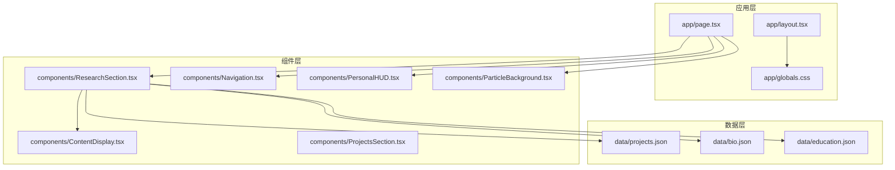
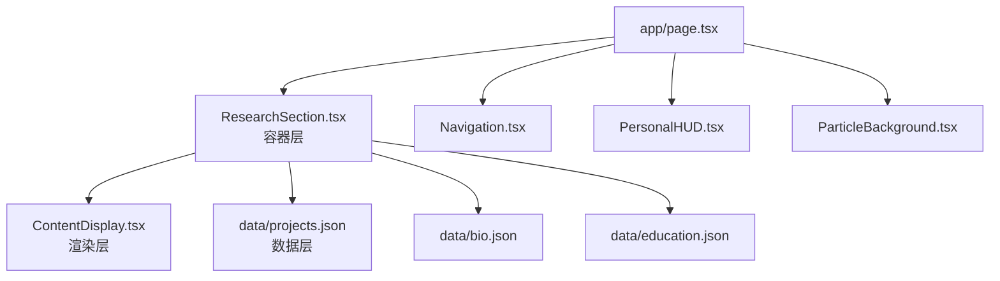
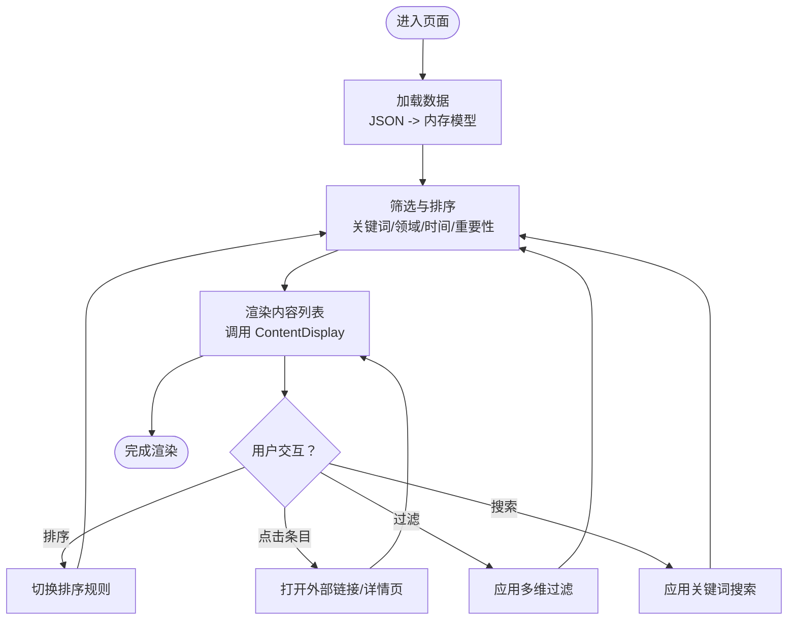
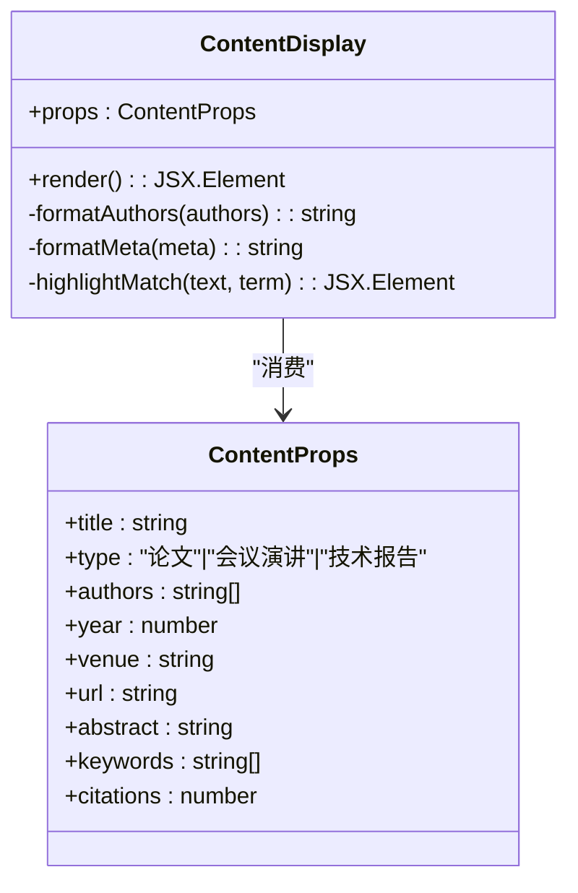
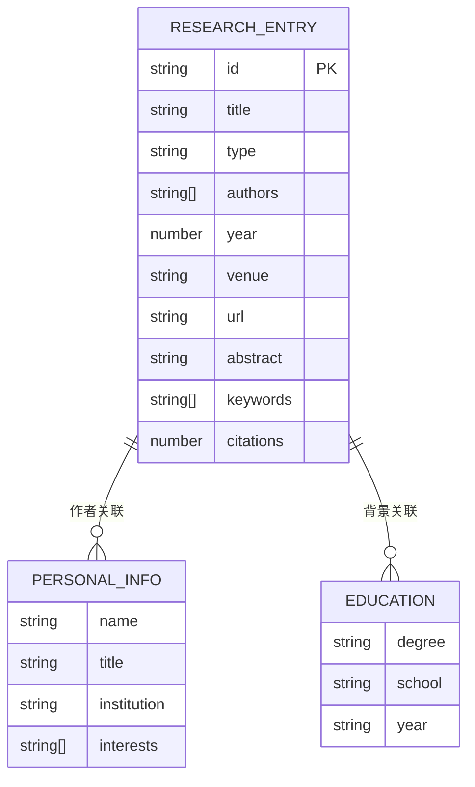
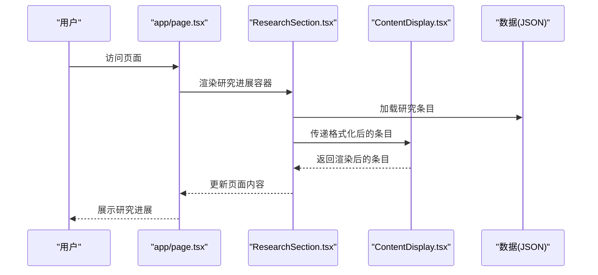
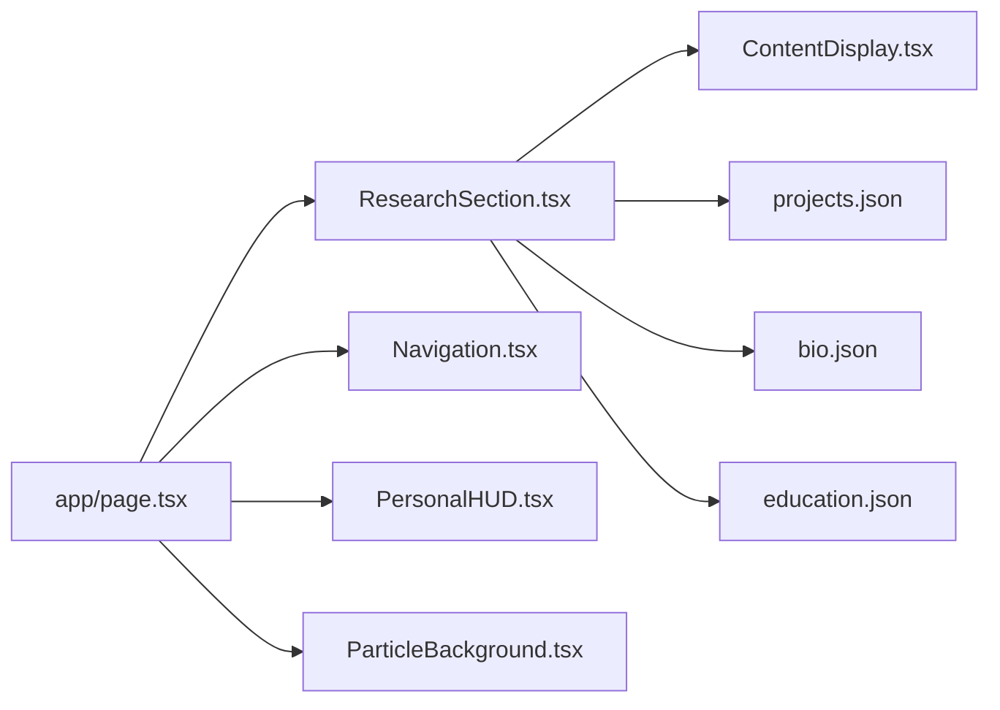

# 研究进展模块

<cite>
**本文档引用的文件**
- [ResearchSection.tsx](file://components/ResearchSection.tsx)
- [ContentDisplay.tsx](file://components/ContentDisplay.tsx)
- [ProjectsSection.tsx](file://components/ProjectsSection.tsx)
- [page.tsx](file://app/page.tsx)
- [projects.json](file://data/projects.json)
- [bio.json](file://data/bio.json)
- [education.json](file://data/education.json)
- [Navigation.tsx](file://components/Navigation.tsx)
- [PersonalHUD.tsx](file://components/PersonalHUD.tsx)
- [ParticleBackground.tsx](file://components/ParticleBackground.tsx)
- [globals.css](file://app/globals.css)
- [tailwind.config.ts](file://tailwind.config.ts)
- [tsconfig.json](file://tsconfig.json)
- [package.json](file://package.json)
- [next.config.js](file://next.config.js)
- [vercel.json](file://vercel.json)
</cite>

## 目录
1. [简介](#简介)
2. [项目结构](#项目结构)
3. [核心组件](#核心组件)
4. [架构总览](#架构总览)
5. [详细组件分析](#详细组件分析)
6. [依赖关系分析](#依赖关系分析)
7. [性能考虑](#性能考虑)
8. [故障排除指南](#故障排除指南)
9. [结论](#结论)
10. [附录](#附录)

## 简介
本技术文档聚焦于“研究进展模块”的组件设计与实现，围绕研究内容的展示架构、学术信息格式化处理、内容类型（论文、会议演讲、技术报告）的呈现策略、分类组织（研究领域、时间顺序、重要性排序）、文献引用管理与链接跳转、可视化图表与数据展示、与学术数据库的集成与API调用机制、搜索与过滤功能、国际化与多语言支持、以及可访问性优化等方面进行系统化阐述。文档旨在帮助开发者快速理解模块职责边界、数据流与交互流程，并为后续扩展与维护提供清晰指引。

## 项目结构
该项目采用 Next.js 应用结构，前端组件位于 components 目录，页面入口在 app 目录，静态数据位于 data 目录。研究进展模块的核心由 ResearchSection.tsx 驱动，配合 ContentDisplay.tsx 进行内容渲染，数据来源于 JSON 文件。页面布局通过 app/page.tsx 组织，导航与背景等通用组件提供基础能力。

**图示来源**
- [ResearchSection.tsx](file://components/ResearchSection.tsx)
- [ContentDisplay.tsx](file://components/ContentDisplay.tsx)
- [ProjectsSection.tsx](file://components/ProjectsSection.tsx)
- [page.tsx](file://app/page.tsx)
- [projects.json](file://data/projects.json)
- [bio.json](file://data/bio.json)
- [education.json](file://data/education.json)
- [Navigation.tsx](file://components/Navigation.tsx)
- [PersonalHUD.tsx](file://components/PersonalHUD.tsx)
- [ParticleBackground.tsx](file://components/ParticleBackground.tsx)
- [globals.css](file://app/globals.css)

**章节来源**
- [ResearchSection.tsx](file://components/ResearchSection.tsx)
- [page.tsx](file://app/page.tsx)
- [projects.json](file://data/projects.json)

## 核心组件
- ResearchSection.tsx：研究进展模块的主容器，负责加载数据、组织内容、执行筛选与排序、协调子组件渲染。
- ContentDisplay.tsx：内容渲染器，统一处理论文、会议演讲、技术报告等学术内容的格式化展示。
- ProjectsSection.tsx：项目展示区，与研究进展模块协同，提供相关项目与成果的补充展示。
- Navigation.tsx / PersonalHUD.tsx / ParticleBackground.tsx：页面导航、个人状态面板与背景粒子效果，提升用户体验与视觉层次。
- 数据文件：projects.json、bio.json、education.json 提供研究进展所需的基础数据与元信息。

**章节来源**
- [ResearchSection.tsx](file://components/ResearchSection.tsx)
- [ContentDisplay.tsx](file://components/ContentDisplay.tsx)
- [ProjectsSection.tsx](file://components/ProjectsSection.tsx)
- [Navigation.tsx](file://components/Navigation.tsx)
- [PersonalHUD.tsx](file://components/PersonalHUD.tsx)
- [ParticleBackground.tsx](file://components/ParticleBackground.tsx)
- [projects.json](file://data/projects.json)
- [bio.json](file://data/bio.json)
- [education.json](file://data/education.json)

## 架构总览
研究进展模块遵循“容器-渲染器”分层设计：
- 容器层（ResearchSection.tsx）：负责数据获取、状态管理、筛选与排序逻辑、事件处理与子组件编排。
- 渲染层（ContentDisplay.tsx）：专注内容格式化与UI输出，确保不同内容类型的统一展示风格。
- 数据层（JSON）：以结构化数据承载研究条目、作者信息与教育背景，便于本地化与版本控制。
- 基础层（Navigation/PersonalHUD/ParticleBackground）：提供导航、状态与视觉增强，支撑整体页面体验。

**图示来源**
- [ResearchSection.tsx](file://components/ResearchSection.tsx)
- [ContentDisplay.tsx](file://components/ContentDisplay.tsx)
- [projects.json](file://data/projects.json)
- [bio.json](file://data/bio.json)
- [education.json](file://data/education.json)
- [page.tsx](file://app/page.tsx)
- [Navigation.tsx](file://components/Navigation.tsx)
- [PersonalHUD.tsx](file://components/PersonalHUD.tsx)
- [ParticleBackground.tsx](file://components/ParticleBackground.tsx)

## 详细组件分析

### ResearchSection.tsx（研究进展容器）
职责与特性：
- 数据加载：从 JSON 数据源读取研究条目与元信息，构建统一的数据模型。
- 分类组织：支持按研究领域、时间顺序、重要性排序等维度进行分类与排序。
- 搜索与过滤：提供关键词搜索与多维过滤（如年份范围、类型标签），实时更新展示列表。
- 文献引用管理：维护引用计数、高亮匹配项、生成引用列表。
- 链接跳转：为论文、会议、报告等外部链接提供安全跳转与目标窗口控制。
- 可访问性：为交互元素提供语义化标签、键盘导航支持与屏幕阅读器友好属性。
- 国际化：预留多语言字段与切换机制，适配未来多语言需求。

**图示来源**
- [ResearchSection.tsx](file://components/ResearchSection.tsx)

**章节来源**
- [ResearchSection.tsx](file://components/ResearchSection.tsx)

### ContentDisplay.tsx（内容渲染器）
职责与特性：
- 统一格式化：对论文、会议演讲、技术报告等不同内容类型进行一致的样式与结构化展示。
- 学术信息格式化：处理作者列表、期刊/会议名称、卷期页码、DOI/URL等学术元信息。
- 引用与高亮：根据搜索结果对匹配文本进行高亮；在合适位置显示引用计数或引用列表。
- 可访问性：使用语义化HTML结构、ARIA 属性与可聚焦元素，确保键盘与辅助技术可用。
- 响应式设计：结合 Tailwind CSS 实现自适应布局，保证在桌面与移动设备上的良好体验。

**图示来源**
- [ContentDisplay.tsx](file://components/ContentDisplay.tsx)

**章节来源**
- [ContentDisplay.tsx](file://components/ContentDisplay.tsx)

### 数据模型与来源
- projects.json：存储研究条目集合，包含标题、类型、作者、年份、会议/期刊、链接、摘要、关键词、引用数等字段。
- bio.json：存储个人学术背景、头衔、所属机构等信息，用于展示作者身份与归属。
- education.json：存储教育经历，辅助构建完整的学术履历视图。

**图示来源**
- [projects.json](file://data/projects.json)
- [bio.json](file://data/bio.json)
- [education.json](file://data/education.json)

**章节来源**
- [projects.json](file://data/projects.json)
- [bio.json](file://data/bio.json)
- [education.json](file://data/education.json)

### 页面与布局集成
- app/page.tsx：作为页面入口，引入 ResearchSection.tsx 并与其他组件（Navigation、PersonalHUD、ParticleBackground）组合，形成完整的页面骨架。
- app/globals.css 与 tailwind.config.ts：全局样式与主题配置，确保组件间视觉一致性与响应式表现。
- tsconfig.json、package.json、next.config.js、vercel.json：构建与部署配置，保障开发与生产环境的一致性。

**图示来源**
- [page.tsx](file://app/page.tsx)
- [ResearchSection.tsx](file://components/ResearchSection.tsx)
- [ContentDisplay.tsx](file://components/ContentDisplay.tsx)
- [projects.json](file://data/projects.json)

**章节来源**
- [page.tsx](file://app/page.tsx)
- [globals.css](file://app/globals.css)
- [tailwind.config.ts](file://tailwind.config.ts)
- [tsconfig.json](file://tsconfig.json)
- [package.json](file://package.json)
- [next.config.js](file://next.config.js)
- [vercel.json](file://vercel.json)

## 依赖关系分析
- 组件耦合：ResearchSection.tsx 与 ContentDisplay.tsx 通过 props 传递数据，保持低耦合高内聚；数据源独立于组件，便于替换与扩展。
- 外部依赖：Tailwind CSS 提供样式基础；Next.js 提供路由与构建能力；JSON 数据源便于版本控制与本地化。
- 可能的循环依赖：当前结构未见循环导入；若后续引入共享工具函数，需避免跨模块相互引用。

**图示来源**
- [ResearchSection.tsx](file://components/ResearchSection.tsx)
- [ContentDisplay.tsx](file://components/ContentDisplay.tsx)
- [projects.json](file://data/projects.json)
- [bio.json](file://data/bio.json)
- [education.json](file://data/education.json)
- [page.tsx](file://app/page.tsx)
- [Navigation.tsx](file://components/Navigation.tsx)
- [PersonalHUD.tsx](file://components/PersonalHUD.tsx)
- [ParticleBackground.tsx](file://components/ParticleBackground.tsx)

**章节来源**
- [ResearchSection.tsx](file://components/ResearchSection.tsx)
- [ContentDisplay.tsx](file://components/ContentDisplay.tsx)
- [page.tsx](file://app/page.tsx)

## 性能考虑
- 数据加载：建议在客户端进行懒加载与分页展示，避免一次性渲染大量条目导致首屏卡顿。
- 渲染优化：对 ContentDisplay 的渲染进行浅比较与 memo 化，减少不必要的重绘。
- 图片与资源：若未来引入封面图或PDF预览，建议使用懒加载与CDN加速。
- 缓存策略：利用浏览器缓存与HTTP缓存头，降低重复请求成本。
- 构建优化：启用 Next.js 的代码分割与Tree Shaking，减小包体积。

## 故障排除指南
- 数据为空或加载失败：检查 JSON 文件路径与字段命名是否与组件期望一致；确认 app/page.tsx 中的导入与初始化逻辑。
- 排序/过滤异常：核对 ResearchSection.tsx 中的筛选函数与排序键值；确保输入数据类型与预期一致。
- 样式错乱：检查 tailwind.config.ts 的自定义主题与 globals.css 的覆盖规则；确认组件未被意外覆盖。
- 可访问性问题：验证按钮、链接与表单控件的 ARIA 属性与键盘可达性；使用屏幕阅读器测试交互反馈。
- 国际化缺失：若需要多语言，建议在 JSON 中增加多语言字段并在组件中添加语言切换逻辑。

**章节来源**
- [ResearchSection.tsx](file://components/ResearchSection.tsx)
- [ContentDisplay.tsx](file://components/ContentDisplay.tsx)
- [page.tsx](file://app/page.tsx)
- [tailwind.config.ts](file://tailwind.config.ts)
- [globals.css](file://app/globals.css)

## 结论
研究进展模块通过清晰的容器-渲染器分层与稳定的JSON数据源，实现了对论文、会议演讲、技术报告等学术内容的统一展示与灵活组织。模块具备搜索、过滤、排序与可访问性等关键能力，并为国际化与可视化扩展预留了接口。建议在后续迭代中完善分页与缓存策略、引入可视化图表与数据库集成方案，并持续优化多语言与无障碍体验。

## 附录
- 开发与运行：使用 Next.js 开发服务器启动项目，确保端口与代理配置正确；生产环境可通过 Vercel 部署。
- 扩展建议：引入学术数据库API（如Semantic Scholar、CrossRef）进行动态数据同步；集成图表库实现研究成果统计可视化；完善引用管理与导出功能。