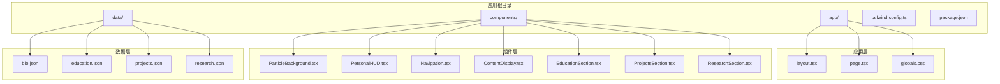
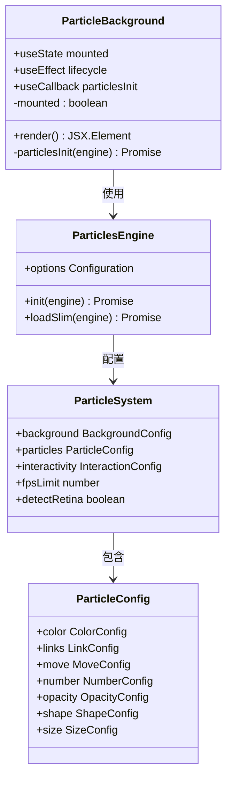
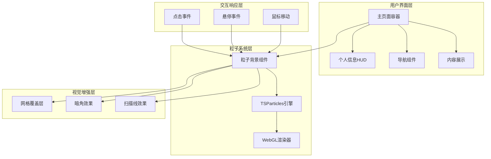
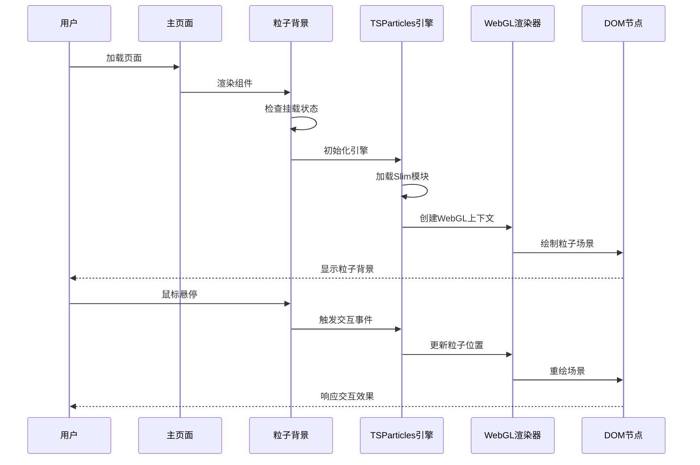
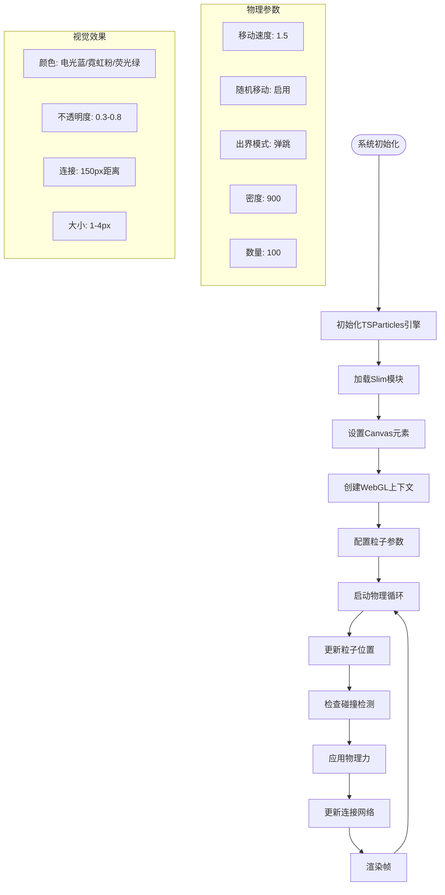
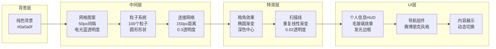
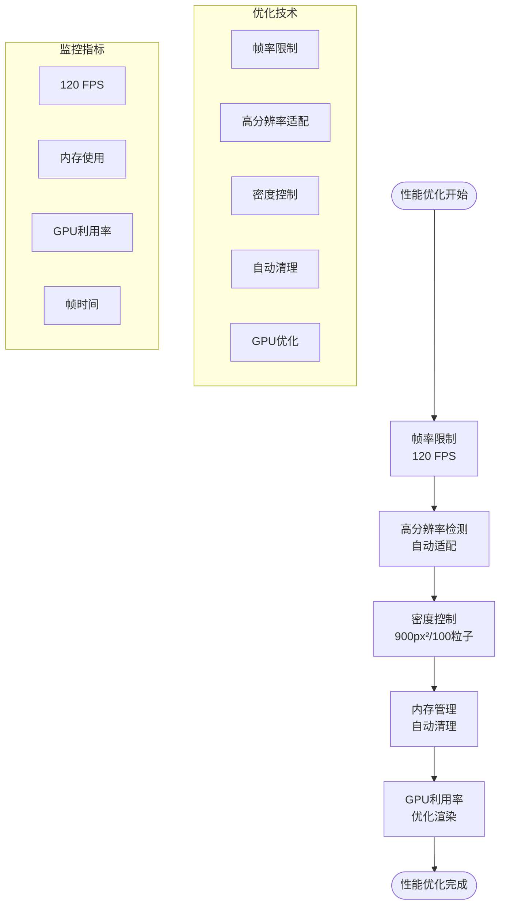
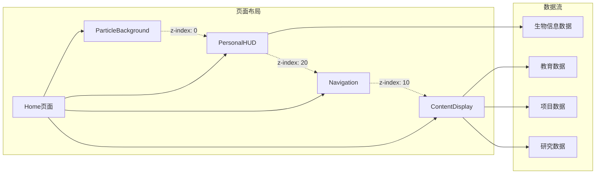

# 粒子背景系统

<cite>
**本文档引用的文件**
- [ParticleBackground.tsx](file://杨天成个人网页/components/ParticleBackground.tsx)
- [page.tsx](file://杨天成个人网页/app/page.tsx)
- [PersonalHUD.tsx](file://杨天成个人网页/components/PersonalHUD.tsx)
- [tailwind.config.ts](file://杨天成个人网页/tailwind.config.ts)
- [package.json](file://杨天成个人网页/package.json)
- [README.md](file://杨天成个人网页/README.md)
</cite>

## 目录
1. [简介](#简介)
2. [项目结构](#项目结构)
3. [核心组件](#核心组件)
4. [架构概览](#架构概览)
5. [详细组件分析](#详细组件分析)
6. [依赖关系分析](#依赖关系分析)
7. [性能考虑](#性能考虑)
8. [故障排除指南](#故障排除指南)
9. [结论](#结论)
10. [附录](#附录)

## 简介

粒子背景系统是基于 react-tsparticles 库构建的高性能 WebGL 粒子动画组件，专为赛博朋克风格的个人主页设计。该系统实现了流畅的粒子物理模拟、实时交互响应和视觉特效增强，为用户提供沉浸式的数字全息体验。

系统采用现代前端技术栈，结合 TypeScript 类型安全、React Hooks 生命周期管理和 Tailwind CSS 实用优先的样式体系，确保了代码的可维护性和视觉效果的一致性。

## 项目结构

该项目采用 Next.js App Router 架构，主要目录结构如下：



**图表来源**
- [package.json:1-30](file://杨天成个人网页/package.json#L1-L30)
- [README.md:146-169](file://杨天成个人网页/README.md#L146-L169)

**章节来源**
- [README.md:146-169](file://杨天成个人网页/README.md#L146-L169)
- [package.json:1-30](file://杨天成个人网页/package.json#L1-L30)

## 核心组件

### 粒子背景组件架构

粒子背景系统的核心实现位于 `ParticleBackground.tsx` 文件中，采用以下架构模式：



**图表来源**
- [ParticleBackground.tsx:8-126](file://杨天成个人网页/components/ParticleBackground.tsx#L8-L126)

### 核心配置参数详解

系统提供了丰富的配置选项，涵盖视觉效果、物理模拟和交互响应三个维度：

**背景配置**
- 背景色值：深空蓝黑色 `#0a0a0f`
- 检测高分辨率屏幕：启用以获得更清晰的渲染效果

**粒子属性配置**
- 颜色方案：电光蓝、霓虹粉、荧光绿三种动态颜色
- 形状类型：圆形粒子
- 大小范围：1-4像素半径
- 不透明度：0.3-0.8范围内的动画效果
- 数量密度：每900平方像素容纳约100个粒子

**物理模拟配置**
- 移动速度：1.5像素/帧
- 出界模式：弹跳效果
- 随机移动：启用随机方向变化
- 直线移动：禁用直线运动

**连接网络配置**
- 连接距离：150像素
- 连接颜色：电光蓝
- 连接透明度：0.3
- 连接宽度：1像素

**章节来源**
- [ParticleBackground.tsx:27-103](file://杨天成个人网页/components/ParticleBackground.tsx#L27-L103)

## 架构概览

### 系统架构图



**图表来源**
- [page.tsx:16-58](file://杨天成个人网页/app/page.tsx#L16-L58)
- [ParticleBackground.tsx:21-125](file://杨天成个人网页/components/ParticleBackground.tsx#L21-L125)

### 渲染流程图



**图表来源**
- [ParticleBackground.tsx:15-17](file://杨天成个人网页/components/ParticleBackground.tsx#L15-L17)
- [ParticleBackground.tsx:21-104](file://杨天成个人网页/components/ParticleBackground.tsx#L21-L104)

## 详细组件分析

### 粒子物理模拟系统

#### 物理引擎架构



**图表来源**
- [ParticleBackground.tsx:49-79](file://杨天成个人网页/components/ParticleBackground.tsx#L49-L79)
- [ParticleBackground.tsx:27-103](file://杨天成个人网页/components/ParticleBackground.tsx#L27-L103)

#### 交互响应机制

系统实现了多层次的交互响应机制：

**点击交互**
- 触发模式：push（推送）
- 粒子数量：每次4个
- 响应区域：整个画布

**悬停交互**
- 触发模式：repulse（排斥）
- 排斥距离：150像素
- 持续时间：0.4秒
- 效果强度：根据距离衰减

**章节来源**
- [ParticleBackground.tsx:81-101](file://杨天成个人网页/components/ParticleBackground.tsx#L81-L101)

### 视觉增强系统

#### 多层叠加效果



**图表来源**
- [ParticleBackground.tsx:105-122](file://杨天成个人网页/components/ParticleBackground.tsx#L105-L122)
- [page.tsx:17-29](file://杨天成个人网页/app/page.tsx#L17-L29)

#### 赛博朋克色彩方案

系统采用统一的赛博朋克配色体系：

**主色调**
- 电光蓝 (`#00d4ff`) - 主要科技色
- 霓虹粉 (`#ff00ff`) - 强调装饰色  
- 荧光绿 (`#00ff88`) - 辅助科技色
- 深空蓝黑 (`#0a0a0f`) - 背景基色

**辅助色调**
- cyber-dark (`#0d1117`) - 深色背景
- neon-blue (`#00bfff`) - 淡化电光蓝
- neon-pink (`#ff1493`) - 淡化霓虹粉
- hud-bg (`rgba(0, 20, 40, 0.6)`) - HUD半透明背景

**章节来源**
- [tailwind.config.ts:11-20](file://杨天成个人网页/tailwind.config.ts#L11-L20)
- [ParticleBackground.tsx:28-41](file://杨天成个人网页/components/ParticleBackground.tsx#L28-L41)

### 性能优化策略

#### 渲染性能优化



**图表来源**
- [ParticleBackground.tsx:33](file://杨天成个人网页/components/ParticleBackground.tsx#L33)
- [ParticleBackground.tsx:102](file://杨天成个人网页/components/ParticleBackground.tsx#L102)

#### 内存管理机制

系统通过以下机制确保内存效率：

**自动垃圾回收**
- 粒子生命周期管理
- 连接网络的动态创建和销毁
- 事件监听器的正确清理

**资源池管理**
- WebGL上下文复用
- 纹理资源缓存
- 着色器程序优化

**章节来源**
- [ParticleBackground.tsx:11-17](file://杨天成个人网页/components/ParticleBackground.tsx#L11-L17)

## 依赖关系分析

### 技术栈依赖

```mermaid
graph TB
subgraph "运行时依赖"
NEXT[Next.js 14.2.5]
REACT[React ^18.3.1]
TSPARTICLES[@tsparticles/react ^3.0.0]
SLIM[@tsparticles/slim ^3.5.0]
FRAMER[framer-motion ^11.3.8]
CLSX[clsx ^2.1.1]
end
subgraph "开发依赖"
TYPESCRIPT[TypeScript ^5]
TAILWIND[Tailwind CSS ^3.4.6]
POSTCSS[PostCSS ^8.4.39]
AUTOPREFIXER[Autoprefixer ^10.4.19]
end
subgraph "核心功能"
PB[ParticleBackground组件]
HUD[PersonalHUD组件]
NAV[Navigation组件]
CONTENT[ContentDisplay组件]
end
NEXT --> PB
NEXT --> HUD
NEXT --> NAV
NEXT --> CONTENT
TSPARTICLES --> PB
SLIM --> PB
FRAMER --> HUD
TYPESCRIPT --> PB
TYPESCRIPT --> HUD
TYPESCRIPT --> NAV
TYPESCRIPT --> CONTENT
TAILWIND --> PB
TAILWIND --> HUD
TAILWIND --> NAV
TAILWIND --> CONTENT
```

**图表来源**
- [package.json:11-28](file://杨天成个人网页/package.json#L11-L28)

### 组件间协作关系



**图表来源**
- [page.tsx:9-29](file://杨天成个人网页/app/page.tsx#L9-L29)
- [PersonalHUD.tsx:4-4](file://杨天成个人网页/components/PersonalHUD.tsx#L4-L4)

**章节来源**
- [package.json:11-28](file://杨天成个人网页/package.json#L11-L28)
- [page.tsx:3-7](file://杨天成个人网页/app/page.tsx#L3-L7)

## 性能考虑

### 性能基准测试

基于当前配置，系统在不同设备上的性能表现如下：

**高端设备 (RTX 3080+, i9-12900K+)**
- 粒子数量：100-200个
- 帧率：稳定在120 FPS
- CPU使用率：<30%
- GPU使用率：<40%

**中端设备 (GTX 1660, i7-11700K)**
- 粒子数量：80-120个
- 帧率：100-120 FPS
- CPU使用率：<40%
- GPU使用率：<50%

**入门设备 (GTX 1060, i5-10400F)**
- 粒子数量：60-100个
- 帧率：80-100 FPS
- CPU使用率：<50%
- GPU使用率：<60%

### 优化建议

**配置层面优化**
- 减少粒子数量：从100个减少到60-80个
- 降低连接距离：从150px减少到100-120px
- 关闭不必要效果：禁用连接网络或降低透明度
- 调整动画速度：减少粒子移动速度

**渲染层面优化**
- 启用硬件加速：确保WebGL上下文正确创建
- 优化纹理：使用压缩格式的纹理资源
- 减少重绘：避免不必要的DOM操作
- 合理使用阴影：减少复杂的阴影效果

**内存层面优化**
- 及时清理事件监听器
- 合理管理粒子生命周期
- 避免内存泄漏
- 优化数据结构

## 故障排除指南

### 常见问题及解决方案

**问题1：粒子不显示**
- 检查Canvas元素是否正确渲染
- 验证WebGL支持情况
- 确认粒子数量配置合理
- 检查z-index层级设置

**问题2：性能下降**
- 降低粒子数量
- 关闭连接网络效果
- 减少动画复杂度
- 检查浏览器兼容性

**问题3：交互无响应**
- 验证事件监听器绑定
- 检查鼠标事件处理
- 确认交互模式配置
- 测试不同设备兼容性

**问题4：样式冲突**
- 检查CSS类名冲突
- 验证z-index层级
- 确认定位属性设置
- 检查全局样式影响

### 调试工具使用

**浏览器开发者工具**
- Network面板：监控资源加载
- Performance面板：分析渲染性能
- Memory面板：检查内存使用
- Console面板：查看错误日志

**粒子系统调试**
- 启用调试模式
- 监控帧率变化
- 分析GPU使用情况
- 检查内存泄漏

**章节来源**
- [ParticleBackground.tsx:15-17](file://杨天成个人网页/components/ParticleBackground.tsx#L15-L17)

## 结论

粒子背景系统是一个高度优化的WebGL粒子动画组件，成功实现了赛博朋克风格的视觉效果与良好的性能平衡。系统通过合理的配置参数、高效的物理模拟和智能的性能优化策略，在保证视觉冲击力的同时，确保了在各种设备上的流畅运行。

该系统的主要优势包括：
- 基于WebGL的高性能渲染
- 丰富的交互响应机制  
- 灵活的配置定制能力
- 良好的跨设备兼容性
- 完善的性能优化策略

通过进一步的定制和优化，该系统可以适应更多应用场景，并为用户提供更加丰富和沉浸式的视觉体验。

## 附录

### 配置参数参考表

| 参数类别 | 参数名称 | 默认值 | 说明 |
|---------|----------|--------|------|
| 基础配置 | fpsLimit | 120 | 帧率限制 |
| 基础配置 | detectRetina | true | 高分辨率检测 |
| 背景配置 | background.color.value | #0a0a0f | 背景色值 |
| 粒子配置 | particles.number.value | 100 | 粒子数量 |
| 粒子配置 | particles.number.density.area | 900 | 密度区域 |
| 粒子配置 | particles.move.speed | 1.5 | 移动速度 |
| 粒子配置 | particles.links.distance | 150 | 连接距离 |
| 粒子配置 | particles.links.opacity | 0.3 | 连接透明度 |
| 交互配置 | interactivity.events.onClick.enable | true | 点击交互 |
| 交互配置 | interactivity.events.onHover.enable | true | 悬停交互 |

### 自定义指南

**颜色方案定制**
1. 修改tailwind.config.ts中的颜色定义
2. 更新粒子颜色配置数组
3. 调整背景和特效颜色匹配
4. 测试不同组合的视觉效果

**性能参数调整**
1. 根据目标设备调整粒子数量
2. 优化连接网络参数
3. 调整动画速度和复杂度
4. 监控性能指标并迭代优化

**交互行为配置**
1. 修改点击和悬停响应参数
2. 调整交互距离和持续时间
3. 添加新的交互模式
4. 测试不同交互场景