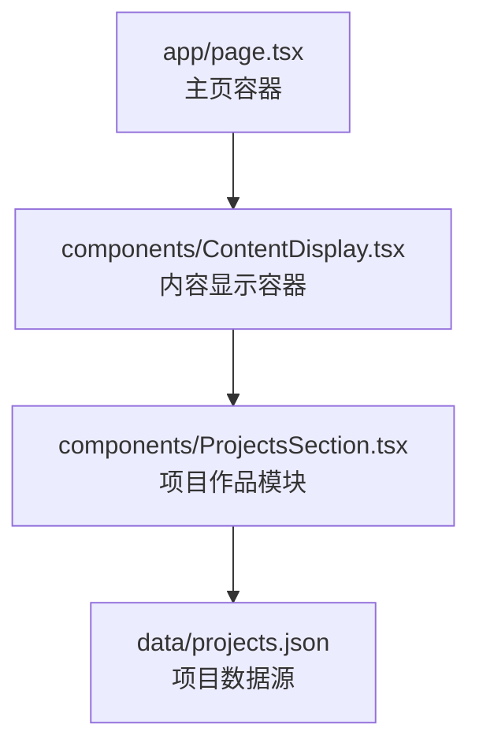
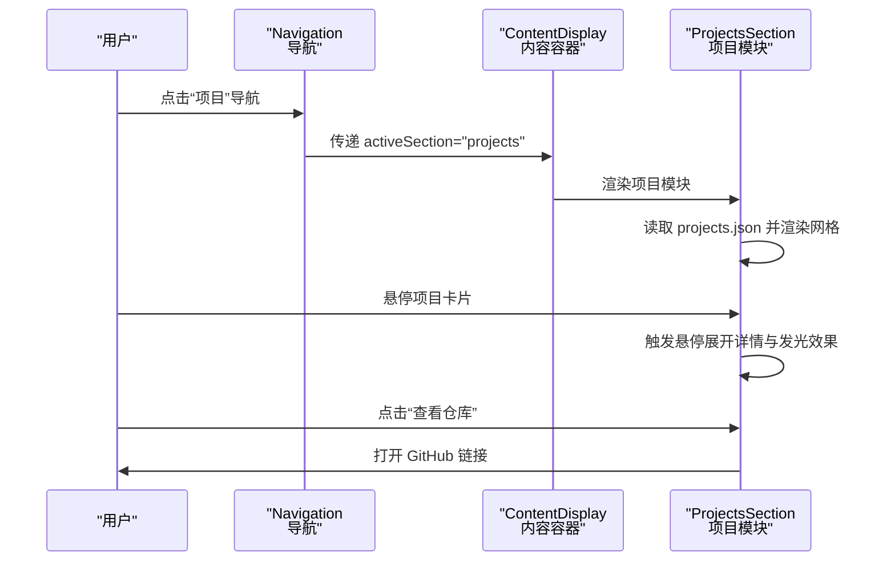
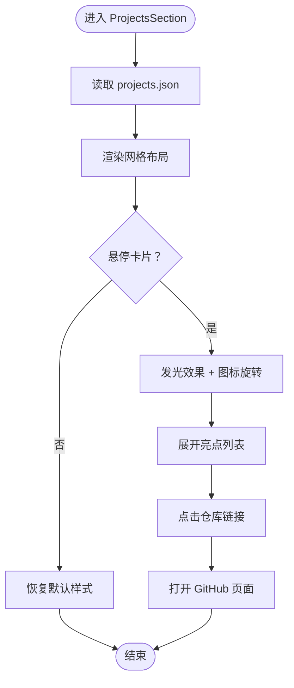
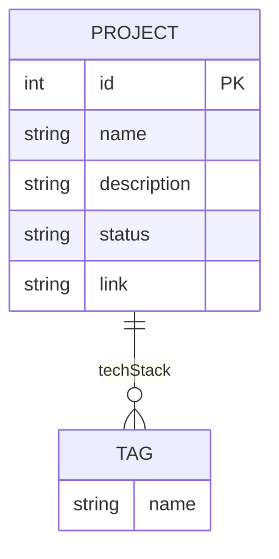
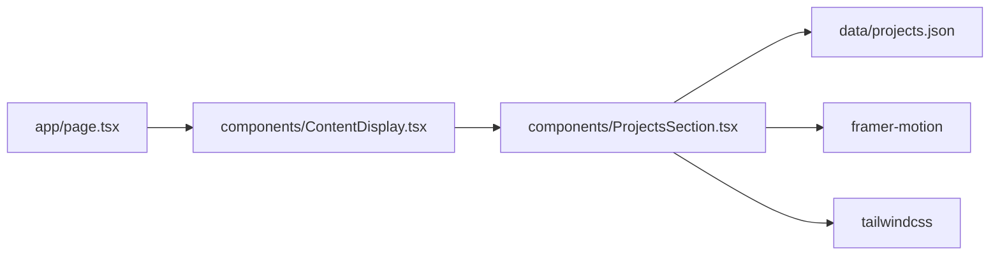

# 项目作品模块

<cite>
**本文引用的文件**
- [ProjectsSection.tsx](file://components/ProjectsSection.tsx)
- [projects.json](file://data/projects.json)
- [page.tsx](file://app/page.tsx)
- [ContentDisplay.tsx](file://components/ContentDisplay.tsx)
</cite>

## 目录
1. [简介](#简介)
2. [项目结构](#项目结构)
3. [核心组件](#核心组件)
4. [架构总览](#架构总览)
5. [详细组件分析](#详细组件分析)
6. [依赖关系分析](#依赖关系分析)
7. [性能考量](#性能考量)
8. [故障排查指南](#故障排查指南)
9. [结论](#结论)
10. [附录](#附录)

## 简介
本文件为“项目作品模块”的实现文档，聚焦于项目作品在个人网页中的展示与交互。内容涵盖：
- 展示布局与信息组织：项目卡片设计、内容摘要生成、状态标识与技术栈标签。
- 数据加载与懒加载：静态数据导入与首屏渲染策略。
- 分类筛选与搜索：当前实现未内置筛选/搜索，但具备扩展空间。
- 交互设计：悬停展开详情、链接跳转至仓库、社交分享入口预留。
- 响应式网格与视觉优化：网格布局、扫描线效果、渐变发光与动画。
- 标签系统与技能关联：技术栈标签映射与状态分类。
- 外部服务集成：GitHub 链接集成与跳转。
- 可定制性与主题适配：颜色变量、边框与背景层叠。
- SEO 与元数据：当前未见页面级元数据配置，建议补充。

## 项目结构
项目采用 Next.js App Router 结构，页面通过导航切换内容区域，项目作品模块作为内容区之一被动态渲染。

图示来源
- [page.tsx:16-29](file://app/page.tsx#L16-L29)
- [ContentDisplay.tsx:12-42](file://components/ContentDisplay.tsx#L12-L42)
- [ProjectsSection.tsx:5](file://components/ProjectsSection.tsx#L5)

章节来源
- [page.tsx:16-29](file://app/page.tsx#L16-L29)
- [ContentDisplay.tsx:12-42](file://components/ContentDisplay.tsx#L12-L42)

## 核心组件
- 项目作品模块（ProjectsSection）：负责渲染项目网格、卡片样式、悬停展开详情、状态徽章、技术栈标签与仓库链接。
- 内容显示容器（ContentDisplay）：根据导航状态切换渲染教育、项目或研究内容，默认欢迎屏。
- 主页容器（page）：承载粒子背景、HUD、导航与内容显示容器，并提供全局装饰元素。

章节来源
- [ProjectsSection.tsx:7-160](file://components/ProjectsSection.tsx#L7-L160)
- [ContentDisplay.tsx:12-42](file://components/ContentDisplay.tsx#L12-L42)
- [page.tsx:9-60](file://app/page.tsx#L9-L60)

## 架构总览
项目作品模块通过数据驱动渲染，使用 Framer Motion 实现逐项入场与悬停动画；数据来源于本地 JSON 文件，组件内部不包含筛选/搜索逻辑，但具备良好的扩展点。

图示来源
- [page.tsx:12-14](file://app/page.tsx#L12-L14)
- [ContentDisplay.tsx:14-23](file://components/ContentDisplay.tsx#L14-L23)
- [ProjectsSection.tsx:26-156](file://components/ProjectsSection.tsx#L26-L156)

## 详细组件分析

### 项目作品模块（ProjectsSection）
- 数据来源：从本地 JSON 导入项目数组，每个项目包含 id、名称、描述、技术栈、状态、链接与亮点列表。
- 布局与网格：单列到双列自适应网格，卡片内含扫描线装饰、发光边框、状态徽章与技术栈标签。
- 动画与交互：
  - 卡片逐项入场动画，悬停时触发发光与图标旋转。
  - 悬停展开“亮点”列表与“查看仓库”按钮，使用高度折叠/展开控制。
- 链接与跳转：点击“查看仓库”打开项目仓库链接，使用新窗口安全属性。
- 状态与标签：根据状态动态设置徽章样式；技术栈以标签形式展示。

图示来源
- [ProjectsSection.tsx:26-156](file://components/ProjectsSection.tsx#L26-L156)
- [projects.json:1-57](file://data/projects.json#L1-L57)

章节来源
- [ProjectsSection.tsx:7-160](file://components/ProjectsSection.tsx#L7-L160)
- [projects.json:1-57](file://data/projects.json#L1-L57)

### 数据模型（projects.json）
- 字段说明：
  - id：项目唯一标识
  - name：项目名称
  - description：项目描述（用于卡片摘要）
  - techStack：技术栈数组（标签）
  - status：项目状态（用于徽章样式）
  - link：项目仓库链接
  - highlights：亮点列表（用于悬停展开）

图示来源
- [projects.json:2-56](file://data/projects.json#L2-L56)

章节来源
- [projects.json:1-57](file://data/projects.json#L1-L57)

### 内容显示容器（ContentDisplay）
- 职责：根据 activeSection 渲染对应内容块，使用动画过渡实现平滑切换。
- 当前支持：education、projects、research 三类内容，以及默认欢迎屏。
- 与项目模块的关系：当 activeSection 为 projects 时，渲染 ProjectsSection。

章节来源
- [ContentDisplay.tsx:12-42](file://components/ContentDisplay.tsx#L12-L42)

### 主页容器（page）
- 职责：承载背景粒子、HUD、导航与内容显示容器，提供全局装饰与扫描线效果。
- 与项目模块的关系：通过导航状态驱动 ContentDisplay 切换到项目模块。

章节来源
- [page.tsx:9-60](file://app/page.tsx#L9-L60)

## 依赖关系分析
- 组件依赖：
  - ProjectsSection 依赖 projects.json 提供的数据。
  - ContentDisplay 依赖 ProjectsSection 进行渲染。
  - page 依赖 ContentDisplay 与 Navigation 协同工作。
- 外部依赖：
  - Framer Motion：用于入场、悬停与过渡动画。
  - TailwindCSS：用于样式与主题变量（如 cyber-pink、cyber-blue 等）。

图示来源
- [page.tsx:16-29](file://app/page.tsx#L16-L29)
- [ContentDisplay.tsx:12-42](file://components/ContentDisplay.tsx#L12-L42)
- [ProjectsSection.tsx:3-5](file://components/ProjectsSection.tsx#L3-L5)

章节来源
- [page.tsx:16-29](file://app/page.tsx#L16-L29)
- [ContentDisplay.tsx:12-42](file://components/ContentDisplay.tsx#L12-L42)
- [ProjectsSection.tsx:3-5](file://components/ProjectsSection.tsx#L3-L5)

## 性能考量
- 静态数据加载：项目数据来自本地 JSON，无需网络请求，首屏渲染快速。
- 动画性能：使用 Framer Motion 的 GPU 加速动画（如 translate/rotate/scale），在低端设备上可考虑禁用或降级。
- 图片懒加载：当前项目卡片使用占位背景与图标，未使用原生图片懒加载；若后续引入图片资源，建议启用懒加载与占位骨架。
- 响应式网格：使用 Tailwind 的响应式断点，避免过度复杂的媒体查询。
- 交互节流：悬停事件已通过状态管理控制，无需额外节流。

## 故障排查指南
- 项目卡片不显示：
  - 检查 projects.json 是否存在且格式正确。
  - 确认 ProjectsSection 正确导入数据文件。
- 悬停无效果：
  - 确认 Framer Motion 已安装并可用。
  - 检查 CSS 类名是否与 Tailwind 配置一致。
- 链接无法打开：
  - 检查 link 字段是否为有效 URL。
  - 确认新窗口与安全属性设置正确。
- 动画异常：
  - 在低端设备上尝试关闭部分动画或降低帧率。

章节来源
- [ProjectsSection.tsx:26-156](file://components/ProjectsSection.tsx#L26-L156)
- [projects.json:1-57](file://data/projects.json#L1-L57)

## 结论
项目作品模块以简洁的卡片网格为核心，结合状态徽章、技术栈标签与悬停展开详情，提供了清晰的信息层次与流畅的交互体验。当前实现专注于静态数据与基础动画，未包含筛选/搜索与社交分享功能，但具备良好的扩展性，可在不破坏现有样式的前提下逐步增强。

## 附录

### 可定制性与主题适配
- 主题色板：通过 Tailwind 自定义颜色（如 cyber-pink、cyber-blue、cyber-green）统一风格。
- 边框与背景：卡片边框与背景使用半透明与模糊效果，便于在不同背景下保持可读性。
- 动画参数：可通过调整延迟、持续时间与缓动函数微调动画节奏。

### SEO 与元数据建议
- 当前未发现页面级元数据配置（如 title、description、open graph 等）。
- 建议在页面组件中添加标准 SEO 元数据，提升搜索引擎可见性与社交分享质量。