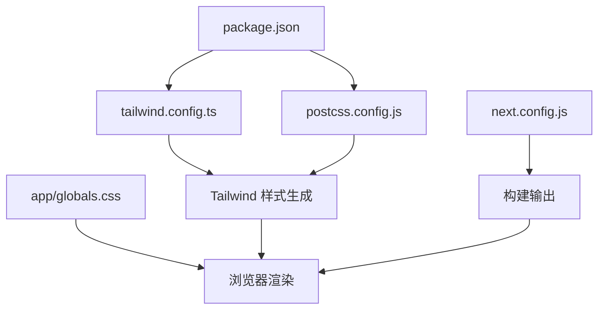
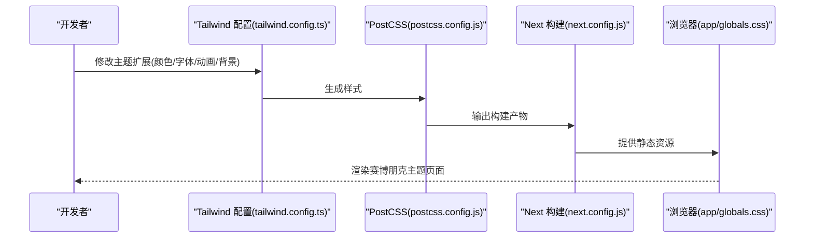
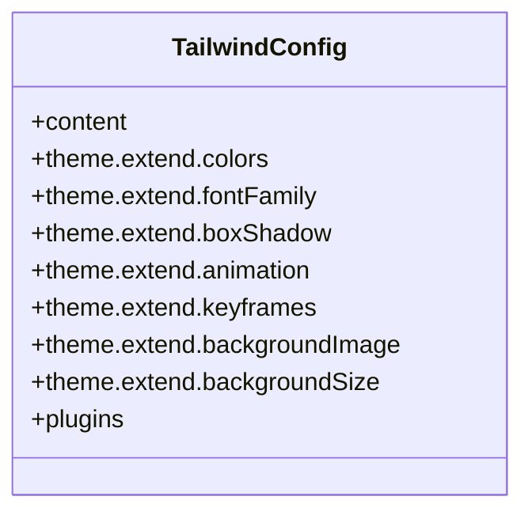
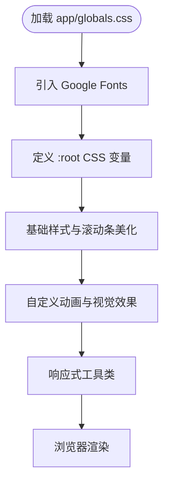
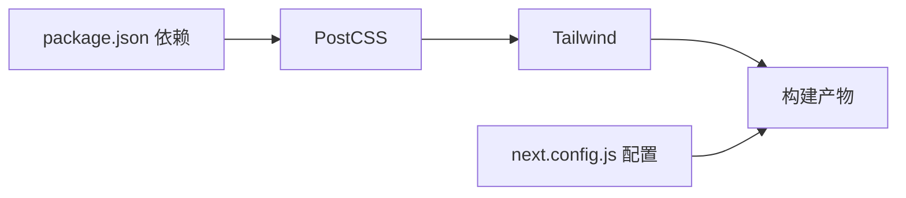
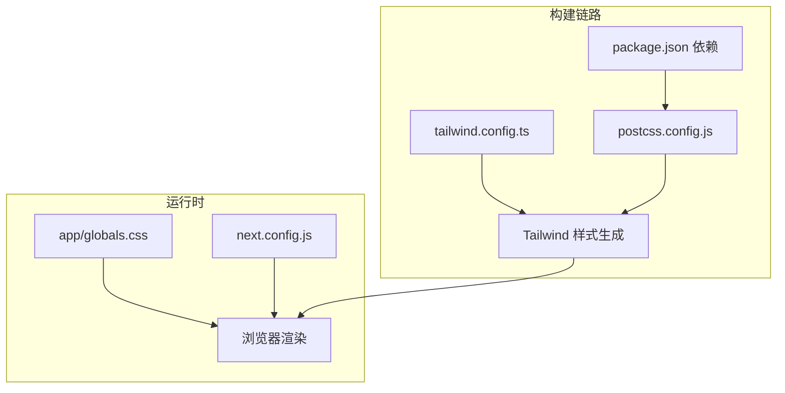

# 主题定制

<cite>
**本文引用的文件**
- [tailwind.config.ts](file://tailwind.config.ts)
- [postcss.config.js](file://postcss.config.js)
- [app/globals.css](file://app/globals.css)
- [next.config.js](file://next.config.js)
- [package.json](file://package.json)
</cite>

## 目录
1. [简介](#简介)
2. [项目结构](#项目结构)
3. [核心组件](#核心组件)
4. [架构总览](#架构总览)
5. [详细组件分析](#详细组件分析)
6. [依赖分析](#依赖分析)
7. [性能考虑](#性能考虑)
8. [故障排除指南](#故障排除指南)
9. [结论](#结论)
10. [附录](#附录)

## 简介
本指南面向希望在 Next.js + Tailwind CSS 项目中定制“赛博朋克风格”主题的开发者与设计师。基于仓库中的现有配置，我们将系统讲解如何通过 Tailwind 配置扩展颜色、字体、阴影、动画、背景图案与网格等视觉元素；同时结合全局样式与构建配置，给出可落地的主题定制步骤、最佳实践与排错建议。

## 项目结构
该项目采用标准 Next.js 结构，主题相关的关键文件集中在以下位置：
- Tailwind 配置：tailwind.config.ts（定义内容扫描范围、主题扩展与插件）
- PostCSS 配置：postcss.config.js（启用 Tailwind 与 Autoprefixer）
- 全局样式：app/globals.css（引入 Google Fonts、定义 CSS 变量、基础样式与动画）
- 构建配置：next.config.js（静态导出、图片优化关闭、尾斜杠）
- 依赖声明：package.json（Tailwind、PostCSS、Autoprefixer 等）

**图表来源**
- [tailwind.config.ts:1-72](file://tailwind.config.ts#L1-L72)
- [postcss.config.js:1-7](file://postcss.config.js#L1-L7)
- [app/globals.css:1-212](file://app/globals.css#L1-L212)
- [next.config.js:1-11](file://next.config.js#L1-L11)
- [package.json:1-30](file://package.json#L1-L30)

**章节来源**
- [tailwind.config.ts:1-72](file://tailwind.config.ts#L1-L72)
- [postcss.config.js:1-7](file://postcss.config.js#L1-L7)
- [app/globals.css:1-212](file://app/globals.css#L1-L212)
- [next.config.js:1-11](file://next.config.js#L1-L11)
- [package.json:1-30](file://package.json#L1-L30)

## 核心组件
- Tailwind 主题扩展：通过 colors、fontFamily、boxShadow、animation、keyframes、backgroundImage、backgroundSize 等字段，为赛博朋克风格提供统一的颜色体系、字体族、光晕与动画效果。
- 全局样式与 CSS 变量：在 app/globals.css 中引入 Google Fonts 并定义 --cyber-* 变量，配合 :root 使用，确保颜色一致性与可维护性。
- 动画与背景：内置多种动画（脉冲、扫描、闪烁、浮动、数据流）与背景图案（网格、数据流），便于快速应用到页面元素。
- 构建与打包：next.config.js 配置静态导出与图片优化策略；package.json 声明 Tailwind、PostCSS、Autoprefixer 等依赖。

**章节来源**
- [tailwind.config.ts:9-67](file://tailwind.config.ts#L9-L67)
- [app/globals.css:5-13](file://app/globals.css#L5-L13)
- [app/globals.css:69-212](file://app/globals.css#L69-L212)
- [next.config.js:2-8](file://next.config.js#L2-L8)
- [package.json:20-28](file://package.json#L20-L28)

## 架构总览
下图展示了从配置到渲染的整体流程：Tailwind 读取配置并生成样式，PostCSS 处理，Next.js 在构建阶段输出静态资源，最终浏览器加载并渲染。

**图表来源**
- [tailwind.config.ts:1-72](file://tailwind.config.ts#L1-L72)
- [postcss.config.js:1-7](file://postcss.config.js#L1-L7)
- [next.config.js:1-11](file://next.config.js#L1-L11)
- [app/globals.css:1-212](file://app/globals.css#L1-L212)

## 详细组件分析

### Tailwind 主题扩展详解
- 内容扫描范围：确保 Tailwind 扫描 pages、components、app 目录，以生成所需类名。
- 颜色系统：新增了 cyber-black、cyber-dark、cyber-blue、cyber-pink、cyber-green、neon-blue、neon-pink 以及 HUD 背景透明色，形成统一的赛博朋克配色。
- 字体系统：定义 tech 与 mono 两类字体族，分别对应科技感与等宽代码字体。
- 阴影与光晕：为蓝色、粉色、绿色与通用 glow 定义阴影，营造霓虹光晕效果。
- 动画与关键帧：内置 pulse-glow、scan、flicker、float、data-flow 等动画，配合 keyframes 实现动态视觉。
- 背景与尺寸：提供 grid-pattern、data-stream 背景与 grid 尺寸，用于构建赛博朋克风格的背景纹理。

**图表来源**
- [tailwind.config.ts:3-69](file://tailwind.config.ts#L3-L69)

**章节来源**
- [tailwind.config.ts:3-69](file://tailwind.config.ts#L3-L69)

### 全局样式与 CSS 变量
- Google Fonts 引入：通过 @import 引入 Orbitron、Rajdhani、JetBrains Mono 等字体，确保科技感与代码字体可用。
- CSS 变量：在 :root 定义 --cyber-* 变量，供 body 与组件共享使用，便于集中管理主题色。
- 基础样式：重置 margin/padding、平滑滚动、隐藏滚动条等实用样式。
- 自定义动画与效果：glitch、flicker、neon-pulse、scan、data-flow、float 等动画；文本发光、HUD 背景、数字切角、六边形裁剪等视觉效果。
- 响应式工具：在 @layer utilities 中提供 text-balance 等现代排版工具类。

**图表来源**
- [app/globals.css:5-212](file://app/globals.css#L5-L212)

**章节来源**
- [app/globals.css:5-13](file://app/globals.css#L5-L13)
- [app/globals.css:15-67](file://app/globals.css#L15-L67)
- [app/globals.css:69-212](file://app/globals.css#L69-L212)

### 构建与打包配置
- Next 静态导出：output: 'export' 适合静态托管；images.unoptimized: true 与 trailingSlash: true 便于无服务部署。
- 依赖：Tailwind、PostCSS、Autoprefixer 由 package.json 声明，确保构建链路完整。

**图表来源**
- [package.json:20-28](file://package.json#L20-L28)
- [postcss.config.js:1-7](file://postcss.config.js#L1-L7)
- [next.config.js:2-8](file://next.config.js#L2-L8)

**章节来源**
- [next.config.js:2-8](file://next.config.js#L2-L8)
- [package.json:20-28](file://package.json#L20-L28)

## 依赖分析
- Tailwind 与 PostCSS：通过 postcss.config.js 启用 tailwindcss 与 autoprefixer，确保样式按需生成与兼容性处理。
- Next 构建：next.config.js 的静态导出与图片优化策略影响最终产物体积与加载性能。
- 字体加载：Google Fonts 通过 app/globals.css 引入，需关注首屏渲染与字体回退策略。

**图表来源**
- [tailwind.config.ts:1-72](file://tailwind.config.ts#L1-L72)
- [postcss.config.js:1-7](file://postcss.config.js#L1-L7)
- [package.json:20-28](file://package.json#L20-L28)
- [app/globals.css:1-212](file://app/globals.css#L1-L212)
- [next.config.js:1-11](file://next.config.js#L1-L11)

**章节来源**
- [tailwind.config.ts:1-72](file://tailwind.config.ts#L1-L72)
- [postcss.config.js:1-7](file://postcss.config.js#L1-L7)
- [package.json:20-28](file://package.json#L20-L28)
- [app/globals.css:1-212](file://app/globals.css#L1-L212)
- [next.config.js:1-11](file://next.config.js#L1-L11)

## 性能考虑
- 减少不必要的内容扫描：保持 content 范围精确，避免扫描未使用的目录，缩短构建时间。
- 控制动画数量：动画与关键帧越多，样式体积越大，建议按需启用。
- 字体加载优化：Google Fonts 已通过 @import 引入，建议在生产环境考虑字体子集化或本地托管以提升首屏性能。
- 静态导出与图片：静态导出适合展示型站点，若包含大量动态图片，需评估体积与加载策略。

[本节为通用性能建议，不直接分析具体文件]

## 故障排除指南
- Tailwind 类名无效：检查 tailwind.config.ts 的 content 范围是否包含当前文件路径，确保类名被扫描到。
- 颜色/字体未生效：确认 app/globals.css 中的 CSS 变量与字体引入是否正确加载，必要时检查网络面板与控制台错误。
- 动画不显示：核对 animation 与 keyframes 是否在 theme.extend 中正确定义，且类名拼写一致。
- 构建失败：检查 package.json 中 Tailwind、PostCSS、Autoprefixer 版本与 postcss.config.js 配置是否匹配。

**章节来源**
- [tailwind.config.ts:4-8](file://tailwind.config.ts#L4-L8)
- [app/globals.css:5-27](file://app/globals.css#L5-L27)
- [tailwind.config.ts:31-59](file://tailwind.config.ts#L31-L59)
- [package.json:20-28](file://package.json#L20-L28)

## 结论
通过 tailwind.config.ts 的主题扩展与 app/globals.css 的全局样式、CSS 变量、动画与背景，项目已具备完整的赛博朋克风格基础。结合 next.config.js 的静态导出与 package.json 的构建依赖，开发者可以在此基础上快速迭代颜色、字体、动画与背景，实现一致且富有科技感的主题体验。

[本节为总结性内容，不直接分析具体文件]

## 附录

### 赛博朋克主题定制清单
- 颜色变量
  - 在 tailwind.config.ts 的 colors 中新增或覆盖颜色键值，如 cyber-purple、neon-yellow 等。
  - 在 app/globals.css 的 :root 中同步定义对应的 CSS 变量，保证变量驱动的一致性。
  - 示例参考：[tailwind.config.ts:11-20](file://tailwind.config.ts#L11-L20)，[app/globals.css:7-13](file://app/globals.css#L7-L13)
- 新颜色方案与渐变
  - 在 tailwind.config.ts 的 backgroundImage 中添加渐变方案，如 grid-pattern、data-stream 的变体。
  - 在 app/globals.css 中补充自定义渐变类，如 .bg-cyber-gradient。
  - 示例参考：[tailwind.config.ts:60-66](file://tailwind.config.ts#L60-L66)，[app/globals.css:172-187](file://app/globals.css#L172-L187)
- 字体系统
  - 在 tailwind.config.ts 的 fontFamily 中定义 tech 与 mono 字体族，确保优先级顺序合理。
  - 在 app/globals.css 中通过 @import 引入 Google Fonts，并在 body 或组件中使用 font-tech 与 font-mono。
  - 示例参考：[tailwind.config.ts:21-24](file://tailwind.config.ts#L21-L24)，[app/globals.css:5-27](file://app/globals.css#L5-L27)
- 布局系统
  - 断点与间距：在 tailwind.config.ts 的 theme.extend 中扩展 spacing、screens 等，以适配多端布局。
  - 网格系统：通过 backgroundImage 与 backgroundSize 定义网格纹理，结合容器类实现背景网格。
  - 示例参考：[tailwind.config.ts:64-66](file://tailwind.config.ts#L64-L66)，[app/globals.css:172-178](file://app/globals.css#L172-L178)
- 动画与光晕
  - 在 tailwind.config.ts 的 animation 与 keyframes 中新增自定义动画，如 scan-line、glitch-text。
  - 在 app/globals.css 中补充关键帧与类，如 .animate-scan、.glitch-text。
  - 示例参考：[tailwind.config.ts:31-59](file://tailwind.config.ts#L31-L59)，[app/globals.css:122-148](file://app/globals.css#L122-L148)
- 主题切换与响应式
  - 主题切换：通过 CSS 变量在 :root 上切换 --cyber-* 值，或在组件中切换类名以改变背景与文字颜色。
  - 响应式：利用 Tailwind 默认与自定义断点，结合 text-balance 等工具类优化排版。
  - 示例参考：[app/globals.css:7-13](file://app/globals.css#L7-L13)，[app/globals.css:207-211](file://app/globals.css#L207-L211)
- 最佳实践
  - 保持 colors、CSS 变量与字体族的命名一致性，避免重复与冲突。
  - 将动画与背景纹理拆分为可复用的类，减少重复定义。
  - 在生产环境考虑字体加载策略与样式体积，必要时进行子集化或本地托管。

[本节为操作清单与最佳实践建议，不直接分析具体文件]