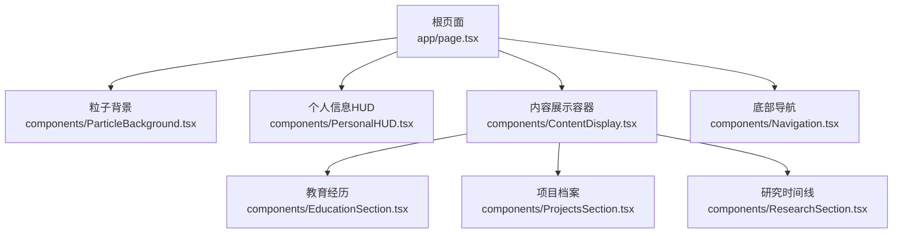
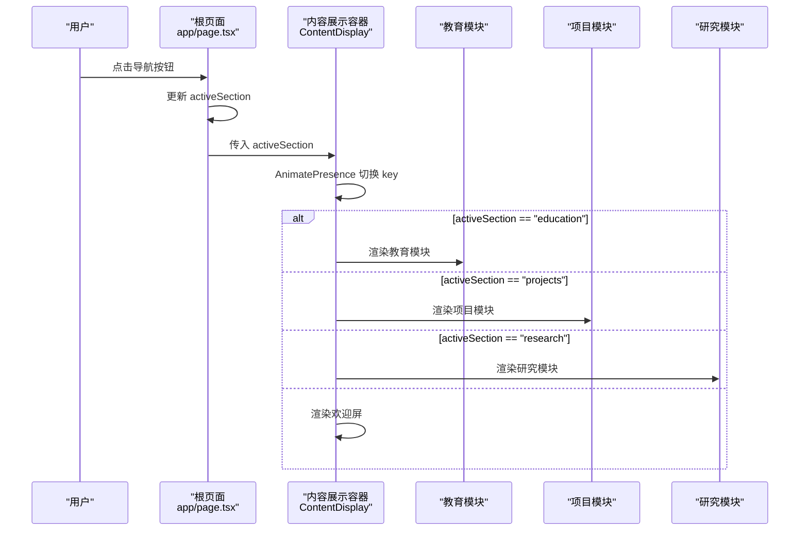
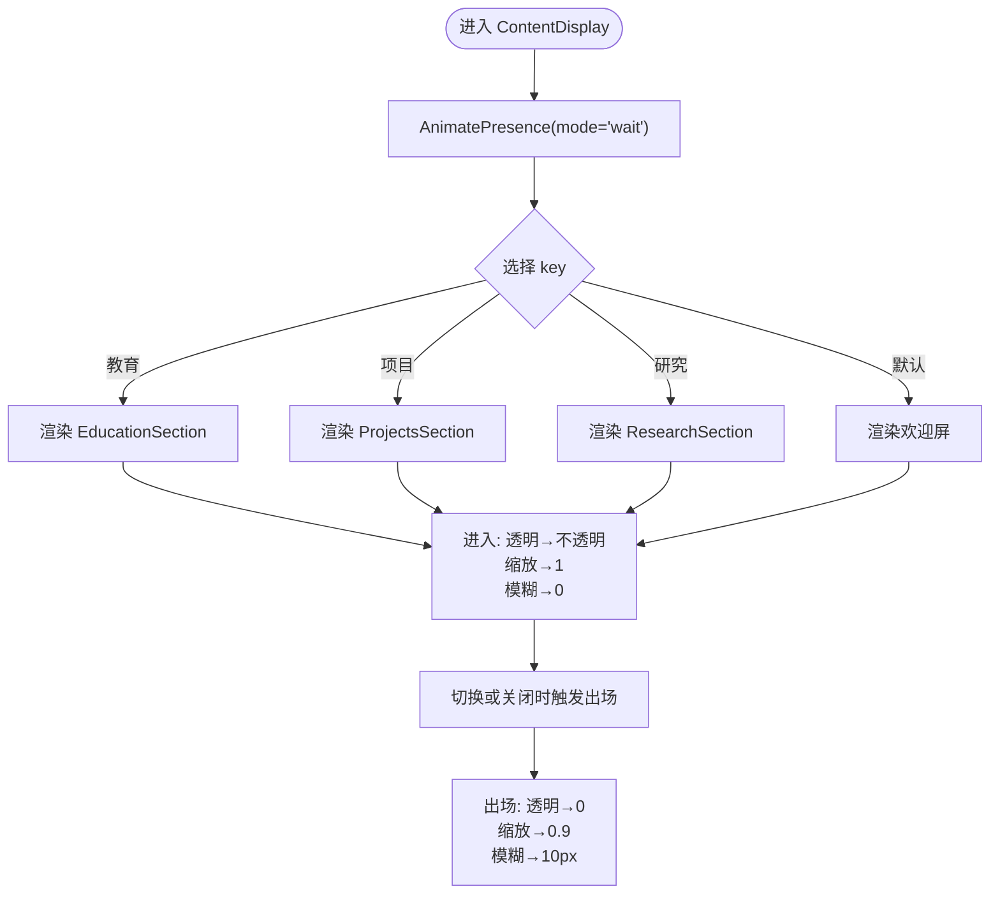
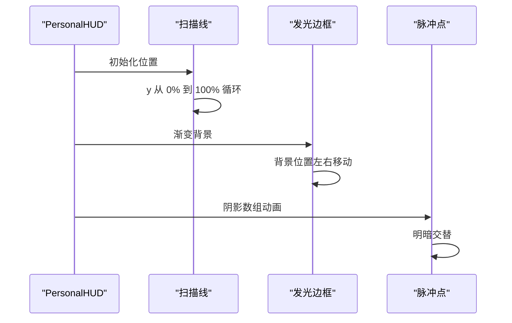
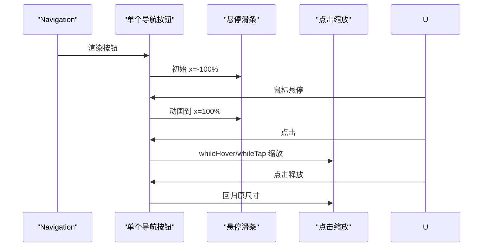
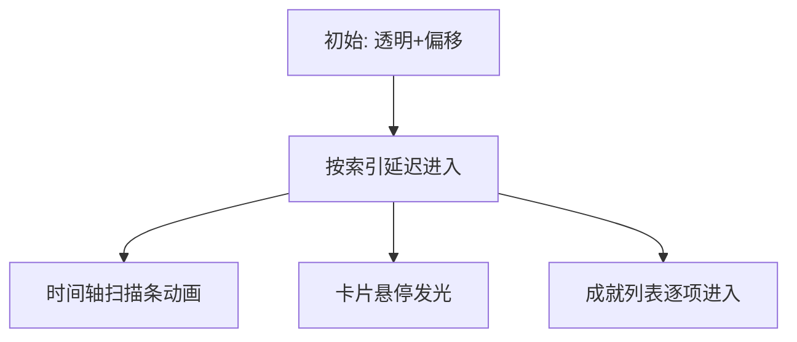
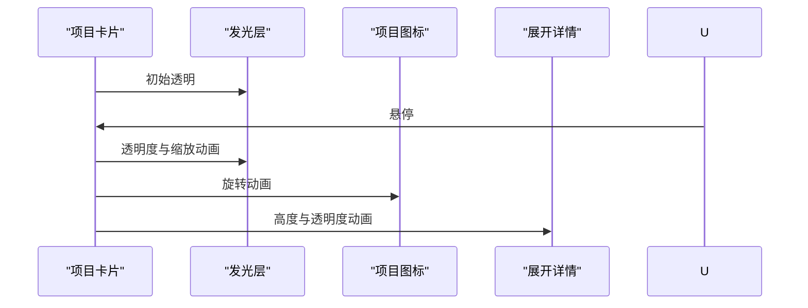
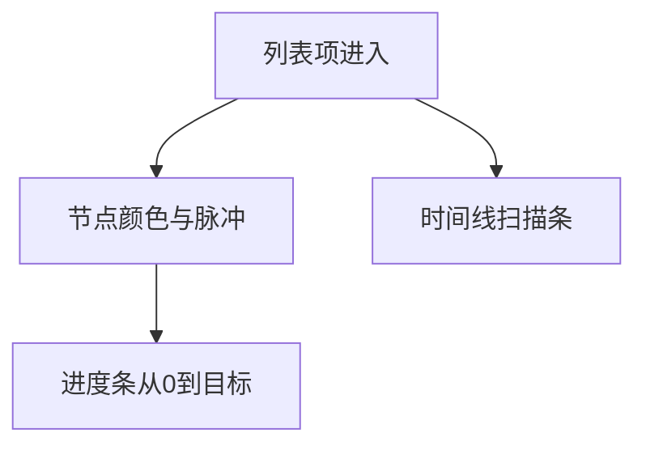
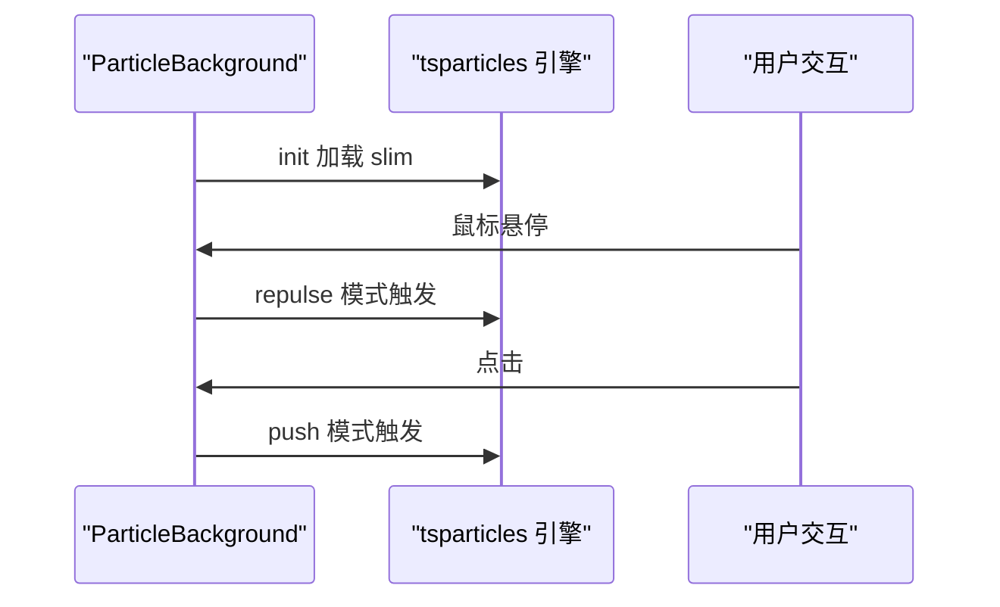
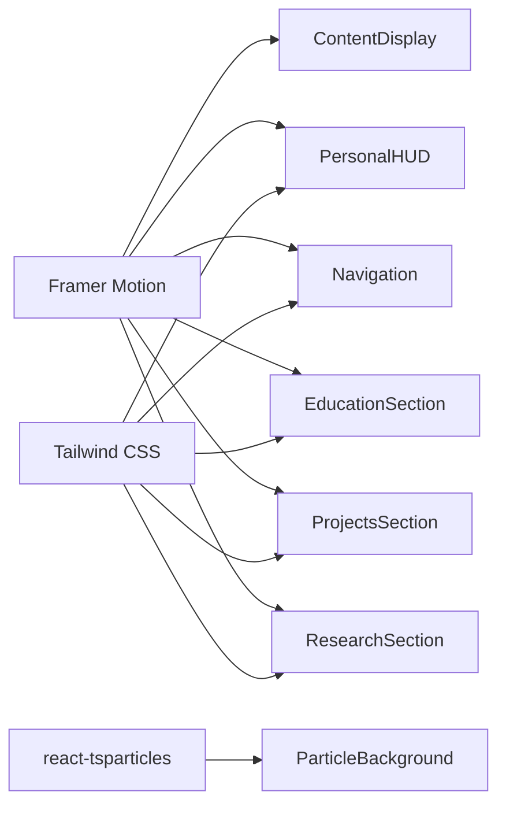

# 动画定制

<cite>
**本文引用的文件**
- [README.md](file://README.md)
- [package.json](file://package.json)
- [app/page.tsx](file://app/page.tsx)
- [components/ContentDisplay.tsx](file://components/ContentDisplay.tsx)
- [components/ParticleBackground.tsx](file://components/ParticleBackground.tsx)
- [components/PersonalHUD.tsx](file://components/PersonalHUD.tsx)
- [components/Navigation.tsx](file://components/Navigation.tsx)
- [components/EducationSection.tsx](file://components/EducationSection.tsx)
- [components/ProjectsSection.tsx](file://components/ProjectsSection.tsx)
- [components/ResearchSection.tsx](file://components/ResearchSection.tsx)
</cite>

## 目录
1. [引言](#引言)
2. [项目结构](#项目结构)
3. [核心组件](#核心组件)
4. [架构总览](#架构总览)
5. [详细组件分析](#详细组件分析)
6. [依赖关系分析](#依赖关系分析)
7. [性能考量](#性能考量)
8. [故障排查指南](#故障排查指南)
9. [结论](#结论)
10. [附录](#附录)

## 引言
本指南围绕“动画定制”主题，结合项目中实际使用的 Framer Motion 与 react-tsparticles，系统讲解如何创建与调优进入、退出、悬停等动画，并覆盖复杂动画序列编排、响应式一致性、性能优化与调试技巧。读者无需深入源码即可理解并复用这些实践。

## 项目结构
该项目采用 Next.js App Router 结构，根页面负责组合多个功能组件，其中大量使用 Framer Motion 实现进入/退出/悬停动画；粒子背景由 react-tsparticles 提供，配合 Framer Motion 的扫描线、脉冲、闪烁等效果，营造赛博朋克风格的动态体验。

图表来源
- [app/page.tsx:16-29](file://app/page.tsx#L16-L29)
- [components/ContentDisplay.tsx:12-42](file://components/ContentDisplay.tsx#L12-L42)
- [components/ParticleBackground.tsx:21-124](file://components/ParticleBackground.tsx#L21-L124)
- [components/PersonalHUD.tsx:7-121](file://components/PersonalHUD.tsx#L7-L121)
- [components/Navigation.tsx:17-101](file://components/Navigation.tsx#L17-L101)

章节来源
- [README.md:146-169](file://README.md#L146-L169)
- [package.json:11-18](file://package.json#L11-L18)

## 核心组件
- 内容展示容器（进入/退出）：通过 AnimatePresence 与 motion.div 的 initial/animate/exit/transition 组合，实现内容切换时的淡入淡出与缩放模糊过渡。
- 个人信息 HUD（进入/静态动画）：使用初始透明与位移，随后渐显；扫描线与边框发光采用 repeat 无限循环，营造科技感。
- 底部导航（悬停/激活）：按钮悬停时的滑入高亮、点击缩放反馈、激活指示条使用 layoutId 布局稳定。
- 教育/项目/研究（进入/悬停/进度）：列表项按序进入，卡片悬停发光与扫描线，项目卡片展开细节区域，研究进度条按延迟动画推进。
- 粒子背景（交互/视觉）：鼠标悬停排斥、点击聚集，网格与暗角叠加增强层次。

章节来源
- [components/ContentDisplay.tsx:26-42](file://components/ContentDisplay.tsx#L26-L42)
- [components/PersonalHUD.tsx:7-121](file://components/PersonalHUD.tsx#L7-L121)
- [components/Navigation.tsx:17-101](file://components/Navigation.tsx#L17-L101)
- [components/EducationSection.tsx:38-139](file://components/EducationSection.tsx#L38-L139)
- [components/ProjectsSection.tsx:25-157](file://components/ProjectsSection.tsx#L25-L157)
- [components/ResearchSection.tsx:37-171](file://components/ResearchSection.tsx#L37-L171)
- [components/ParticleBackground.tsx:21-124](file://components/ParticleBackground.tsx#L21-L124)

## 架构总览
下图展示了页面级控制流与动画编排：根页面持有 activeSection 状态，驱动内容展示容器渲染对应模块；各模块内部再细分子动画，形成“页面级切换 + 模块内进入/悬停”的分层动画体系。

图表来源
- [app/page.tsx:10-14](file://app/page.tsx#L10-L14)
- [components/ContentDisplay.tsx:12-24](file://components/ContentDisplay.tsx#L12-L24)
- [components/ContentDisplay.tsx:28-39](file://components/ContentDisplay.tsx#L28-L39)

## 详细组件分析

### 内容展示容器（进入/退出）
- 进入：initial 设置透明与轻微缩放+模糊，animate 回到不透明与清晰，配合 transition 控制时长与缓动。
- 退出：exit 使用与 initial 对称的反向状态，确保切换时有自然收束。
- 切换策略：AnimatePresence + mode="wait" 保证同一时刻仅有一个子树渲染，避免重叠动画冲突。
- 关键点：key 基于 activeSection 或默认值，确保每次切换重建动画上下文。

图表来源
- [components/ContentDisplay.tsx:26-42](file://components/ContentDisplay.tsx#L26-L42)
- [components/ContentDisplay.tsx:12-24](file://components/ContentDisplay.tsx#L12-L24)

章节来源
- [components/ContentDisplay.tsx:26-42](file://components/ContentDisplay.tsx#L26-L42)

### 个人信息 HUD（进入/静态动画）
- 进入：初始透明+右移，随后平滑过渡至完全可见。
- 扫描线：顶部扫描条使用 y 从 0% 到 100% 的线性重复动画，营造扫描感。
- 边框发光：外层遮罩使用线性渐变并水平移动，形成流动的霓虹边框。
- 点状脉冲：状态指示点采用阴影数组动画，周期性明暗交替。

图表来源
- [components/PersonalHUD.tsx:27-33](file://components/PersonalHUD.tsx#L27-L33)
- [components/PersonalHUD.tsx:110-118](file://components/PersonalHUD.tsx#L110-L118)
- [components/PersonalHUD.tsx:40-43](file://components/PersonalHUD.tsx#L40-L43)

章节来源
- [components/PersonalHUD.tsx:7-121](file://components/PersonalHUD.tsx#L7-L121)

### 底部导航（悬停/激活）
- 进入：整体从底部弹入，伴随透明度与位移变化。
- 悬停：使用 onHoverStart/onHoverEnd 管理 hoveredIndex，带动画的高亮滑条从左至右扫过。
- 点击：whileHover/whileTap 提供即时缩放反馈，增强交互真实感。
- 激活：使用 layoutId 的激活指示条，保证不同按钮间切换时的布局过渡平滑。

图表来源
- [components/Navigation.tsx:17-101](file://components/Navigation.tsx#L17-L101)

章节来源
- [components/Navigation.tsx:17-101](file://components/Navigation.tsx#L17-L101)

### 教育经历（进入/悬停/扫描）
- 进入：奇偶行分别从左侧/右侧滑入，配合延迟形成流水进入。
- 时间轴：中心线与数据流扫描条营造信息流感。
- 卡片：悬停时发光层出现，扫描条动画贯穿整个卡片。
- 子项：成就列表逐项进入，形成“主进入 + 子进入”的层级节奏。

图表来源
- [components/EducationSection.tsx:38-139](file://components/EducationSection.tsx#L38-L139)

章节来源
- [components/EducationSection.tsx:38-139](file://components/EducationSection.tsx#L38-L139)

### 项目档案（悬停展开/技术标签）
- 进入：网格卡片逐列进入，带延迟形成瀑布流。
- 悬停：发光层随 hover 项目放大，图标旋转，展开“亮点”区域。
- 技术标签：按项目与标签双重延迟，形成“先项目后标签”的节奏。
- 状态徽章：根据状态动态着色，提升信息密度。

图表来源
- [components/ProjectsSection.tsx:25-157](file://components/ProjectsSection.tsx#L25-L157)

章节来源
- [components/ProjectsSection.tsx:25-157](file://components/ProjectsSection.tsx#L25-L157)

### 研究时间线（进度条/节点脉冲）
- 进入：列表项依次从左侧滑入，带延迟。
- 节点：根据状态选择颜色，采用内外双层脉冲动画，突出状态。
- 进度条：初始宽度为 0，按延迟动画推进到目标百分比，增强可视化反馈。
- 扫描：整条时间线的扫描条营造“能量流动”感。

图表来源
- [components/ResearchSection.tsx:37-171](file://components/ResearchSection.tsx#L37-L171)

章节来源
- [components/ResearchSection.tsx:37-171](file://components/ResearchSection.tsx#L37-L171)

### 粒子背景（交互/视觉）
- 初始化：使用 mounted 与回调加载引擎，避免服务端渲染问题。
- 交互：悬停 repulse（排斥），点击 push（聚集），参数控制距离与持续时间。
- 视觉：网格叠加、径向暗角、粒子颜色与链接，共同构建深空赛博朋克氛围。

图表来源
- [components/ParticleBackground.tsx:8-17](file://components/ParticleBackground.tsx#L8-L17)
- [components/ParticleBackground.tsx:81-101](file://components/ParticleBackground.tsx#L81-L101)

章节来源
- [components/ParticleBackground.tsx:21-124](file://components/ParticleBackground.tsx#L21-L124)

## 依赖关系分析
- Framer Motion：用于所有进入/退出/悬停/扫描/脉冲等动画。
- react-tsparticles：提供粒子系统与交互模式。
- Tailwind CSS：提供基础样式与响应式断点，配合动画实现一致的跨设备表现。

图表来源
- [package.json:11-18](file://package.json#L11-L18)
- [components/ContentDisplay.tsx:3](file://components/ContentDisplay.tsx#L3)
- [components/PersonalHUD.tsx:3](file://components/PersonalHUD.tsx#L3)
- [components/Navigation.tsx:3](file://components/Navigation.tsx#L3)
- [components/EducationSection.tsx:3](file://components/EducationSection.tsx#L3)
- [components/ProjectsSection.tsx:3](file://components/ProjectsSection.tsx#L3)
- [components/ResearchSection.tsx:3](file://components/ResearchSection.tsx#L3)
- [components/ParticleBackground.tsx:4](file://components/ParticleBackground.tsx#L4)

章节来源
- [package.json:11-18](file://package.json#L11-L18)

## 性能考量
- 使用 AnimatePresence 的 mode="wait" 与合适的 transition 参数，避免同时渲染多个动画树导致的重绘压力。
- 列表进入使用延迟但不要过度叠加，建议每项延迟在合理区间（如 0.1~0.3s），以平衡节奏与性能。
- 复杂扫描/脉冲动画尽量使用 transform 与 opacity，减少对布局与绘制的影响。
- 粒子系统通过 fpsLimit 限制帧率，交互模式的持续时间与距离参数需适度，避免在低端设备上掉帧。
- 使用 mounted 防止服务端渲染期间执行客户端动画逻辑，降低首屏抖动与错误。
- 合理拆分动画层级，避免深层嵌套的复杂父子动画链造成计算负担。

## 故障排查指南
- 动画不生效
  - 检查是否在客户端环境使用（组件顶部包含 'use client'）。
  - 确认 motion/AnimatePresence 是否正确导入。
- 切换卡顿
  - 减少同时运行的动画数量，合并或取消不必要的过渡。
  - 适当提高 transition.duration 或降低 easing 的复杂度。
- 悬停抖动
  - 使用 whileHover/whileTap 时保持缩放比例适中，避免过大差异。
  - 检查父容器的布局变化是否影响了 hover 区域。
- 粒子卡顿
  - 降低 particles.number.value 或 interactivity.modes.repulse.distance/duration。
  - 在移动端启用更保守的动画速度与数量。
- 响应式异常
  - 使用 Tailwind 断点控制动画触发时机与强度，避免在小屏上过度动画。
  - 对关键动画设置 prefers-reduced-motion 的降级方案。

## 结论
本项目通过 Framer Motion 与 react-tsparticles 的协同，实现了从页面级内容切换到模块内细节动画的完整体验。遵循本文的参数调优、序列编排与性能优化建议，可在不同设备上获得一致且流畅的动画表现。

## 附录
- 动画参数速查
  - 持续时间：duration（秒）
  - 缓动函数：ease、easeIn、easeOut、easeInOut、circ、back、bounce 等
  - 延迟：delay（秒）
  - 重复：repeat（次数）、repeatDelay（间隔）
  - 回环：从 A→B 或 A→B→A 的往返
- 常见场景参考
  - 进入：initial → animate（透明度、位移、缩放、模糊）
  - 退出：exit → animate（与进入相反）
  - 悬停：onHoverStart/onHoverEnd 或 whileHover/whileTap
  - 复杂序列：列表项延迟、子元素交错进入、进度条推进
- 调试技巧
  - 逐步注释动画，定位冲突或性能瓶颈
  - 使用浏览器开发者工具的性能面板观察帧率与重绘
  - 在移动端真机测试，必要时降低动画强度或禁用部分动画