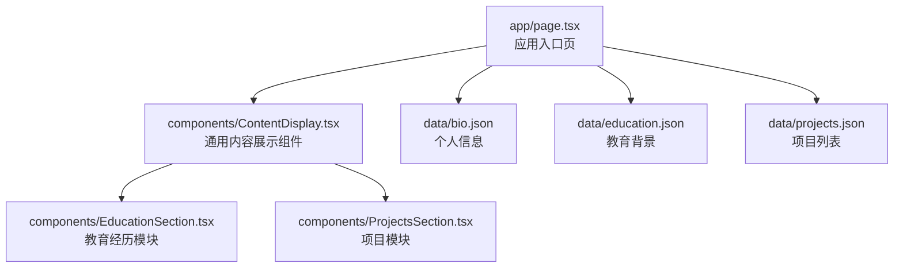
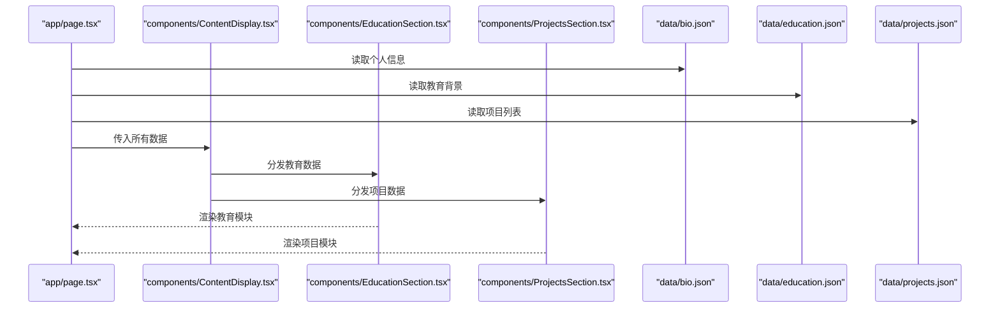
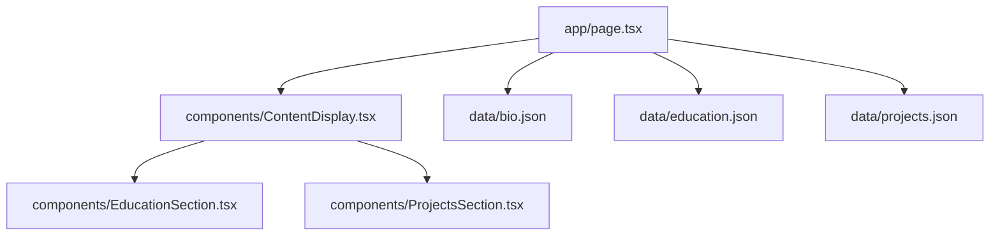

# 数据模型扩展

<cite>
**本文引用的文件**
- [app/page.tsx](file://app/page.tsx)
- [components/ContentDisplay.tsx](file://components/ContentDisplay.tsx)
- [components/EducationSection.tsx](file://components/EducationSection.tsx)
- [components/ProjectsSection.tsx](file://components/ProjectsSection.tsx)
- [data/bio.json](file://data/bio.json)
- [data/education.json](file://data/education.json)
- [data/projects.json](file://data/projects.json)
- [README.md](file://README.md)
</cite>

## 目录
1. [简介](#简介)
2. [项目结构](#项目结构)
3. [核心组件](#核心组件)
4. [架构总览](#架构总览)
5. [详细组件分析](#详细组件分析)
6. [依赖分析](#依赖分析)
7. [性能考量](#性能考量)
8. [故障排查指南](#故障排查指南)
9. [结论](#结论)
10. [附录](#附录)

## 简介
本指南面向需要在当前个人网页项目中扩展数据模型的开发者，系统讲解如何设计与维护 JSON 数据模型、如何在前端组件中消费这些数据、如何确保数据一致性与可演进性，并给出动态加载与缓存策略建议。文档以现有组件与数据文件为依据，结合最佳实践，帮助你安全地新增、修改与迁移数据模型。

## 项目结构
该项目采用 Next.js 应用结构，页面通过 app 目录组织，静态数据放置于 data 目录，页面组件位于 components 目录。页面渲染时从 data 目录读取 JSON 文件并在组件中展示。

图表来源
- [app/page.tsx](file://app/page.tsx)
- [components/ContentDisplay.tsx](file://components/ContentDisplay.tsx)
- [components/EducationSection.tsx](file://components/EducationSection.tsx)
- [components/ProjectsSection.tsx](file://components/ProjectsSection.tsx)
- [data/bio.json](file://data/bio.json)
- [data/education.json](file://data/education.json)
- [data/projects.json](file://data/projects.json)

章节来源
- [app/page.tsx](file://app/page.tsx)
- [components/ContentDisplay.tsx](file://components/ContentDisplay.tsx)
- [components/EducationSection.tsx](file://components/EducationSection.tsx)
- [components/ProjectsSection.tsx](file://components/ProjectsSection.tsx)
- [data/bio.json](file://data/bio.json)
- [data/education.json](file://data/education.json)
- [data/projects.json](file://data/projects.json)

## 核心组件
- 页面入口：负责导入数据文件并传递给内容展示组件。
- 内容展示组件：作为通用容器，接收数据并渲染子模块（如教育模块、项目模块）。
- 模块组件：分别消费对应的数据集合，进行列表或详情渲染。
- 数据文件：以 JSON 形式存放静态数据，供页面按需读取。

章节来源
- [app/page.tsx](file://app/page.tsx)
- [components/ContentDisplay.tsx](file://components/ContentDisplay.tsx)
- [components/EducationSection.tsx](file://components/EducationSection.tsx)
- [components/ProjectsSection.tsx](file://components/ProjectsSection.tsx)
- [data/bio.json](file://data/bio.json)
- [data/education.json](file://data/education.json)
- [data/projects.json](file://data/projects.json)

## 架构总览
页面渲染流程：入口页读取多个 JSON 数据文件，将数据注入到内容展示组件；内容展示组件再将数据分发给各业务模块组件进行渲染。

图表来源
- [app/page.tsx](file://app/page.tsx)
- [components/ContentDisplay.tsx](file://components/ContentDisplay.tsx)
- [components/EducationSection.tsx](file://components/EducationSection.tsx)
- [components/ProjectsSection.tsx](file://components/ProjectsSection.tsx)
- [data/bio.json](file://data/bio.json)
- [data/education.json](file://data/education.json)
- [data/projects.json](file://data/projects.json)

## 详细组件分析

### 数据模型设计与类型定义
- 设计原则
  - 明确数据用途：每个 JSON 文件聚焦一个领域（如教育、项目、个人简介），便于维护与扩展。
  - 字段命名规范：使用语义化英文小写加下划线风格，避免缩写导致歧义。
  - 可选字段与必填字段：明确区分必填项与可选项，减少渲染分支复杂度。
  - 版本化：为重要数据集增加版本号字段，便于后续迁移与兼容。
- 类型建议（以现有数据为例）
  - 个人信息：包含姓名、头衔、简介、联系方式等字段，建议统一时间戳字段命名风格。
  - 教育背景：包含学校、专业、学位、起止时间等字段，建议统一日期格式。
  - 项目列表：包含标题、描述、时间范围、链接、标签等字段，建议统一标签枚举值。

章节来源
- [data/bio.json](file://data/bio.json)
- [data/education.json](file://data/education.json)
- [data/projects.json](file://data/projects.json)

### 新增数据模型步骤
- 步骤一：设计 JSON 结构
  - 在 data 目录新增 JSON 文件，定义字段与层级关系。
  - 明确字段类型（字符串、数字、布尔、数组、对象）与约束（必填、唯一、枚举）。
- 步骤二：在页面入口引入数据
  - 在入口页中导入新数据文件，合并到统一的数据对象中。
- 步骤三：在内容展示组件中分发数据
  - 将新数据作为 props 传入对应的模块组件。
- 步骤四：在模块组件中消费数据
  - 在模块组件内读取并渲染数据，确保空值与缺失字段的兜底处理。
- 步骤五：更新 README 或文档
  - 记录新增模型的字段含义、示例与注意事项。

章节来源
- [app/page.tsx](file://app/page.tsx)
- [components/ContentDisplay.tsx](file://components/ContentDisplay.tsx)
- [components/EducationSection.tsx](file://components/EducationSection.tsx)
- [components/ProjectsSection.tsx](file://components/ProjectsSection.tsx)
- [data/bio.json](file://data/bio.json)
- [data/education.json](file://data/education.json)
- [data/projects.json](file://data/projects.json)

### 修改现有数据模型
- 增删改查与格式调整
  - 增加字段：先在 JSON 中补充字段，再在组件中做安全读取与默认值处理。
  - 删除字段：保留历史字段一段时间并提供映射，避免破坏旧渲染逻辑。
  - 修改字段：保持向后兼容（例如新增别名字段），并在组件中优先读取新字段。
  - 调整格式：统一日期、金额、链接等格式，必要时在读取阶段做转换。
- 数据一致性保证
  - 使用固定枚举值（如状态、标签）避免拼写差异。
  - 对外链与图片链接进行校验，确保可用性。
  - 对重复字段（如 ID）进行去重检查。
- 版本管理
  - 为关键模型增加 version 字段，记录数据结构版本。
  - 迁移脚本根据版本号执行字段映射与格式转换。

章节来源
- [data/bio.json](file://data/bio.json)
- [data/education.json](file://data/education.json)
- [data/projects.json](file://data/projects.json)

### 动态数据加载与缓存策略
- 动态加载
  - 将 JSON 文件改为 API 接口返回，便于集中管理与灰度发布。
  - 使用客户端缓存（内存或浏览器存储）减少重复请求。
- 缓存策略
  - 静态资源缓存：利用构建工具与 CDN 设置长缓存，版本号变更触发失效。
  - 客户端缓存：对不频繁变化的数据设置短期缓存，对高频数据设置更短缓存。
  - 缓存失效：基于版本号或时间戳控制刷新，支持手动刷新与自动刷新。
- 错误处理
  - 请求失败时回退到本地 JSON，保证页面可用性。
  - 对异常数据进行清洗与降级渲染。

章节来源
- [app/page.tsx](file://app/page.tsx)
- [components/ContentDisplay.tsx](file://components/ContentDisplay.tsx)

### 数据迁移与向后兼容
- 迁移流程
  - 制定迁移计划：评估影响范围、风险与回滚方案。
  - 渐进式迁移：先在服务端支持新旧两种结构，逐步切换。
  - 自动迁移：在读取阶段对旧字段做映射与转换。
- 向后兼容
  - 保留旧字段一段时间，提供兼容层。
  - 使用版本号与条件判断，避免破坏旧渲染逻辑。
  - 提供迁移工具与测试用例，确保数据正确性。

章节来源
- [data/bio.json](file://data/bio.json)
- [data/education.json](file://data/education.json)
- [data/projects.json](file://data/projects.json)

### 数据驱动内容管理最佳实践
- 数据组织结构
  - 按领域拆分 JSON 文件，避免单文件过大。
  - 统一字段命名与数据类型，减少解析成本。
- 一致性保证
  - 引入简单校验：对必填字段、格式与范围进行基础校验。
  - 对外链与媒体资源进行可用性检查。
- 版本管理
  - 为关键模型增加版本号，便于迁移与回滚。
  - 记录每次变更的变更日志，便于追溯。

章节来源
- [README.md](file://README.md)

## 依赖分析
当前页面与组件之间的依赖关系如下：

图表来源
- [app/page.tsx](file://app/page.tsx)
- [components/ContentDisplay.tsx](file://components/ContentDisplay.tsx)
- [components/EducationSection.tsx](file://components/EducationSection.tsx)
- [components/ProjectsSection.tsx](file://components/ProjectsSection.tsx)
- [data/bio.json](file://data/bio.json)
- [data/education.json](file://data/education.json)
- [data/projects.json](file://data/projects.json)

章节来源
- [app/page.tsx](file://app/page.tsx)
- [components/ContentDisplay.tsx](file://components/ContentDisplay.tsx)
- [components/EducationSection.tsx](file://components/EducationSection.tsx)
- [components/ProjectsSection.tsx](file://components/ProjectsSection.tsx)
- [data/bio.json](file://data/bio.json)
- [data/education.json](file://data/education.json)
- [data/projects.json](file://data/projects.json)

## 性能考量
- 数据体积优化
  - 合理拆分 JSON 文件，避免一次性加载过多数据。
  - 移除冗余字段，压缩文本内容（如简介）。
- 渲染性能
  - 使用虚拟滚动或分页展示大量列表。
  - 对图片与媒体资源进行懒加载与尺寸优化。
- 缓存与网络
  - 利用浏览器缓存与 CDN，减少网络请求。
  - 对不常变动的数据设置较长缓存周期。

## 故障排查指南
- 常见问题
  - 字段缺失：在组件中对可能缺失的字段提供默认值，避免渲染错误。
  - 格式不一致：统一日期、链接等格式，必要时在读取阶段做转换。
  - 外链失效：对外链进行可用性检查，提供备用链接或占位图。
- 调试建议
  - 打印关键数据结构，确认字段存在与类型正确。
  - 使用最小化示例快速定位问题，逐步恢复完整数据。
  - 对迁移后的数据进行回归测试，确保渲染稳定。

章节来源
- [components/ContentDisplay.tsx](file://components/ContentDisplay.tsx)
- [components/EducationSection.tsx](file://components/EducationSection.tsx)
- [components/ProjectsSection.tsx](file://components/ProjectsSection.tsx)
- [data/bio.json](file://data/bio.json)
- [data/education.json](file://data/education.json)
- [data/projects.json](file://data/projects.json)

## 结论
通过将数据模型与组件解耦、引入版本化与兼容策略、以及合理的缓存与迁移机制，可以在不破坏现有功能的前提下安全扩展数据模型。建议在新增或修改数据结构前，先完善类型定义与校验规则，并在组件中做好兜底处理，确保页面稳定性与可维护性。

## 附录
- 示例与参考
  - 个人信息模型：用于存放基本资料与联系信息。
  - 教育背景模型：用于展示学习经历与证书信息。
  - 项目列表模型：用于展示作品与研究项目。
- 迁移与版本管理
  - 为关键模型增加版本号字段，制定迁移脚本与回滚策略。
  - 在组件中根据版本号选择不同的解析逻辑，确保向后兼容。

章节来源
- [data/bio.json](file://data/bio.json)
- [data/education.json](file://data/education.json)
- [data/projects.json](file://data/projects.json)
- [README.md](file://README.md)