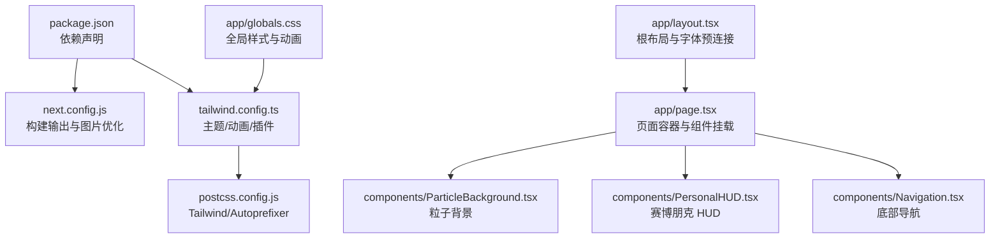
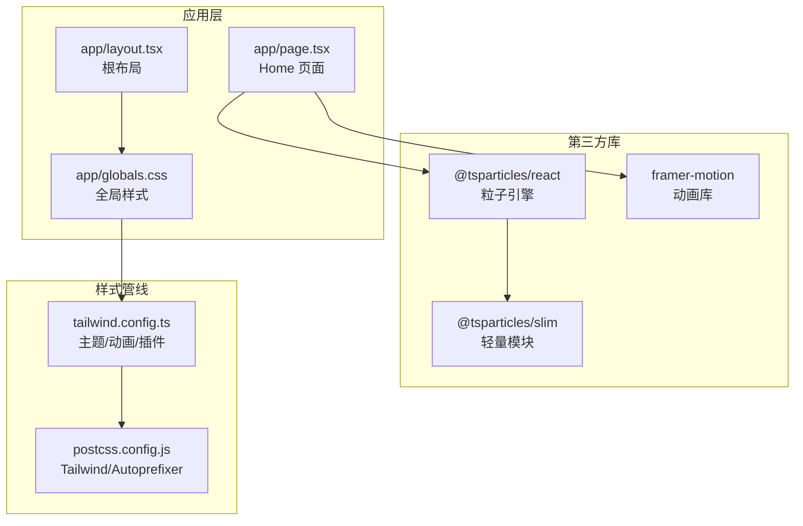
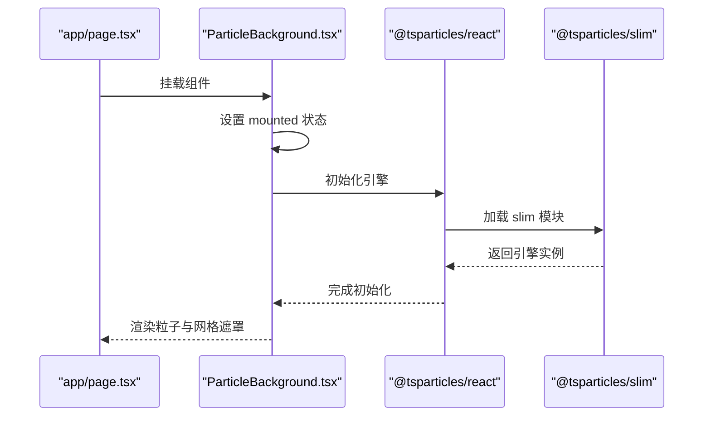
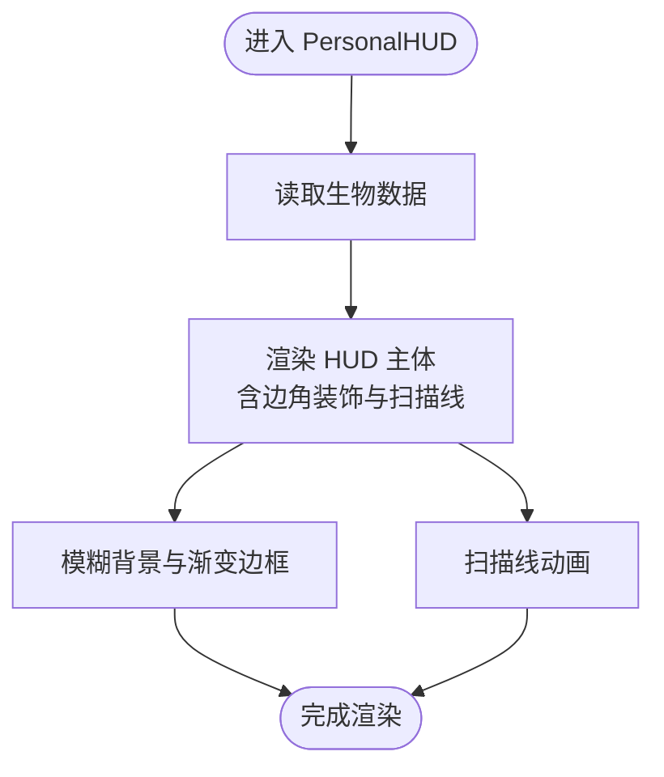
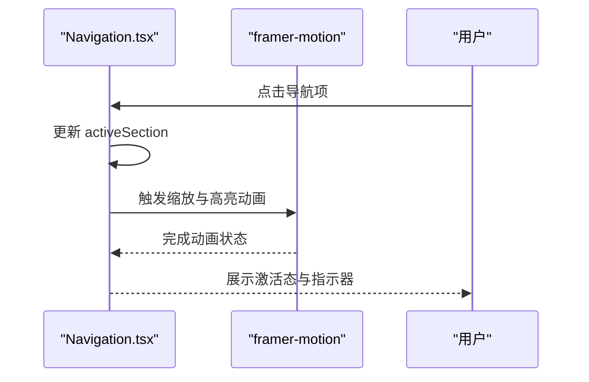
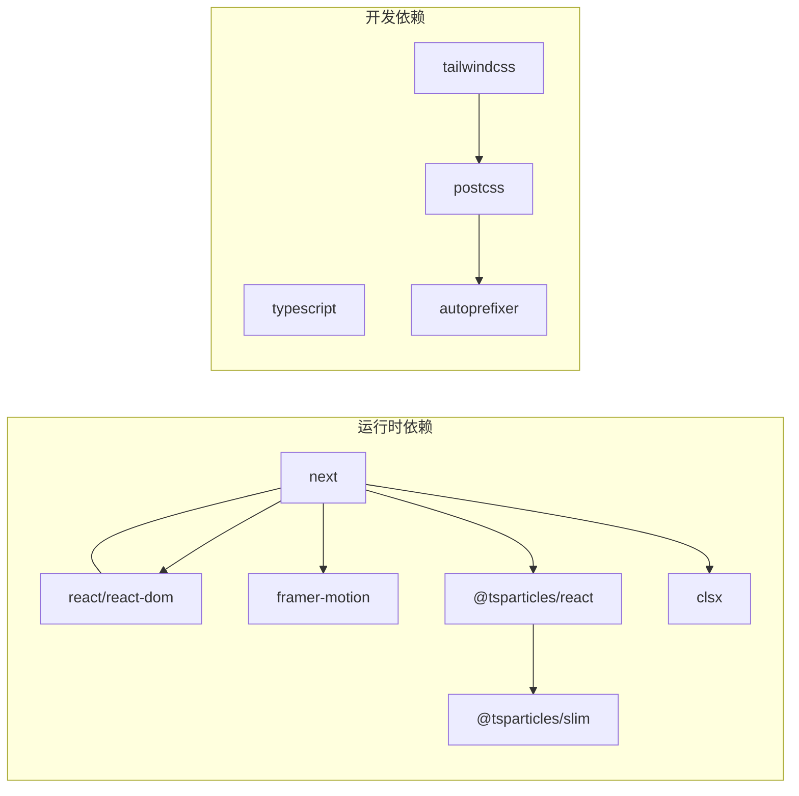

# 第三方集成

<cite>
**本文引用的文件**
- [package.json](file://package.json)
- [next.config.js](file://next.config.js)
- [tailwind.config.ts](file://tailwind.config.ts)
- [postcss.config.js](file://postcss.config.js)
- [app/layout.tsx](file://app/layout.tsx)
- [app/page.tsx](file://app/page.tsx)
- [app/globals.css](file://app/globals.css)
- [components/ParticleBackground.tsx](file://components/ParticleBackground.tsx)
- [components/PersonalHUD.tsx](file://components/PersonalHUD.tsx)
- [components/Navigation.tsx](file://components/Navigation.tsx)
</cite>

## 目录
1. [简介](#简介)
2. [项目结构](#项目结构)
3. [核心组件](#核心组件)
4. [架构总览](#架构总览)
5. [详细组件分析](#详细组件分析)
6. [依赖分析](#依赖分析)
7. [性能考量](#性能考量)
8. [故障排查指南](#故障排查指南)
9. [结论](#结论)
10. [附录](#附录)

## 简介
本指南面向在 Next.js 项目中集成第三方库的实践需求，结合当前仓库的实际实现，系统讲解从“添加新库”到“升级与替换”的完整流程，覆盖依赖安装、配置文件修改、导入方式、样式冲突与性能影响处理、安全与许可证合规性检查，以及常见问题的解决方案。文档同时给出基于现有组件（粒子背景、HUD、导航）的集成范式，帮助读者快速落地。

## 项目结构
该项目采用 Next.js App Router 结构，样式通过 Tailwind CSS 与 PostCSS 驱动，全局样式与主题扩展集中在 Tailwind 配置与全局 CSS 中；组件层使用客户端组件（use client）以启用动画与交互效果。

图示来源
- [package.json:11-19](file://package.json#L11-L19)
- [next.config.js:2-8](file://next.config.js#L2-L8)
- [tailwind.config.ts:3-69](file://tailwind.config.ts#L3-L69)
- [postcss.config.js:1-6](file://postcss.config.js#L1-L6)
- [app/layout.tsx:16-36](file://app/layout.tsx#L16-L36)
- [app/page.tsx:9-60](file://app/page.tsx#L9-L60)
- [components/ParticleBackground.tsx:1-126](file://components/ParticleBackground.tsx#L1-L126)
- [components/PersonalHUD.tsx:1-132](file://components/PersonalHUD.tsx#L1-L132)
- [components/Navigation.tsx:1-103](file://components/Navigation.tsx#L1-L103)
- [app/globals.css:1-212](file://app/globals.css#L1-L212)

章节来源
- [package.json:1-30](file://package.json#L1-L30)
- [next.config.js:1-11](file://next.config.js#L1-L11)
- [tailwind.config.ts:1-72](file://tailwind.config.ts#L1-L72)
- [postcss.config.js:1-7](file://postcss.config.js#L1-L7)
- [app/layout.tsx:1-37](file://app/layout.tsx#L1-L37)
- [app/page.tsx:1-61](file://app/page.tsx#L1-L61)
- [app/globals.css:1-212](file://app/globals.css#L1-L212)

## 核心组件
- 粒子背景：使用 @tsparticles/react 与 @tsparticles/slim 实现动态粒子与连线效果，初始化在客户端执行，避免 SSR 不兼容。
- HUD 组件：使用 framer-motion 实现进入与扫描线动画，配合 Tailwind 自定义主题色与模糊背景。
- 导航组件：底部导航按钮组，使用 framer-motion 的 hover/tap 动画与激活指示器。
- 布局与样式：根布局引入 Google Fonts 并设置语言属性；全局 CSS 定义滚动条、选择色、动画与网格背景；Tailwind 主题扩展了自定义颜色、字体族、阴影、动画与背景图案。

章节来源
- [components/ParticleBackground.tsx:1-126](file://components/ParticleBackground.tsx#L1-L126)
- [components/PersonalHUD.tsx:1-132](file://components/PersonalHUD.tsx#L1-L132)
- [components/Navigation.tsx:1-103](file://components/Navigation.tsx#L1-L103)
- [app/layout.tsx:16-36](file://app/layout.tsx#L16-L36)
- [app/globals.css:1-212](file://app/globals.css#L1-L212)
- [tailwind.config.ts:9-69](file://tailwind.config.ts#L9-L69)

## 架构总览
下图展示页面渲染与第三方库的交互关系：页面组件负责挂载第三方组件；第三方库通过客户端运行时初始化；样式由 Tailwind 与全局 CSS 提供统一视觉风格。

图示来源
- [app/page.tsx:4-5](file://app/page.tsx#L4-L5)
- [app/layout.tsx:24-30](file://app/layout.tsx#L24-L30)
- [app/globals.css:1-3](file://app/globals.css#L1-L3)
- [tailwind.config.ts:3-69](file://tailwind.config.ts#L3-L69)
- [postcss.config.js:1-6](file://postcss.config.js#L1-L6)
- [components/ParticleBackground.tsx:4-5](file://components/ParticleBackground.tsx#L4-L5)
- [components/PersonalHUD.tsx:3](file://components/PersonalHUD.tsx#L3)
- [components/Navigation.tsx:3](file://components/Navigation.tsx#L3)

## 详细组件分析

### 粒子背景组件集成分析
该组件展示了典型的第三方库客户端初始化模式：
- 使用客户端指令启用运行时特性
- 在初始化回调中加载轻量模块
- 通过条件渲染避免 SSR 渲染
- 与 Tailwind 主题色与背景网格叠加

图示来源
- [app/page.tsx:19](file://app/page.tsx#L19)
- [components/ParticleBackground.tsx:8-17](file://components/ParticleBackground.tsx#L8-L17)
- [components/ParticleBackground.tsx:23-104](file://components/ParticleBackground.tsx#L23-L104)
- [components/ParticleBackground.tsx:106-123](file://components/ParticleBackground.tsx#L106-L123)

章节来源
- [components/ParticleBackground.tsx:1-126](file://components/ParticleBackground.tsx#L1-L126)

### HUD 组件集成分析
该组件演示了动画与主题样式的协同：
- 使用 framer-motion 实现进入与扫描线动画
- Tailwind 自定义主题色与模糊背景
- 与全局 CSS 的动画类名配合

图示来源
- [components/PersonalHUD.tsx:6-121](file://components/PersonalHUD.tsx#L6-L121)
- [app/globals.css:122-148](file://app/globals.css#L122-L148)
- [tailwind.config.ts:9-37](file://tailwind.config.ts#L9-L37)

章节来源
- [components/PersonalHUD.tsx:1-132](file://components/PersonalHUD.tsx#L1-L132)
- [app/globals.css:122-148](file://app/globals.css#L122-L148)
- [tailwind.config.ts:9-37](file://tailwind.config.ts#L9-L37)

### 导航组件集成分析
底部导航组件展示了交互与动画的组合：
- 使用 framer-motion 的 hover/tap 缩放与点击事件
- 激活态指示器使用 layoutId 实现平滑过渡
- 与 Tailwind 自定义边框与模糊背景结合

图示来源
- [components/Navigation.tsx:17-91](file://components/Navigation.tsx#L17-L91)
- [components/Navigation.tsx:77-83](file://components/Navigation.tsx#L77-L83)

章节来源
- [components/Navigation.tsx:1-103](file://components/Navigation.tsx#L1-L103)

## 依赖分析
- 依赖来源与作用
  - 运行时依赖：Next.js、React、React DOM、framer-motion、@tsparticles/react、@tsparticles/slim、clsx
  - 开发依赖：TypeScript、Tailwind CSS、PostCSS、Autoprefixer
- 构建配置
  - 输出模式为静态导出，图片未优化以适配静态部署
- 样式管线
  - Tailwind 内容扫描范围覆盖 app、components、pages
  - 主题扩展包含自定义颜色、字体、阴影、动画与背景图案
  - PostCSS 启用 Tailwind 与 Autoprefixer 插件

图示来源
- [package.json:11-28](file://package.json#L11-L28)
- [next.config.js:2-8](file://next.config.js#L2-L8)
- [tailwind.config.ts:4-7](file://tailwind.config.ts#L4-L7)
- [postcss.config.js:1-6](file://postcss.config.js#L1-L6)

章节来源
- [package.json:1-30](file://package.json#L1-L30)
- [next.config.js:1-11](file://next.config.js#L1-L11)
- [tailwind.config.ts:1-72](file://tailwind.config.ts#L1-L72)
- [postcss.config.js:1-7](file://postcss.config.js#L1-L7)

## 性能考量
- 图片与静态导出
  - 当前配置为静态导出且关闭图片优化，若需优化图片体积与加载性能，可开启图片优化或按需懒加载。
- 动画与粒子
  - 粒子数量与动画帧率需平衡视觉与性能；可通过减少粒子数量、降低动画复杂度或在低端设备降级处理。
- 样式体积
  - Tailwind 内容扫描范围较大，建议定期清理未使用类名，避免样式体积膨胀。
- 字体加载
  - 根布局已进行字体预连接，可进一步考虑字体子集化与回退策略，减少阻塞。

章节来源
- [next.config.js:3-7](file://next.config.js#L3-L7)
- [components/ParticleBackground.tsx:33-34](file://components/ParticleBackground.tsx#L33-L34)
- [tailwind.config.ts:4-7](file://tailwind.config.ts#L4-L7)
- [app/layout.tsx:24-29](file://app/layout.tsx#L24-L29)

## 故障排查指南
- 客户端运行时错误
  - 现象：SSR 报错或找不到浏览器 API
  - 处理：确保使用客户端指令并在条件渲染中初始化第三方库
  - 参考：粒子背景组件的初始化与挂载逻辑
- 样式冲突
  - 现象：第三方库样式覆盖或与 Tailwind 类冲突
  - 处理：优先使用 Tailwind 工具类；必要时通过作用域 CSS 或 CSS Modules 隔离；检查内容扫描路径是否包含第三方组件目录
  - 参考：Tailwind 内容扫描范围与全局 CSS 的作用域
- 动画卡顿
  - 现象：动画不流畅或掉帧
  - 处理：减少动画层级、降低复杂度、限制帧率；在低端设备禁用部分动画
  - 参考：粒子背景的帧率与 HUD 的扫描线动画
- 构建失败或样式未生效
  - 现象：PostCSS/Tailwind 插件报错
  - 处理：确认插件版本兼容；检查内容扫描路径与文件扩展名；清理缓存后重试
  - 参考：PostCSS 与 Tailwind 配置

章节来源
- [components/ParticleBackground.tsx:8-17](file://components/ParticleBackground.tsx#L8-L17)
- [tailwind.config.ts:4-7](file://tailwind.config.ts#L4-L7)
- [app/globals.css:1-3](file://app/globals.css#L1-L3)
- [postcss.config.js:1-6](file://postcss.config.js#L1-L6)

## 结论
本项目以清晰的客户端初始化模式与 Tailwind 主题体系，为第三方库集成提供了稳定范式。遵循本文的“添加—配置—导入—验证—优化—合规”流程，可在保证性能与一致性的前提下，安全高效地引入新库并管理其生命周期。

## 附录

### 新增第三方库的标准流程
- 步骤一：安装依赖
  - 使用包管理器安装运行时依赖或开发依赖
  - 若涉及类型定义，同步安装对应 @types 包
- 步骤二：配置构建与样式
  - 如需静态导出或图片优化，调整构建配置
  - 如第三方库包含样式，确认内容扫描路径或引入全局样式
- 步骤三：导入与初始化
  - 在需要的组件中导入第三方模块
  - 对于客户端特性，使用客户端指令并在条件渲染中初始化
- 步骤四：验证与优化
  - 在不同设备与网络条件下测试
  - 分析性能指标并进行必要的降级或优化
- 步骤五：合规与文档
  - 记录许可证信息与依赖版本
  - 更新项目文档与变更日志

章节来源
- [package.json:11-28](file://package.json#L11-L28)
- [next.config.js:2-8](file://next.config.js#L2-L8)
- [tailwind.config.ts:4-7](file://tailwind.config.ts#L4-L7)
- [postcss.config.js:1-6](file://postcss.config.js#L1-L6)

### 升级与替换现有库
- 版本兼容性检查
  - 对照运行时与开发依赖的版本范围，评估破坏性变更
  - 关注第三方库的迁移指南与弃用提示
- 迁移步骤
  - 逐步替换依赖并在隔离分支验证
  - 更新初始化与配置代码，确保与 Tailwind 主题一致
  - 回归测试动画、样式与交互
- 替换示例（以粒子库为例）
  - 从 @tsparticles/react/slim 迁移到其他粒子库时，保持初始化回调与选项结构一致
  - 在页面组件中替换导入与调用点，确保客户端渲染不变

章节来源
- [components/ParticleBackground.tsx:4-5](file://components/ParticleBackground.tsx#L4-L5)
- [components/ParticleBackground.tsx:15-17](file://components/ParticleBackground.tsx#L15-L17)
- [tailwind.config.ts:9-69](file://tailwind.config.ts#L9-L69)

### 常用第三方库集成示例
- 图表库（如可视化库）
  - 安装与导入：在需要的组件中导入图表库模块
  - 客户端初始化：使用客户端指令并在条件渲染中初始化
  - 样式与主题：优先使用 Tailwind 工具类；必要时引入独立样式
- 编辑器（如富文本/Markdown 编辑器）
  - 安装与导入：在页面组件中导入编辑器组件
  - 客户端渲染：确保在客户端运行，避免 SSR 不兼容
  - 样式隔离：通过作用域 CSS 或 CSS Modules 避免与全局样式冲突
- UI 组件库（如原子化 UI 库）
  - 安装与导入：在页面或布局中导入所需组件
  - 内容扫描：将组件所在目录加入 Tailwind 内容扫描范围
  - 主题一致性：使用 Tailwind 自定义主题色与工具类保持风格统一

章节来源
- [package.json:11-19](file://package.json#L11-L19)
- [tailwind.config.ts:4-7](file://tailwind.config.ts#L4-L7)
- [app/layout.tsx:24-30](file://app/layout.tsx#L24-L30)

### 样式冲突与性能影响处理
- 样式冲突
  - 优先使用 Tailwind 工具类；对第三方库样式进行作用域隔离
  - 检查内容扫描路径，确保 Tailwind 能正确生成所需类名
- 性能影响
  - 控制动画复杂度与数量；在低端设备降级处理
  - 优化图片与字体加载；减少不必要的重绘与回流

章节来源
- [tailwind.config.ts:4-7](file://tailwind.config.ts#L4-L7)
- [app/globals.css:122-148](file://app/globals.css#L122-L148)
- [components/ParticleBackground.tsx:33-34](file://components/ParticleBackground.tsx#L33-L34)

### 安全与许可证合规
- 许可证检查
  - 记录每个依赖的许可证类型与使用限制
  - 在发布前进行许可证扫描与合规审查
- 安全更新
  - 定期更新依赖以修复已知漏洞
  - 关注安全公告并及时修补

[本节为通用指导，无需特定文件引用]