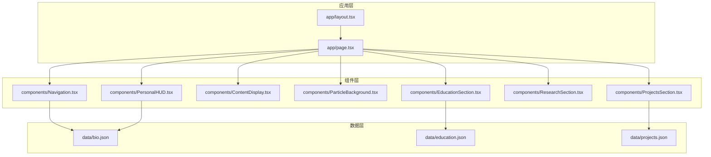
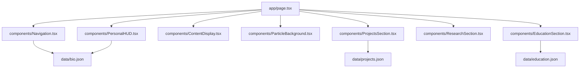
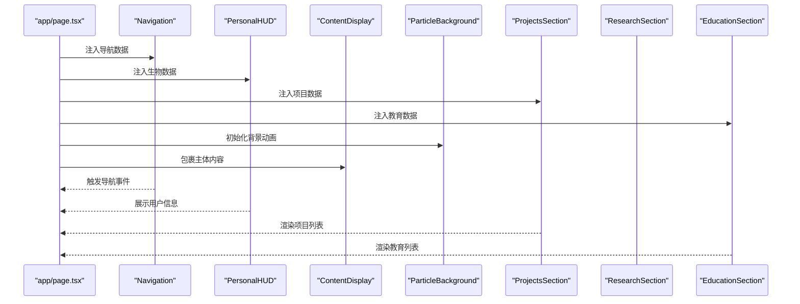
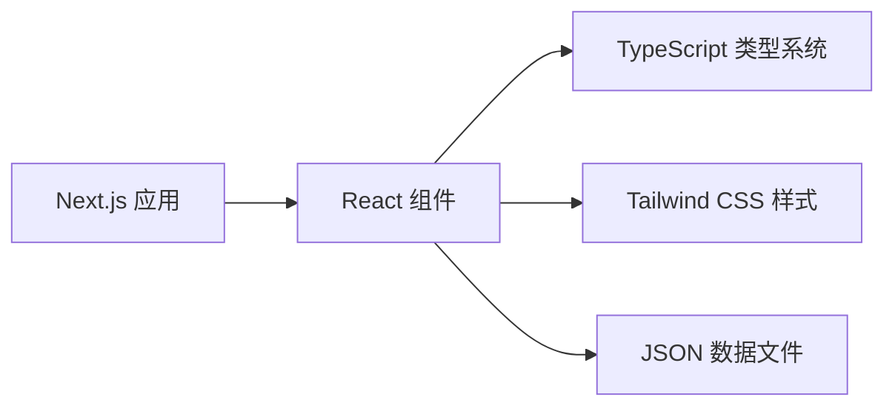

# 组件扩展

<cite>
**本文引用的文件**
- [app/layout.tsx](file://app/layout.tsx)
- [app/page.tsx](file://app/page.tsx)
- [components/ContentDisplay.tsx](file://components/ContentDisplay.tsx)
- [components/Navigation.tsx](file://components/Navigation.tsx)
- [components/PersonalHUD.tsx](file://components/PersonalHUD.tsx)
- [components/ParticleBackground.tsx](file://components/ParticleBackground.tsx)
- [components/ProjectsSection.tsx](file://components/ProjectsSection.tsx)
- [components/ResearchSection.tsx](file://components/ResearchSection.tsx)
- [components/EducationSection.tsx](file://components/EducationSection.tsx)
- [data/bio.json](file://data/bio.json)
- [data/education.json](file://data/education.json)
- [data/projects.json](file://data/projects.json)
- [package.json](file://package.json)
- [tsconfig.json](file://tsconfig.json)
- [tailwind.config.ts](file://tailwind.config.ts)
- [postcss.config.js](file://postcss.config.js)
</cite>

## 目录
1. [简介](#简介)
2. [项目结构](#项目结构)
3. [核心组件](#核心组件)
4. [架构总览](#架构总览)
5. [详细组件分析](#详细组件分析)
6. [依赖关系分析](#依赖关系分析)
7. [性能考量](#性能考量)
8. [故障排查指南](#故障排查指南)
9. [结论](#结论)
10. [附录](#附录)

## 简介
本指南面向希望在现有Next.js + React + TypeScript项目中扩展组件的开发者，系统讲解如何设计新组件、定义Props与类型、修改与增强现有组件、实现组件间通信、提升可复用与可配置性、以及组件测试与最佳实践。文档以仓库中的实际组件为蓝本，提供从简单到复杂的扩展案例与可视化图示。

## 项目结构
该项目采用Next.js应用结构，页面级入口位于app目录，业务组件集中在components目录，数据资源位于data目录。TypeScript与Tailwind CSS作为主要技术栈，配置文件位于根目录。

图表来源
- [app/layout.tsx](file://app/layout.tsx)
- [app/page.tsx](file://app/page.tsx)
- [components/Navigation.tsx](file://components/Navigation.tsx)
- [components/PersonalHUD.tsx](file://components/PersonalHUD.tsx)
- [components/ContentDisplay.tsx](file://components/ContentDisplay.tsx)
- [components/ParticleBackground.tsx](file://components/ParticleBackground.tsx)
- [components/ProjectsSection.tsx](file://components/ProjectsSection.tsx)
- [components/ResearchSection.tsx](file://components/ResearchSection.tsx)
- [components/EducationSection.tsx](file://components/EducationSection.tsx)
- [data/bio.json](file://data/bio.json)
- [data/education.json](file://data/education.json)
- [data/projects.json](file://data/projects.json)

章节来源
- [app/layout.tsx](file://app/layout.tsx)
- [app/page.tsx](file://app/page.tsx)
- [package.json](file://package.json)

## 核心组件
本节概述现有组件的职责与交互模式，为后续扩展提供参考。

- Navigation：导航栏组件，负责页面内跳转与菜单控制。
- PersonalHUD：个人信息展示组件，结合生物数据渲染头像、姓名、简介等。
- ContentDisplay：内容容器组件，用于承载页面主体内容。
- ParticleBackground：粒子背景组件，提供动态视觉效果。
- ProjectsSection：项目展示组件，基于项目数据渲染列表。
- ResearchSection：研究展示组件，基于研究数据渲染列表。
- EducationSection：教育背景组件，基于教育数据渲染列表。

章节来源
- [components/Navigation.tsx](file://components/Navigation.tsx)
- [components/PersonalHUD.tsx](file://components/PersonalHUD.tsx)
- [components/ContentDisplay.tsx](file://components/ContentDisplay.tsx)
- [components/ParticleBackground.tsx](file://components/ParticleBackground.tsx)
- [components/ProjectsSection.tsx](file://components/ProjectsSection.tsx)
- [components/ResearchSection.tsx](file://components/ResearchSection.tsx)
- [components/EducationSection.tsx](file://components/EducationSection.tsx)

## 架构总览
页面入口通过app/page.tsx组合多个业务组件；组件之间通过Props传递数据与回调，部分组件依赖外部数据文件。Tailwind CSS提供样式能力，TypeScript确保类型安全。

图表来源
- [app/page.tsx](file://app/page.tsx)
- [components/Navigation.tsx](file://components/Navigation.tsx)
- [components/PersonalHUD.tsx](file://components/PersonalHUD.tsx)
- [components/ContentDisplay.tsx](file://components/ContentDisplay.tsx)
- [components/ParticleBackground.tsx](file://components/ParticleBackground.tsx)
- [components/ProjectsSection.tsx](file://components/ProjectsSection.tsx)
- [components/ResearchSection.tsx](file://components/ResearchSection.tsx)
- [components/EducationSection.tsx](file://components/EducationSection.tsx)
- [data/bio.json](file://data/bio.json)
- [data/projects.json](file://data/projects.json)
- [data/education.json](file://data/education.json)

## 详细组件分析

### Navigation 导航组件
- 设计要点
  - 使用Props接收导航项列表与当前激活状态，支持主题切换或菜单展开收起。
  - 建议将导航项类型化为接口，包含文本、链接与可选图标字段。
- 扩展建议
  - 新增Props：是否显示徽章、是否启用下划线高亮、是否响应式折叠。
  - 行为增强：点击导航项时触发回调，支持滚动定位或路由变更。
- 可复用性
  - 将导航项数据与UI解耦，允许外部传入任意导航树。
- 测试建议
  - 单元测试验证渲染项数量与链接正确性；集成测试验证点击事件与回调触发。

章节来源
- [components/Navigation.tsx](file://components/Navigation.tsx)

### PersonalHUD 个人信息组件
- 设计要点
  - 接收生物数据对象，渲染头像、姓名、简介与社交链接。
  - Props应明确字段类型与可选性，避免运行时错误。
- 扩展建议
  - 新增Props：是否显示社交按钮、是否显示“了解更多”按钮、是否启用渐变背景。
  - 样式调整：支持多尺寸头像、不同布局（横向/纵向）。
- 可复用性
  - 将数据源抽象为可注入的Provider或Context，便于在多页面复用。
- 测试建议
  - 快照测试验证默认渲染；单元测试覆盖空数据与部分字段缺失场景。

章节来源
- [components/PersonalHUD.tsx](file://components/PersonalHUD.tsx)
- [data/bio.json](file://data/bio.json)

### ContentDisplay 内容容器组件
- 设计要点
  - 作为页面主体的容器，支持插槽式内容插入与通用间距/对齐设置。
- 扩展建议
  - 新增Props：是否启用居中布局、是否添加阴影或圆角、是否限制最大宽度。
  - 行为改变：支持滚动到锚点或自动定位到特定区域。
- 可复用性
  - 抽象为通用卡片/面板组件，支持标题、副标题与操作区。
- 测试建议
  - 集成测试验证子组件渲染与容器样式叠加效果。

章节来源
- [components/ContentDisplay.tsx](file://components/ContentDisplay.tsx)

### ParticleBackground 粒子背景组件
- 设计要点
  - 提供Canvas粒子动画，需考虑性能与响应式适配。
- 扩展建议
  - 新增Props：粒子密度、颜色方案、交互灵敏度、是否启用鼠标吸引。
  - 性能优化：在小屏设备上降低粒子数量或禁用动画。
- 可复用性
  - 封装为独立组件，支持全局注册或按需引入。
- 测试建议
  - 性能测试验证帧率与内存占用；快照测试验证渲染一致性。

章节来源
- [components/ParticleBackground.tsx](file://components/ParticleBackground.tsx)

### ProjectsSection 项目展示组件
- 设计要点
  - 基于项目数据渲染列表，支持分页、筛选与排序。
- 扩展建议
  - 新增Props：是否启用搜索框、是否显示标签过滤、是否懒加载。
  - 行为改变：点击项目卡片打开详情模态框或跳转至外部链接。
- 可复用性
  - 将数据请求逻辑抽离为Hook，支持本地与远程数据源。
- 测试建议
  - 单元测试验证渲染条目与筛选逻辑；E2E测试验证点击与跳转。

章节来源
- [components/ProjectsSection.tsx](file://components/ProjectsSection.tsx)
- [data/projects.json](file://data/projects.json)

### ResearchSection 研究展示组件
- 设计要点
  - 类似项目组件，但聚焦学术研究内容。
- 扩展建议
  - 新增Props：是否显示引用次数、是否显示作者信息、是否启用摘要展开。
- 可复用性
  - 与项目组件共享基础UI结构，通过Props切换字段集。
- 测试建议
  - 单元测试覆盖不同数据形态与空数据场景。

章节来源
- [components/ResearchSection.tsx](file://components/ResearchSection.tsx)

### EducationSection 教育背景组件
- 设计要点
  - 渲染时间线或卡片列表，突出学校、学位与时间。
- 扩展建议
  - 新增Props：是否显示时间轴连接线、是否启用折叠/展开。
- 可复用性
  - 抽象为通用时间线组件，支持自定义节点内容。
- 测试建议
  - 快照测试验证时间线渲染；单元测试覆盖排序与空数据。

章节来源
- [components/EducationSection.tsx](file://components/EducationSection.tsx)
- [data/education.json](file://data/education.json)

### 页面组合与数据流
页面通过app/page.tsx组合各业务组件，并将数据文件作为Props注入到对应组件。

图表来源
- [app/page.tsx](file://app/page.tsx)
- [components/Navigation.tsx](file://components/Navigation.tsx)
- [components/PersonalHUD.tsx](file://components/PersonalHUD.tsx)
- [components/ContentDisplay.tsx](file://components/ContentDisplay.tsx)
- [components/ParticleBackground.tsx](file://components/ParticleBackground.tsx)
- [components/ProjectsSection.tsx](file://components/ProjectsSection.tsx)
- [components/ResearchSection.tsx](file://components/ResearchSection.tsx)
- [components/EducationSection.tsx](file://components/EducationSection.tsx)
- [data/bio.json](file://data/bio.json)
- [data/projects.json](file://data/projects.json)
- [data/education.json](file://data/education.json)

## 依赖关系分析
- 技术栈
  - Next.js：页面路由与SSR/CSR支持。
  - React：组件化UI构建。
  - TypeScript：类型安全与IDE体验。
  - Tailwind CSS：原子化样式与响应式布局。
- 外部依赖
  - 项目未声明额外UI库，组件多为自定义实现，利于统一风格与体积控制。
- 配置
  - tsconfig.json启用严格模式，确保类型检查质量。
  - Tailwind与PostCSS配置提供样式编译与按需生成。

图表来源
- [package.json](file://package.json)
- [tsconfig.json](file://tsconfig.json)
- [tailwind.config.ts](file://tailwind.config.ts)
- [postcss.config.js](file://postcss.config.js)

章节来源
- [package.json](file://package.json)
- [tsconfig.json](file://tsconfig.json)
- [tailwind.config.ts](file://tailwind.config.ts)
- [postcss.config.js](file://postcss.config.js)

## 性能考量
- 渲染性能
  - 合理拆分组件，避免不必要的重渲染；对长列表使用虚拟化或分页。
  - 在粒子背景等高开销组件中，根据设备性能动态调整参数。
- 资源加载
  - 图片与字体按需加载，使用现代格式与合适的尺寸。
- 样式体积
  - Tailwind按需生成，避免引入未使用的类名；必要时自定义主题变量减少重复样式。

## 故障排查指南
- 类型错误
  - 检查Props接口定义是否与调用处一致；确保可选字段有默认值或条件渲染。
- 样式异常
  - 确认Tailwind类名拼写与作用域；检查postcss与tailwind配置是否生效。
- 数据不显示
  - 核对数据文件路径与字段名；在组件中增加空数据保护与占位提示。
- 动画卡顿
  - 降低粒子数量或帧率；在移动端禁用复杂动画。

## 结论
通过明确的Props设计、严格的TypeScript类型约束、清晰的数据流与可复用的组件结构，可以在现有项目基础上高效扩展组件。遵循本文的扩展流程与最佳实践，能够快速实现从简单到复杂的组件增强，并保持良好的可维护性与性能表现。

## 附录

### 组件扩展步骤清单
- 设计阶段
  - 明确组件职责与边界，定义Props接口与默认值。
  - 选择合适的类型（联合类型、可选属性、只读属性）。
- 实现阶段
  - 编写组件主体逻辑，确保条件渲染与错误处理。
  - 使用Tailwind类名实现样式，必要时封装主题变量。
- 集成阶段
  - 在页面中引入组件，注入数据与回调。
  - 进行单元测试与集成测试，验证渲染与交互。
- 发布阶段
  - 文档化Props与行为，提供示例与注意事项。

### 组件间通信最佳实践
- 父子组件通信
  - 父组件通过Props向下传递数据，子组件通过回调向上反馈事件。
- 兄弟组件通信
  - 通过共同父组件协调状态，或使用Context共享轻量状态。
- 跨层级通信
  - 使用Context或集中式状态管理（如Zustand），避免深层Props传递。
- 事件冒泡与防抖
  - 对高频事件（如滚动、窗口大小变化）进行防抖/节流处理。

### 可复用性与可配置性
- 抽象公共逻辑：将样式、布局、交互抽离为可配置的Hook或工具函数。
- 参数化：通过Props提供主题、尺寸、显隐等开关，减少分支逻辑。
- 插槽化：支持自定义渲染内容，提升灵活性。

### 组件测试方法与工具推荐
- 单元测试
  - 使用React Testing Library或@testing-library/react，断言渲染结果与交互行为。
- 集成测试
  - 在页面级别验证组件组合与数据流，关注Props注入与回调触发。
- E2E测试
  - 使用Cypress或Playwright，模拟真实用户操作与路由跳转。
- 快照测试
  - 对静态组件进行快照对比，防止样式回归。
- 性能测试
  - 使用浏览器性能面板或Lighthouse，评估渲染与交互性能。

### 代码示例路径（不展示具体代码）
- 新建导航组件：参考 [components/Navigation.tsx](file://components/Navigation.tsx)
- 新建个人信息组件：参考 [components/PersonalHUD.tsx](file://components/PersonalHUD.tsx)
- 新建内容容器组件：参考 [components/ContentDisplay.tsx](file://components/ContentDisplay.tsx)
- 新建粒子背景组件：参考 [components/ParticleBackground.tsx](file://components/ParticleBackground.tsx)
- 新建项目展示组件：参考 [components/ProjectsSection.tsx](file://components/ProjectsSection.tsx)
- 新建研究展示组件：参考 [components/ResearchSection.tsx](file://components/ResearchSection.tsx)
- 新建教育背景组件：参考 [components/EducationSection.tsx](file://components/EducationSection.tsx)
- 页面组合与数据注入：参考 [app/page.tsx](file://app/page.tsx)
- 数据文件示例：参考 [data/bio.json](file://data/bio.json)、[data/projects.json](file://data/projects.json)、[data/education.json](file://data/education.json)