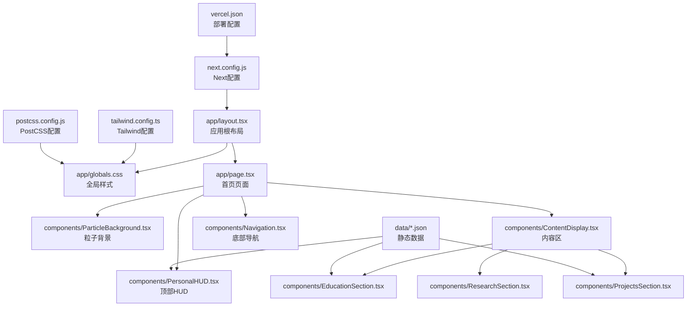
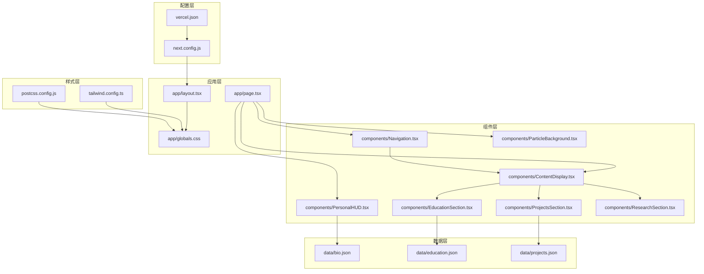
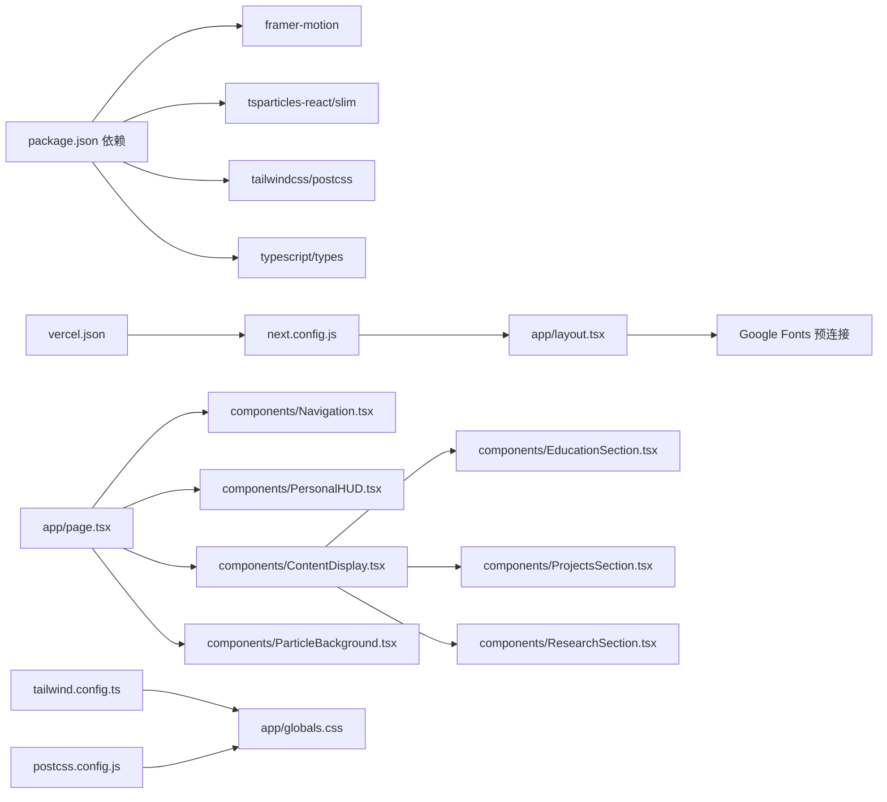
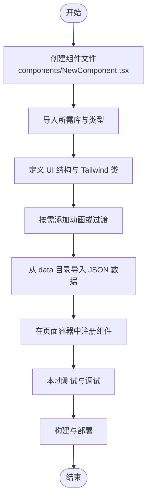

# 自定义与扩展

<cite>
**本文引用的文件**
- [package.json](file://package.json)
- [next.config.js](file://next.config.js)
- [vercel.json](file://vercel.json)
- [tailwind.config.ts](file://tailwind.config.ts)
- [postcss.config.js](file://postcss.config.js)
- [app/layout.tsx](file://app/layout.tsx)
- [app/globals.css](file://app/globals.css)
- [app/page.tsx](file://app/page.tsx)
- [components/ParticleBackground.tsx](file://components/ParticleBackground.tsx)
- [components/PersonalHUD.tsx](file://components/PersonalHUD.tsx)
- [components/Navigation.tsx](file://components/Navigation.tsx)
- [components/ContentDisplay.tsx](file://components/ContentDisplay.tsx)
- [components/EducationSection.tsx](file://components/EducationSection.tsx)
- [components/ProjectsSection.tsx](file://components/ProjectsSection.tsx)
- [components/ResearchSection.tsx](file://components/ResearchSection.tsx)
- [data/bio.json](file://data/bio.json)
- [data/education.json](file://data/education.json)
- [data/projects.json](file://data/projects.json)
</cite>

## 目录
1. [简介](#简介)
2. [项目结构](#项目结构)
3. [核心组件](#核心组件)
4. [架构总览](#架构总览)
5. [详细组件分析](#详细组件分析)
6. [依赖关系分析](#依赖关系分析)
7. [性能考量](#性能考量)
8. [故障排查指南](#故障排查指南)
9. [结论](#结论)
10. [附录](#附录)

## 简介
本指南面向希望对“杨天成个人网页”项目进行深度定制与扩展的开发者。内容涵盖主题定制（颜色系统、字体、布局）、新增功能模块（组件、数据模型、导航）、样式扩展（新组件样式与覆盖）、动画自定义（新增与修改）、第三方库集成与注意事项、性能优化策略（代码分割、懒加载、缓存）、插件与扩展点利用，以及扩展的兼容性与向后兼容性保障。

## 项目结构
该项目采用 Next.js App Router 结构，样式通过 Tailwind CSS 配置与 PostCSS 处理，全局样式在应用层注入，组件按功能分层组织，数据以 JSON 文件形式提供。

**图示来源**
- [app/layout.tsx:1-37](file://app/layout.tsx#L1-L37)
- [app/globals.css:1-212](file://app/globals.css#L1-L212)
- [app/page.tsx:1-61](file://app/page.tsx#L1-L61)
- [components/ParticleBackground.tsx:1-126](file://components/ParticleBackground.tsx#L1-L126)
- [components/PersonalHUD.tsx:1-132](file://components/PersonalHUD.tsx#L1-L132)
- [components/ContentDisplay.tsx:1-125](file://components/ContentDisplay.tsx#L1-L125)
- [components/EducationSection.tsx:1-143](file://components/EducationSection.tsx#L1-L143)
- [components/ProjectsSection.tsx:1-161](file://components/ProjectsSection.tsx#L1-L161)
- [components/ResearchSection.tsx:1-175](file://components/ResearchSection.tsx#L1-L175)
- [tailwind.config.ts:1-72](file://tailwind.config.ts#L1-L72)
- [postcss.config.js:1-7](file://postcss.config.js#L1-L7)
- [next.config.js:1-11](file://next.config.js#L1-L11)
- [vercel.json:1-7](file://vercel.json#L1-L7)
- [data/bio.json:1-14](file://data/bio.json#L1-L14)
- [data/education.json:1-33](file://data/education.json#L1-L33)
- [data/projects.json:1-57](file://data/projects.json#L1-L57)

**章节来源**
- [app/layout.tsx:1-37](file://app/layout.tsx#L1-L37)
- [app/globals.css:1-212](file://app/globals.css#L1-L212)
- [app/page.tsx:1-61](file://app/page.tsx#L1-L61)
- [tailwind.config.ts:1-72](file://tailwind.config.ts#L1-L72)
- [postcss.config.js:1-7](file://postcss.config.js#L1-L7)
- [next.config.js:1-11](file://next.config.js#L1-L11)
- [vercel.json:1-7](file://vercel.json#L1-L7)

## 核心组件
- 应用根布局与元数据：负责注入全局样式、预连接字体资源、设置站点元信息。
- 页面容器：协调粒子背景、HUD、内容区、导航条与装饰元素。
- 内容区：根据激活的导航项切换不同模块（教育、项目、研究）或欢迎页。
- 导航：底部横向导航，支持悬停发光、抖动、扫描线等赛博朋克风格动画。
- HUD：顶部右上角信息面板，包含扫描线、渐变边框、技能标签等。
- 粒子背景：基于 tsparticles 的动态粒子系统，配合网格与暗角效果。
- 数据驱动：通过 JSON 文件提供生物、教育、项目等静态数据。

**章节来源**
- [app/layout.tsx:1-37](file://app/layout.tsx#L1-L37)
- [app/page.tsx:1-61](file://app/page.tsx#L1-L61)
- [components/ContentDisplay.tsx:1-125](file://components/ContentDisplay.tsx#L1-L125)
- [components/Navigation.tsx:1-103](file://components/Navigation.tsx#L1-L103)
- [components/PersonalHUD.tsx:1-132](file://components/PersonalHUD.tsx#L1-L132)
- [components/ParticleBackground.tsx:1-126](file://components/ParticleBackground.tsx#L1-L126)
- [data/bio.json:1-14](file://data/bio.json#L1-L14)
- [data/education.json:1-33](file://data/education.json#L1-L33)
- [data/projects.json:1-57](file://data/projects.json#L1-L57)

## 架构总览
整体采用“布局-容器-组件-数据”的分层架构。样式系统由 Tailwind 扩展与全局 CSS 共同构成；动画系统由 Tailwind 动画与 Framer Motion 双通道提供；第三方库通过 npm 引入并在组件内按需初始化。

**图示来源**
- [app/layout.tsx:1-37](file://app/layout.tsx#L1-L37)
- [app/page.tsx:1-61](file://app/page.tsx#L1-L61)
- [app/globals.css:1-212](file://app/globals.css#L1-L212)
- [tailwind.config.ts:1-72](file://tailwind.config.ts#L1-L72)
- [postcss.config.js:1-7](file://postcss.config.js#L1-L7)
- [components/Navigation.tsx:1-103](file://components/Navigation.tsx#L1-L103)
- [components/PersonalHUD.tsx:1-132](file://components/PersonalHUD.tsx#L1-L132)
- [components/ContentDisplay.tsx:1-125](file://components/ContentDisplay.tsx#L1-L125)
- [components/EducationSection.tsx:1-143](file://components/EducationSection.tsx#L1-L143)
- [components/ProjectsSection.tsx:1-161](file://components/ProjectsSection.tsx#L1-L161)
- [components/ResearchSection.tsx:1-175](file://components/ResearchSection.tsx#L1-L175)
- [components/ParticleBackground.tsx:1-126](file://components/ParticleBackground.tsx#L1-L126)
- [data/bio.json:1-14](file://data/bio.json#L1-L14)
- [data/education.json:1-33](file://data/education.json#L1-L33)
- [data/projects.json:1-57](file://data/projects.json#L1-L57)
- [next.config.js:1-11](file://next.config.js#L1-L11)
- [vercel.json:1-7](file://vercel.json#L1-L7)

## 详细组件分析

### 主题定制：颜色系统、字体与布局
- 颜色系统
  - 在 Tailwind 配置中通过扩展键定义了赛博朋克风格的色彩集与 HUD 背景色，同时在全局 CSS 中定义了 CSS 变量以供复用。
  - 建议：新增颜色时优先在 Tailwind 扩展中集中管理，避免重复定义；如需动态切换，可在全局 CSS 中通过变量控制。
- 字体系统
  - 通过 Google Fonts 预连接与注入，Tailwind 配置中定义了科技感字体族与等宽字体族。
  - 建议：新增字体时同步更新 Tailwind 配置与预连接链接，确保 SSR 与首屏渲染稳定。
- 布局系统
  - 使用固定定位与 z-index 层级管理 HUD、导航、粒子背景与内容区，配合全局滚动行为与无滚动条样式。
  - 建议：新增布局元素时保持层级与定位一致性，避免遮挡与渲染异常。

**章节来源**
- [tailwind.config.ts:9-70](file://tailwind.config.ts#L9-L70)
- [app/globals.css:5-31](file://app/globals.css#L5-L31)
- [app/layout.tsx:24-30](file://app/layout.tsx#L24-L30)

### 新增功能模块：组件、数据模型与路由
- 新组件开发
  - 步骤：在 components 目录下新建组件文件，使用客户端渲染注解，引入所需动画与第三方库；在页面容器中注册并传参。
  - 示例路径：[components/Navigation.tsx:1-103](file://components/Navigation.tsx#L1-L103)、[components/PersonalHUD.tsx:1-132](file://components/PersonalHUD.tsx#L1-L132)
- 数据模型扩展
  - 步骤：在 data 目录新增 JSON 文件，组件中导入并消费数据；确保字段命名与类型一致。
  - 示例路径：[data/projects.json:1-57](file://data/projects.json#L1-L57)、[components/ProjectsSection.tsx:1-161](file://components/ProjectsSection.tsx#L1-L161)
- 路由配置
  - 本项目采用 App Router，页面位于 app 目录；如需新增页面，直接在 app 下创建目录或文件即可。
  - 当前页面通过根布局统一注入样式与元数据。
  - 示例路径：[app/page.tsx:1-61](file://app/page.tsx#L1-L61)、[app/layout.tsx:1-37](file://app/layout.tsx#L1-L37)

**章节来源**
- [components/Navigation.tsx:1-103](file://components/Navigation.tsx#L1-L103)
- [components/PersonalHUD.tsx:1-132](file://components/PersonalHUD.tsx#L1-L132)
- [components/ProjectsSection.tsx:1-161](file://components/ProjectsSection.tsx#L1-L161)
- [data/projects.json:1-57](file://data/projects.json#L1-L57)
- [app/page.tsx:1-61](file://app/page.tsx#L1-L61)
- [app/layout.tsx:1-37](file://app/layout.tsx#L1-L37)

### 样式系统扩展：新组件样式与覆盖
- 新组件样式编写
  - 建议优先使用 Tailwind 类组合，必要时在全局 CSS 中补充关键样式与动画。
  - 示例路径：[components/EducationSection.tsx:64-134](file://components/EducationSection.tsx#L64-L134)、[app/globals.css:172-187](file://app/globals.css#L172-L187)
- 现有样式覆盖
  - 通过 Tailwind 扩展中的 utilities 或在组件内使用层叠类实现局部覆盖。
  - 示例路径：[tailwind.config.ts:207-211](file://tailwind.config.ts#L207-L211)

**章节来源**
- [components/EducationSection.tsx:64-134](file://components/EducationSection.tsx#L64-L134)
- [app/globals.css:172-187](file://app/globals.css#L172-L187)
- [tailwind.config.ts:207-211](file://tailwind.config.ts#L207-L211)

### 动画效果自定义：新增与修改
- 新增动画类型
  - 在 Tailwind 配置的 keyframes 与 animation 中定义新动画，并在组件中通过类名应用。
  - 示例路径：[tailwind.config.ts:38-59](file://tailwind.config.ts#L38-L59)
- 修改现有动画
  - 可通过调整关键帧参数或在组件内覆盖类名实现局部修改。
  - 示例路径：[components/PersonalHUD.tsx:28-33](file://components/PersonalHUD.tsx#L28-L33)、[app/globals.css:122-148](file://app/globals.css#L122-L148)

**章节来源**
- [tailwind.config.ts:38-59](file://tailwind.config.ts#L38-L59)
- [components/PersonalHUD.tsx:28-33](file://components/PersonalHUD.tsx#L28-L33)
- [app/globals.css:122-148](file://app/globals.css#L122-L148)

### 第三方库集成与注意事项
- 已集成库
  - 动画：framer-motion
  - 粒子系统：@tsparticles/react、@tsparticles/slim
  - 工具函数：clsx
- 集成方式
  - 在组件中按需导入并初始化；例如粒子系统在挂载后初始化。
  - 示例路径：[components/ParticleBackground.tsx:15-17](file://components/ParticleBackground.tsx#L15-L17)、[package.json:11-28](file://package.json#L11-L28)
- 注意事项
  - 客户端组件需使用客户端渲染注解；
  - 初始化逻辑应避免在服务端执行；
  - 对于大型库，建议按需加载与懒加载策略。

**章节来源**
- [components/ParticleBackground.tsx:1-126](file://components/ParticleBackground.tsx#L1-L126)
- [package.json:11-28](file://package.json#L11-L28)

### 性能优化策略：代码分割、懒加载与缓存
- 代码分割
  - 利用 Next.js 的 App Router 自然分割页面与组件；在新增页面时保持职责单一。
- 懒加载
  - 对大组件或第三方库采用动态导入与条件渲染；例如粒子系统仅在挂载后初始化。
  - 示例路径：[components/ParticleBackground.tsx:9-19](file://components/ParticleBackground.tsx#L9-L19)
- 缓存优化
  - 静态导出与图片未优化配置已启用；可结合 CDN 与浏览器缓存策略提升访问速度。
  - 示例路径：[next.config.js:3-8](file://next.config.js#L3-L8)

**章节来源**
- [components/ParticleBackground.tsx:9-19](file://components/ParticleBackground.tsx#L9-L19)
- [next.config.js:3-8](file://next.config.js#L3-L8)

### 插件开发与扩展点利用
- Tailwind 插件
  - 当前配置中插件数组为空；可在此扩展自定义工具类或主题变量。
  - 示例路径：[tailwind.config.ts:69-70](file://tailwind.config.ts#L69-L70)
- Next.js 扩展点
  - 通过 next.config.js 与 vercel.json 配置构建、安装与部署流程，便于 CI/CD 集成。
  - 示例路径：[next.config.js:1-11](file://next.config.js#L1-L11)、[vercel.json:1-7](file://vercel.json#L1-L7)

**章节来源**
- [tailwind.config.ts:69-70](file://tailwind.config.ts#L69-L70)
- [next.config.js:1-11](file://next.config.js#L1-L11)
- [vercel.json:1-7](file://vercel.json#L1-L7)

### 兼容性与向后兼容性
- 浏览器兼容
  - 使用现代 CSS 特性（如 backdrop-filter、clip-path），需关注目标浏览器支持情况。
- 版本管理
  - 严格锁定依赖版本，升级前进行充分测试；通过语义化版本控制减少破坏性变更。
- 渐进增强
  - 将动画与特效作为增强而非必需功能，确保降级场景仍可正常浏览。

## 依赖关系分析

**图示来源**
- [package.json:11-28](file://package.json#L11-L28)
- [app/layout.tsx:24-30](file://app/layout.tsx#L24-L30)
- [app/page.tsx:1-61](file://app/page.tsx#L1-L61)
- [components/Navigation.tsx:1-103](file://components/Navigation.tsx#L1-L103)
- [components/PersonalHUD.tsx:1-132](file://components/PersonalHUD.tsx#L1-L132)
- [components/ContentDisplay.tsx:1-125](file://components/ContentDisplay.tsx#L1-L125)
- [components/EducationSection.tsx:1-143](file://components/EducationSection.tsx#L1-L143)
- [components/ProjectsSection.tsx:1-161](file://components/ProjectsSection.tsx#L1-L161)
- [components/ResearchSection.tsx:1-175](file://components/ResearchSection.tsx#L1-L175)
- [components/ParticleBackground.tsx:1-126](file://components/ParticleBackground.tsx#L1-L126)
- [tailwind.config.ts:1-72](file://tailwind.config.ts#L1-L72)
- [postcss.config.js:1-7](file://postcss.config.js#L1-L7)
- [next.config.js:1-11](file://next.config.js#L1-L11)
- [vercel.json:1-7](file://vercel.json#L1-L7)

**章节来源**
- [package.json:11-28](file://package.json#L11-L28)
- [tailwind.config.ts:1-72](file://tailwind.config.ts#L1-L72)
- [postcss.config.js:1-7](file://postcss.config.js#L1-L7)
- [next.config.js:1-11](file://next.config.js#L1-L11)
- [vercel.json:1-7](file://vercel.json#L1-L7)

## 性能考量
- 组件渲染
  - 使用 Framer Motion 的 AnimatePresence 控制切换动画，避免不必要的重绘。
- 图片与资源
  - 静态导出模式下图片未优化，建议在生产环境结合 CDN 与缓存策略。
- 动画与粒子
  - 合理设置帧率与粒子数量，避免高负载设备卡顿；可按设备能力动态调整。

[本节为通用指导，无需特定文件引用]

## 故障排查指南
- 字体加载失败
  - 检查预连接与注入链接是否正确；确认网络可达性。
  - 参考路径：[app/layout.tsx:24-30](file://app/layout.tsx#L24-L30)
- 动画不生效
  - 确认 Tailwind 扩展中的动画与关键帧已定义；检查类名拼写。
  - 参考路径：[tailwind.config.ts:38-59](file://tailwind.config.ts#L38-L59)
- 粒子系统无显示
  - 确认客户端挂载完成后再初始化；检查第三方库版本与初始化回调。
  - 参考路径：[components/ParticleBackground.tsx:9-19](file://components/ParticleBackground.tsx#L9-L19)
- 样式覆盖无效
  - 检查 Tailwind 层级与优先级；必要时使用 !important 或在全局 CSS 中补充。
  - 参考路径：[tailwind.config.ts:207-211](file://tailwind.config.ts#L207-L211)

**章节来源**
- [app/layout.tsx:24-30](file://app/layout.tsx#L24-L30)
- [tailwind.config.ts:38-59](file://tailwind.config.ts#L38-L59)
- [components/ParticleBackground.tsx:9-19](file://components/ParticleBackground.tsx#L9-L19)
- [tailwind.config.ts:207-211](file://tailwind.config.ts#L207-L211)

## 结论
本项目以 Tailwind 为核心样式系统，结合 Framer Motion 与 tsparticles 实现丰富的赛博朋克风格视觉与交互体验。通过合理的组件分层、数据驱动与配置化扩展，开发者可以高效地进行主题定制、功能扩展与性能优化。遵循本文档的实践建议，可在保证兼容性的前提下持续迭代与演进。

[本节为总结性内容，无需特定文件引用]

## 附录

### 新增组件开发流程图

[本图为概念流程示意，无需图示来源]