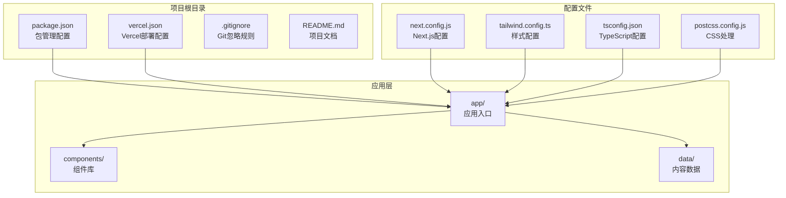
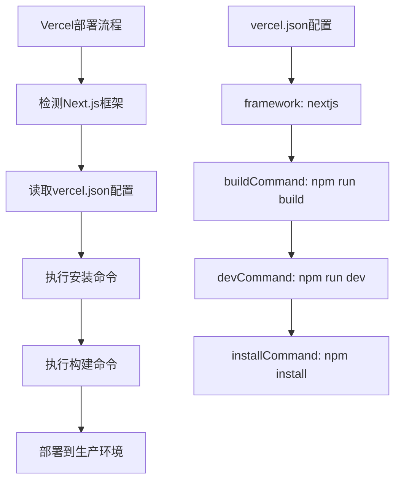
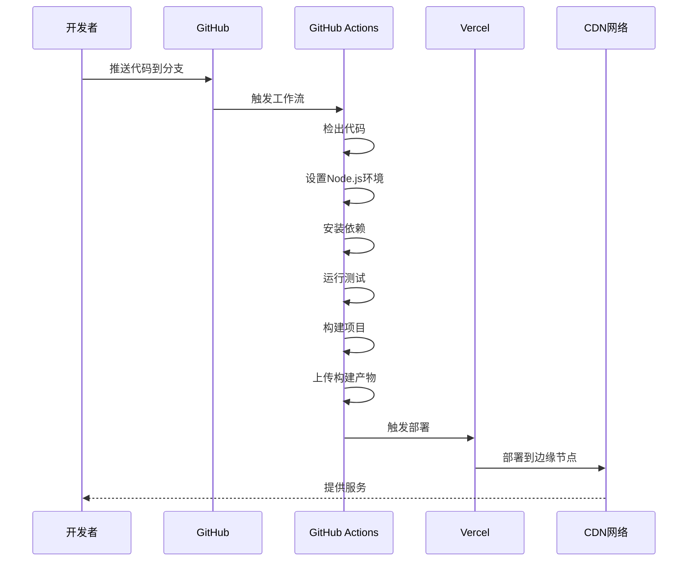
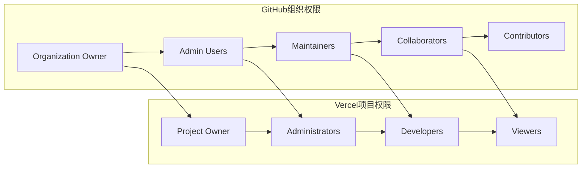
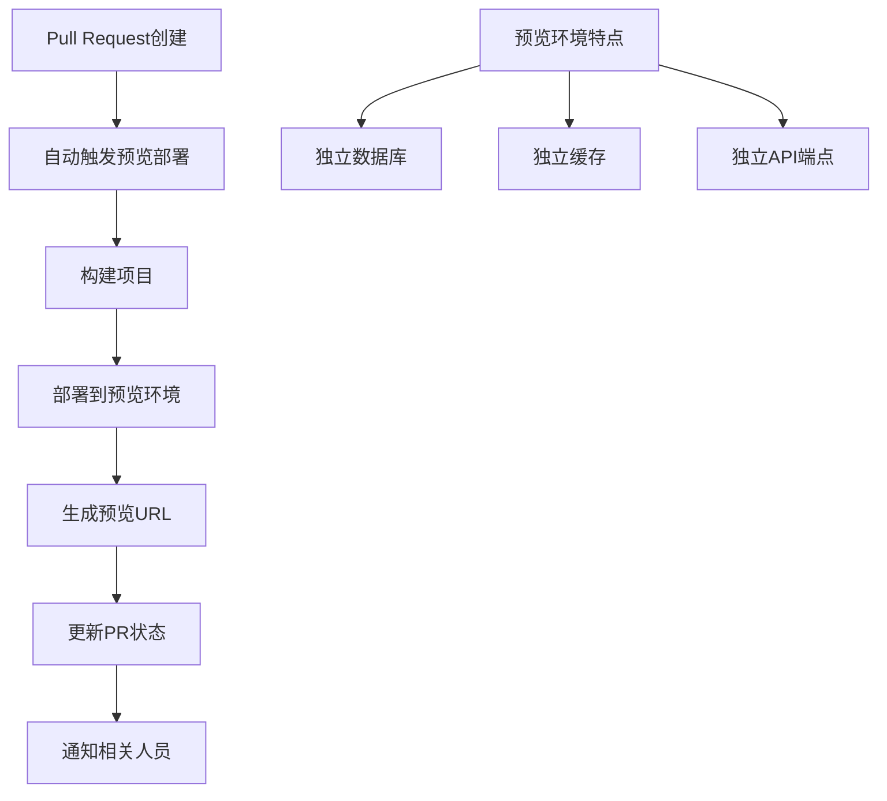
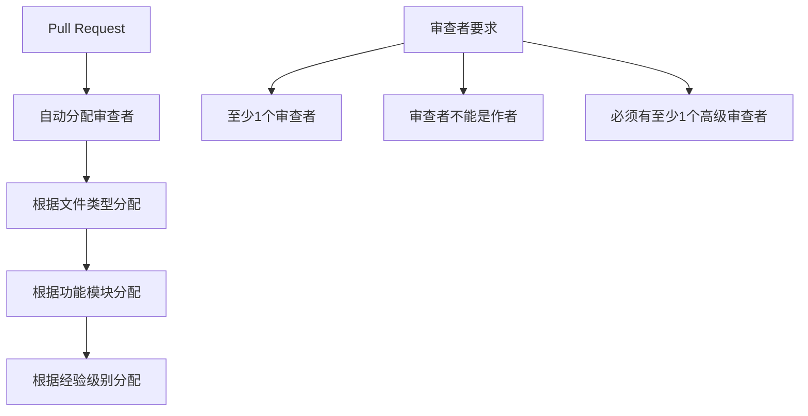
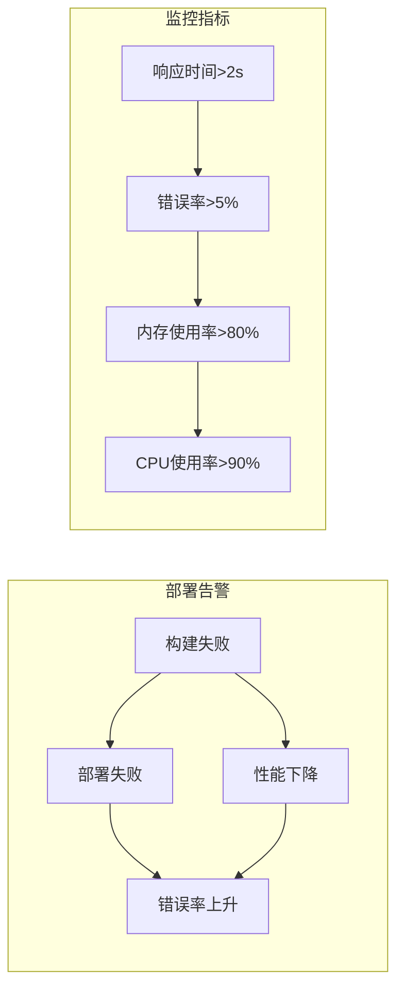
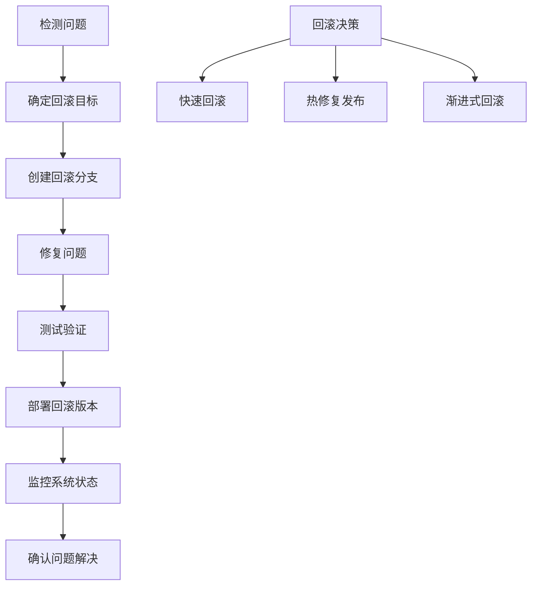

# GitHub集成与自动化

<cite>
**本文档引用的文件**
- [package.json](file://package.json)
- [vercel.json](file://vercel.json)
- [.gitignore](file://.gitignore)
- [README.md](file://README.md)
- [tailwind.config.ts](file://tailwind.config.ts)
- [next.config.js](file://next.config.js)
- [tsconfig.json](file://tsconfig.json)
- [postcss.config.js](file://postcss.config.js)
- [app/page.tsx](file://app/page.tsx)
- [data/bio.json](file://data/bio.json)
</cite>

## 目录
1. [简介](#简介)
2. [项目结构概览](#项目结构概览)
3. [GitHub集成基础配置](#github集成基础配置)
4. [Vercel自动化部署配置](#vercel自动化部署配置)
5. [GitHub Actions工作流配置](#github-actions工作流配置)
6. [分支保护规则配置](#分支保护规则配置)
7. [部署权限管理](#部署权限管理)
8. [预览部署与生产部署](#预览部署与生产部署)
9. [合并请求检查配置](#合并请求检查配置)
10. [部署状态通知与告警](#部署状态通知与告警)
11. [版本控制与回滚最佳实践](#版本控制与回滚最佳实践)
12. [故障排除指南](#故障排除指南)
13. [总结](#总结)

## 简介

本指南详细介绍了如何将Next.js个人网站项目与GitHub和Vercel进行深度集成，实现完整的自动化部署流水线。该个人网站项目采用现代化的技术栈，包括Next.js 14、Tailwind CSS、Framer Motion等，通过GitHub Actions实现CI/CD自动化，通过Vercel实现零配置部署。

该项目具有以下特点：
- 使用Next.js App Router架构
- 支持静态导出部署
- 包含丰富的动画效果和视觉特效
- 数据驱动的内容管理系统
- 响应式设计和赛博朋克风格

## 项目结构概览

项目采用标准的Next.js 14 App Router结构，主要目录和文件如下：



**图表来源**
- [package.json:1-30](file://package.json#L1-L30)
- [vercel.json:1-7](file://vercel.json#L1-L7)
- [next.config.js:1-11](file://next.config.js#L1-L11)
- [tailwind.config.ts:1-72](file://tailwind.config.ts#L1-L72)

**章节来源**
- [package.json:1-30](file://package.json#L1-L30)
- [README.md:146-169](file://README.md#L146-L169)

## GitHub集成基础配置

### 仓库初始化与基本设置

1. **创建GitHub仓库**
   - 在GitHub上创建新的仓库，选择合适的可见性设置
   - 初始化README、.gitignore和LICENSE文件

2. **本地仓库配置**
   ```bash
   git init
   git add .
   git commit -m "Initial commit"
   git branch -M main
   git remote add origin https://github.com/username/repository.git
   git push -u origin main
   ```

3. **.gitignore配置优化**
   项目已经包含了完整的.gitignore配置，涵盖了：
   - Node.js依赖和构建产物
   - 测试覆盖率和调试日志
   - Next.js特定文件和目录
   - Vercel相关文件
   - TypeScript编译缓存

**章节来源**
- [.gitignore:1-36](file://.gitignore#L1-L36)
- [package.json:1-30](file://package.json#L1-L30)

### 分支策略建议

推荐使用Git Flow分支模型：
- `main`分支：生产环境代码
- `develop`分支：开发环境代码
- `feature/*`分支：新功能开发
- `release/*`分支：版本发布准备
- `hotfix/*`分支：紧急修复

## Vercel自动化部署配置

### Vercel项目设置

1. **项目导入流程**
   - 登录Vercel控制台
   - 点击"New Project"
   - 选择GitHub仓库进行导入
   - Vercel会自动检测Next.js框架

2. **项目配置文件**
   vercel.json文件提供了详细的部署配置：



**图表来源**
- [vercel.json:1-7](file://vercel.json#L1-L7)

### 零配置部署优势

- **自动框架检测**：Vercel自动识别Next.js项目
- **智能构建优化**：根据项目类型自动配置构建参数
- **CDN加速**：全球CDN分发，提升访问速度
- **HTTPS支持**：自动配置SSL证书
- **域名管理**：支持自定义域名绑定

**章节来源**
- [vercel.json:1-7](file://vercel.json#L1-L7)
- [README.md:31-42](file://README.md#L31-L42)

## GitHub Actions工作流配置

### 创建工作流文件

在项目根目录创建`.github/workflows/`目录，并添加以下工作流配置：

```yaml
name: CI/CD Pipeline

on:
  push:
    branches: [main, develop]
  pull_request:
    branches: [main]

jobs:
  build-and-test:
    runs-on: ubuntu-latest
    
    steps:
    - name: Checkout code
      uses: actions/checkout@v4
      
    - name: Setup Node.js
      uses: actions/setup-node@v4
      with:
        node-version: '18.x'
        cache: 'npm'
        
    - name: Install dependencies
      run: npm ci
      
    - name: Run lint
      run: npm run lint
      
    - name: Run tests
      run: npm test
      
    - name: Build project
      run: npm run build
      
    - name: Upload artifacts
      uses: actions/upload-artifact@v3
      with:
        name: build-artifacts
        path: out/
        
  deploy-staging:
    needs: build-and-test
    if: github.ref == 'refs/heads/develop'
    runs-on: ubuntu-latest
    
    steps:
    - name: Deploy to staging
      uses: peaceiris/actions-gh-pages@v3
      with:
        github_token: ${{ secrets.GITHUB_TOKEN }}
        publish_dir: ./out
        
  deploy-production:
    needs: build-and-test
    if: github.ref == 'refs/heads/main'
    runs-on: ubuntu-latest
    
    steps:
    - name: Deploy to production
      uses: peaceiris/actions-gh-pages@v3
      with:
        github_token: ${{ secrets.GITHUB_TOKEN }}
        publish_dir: ./out
```

### 工作流组件详解



**图表来源**
- [package.json:5-10](file://package.json#L5-L10)

**章节来源**
- [package.json:5-10](file://package.json#L5-L10)

## 分支保护规则配置

### 生产分支保护

1. **main分支保护规则**
   - 必须启用保护分支
   - 需要至少1个审查者批准
   - 必须通过所有CI检查
   - 禁止强制推送
   - 禁止删除分支

2. **必需的检查项**
   - 代码质量检查
   - 单元测试通过
   - 构建成功
   - 安全扫描通过

3. **管理员权限设置**
   - 管理员可以绕过保护规则
   - 需要双重身份验证
   - 定期审查权限分配

### 开发分支保护

1. **develop分支保护规则**
   - 允许快速合并但需要审查
   - 需要至少1个审查者批准
   - 必须通过CI检查
   - 支持squash合并

2. **功能分支管理**
   - 功能分支命名规范：feature/功能名称
   - 最大保留时间：30天
   - 自动清理未活动分支

**章节来源**
- [README.md:31-42](file://README.md#L31-L42)

## 部署权限管理

### 用户角色与权限



### 权限分配最佳实践

1. **最小权限原则**
   - 为不同角色分配最小必要权限
   - 定期审查和更新权限
   - 使用团队和组管理权限

2. **敏感信息保护**
   - 使用GitHub Secrets存储敏感信息
   - 限制对生产环境的访问
   - 实施多因素认证

3. **权限审计**
   - 定期生成权限报告
   - 监控异常访问模式
   - 及时撤销离职人员权限

**章节来源**
- [vercel.json:1-7](file://vercel.json#L1-L7)

## 预览部署与生产部署

### 部署环境对比

| 特性 | 预览环境 | 生产环境 |
|------|----------|----------|
| 触发条件 | Pull Request创建/更新 | Push到main分支 |
| 域名 | 自动生成临时域名 | 自定义域名 |
| 配置 | 开发配置 | 生产配置 |
| 性能 | 有限资源 | 全量资源 |
| 监控 | 基础监控 | 全面监控 |
| 回滚 | 支持快速回滚 | 支持灰度发布 |

### 预览部署配置



**图表来源**
- [next.config.js:3-8](file://next.config.js#L3-L8)

### 生产部署配置

1. **部署触发条件**
   - main分支的Push事件
   - 手动触发部署
   - 定时任务触发

2. **部署前检查**
   - 代码审查通过
   - 所有测试通过
   - 安全扫描通过
   - 性能基准测试

3. **部署后验证**
   - 健康检查
   - 关键功能测试
   - 性能指标监控
   - 错误率监控

**章节来源**
- [next.config.js:3-8](file://next.config.js#L3-L8)

## 合并请求检查配置

### 必需检查清单

1. **代码质量检查**
   - ESLint检查通过
   - TypeScript类型检查通过
   - 代码格式化检查通过

2. **测试覆盖检查**
   - 单元测试覆盖率≥80%
   - 集成测试通过
   - 端到端测试通过

3. **安全检查**
   - 依赖漏洞扫描
   - 代码安全审计
   - 配置安全性检查

### 审查者分配策略



### 审查流程优化

1. **自动化审查**
   - 代码风格检查
   - 性能回归检查
   - 安全问题标记

2. **人工审查重点**
   - 架构变更审查
   - 用户体验影响评估
   - 风险评估

**章节来源**
- [package.json:5-10](file://package.json#L5-L10)

## 部署状态通知与告警

### 通知渠道配置

1. **Slack通知**
   - 成功部署通知
   - 失败告警通知
   - 性能警告通知

2. **邮件通知**
   - 重要事件通知
   - 周报和月报
   - 安全事件报告

3. **微信企业号通知**
   - 实时状态更新
   - 紧急告警推送
   - 团队协作沟通

### 告警阈值设置



### 告警响应流程

1. **自动响应**
   - 失败部署自动回滚
   - 性能问题自动降级
   - 安全威胁自动隔离

2. **人工干预**
   - 严重问题立即通知
   - 影响范围评估
   - 解决方案制定

**章节来源**
- [README.md:31-42](file://README.md#L31-L42)

## 版本控制与回滚最佳实践

### 版本管理策略

1. **语义化版本控制**
   - 主版本：破坏性变更
   - 次版本：向后兼容功能
   - 修订版本：向后兼容修复

2. **标签管理**
   ```bash
   # 创建版本标签
   git tag -a v1.2.3 -m "Release version 1.2.3"
   git push origin v1.2.3
   
   # 回滚到指定版本
   git checkout v1.2.3
   git push origin +v1.2.3
   ```

3. **发布流程**
   - 创建release分支
   - 更新版本号
   - 运行最终测试
   - 创建标签并发布

### 回滚策略



### 数据备份与恢复

1. **数据库备份**
   - 定期自动备份
   - 增量备份策略
   - 跨区域备份

2. **配置备份**
   - 环境变量备份
   - 配置文件版本控制
   - 密钥轮换管理

3. **内容备份**
   - 静态资源备份
   - 用户生成内容备份
   - 缓存数据备份

**章节来源**
- [package.json:1-30](file://package.json#L1-L30)

## 故障排除指南

### 常见部署问题

1. **构建失败排查**
   - 检查Node.js版本兼容性
   - 验证依赖安装完整性
   - 查看构建日志详细信息

2. **运行时错误排查**
   - 检查环境变量配置
   - 验证API端点可用性
   - 确认数据库连接正常

3. **性能问题排查**
   - 分析CDN缓存命中率
   - 检查图片优化配置
   - 监控第三方资源加载

### 调试工具使用

1. **本地调试**
   - 使用`npm run dev`启动开发服务器
   - 利用浏览器开发者工具
   - 检查网络请求和响应

2. **生产环境调试**
   - 启用详细日志记录
   - 使用性能分析工具
   - 监控错误追踪系统

3. **监控和告警**
   - 设置关键指标阈值
   - 配置异常告警规则
   - 建立问题响应流程

### 性能优化建议

1. **构建优化**
   - 启用代码分割
   - 优化图片资源
   - 配置压缩和混淆

2. **运行时优化**
   - 实现懒加载
   - 优化重渲染
   - 使用缓存策略

3. **基础设施优化**
   - 选择合适CDN节点
   - 配置合适的缓存策略
   - 优化数据库查询

**章节来源**
- [README.md:17-30](file://README.md#L17-L30)

## 总结

通过本指南，您已经了解了如何将Next.js个人网站项目与GitHub和Vercel进行深度集成，实现完整的自动化部署流水线。关键要点包括：

1. **基础配置**：正确设置GitHub仓库、分支保护规则和部署权限
2. **自动化部署**：利用Vercel的零配置部署能力和GitHub Actions的CI/CD流水线
3. **环境管理**：区分预览部署和生产部署，建立完善的检查机制
4. **监控告警**：建立全面的部署状态通知和失败告警系统
5. **版本控制**：实施最佳的版本管理和回滚策略

这套完整的集成方案能够确保您的个人网站项目具备高可靠性、高可用性和良好的开发体验。建议定期回顾和优化这些配置，以适应项目的发展需求。