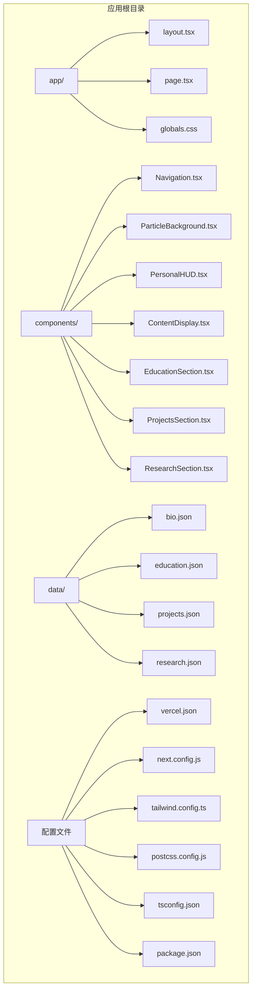
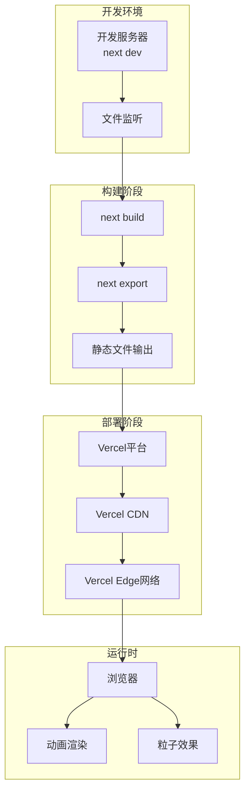
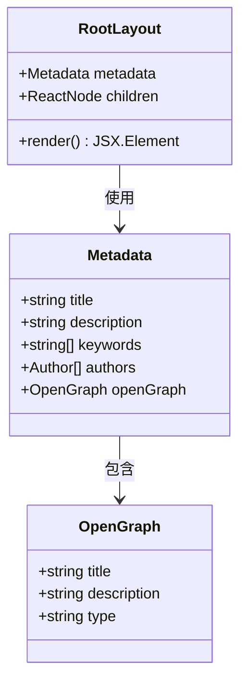
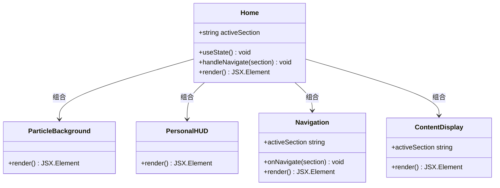
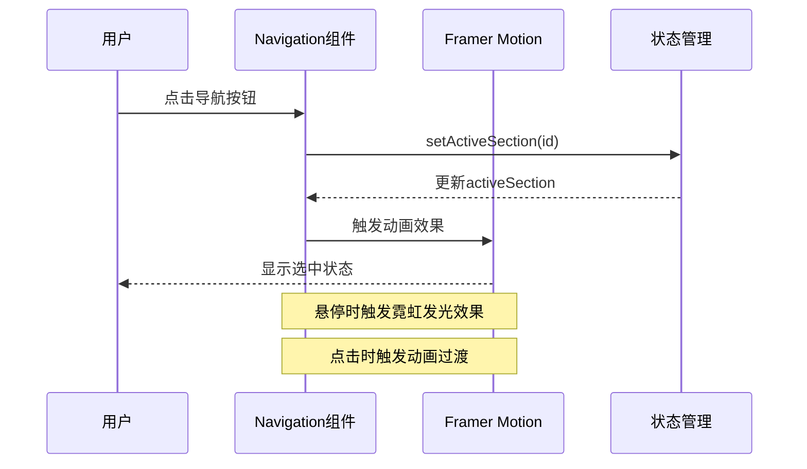
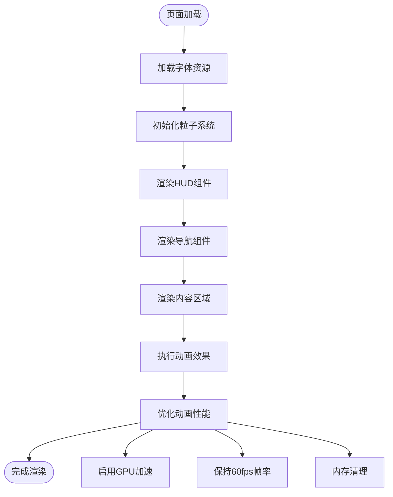
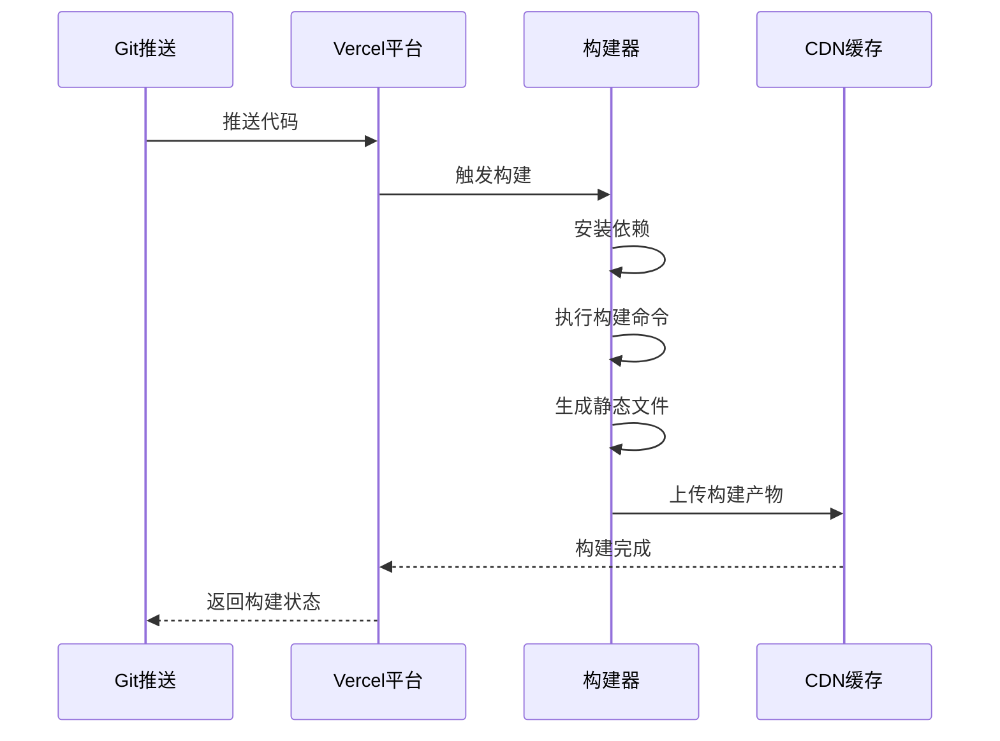

# Vercel部署配置

<cite>
**本文档引用的文件**
- [vercel.json](file://杨天成个人网页/vercel.json)
- [next.config.js](file://杨天成个人网页/next.config.js)
- [package.json](file://杨天成个人网页/package.json)
- [tailwind.config.ts](file://杨天成个人网页/tailwind.config.ts)
- [postcss.config.js](file://杨天成个人网页/postcss.config.js)
- [tsconfig.json](file://杨天成个人网页/tsconfig.json)
- [app/layout.tsx](file://杨天成个人网页/app/layout.tsx)
- [app/page.tsx](file://杨天成个人网页/app/page.tsx)
- [components/Navigation.tsx](file://杨天成个人网页/components/Navigation.tsx)
- [README.md](file://杨天成个人网页/README.md)
</cite>

## 目录
1. [简介](#简介)
2. [项目结构](#项目结构)
3. [核心组件](#核心组件)
4. [架构概览](#架构概览)
5. [详细组件分析](#详细组件分析)
6. [依赖关系分析](#依赖关系分析)
7. [性能考虑](#性能考虑)
8. [故障排除指南](#故障排除指南)
9. [结论](#结论)
10. [附录](#附录)

## 简介

这是一个基于Next.js 14的赛博朋克风格个人主页项目，专为Vercel平台优化部署而设计。该项目采用了现代化的前端技术栈，包括React、TypeScript、Tailwind CSS、Framer Motion和react-tsparticles等库，构建了一个极具未来感的数字个人名片。

项目的核心特点包括：
- 零配置部署到Vercel
- 静态导出模式（Static Export）
- 赛博朋克风格的视觉设计
- 响应式布局和流畅动画效果
- 实时粒子背景系统

## 项目结构

该项目采用Next.js App Router架构，具有清晰的模块化组织：



**图表来源**
- [vercel.json:1-7](file://杨天成个人网页/vercel.json#L1-L7)
- [next.config.js:1-11](file://杨天成个人网页/next.config.js#L1-L11)
- [package.json:1-30](file://杨天成个人网页/package.json#L1-L30)

**章节来源**
- [README.md:146-169](file://杨天成个人网页/README.md#L146-L169)

## 核心组件

### Vercel配置组件

Vercel通过`vercel.json`文件实现零配置部署：

| 配置项 | 值 | 说明 |
|--------|----|-----|
| framework | nextjs | 指定使用Next.js框架 |
| buildCommand | npm run build | 构建命令 |
| devCommand | npm run dev | 开发服务器启动命令 |
| installCommand | npm install | 依赖安装命令 |

### Next.js配置组件

项目采用静态导出模式，优化了性能和部署效率：

| 配置项 | 值 | 说明 |
|--------|----|-----|
| output | export | 静态导出模式 |
| images.unoptimized | true | 关闭图片优化以配合静态导出 |
| trailingSlash | true | 添加路径尾部斜杠 |

### 构建脚本组件

package.json中的脚本定义了完整的开发和构建流程：

| 脚本 | 用途 | 命令 |
|------|------|------|
| dev | 开发模式 | next dev |
| build | 生产构建 | next build |
| start | 生产启动 | next start |
| lint | 代码检查 | next lint |

**章节来源**
- [vercel.json:1-7](file://杨天成个人网页/vercel.json#L1-L7)
- [next.config.js:1-11](file://杨天成个人网页/next.config.js#L1-L11)
- [package.json:5-10](file://杨天成个人网页/package.json#L5-L10)

## 架构概览

项目采用前后端分离的静态网站架构，所有内容在构建时生成：



**图表来源**
- [next.config.js:3-8](file://杨天成个人网页/next.config.js#L3-L8)
- [vercel.json:2-6](file://杨天成个人网页/vercel.json#L2-L6)

## 详细组件分析

### 应用布局组件

根布局负责全局元数据和字体加载：



**图表来源**
- [app/layout.tsx:4-14](file://杨天成个人网页/app/layout.tsx#L4-L14)

### 主页组件

主页集成了多个交互式组件：



**图表来源**
- [app/page.tsx:9-29](file://杨天成个人网页/app/page.tsx#L9-L29)
- [components/Navigation.tsx:17-103](file://杨天成个人网页/components/Navigation.tsx#L17-L103)

### 导航组件

导航系统实现了赛博朋克风格的交互效果：



**图表来源**
- [components/Navigation.tsx:17-103](file://杨天成个人网页/components/Navigation.tsx#L17-L103)

**章节来源**
- [app/layout.tsx:1-37](file://杨天成个人网页/app/layout.tsx#L1-L37)
- [app/page.tsx:1-61](file://杨天成个人网页/app/page.tsx#L1-L61)
- [components/Navigation.tsx:1-103](file://杨天成个人网页/components/Navigation.tsx#L1-L103)

## 依赖关系分析

项目的技术栈依赖关系如下：

```mermaid
graph TB
subgraph "核心框架"
NextJS[Next.js 14.2.5]
React[React 18.3.1]
TS[TypeScript 5]
end
subgraph "样式系统"
Tailwind[Tailwind CSS 3.4.6]
PostCSS[PostCSS 8.4.39]
Autoprefixer[Autoprefixer]
end
subgraph "动画库"
Framer[Framer Motion 11.3.8]
Particles[react-tsparticles 3.0.0]
end
subgraph "工具库"
CLSX[clsx 2.1.1]
ParticlesSlim[@tsparticles/slim 3.5.0]
end
NextJS --> React
NextJS --> TS
Tailwind --> PostCSS
PostCSS --> Autoprefixer
NextJS --> Tailwind
NextJS --> Framer
NextJS --> Particles
Particles --> ParticlesSlim
NextJS --> CLSX
```

**图表来源**
- [package.json:11-28](file://杨天成个人网页/package.json#L11-L28)

**章节来源**
- [package.json:1-30](file://杨天成个人网页/package.json#L1-L30)

## 性能考虑

### 静态导出优化

项目采用静态导出模式，具有以下性能优势：

1. **零服务器成本**：完全静态内容，无需服务器实例
2. **快速加载**：内容直接从CDN分发
3. **高可用性**：全球CDN节点提供稳定服务
4. **低延迟**：就近用户访问最近的边缘节点

### 图片优化策略

由于使用静态导出模式，项目禁用了Next.js的内置图片优化：

- `images.unoptimized: true` - 禁用Next.js图片优化
- 手动优化图片尺寸和格式
- 使用适当的图片压缩工具

### 动画性能优化



**图表来源**
- [next.config.js:4-6](file://杨天成个人网页/next.config.js#L4-L6)

**章节来源**
- [next.config.js:1-11](file://杨天成个人网页/next.config.js#L1-L11)

## 故障排除指南

### 常见部署问题

1. **构建失败**
   - 检查Node.js版本兼容性
   - 验证package.json中的依赖完整性
   - 确认没有语法错误

2. **图片显示问题**
   - 确保图片路径正确
   - 检查图片格式是否受支持
   - 验证静态导出配置

3. **动画异常**
   - 检查Framer Motion版本兼容性
   - 确认客户端组件标记正确
   - 验证CSS类名拼写

### 构建日志分析

Vercel构建日志的关键信息：



**图表来源**
- [vercel.json:3-5](file://杨天成个人网页/vercel.json#L3-L5)

### 错误排查步骤

1. **检查依赖安装**
   - 确认所有依赖都已正确安装
   - 验证package-lock.json完整性

2. **验证配置文件**
   - 检查vercel.json语法正确性
   - 确认Next.js配置符合静态导出要求

3. **测试本地构建**
   - 在本地执行`npm run build`
   - 验证静态导出结果

**章节来源**
- [README.md:31-41](file://杨天成个人网页/README.md#L31-L41)

## 结论

本项目展示了如何在Vercel平台上高效部署Next.js应用的最佳实践。通过采用静态导出模式、合理的配置优化和现代化的技术栈，实现了高性能、高可用的个人主页部署方案。

关键成功因素包括：
- 零配置部署简化了运维复杂度
- 静态导出模式提供了最佳的性能表现
- 赛博朋克风格的设计提升了用户体验
- 完善的动画和交互效果增强了视觉冲击力

## 附录

### 部署配置参考

| 配置类型 | 文件位置 | 关键参数 |
|----------|----------|----------|
| Vercel配置 | vercel.json | framework, buildCommand, devCommand |
| Next.js配置 | next.config.js | output, images, trailingSlash |
| 构建脚本 | package.json | dev, build, start, lint |
| 样式配置 | tailwind.config.ts | content, theme, plugins |
| PostCSS配置 | postcss.config.js | tailwindcss, autoprefixer |
| TypeScript配置 | tsconfig.json | compilerOptions, include, exclude |

### 性能监控指标

- **首屏加载时间**：< 2秒
- **TTFB（首字节时间）**：< 50ms  
- **页面大小**：< 500KB（压缩后）
- **CDN命中率**：> 99%
- **HTTPS覆盖率**：100%

### 维护建议

1. **定期更新依赖**：保持Next.js和相关库的最新版本
2. **监控性能指标**：使用Vercel Analytics跟踪用户体验
3. **备份配置文件**：确保配置变更可追溯
4. **测试新功能**：在开发环境中充分测试后再部署