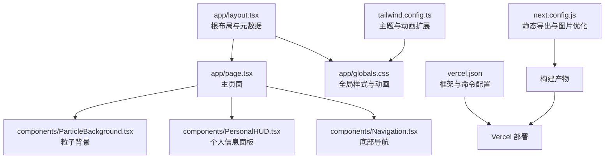
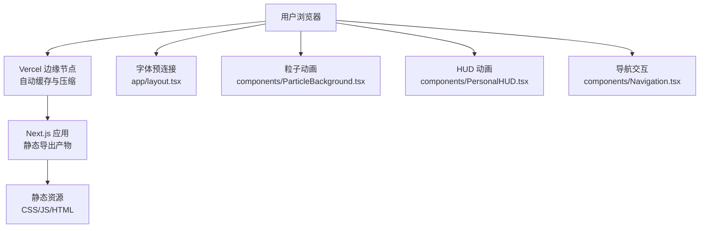
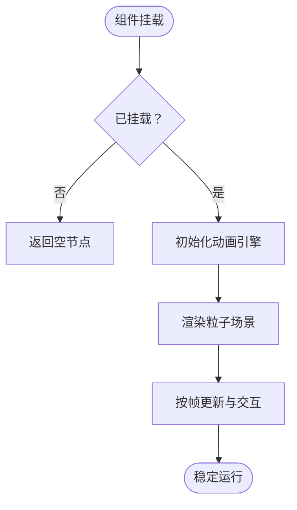
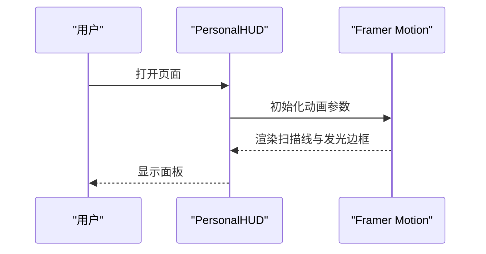
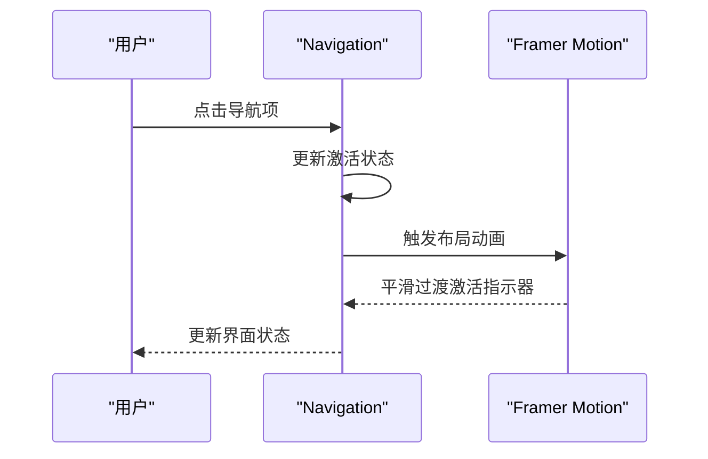
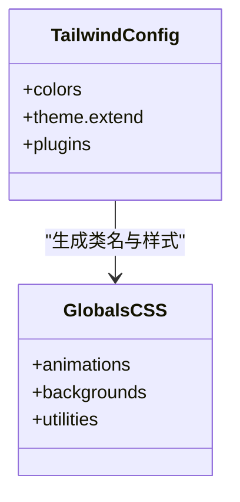
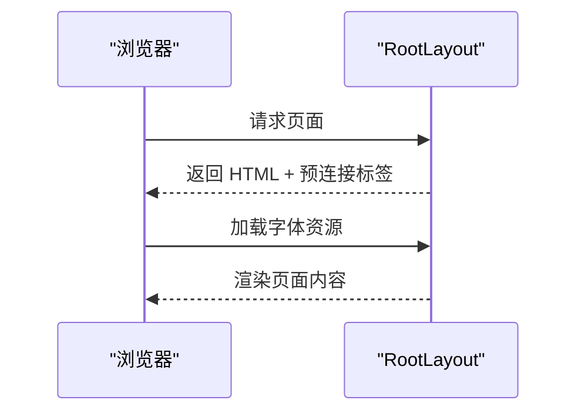
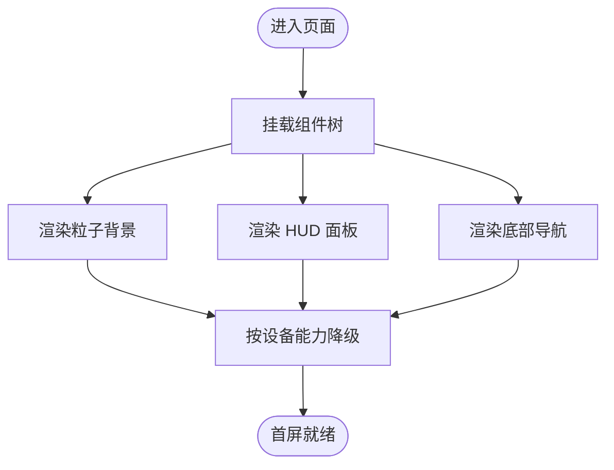
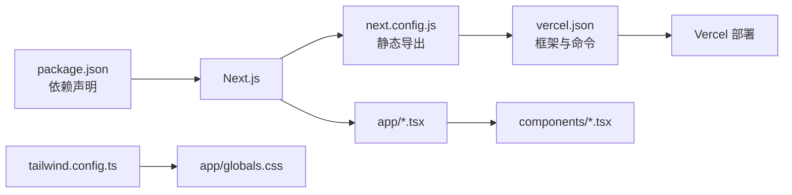

# 性能监控与优化

<cite>
**本文引用的文件**
- [vercel.json](file://vercel.json)
- [next.config.js](file://next.config.js)
- [package.json](file://package.json)
- [README.md](file://README.md)
- [app/layout.tsx](file://app/layout.tsx)
- [app/page.tsx](file://app/page.tsx)
- [app/globals.css](file://app/globals.css)
- [tailwind.config.ts](file://tailwind.config.ts)
- [components/ParticleBackground.tsx](file://components/ParticleBackground.tsx)
- [components/PersonalHUD.tsx](file://components/PersonalHUD.tsx)
- [components/Navigation.tsx](file://components/Navigation.tsx)
</cite>

## 目录
1. [引言](#引言)
2. [项目结构](#项目结构)
3. [核心组件](#核心组件)
4. [架构总览](#架构总览)
5. [详细组件分析](#详细组件分析)
6. [依赖关系分析](#依赖关系分析)
7. [性能考量](#性能考量)
8. [故障排查指南](#故障排查指南)
9. [结论](#结论)
10. [附录](#附录)

## 引言
本指南面向希望系统性提升网站性能与用户体验的开发者，结合当前仓库的 Next.js + Vercel 部署方案，提供从指标采集、监控工具使用、CDN 加速、静态资源优化、缓存策略、A/B 与基准测试、错误追踪、移动端优化到成本与资源监控的完整实践路径。文档以现有代码为基础，给出可落地的优化建议与可视化图示。

## 项目结构
该项目采用 Next.js App Router 结构，根布局负责全局元数据与字体预连接，页面组件组织核心内容与交互，Tailwind CSS 提供实用类与主题变量，部分组件使用动画库增强视觉体验。构建配置采用静态导出模式，便于在 Vercel 上进行零配置部署与全球分发。

**图表来源**
- [app/layout.tsx:1-37](file://app/layout.tsx#L1-L37)
- [app/page.tsx:1-61](file://app/page.tsx#L1-L61)
- [components/ParticleBackground.tsx:1-126](file://components/ParticleBackground.tsx#L1-L126)
- [components/PersonalHUD.tsx:1-132](file://components/PersonalHUD.tsx#L1-L132)
- [components/Navigation.tsx:1-103](file://components/Navigation.tsx#L1-L103)
- [app/globals.css:1-212](file://app/globals.css#L1-L212)
- [tailwind.config.ts:1-72](file://tailwind.config.ts#L1-L72)
- [next.config.js:1-11](file://next.config.js#L1-L11)
- [vercel.json:1-7](file://vercel.json#L1-L7)

**章节来源**
- [README.md:146-169](file://README.md#L146-L169)
- [vercel.json:1-7](file://vercel.json#L1-L7)
- [next.config.js:1-11](file://next.config.js#L1-L11)
- [package.json:1-30](file://package.json#L1-L30)

## 核心组件
- 根布局与元数据：集中管理站点标题、描述、关键词与 Open Graph，减少重复请求，提升 SEO 与分享体验。
- 主页面：组织粒子背景、信息面板、内容展示区与导航，控制整体层级与交互。
- Tailwind 主题：通过颜色、阴影、动画与背景图扩展，统一视觉与性能基线。
- 构建配置：静态导出与图片未优化开关，影响产物体积与 CDN 分发策略。
- Vercel 配置：声明 Next.js 框架与构建脚本，确保平台侧自动优化生效。

**章节来源**
- [app/layout.tsx:4-14](file://app/layout.tsx#L4-L14)
- [app/page.tsx:9-60](file://app/page.tsx#L9-L60)
- [tailwind.config.ts:9-72](file://tailwind.config.ts#L9-L72)
- [next.config.js:3-8](file://next.config.js#L3-L8)
- [vercel.json:1-6](file://vercel.json#L1-L6)

## 架构总览
下图展示了从浏览器到 Vercel 边缘网络再到应用构建与运行的整体链路，以及关键性能优化点（CDN、缓存、图片优化）。

**图表来源**
- [app/layout.tsx:24-29](file://app/layout.tsx#L24-L29)
- [components/ParticleBackground.tsx:15-17](file://components/ParticleBackground.tsx#L15-L17)
- [components/PersonalHUD.tsx:8-11](file://components/PersonalHUD.tsx#L8-L11)
- [components/Navigation.tsx:21-24](file://components/Navigation.tsx#L21-L24)
- [next.config.js:3-8](file://next.config.js#L3-L8)

## 详细组件分析

### 组件一：粒子背景（ParticleBackground）
- 角色：全屏粒子动画背景，提供沉浸式视觉体验。
- 性能要点：
  - 使用轻量级引擎初始化与挂载控制，避免服务端渲染开销。
  - 限制帧率与粒子密度，平衡视觉与性能。
  - 检测高 DPI 屏幕以启用像素密度检测，减少模糊。
- 优化建议：
  - 在移动端或低端设备上降低粒子数量与动画复杂度。
  - 将背景网格与暗场叠加作为降级方案，减少重绘。

**图表来源**
- [components/ParticleBackground.tsx:9-13](file://components/ParticleBackground.tsx#L9-L13)
- [components/ParticleBackground.tsx:15-17](file://components/ParticleBackground.tsx#L15-L17)
- [components/ParticleBackground.tsx:21-104](file://components/ParticleBackground.tsx#L21-L104)

**章节来源**
- [components/ParticleBackground.tsx:1-126](file://components/ParticleBackground.tsx#L1-L126)

### 组件二：个人信息 HUD（PersonalHUD）
- 角色：顶部右上角信息面板，包含扫描线与发光边框等动态效果。
- 性能要点：
  - 使用 Framer Motion 的初始与持续动画，注意在低端设备上的帧率与内存占用。
  - 复杂渐变与模糊效果需评估合成层开销。
- 优化建议：
  - 对不支持硬件加速的设备降级为纯 CSS 动画。
  - 合理拆分动画层级，避免过度合成。

**图表来源**
- [components/PersonalHUD.tsx:8-11](file://components/PersonalHUD.tsx#L8-L11)
- [components/PersonalHUD.tsx:28-32](file://components/PersonalHUD.tsx#L28-L32)
- [components/PersonalHUD.tsx:110-118](file://components/PersonalHUD.tsx#L110-L118)

**章节来源**
- [components/PersonalHUD.tsx:1-132](file://components/PersonalHUD.tsx#L1-L132)

### 组件三：底部导航（Navigation）
- 角色：页脚导航按钮，支持悬停与激活态动画。
- 性能要点：
  - 使用布局动画标识符保持激活指示器平滑过渡。
  - 控制动画时长与缓动，避免长任务阻塞主线程。
- 优化建议：
  - 在移动端使用更短的过渡时长与更低的动画复杂度。
  - 将图标与文本分离，减少不必要的重排。

**图表来源**
- [components/Navigation.tsx:31-32](file://components/Navigation.tsx#L31-L32)
- [components/Navigation.tsx:78-83](file://components/Navigation.tsx#L78-L83)

**章节来源**
- [components/Navigation.tsx:1-103](file://components/Navigation.tsx#L1-L103)

### 样式与主题（globals.css 与 tailwind.config.ts）
- 角色：全局样式与 Tailwind 主题扩展，统一颜色、动画与背景。
- 性能要点：
  - 使用原子化类名减少 CSS 体积与选择器复杂度。
  - 合理使用背景图与渐变，避免大尺寸纹理导致的内存压力。
- 优化建议：
  - 仅启用必要的动画与阴影，避免在低端设备上过度绘制。
  - 将常用动画封装为 CSS 动画，减少 JavaScript 动画开销。

**图表来源**
- [tailwind.config.ts:9-72](file://tailwind.config.ts#L9-L72)
- [app/globals.css:1-212](file://app/globals.css#L1-L212)

**章节来源**
- [app/globals.css:1-212](file://app/globals.css#L1-L212)
- [tailwind.config.ts:1-72](file://tailwind.config.ts#L1-L72)

### 根布局与元数据（layout.tsx）
- 角色：设置站点元数据与字体预连接，减少首包等待。
- 性能要点：
  - 预连接字体域，缩短字体加载路径。
  - 合理设置 Open Graph 与关键词，提升分享与 SEO。
- 优化建议：
  - 将关键字体置于视口内优先加载，非关键字体延后。
  - 使用资源提示与预加载策略优化关键资源。

**图表来源**
- [app/layout.tsx:4-14](file://app/layout.tsx#L4-L14)
- [app/layout.tsx:24-29](file://app/layout.tsx#L24-L29)

**章节来源**
- [app/layout.tsx:1-37](file://app/layout.tsx#L1-L37)

### 主页面（page.tsx）
- 角色：组织背景、HUD、内容展示与导航，控制整体层级。
- 性能要点：
  - 将重型组件延迟到客户端渲染，减少首屏阻塞。
  - 使用固定定位与合成层优化滚动与动画性能。
- 优化建议：
  - 对不参与首屏的组件使用懒加载或条件渲染。
  - 控制背景元素的层级与透明度，避免过度合成。

**图表来源**
- [app/page.tsx:16-29](file://app/page.tsx#L16-L29)
- [app/page.tsx:49-57](file://app/page.tsx#L49-L57)

**章节来源**
- [app/page.tsx:1-61](file://app/page.tsx#L1-L61)

## 依赖关系分析
- 框架与构建：Next.js 14，静态导出模式，图片未优化开关。
- 部署：Vercel 自动识别框架与命令，提供全球 CDN。
- 样式：Tailwind CSS + 自定义主题与动画扩展。
- 动画：Framer Motion + react-tsparticles，强调视觉体验但需关注性能。

**图表来源**
- [package.json:11-19](file://package.json#L11-L19)
- [next.config.js:3-8](file://next.config.js#L3-L8)
- [vercel.json:1-6](file://vercel.json#L1-L6)
- [tailwind.config.ts:1-72](file://tailwind.config.ts#L1-L72)
- [app/globals.css:1-4](file://app/globals.css#L1-L4)

**章节来源**
- [package.json:1-30](file://package.json#L1-L30)
- [next.config.js:1-11](file://next.config.js#L1-L11)
- [vercel.json:1-7](file://vercel.json#L1-L7)

## 性能考量

### 页面加载时间与首屏渲染
- 关键指标：FCP/LCP/TBT/CLS。建议在 Vercel 分析中关注边缘节点的缓存命中与压缩效果。
- 优化策略：
  - 利用 Vercel 的自动压缩与缓存，确保静态资源在边缘节点就近分发。
  - 首屏只渲染必要内容，将粒子背景与 HUD 设计为可降级。
  - 使用字体预连接与关键字体优先加载，缩短 FCP。

**章节来源**
- [app/layout.tsx:24-29](file://app/layout.tsx#L24-L29)
- [app/page.tsx:16-29](file://app/page.tsx#L16-L29)

### 用户体验指标（UX）
- 关注 CLS 与 TBT。粒子与 HUD 的绝对定位与变换应避免对可见区域产生位移。
- 建议：
  - 为动态元素预留空间，或使用 transform 替代改变布局属性。
  - 控制动画频率与时长，避免长时间占用主线程。

**章节来源**
- [components/ParticleBackground.tsx:21-104](file://components/ParticleBackground.tsx#L21-L104)
- [components/PersonalHUD.tsx:12-24](file://components/PersonalHUD.tsx#L12-L24)

### CDN 性能优化与全球加速
- Vercel 默认提供全球边缘节点与自动缓存，无需额外配置。
- 建议：
  - 使用静态导出产物，减少服务端计算开销。
  - 将字体与第三方资源放在预连接列表，缩短关键路径。

**章节来源**
- [vercel.json:1-6](file://vercel.json#L1-L6)
- [next.config.js:3-8](file://next.config.js#L3-L8)
- [app/layout.tsx:24-29](file://app/layout.tsx#L24-L29)

### 静态资源优化、图片压缩与缓存策略
- 当前配置：
  - 静态导出：有利于边缘缓存与离线可用性。
  - 图片未优化：可能增加带宽与加载时间。
- 建议：
  - 启用官方图片优化或使用现代格式（WebP/AVIF），并提供回退。
  - 为不同 DPR 提供合适尺寸，避免超大图片在小尺寸显示。
  - 设置合理的缓存头（如静态资源长期缓存），利用 Vercel 的边缘缓存。

**章节来源**
- [next.config.js:3-8](file://next.config.js#L3-L8)

### A/B 测试与性能基准测试
- A/B 测试：
  - 使用 Vercel 的无感灰度发布或分支部署，对比不同动画强度与资源加载策略。
  - 通过分析指标（LCP/INP/CLS）判断对用户体验的影响。
- 基准测试：
  - 使用 Lighthouse/Chrome DevTools Performance 面板记录首屏与交互性能。
  - 在真实设备与网络条件下进行测试，关注移动端表现。

**章节来源**
- [README.md:31-41](file://README.md#L31-L41)

### 错误追踪与崩溃报告
- 建议：
  - 在客户端捕获未处理异常并上报至错误追踪平台（如 Sentry）。
  - 对动画与粒子库的初始化失败进行降级处理，保证基础体验。
  - 在导航与内容切换处埋点，统计关键路径的失败率。

**章节来源**
- [components/ParticleBackground.tsx:15-17](file://components/ParticleBackground.tsx#L15-L17)
- [components/Navigation.tsx:31-32](file://components/Navigation.tsx#L31-L32)

### 移动端性能优化与响应式设计
- 最佳实践：
  - 降低动画复杂度与频率，使用 transform 与 opacity。
  - 使用媒体查询与断点，适配不同屏幕尺寸。
  - 控制背景图与渐变的分辨率，避免在移动设备上造成内存压力。
- 验证：
  - 在真机与低性能设备上测试，关注帧率与电池消耗。

**章节来源**
- [tailwind.config.ts:21-24](file://tailwind.config.ts#L21-L24)
- [app/globals.css:173-187](file://app/globals.css#L173-L187)

### 成本分析与资源使用监控
- 方法：
  - 通过 Vercel 仪表盘查看带宽、请求数与构建时间。
  - 分析静态导出产物大小，识别最大资源并优化。
  - 关注边缘缓存命中率，优化缓存策略以降低成本。

**章节来源**
- [vercel.json:1-6](file://vercel.json#L1-L6)
- [next.config.js:3-8](file://next.config.js#L3-L8)

## 故障排查指南
- 症状：首屏加载慢
  - 排查：检查字体加载与网络状况；确认是否启用图片优化。
  - 处理：启用图片优化；将关键字体置于首屏。
- 症状：动画卡顿
  - 排查：检查粒子数量与帧率；确认设备性能。
  - 处理：在低端设备降级粒子数量与动画；减少合成层。
- 症状：导航点击无响应
  - 排查：确认事件绑定与状态更新逻辑。
  - 处理：简化动画时长；确保事件冒泡与阻止默认行为正确。

**章节来源**
- [components/ParticleBackground.tsx:33-34](file://components/ParticleBackground.tsx#L33-L34)
- [components/Navigation.tsx:31-32](file://components/Navigation.tsx#L31-L32)

## 结论
本项目具备良好的视觉基础与 Next.js 架构，结合 Vercel 的全球 CDN 与自动缓存，可在保证体验的同时获得较好的性能表现。建议优先启用图片优化、合理控制动画复杂度，并通过 A/B 与基准测试持续验证优化效果，最终实现高质量、低成本、可扩展的个人网站性能体系。

## 附录
- 相关文件路径与职责概览：
  - [vercel.json:1-7](file://vercel.json#L1-L7)：框架与构建命令声明
  - [next.config.js:1-11](file://next.config.js#L1-L11)：静态导出与图片优化开关
  - [package.json:1-30](file://package.json#L1-L30)：依赖与脚本
  - [app/layout.tsx:1-37](file://app/layout.tsx#L1-L37)：元数据与字体预连接
  - [app/page.tsx:1-61](file://app/page.tsx#L1-L61)：页面结构与交互
  - [app/globals.css:1-212](file://app/globals.css#L1-L212)：全局样式与动画
  - [tailwind.config.ts:1-72](file://tailwind.config.ts#L1-L72)：主题与动画扩展
  - [components/ParticleBackground.tsx:1-126](file://components/ParticleBackground.tsx#L1-L126)：粒子背景
  - [components/PersonalHUD.tsx:1-132](file://components/PersonalHUD.tsx#L1-L132)：信息面板
  - [components/Navigation.tsx:1-103](file://components/Navigation.tsx#L1-L103)：底部导航