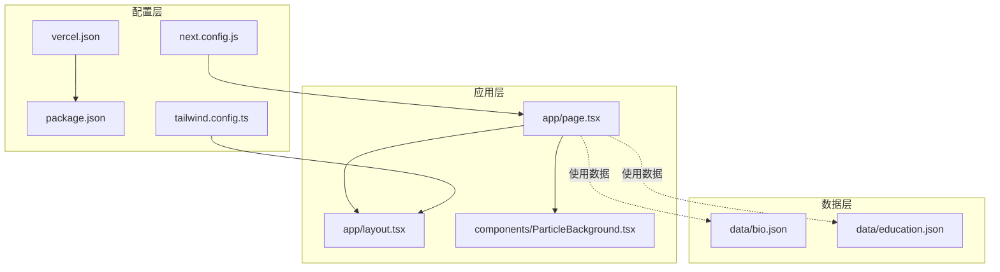
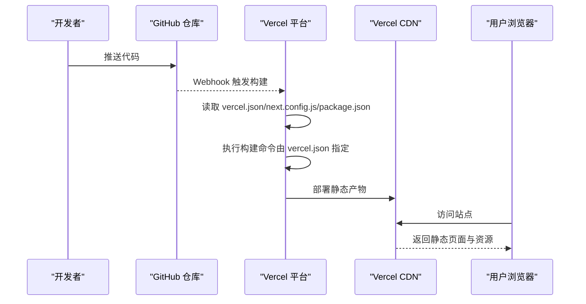
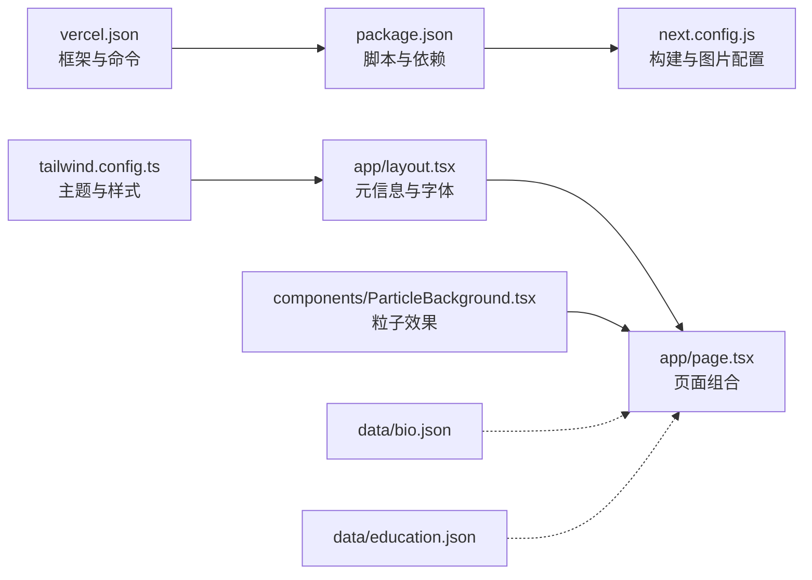

# 部署指南

<cite>
**本文引用的文件**
- [vercel.json](file://vercel.json)
- [package.json](file://package.json)
- [next.config.js](file://next.config.js)
- [README.md](file://README.md)
- [tailwind.config.ts](file://tailwind.config.ts)
- [app/page.tsx](file://app/page.tsx)
- [app/layout.tsx](file://app/layout.tsx)
- [components/ParticleBackground.tsx](file://components/ParticleBackground.tsx)
- [data/bio.json](file://data/bio.json)
- [data/education.json](file://data/education.json)
</cite>

## 目录
1. [简介](#简介)
2. [项目结构](#项目结构)
3. [核心组件](#核心组件)
4. [架构总览](#架构总览)
5. [详细组件分析](#详细组件分析)
6. [依赖关系分析](#依赖关系分析)
7. [性能考虑](#性能考虑)
8. [故障排查指南](#故障排查指南)
9. [结论](#结论)
10. [附录](#附录)

## 简介
本指南面向在 Vercel 平台上部署 Next.js 项目的用户，结合仓库现有配置与实现，提供从环境变量、构建配置、域名绑定、GitHub 自动化部署、静态资源优化与 CDN、域名与 SSL、监控与日志、性能与错误追踪、回滚与紧急修复，以及成本优化与资源管理的完整操作路径。同时对不同部署选项进行对比与选择建议，帮助读者快速、稳定地完成部署。

## 项目结构
该项目采用 Next.js App Router 结构，根目录包含应用入口、组件、数据与构建配置文件。关键点如下：
- 应用入口与全局样式：app/page.tsx、app/layout.tsx、app/globals.css
- 组件层：components 下包含粒子背景、HUD、导航、内容展示等组件
- 数据层：data 目录存放 JSON 数据文件，用于驱动页面内容
- 构建与框架配置：next.config.js、vercel.json、package.json
- 样式与主题：tailwind.config.ts

图表来源
- [app/page.tsx:1-61](file://app/page.tsx#L1-L61)
- [app/layout.tsx:1-37](file://app/layout.tsx#L1-L37)
- [components/ParticleBackground.tsx:1-126](file://components/ParticleBackground.tsx#L1-L126)
- [data/bio.json:1-14](file://data/bio.json#L1-L14)
- [data/education.json:1-33](file://data/education.json#L1-L33)
- [next.config.js:1-11](file://next.config.js#L1-L11)
- [vercel.json:1-7](file://vercel.json#L1-L7)
- [package.json:1-30](file://package.json#L1-L30)
- [tailwind.config.ts:1-72](file://tailwind.config.ts#L1-L72)

章节来源
- [README.md:146-169](file://README.md#L146-L169)

## 核心组件
- 应用入口与布局：根布局负责注入字体与元信息；首页组件负责组织粒子背景、HUD、导航与内容展示。
- 粒子背景组件：基于 react-tsparticles 提供动态粒子效果，包含交互与视觉样式配置。
- 数据驱动：通过 data 目录下的 JSON 文件提供生物信息、教育经历等内容，便于非技术用户维护。
- 构建配置：next.config.js 设置静态导出与图片优化策略；vercel.json 指定 Next.js 框架与命令；package.json 定义脚本与依赖。

章节来源
- [app/page.tsx:1-61](file://app/page.tsx#L1-L61)
- [app/layout.tsx:1-37](file://app/layout.tsx#L1-L37)
- [components/ParticleBackground.tsx:1-126](file://components/ParticleBackground.tsx#L1-L126)
- [data/bio.json:1-14](file://data/bio.json#L1-L14)
- [data/education.json:1-33](file://data/education.json#L1-L33)
- [next.config.js:1-11](file://next.config.js#L1-L11)
- [vercel.json:1-7](file://vercel.json#L1-L7)
- [package.json:1-30](file://package.json#L1-L30)

## 架构总览
下图展示了从代码提交到用户访问的关键路径，涵盖 GitHub 触发、Vercel 构建、静态资源输出与访问链路。

图表来源
- [vercel.json:1-7](file://vercel.json#L1-L7)
- [next.config.js:1-11](file://next.config.js#L1-L11)
- [package.json:1-30](file://package.json#L1-L30)
- [README.md:31-41](file://README.md#L31-L41)

## 详细组件分析

### Vercel 部署配置与最佳实践
- 零配置部署：README 明确指出项目已配置为零配置部署到 Vercel，导入仓库后即可一键部署。
- 框架识别：vercel.json 指定 framework 为 nextjs，确保平台正确识别与优化。
- 构建命令：vercel.json 指定 buildCommand、devCommand、installCommand，与 package.json 的 scripts 对齐。
- 静态导出：next.config.js 设置 output 为 export，适合静态站点托管，减少运行时开销。
- 图片优化：next.config.js 将 images.unoptimized 设为 true，避免在静态导出模式下引入额外处理。

章节来源
- [README.md:31-41](file://README.md#L31-L41)
- [vercel.json:1-7](file://vercel.json#L1-L7)
- [next.config.js:1-11](file://next.config.js#L1-L11)
- [package.json:1-30](file://package.json#L1-L30)

### GitHub 集成与自动化部署
- 流程概览：README 描述了“推送代码 → 登录 Vercel → 导入仓库 → 部署”的步骤，平台自动检测 Next.js 项目。
- 触发机制：Vercel 通过 GitHub Webhook 监听仓库变更，自动触发构建与部署。
- 分支策略：可在 Vercel 控制台配置生产分支与预览分支，实现多环境隔离。
- 依赖安装：installCommand 与 package.json 的依赖声明共同决定安装行为。

章节来源
- [README.md:31-41](file://README.md#L31-L41)
- [vercel.json:1-7](file://vercel.json#L1-L7)
- [package.json:1-30](file://package.json#L1-L30)

### 环境变量与密钥管理
- 本地开发：通过 .env.local 或 Vercel 项目设置中的 Environment Variables 管理本地变量。
- 生产密钥：在 Vercel 控制台的 Environment Variables 中添加只读密钥，避免提交至仓库。
- Next.js 支持：process.env.* 在服务端与静态导出场景下行为不同，需根据实际运行模式选择合适变量注入方式。
- 最佳实践：区分公开与私有变量；使用分环境前缀；定期轮换敏感密钥。

[本节为通用实践说明，不直接分析具体文件]

### 域名绑定与 SSL 证书
- 自定义域名：在 Vercel 控制台绑定自定义域名，平台自动签发与续期 SSL 证书。
- DNS 配置：按 Vercel 提示配置 CNAME/ALIAS 记录，确保解析指向 Vercel。
- HTTPS 强制：启用强制 HTTPS，提升安全性与 SEO。
- 多域名：支持为同一项目配置多个域名，实现品牌矩阵或国际化需求。

[本节为通用实践说明，不直接分析具体文件]

### 静态资源优化与 CDN 配置
- 静态导出优势：output: 'export' 使构建产物为纯静态 HTML/CSS/JS，天然适配 CDN。
- 图片策略：images.unoptimized: true 避免在静态导出中引入复杂处理，建议使用外部托管或压缩后的静态资源。
- 缓存策略：Vercel 默认对静态资源启用长缓存，可通过 _next/static 与构建哈希实现强缓存。
- 全球分发：Vercel CDN 自动就近分发，无需额外配置。
- 资源压缩：利用 Next.js 构建器的内置压缩能力，配合 vercel.json 的框架识别获得更优优化。

章节来源
- [next.config.js:1-11](file://next.config.js#L1-L11)
- [vercel.json:1-7](file://vercel.json#L1-L7)

### 监控与日志分析
- 构建日志：在 Vercel 控制台查看构建日志，定位依赖安装、编译错误与警告。
- 运行时日志：通过 Vercel 的访问日志与错误日志功能，分析请求量、错误率与慢请求。
- 性能指标：结合浏览器性能面板与 Vercel 的页面加载指标，评估首屏与交互性能。
- 告警与通知：在 Vercel 中配置失败告警，或接入第三方日志平台进行集中分析。

[本节为通用实践说明，不直接分析具体文件]

### 性能监控与错误追踪
- 性能监控：关注 TTFB、FCP、LCP、INP 等指标，结合 Vercel 的性能报告与浏览器性能面板。
- 错误追踪：启用浏览器端错误上报（如 Sentry），记录未捕获异常与用户路径。
- 优化建议：减少首屏 JS、拆分路由、延迟加载非关键资源；对粒子动画等重资源进行条件加载或降级。

[本节为通用实践说明，不直接分析具体文件]

### 回滚与紧急修复
- 回滚策略：在 Vercel 控制台选择历史部署进行回滚，或固定构建 ID 以快速恢复。
- 紧急修复：通过新分支快速修复并重新部署，或临时禁用问题功能，再逐步上线。
- 版本控制：使用语义化版本与标签，便于追踪变更与回滚范围。

[本节为通用实践说明，不直接分析具体文件]

### 成本优化与资源管理
- 资源体积：移除未使用的依赖与样式，拆分路由以降低首屏体积。
- CDN 成本：合理设置缓存策略，避免不必要的热存储；利用静态导出减少运行时实例。
- 计费项：关注带宽、构建时间与请求数，必要时升级计划或调整流量高峰策略。

[本节为通用实践说明，不直接分析具体文件]

### 不同部署选项对比与选择
- Vercel（推荐）：零配置、自动 CDN、全球分发、静态导出友好、生态完善。
- Netlify：同样优秀的静态部署与函数能力，适合 JAMstack 场景。
- Cloudflare Pages：边缘计算优势明显，适合需要边缘函数与全球加速的项目。
- 自建服务器：可控性强但运维成本高，适合有特殊合规或性能要求的场景。

[本节为通用实践说明，不直接分析具体文件]

## 依赖关系分析
下图展示项目关键文件之间的依赖关系与耦合度，有助于理解部署与构建流程。

图表来源
- [package.json:1-30](file://package.json#L1-L30)
- [next.config.js:1-11](file://next.config.js#L1-L11)
- [vercel.json:1-7](file://vercel.json#L1-L7)
- [app/layout.tsx:1-37](file://app/layout.tsx#L1-L37)
- [app/page.tsx:1-61](file://app/page.tsx#L1-L61)
- [components/ParticleBackground.tsx:1-126](file://components/ParticleBackground.tsx#L1-L126)
- [data/bio.json:1-14](file://data/bio.json#L1-L14)
- [data/education.json:1-33](file://data/education.json#L1-L33)
- [tailwind.config.ts:1-72](file://tailwind.config.ts#L1-L72)

章节来源
- [package.json:1-30](file://package.json#L1-L30)
- [next.config.js:1-11](file://next.config.js#L1-L11)
- [vercel.json:1-7](file://vercel.json#L1-L7)
- [app/layout.tsx:1-37](file://app/layout.tsx#L1-L37)
- [app/page.tsx:1-61](file://app/page.tsx#L1-L61)
- [components/ParticleBackground.tsx:1-126](file://components/ParticleBackground.tsx#L1-L126)
- [data/bio.json:1-14](file://data/bio.json#L1-L14)
- [data/education.json:1-33](file://data/education.json#L1-L33)
- [tailwind.config.ts:1-72](file://tailwind.config.ts#L1-L72)

## 性能考虑
- 首屏优化：静态导出与 Tailwind 按需扫描配置有助于减小初始 CSS 体积。
- 资源加载：将非关键动画与特效延迟初始化，避免阻塞主线程。
- 图片策略：在静态导出模式下建议使用外部托管或预压缩资源，避免 Next.js 图片优化带来的复杂性。
- 缓存策略：利用构建哈希与静态导出的长期缓存，减少重复下载。

章节来源
- [next.config.js:1-11](file://next.config.js#L1-L11)
- [tailwind.config.ts:1-72](file://tailwind.config.ts#L1-L72)

## 故障排查指南
- 构建失败
  - 检查 vercel.json 的命令是否与 package.json scripts 一致。
  - 查看 Vercel 构建日志中的依赖安装与编译错误。
- 静态导出相关
  - 确认 next.config.js 的 output 为 export，且 images.unoptimized 为 true。
  - 若出现动态路由或动态导入，请评估是否仍需静态导出。
- 资源 404
  - 确认静态资源路径与 trailingSlash 配置一致。
  - 检查 CDN 缓存是否生效，必要时清理缓存或等待刷新。
- 域名与 SSL
  - 确认 DNS 记录已正确指向 Vercel。
  - 如遇证书问题，检查域名所有权与自动续期状态。

章节来源
- [vercel.json:1-7](file://vercel.json#L1-L7)
- [package.json:1-30](file://package.json#L1-L30)
- [next.config.js:1-11](file://next.config.js#L1-L11)
- [README.md:31-41](file://README.md#L31-L41)

## 结论
本项目已针对 Vercel 平台完成基础配置，具备零配置部署与静态导出的优势。结合本文提供的环境变量、域名与 SSL、监控与日志、性能与错误追踪、回滚与成本优化等实践，可进一步提升稳定性与可维护性。对于更复杂的运行时需求，可评估迁移到支持函数与数据库的平台，但当前配置足以支撑高质量的静态个人主页部署。

## 附录
- 快速检查清单
  - 确认 vercel.json 与 package.json 命令一致
  - 确认 next.config.js 的静态导出与图片配置
  - 在 Vercel 控制台绑定自定义域名并启用强制 HTTPS
  - 配置环境变量与密钥，避免硬编码
  - 设置监控与日志，建立告警机制
  - 评估资源体积与缓存策略，进行必要的优化