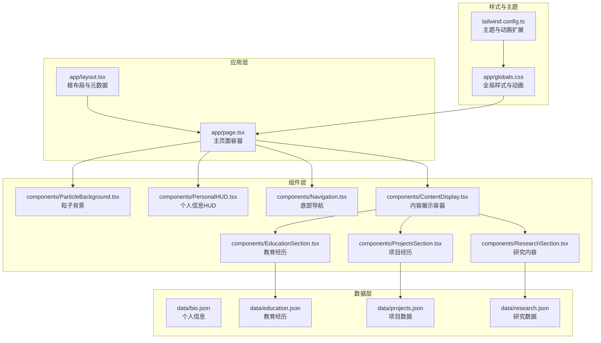
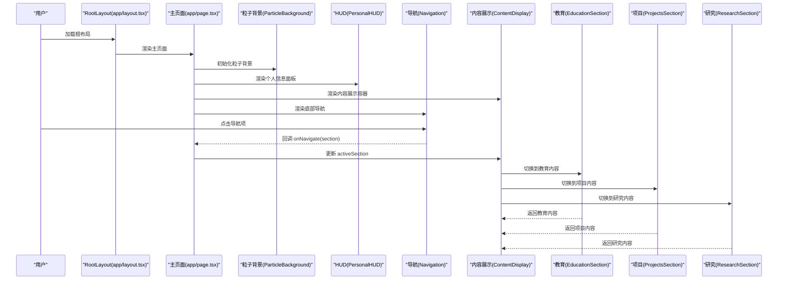
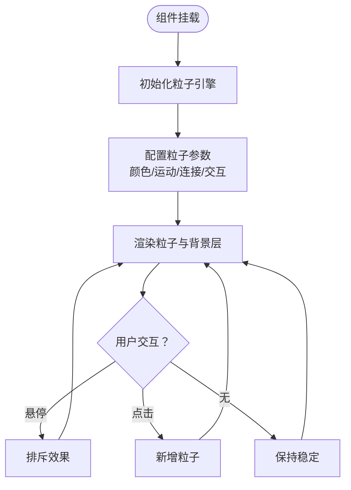
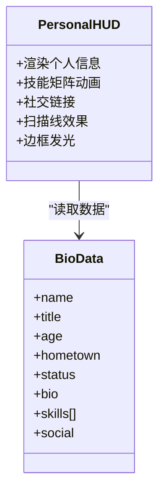
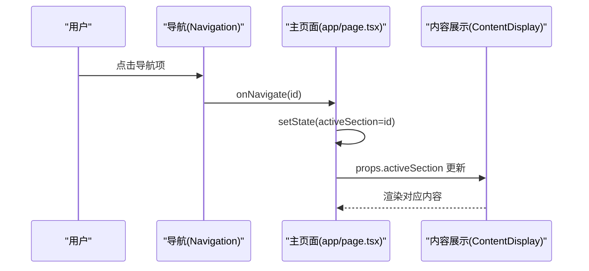
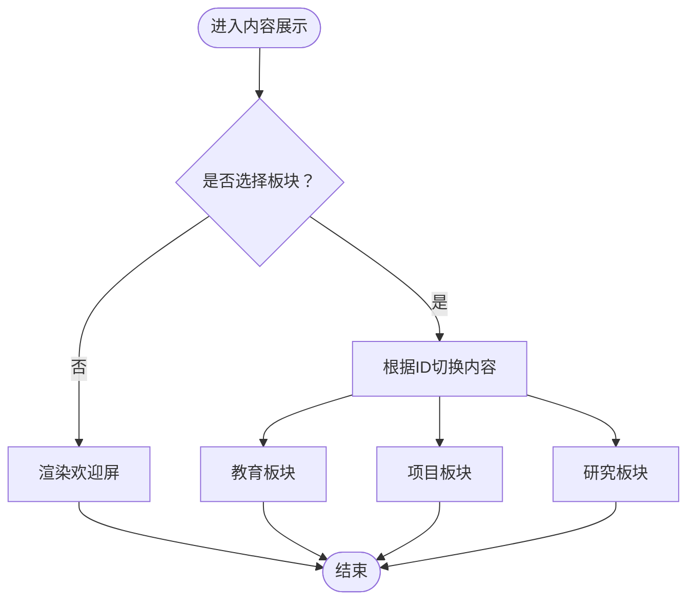
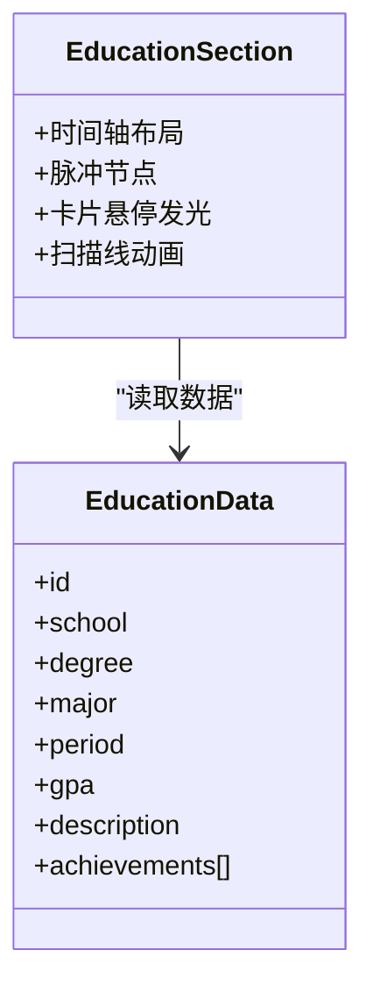
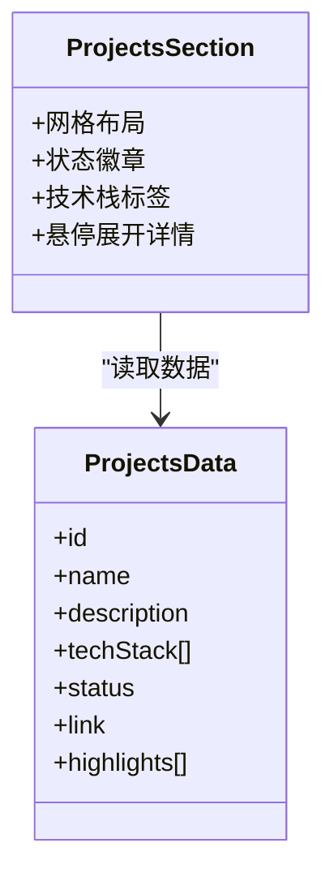
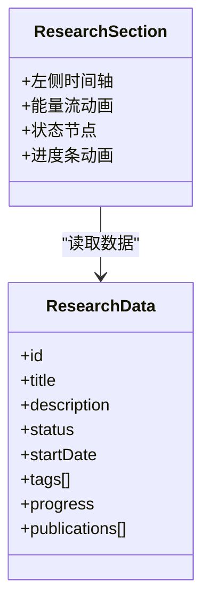
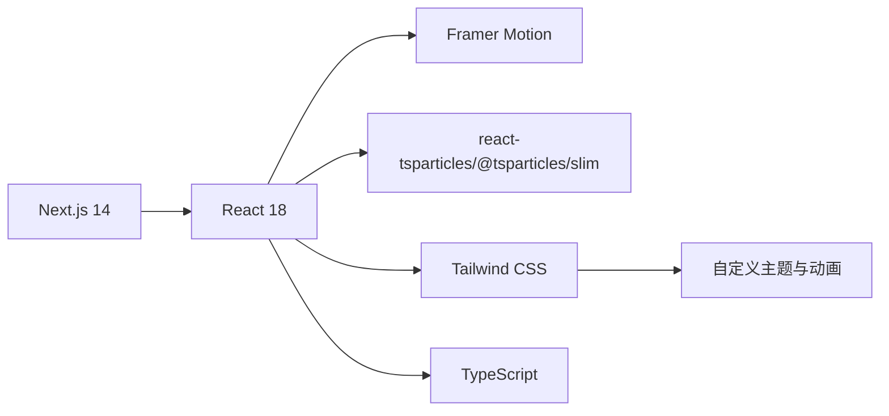

# 项目概述

<cite>
**本文档引用的文件**
- [README.md](file://README.md)
- [package.json](file://package.json)
- [tailwind.config.ts](file://tailwind.config.ts)
- [app/layout.tsx](file://app/layout.tsx)
- [app/page.tsx](file://app/page.tsx)
- [app/globals.css](file://app/globals.css)
- [components/ParticleBackground.tsx](file://components/ParticleBackground.tsx)
- [components/PersonalHUD.tsx](file://components/PersonalHUD.tsx)
- [components/Navigation.tsx](file://components/Navigation.tsx)
- [components/ContentDisplay.tsx](file://components/ContentDisplay.tsx)
- [components/EducationSection.tsx](file://components/EducationSection.tsx)
- [components/ProjectsSection.tsx](file://components/ProjectsSection.tsx)
- [components/ResearchSection.tsx](file://components/ResearchSection.tsx)
- [data/bio.json](file://data/bio.json)
- [data/education.json](file://data/education.json)
- [data/projects.json](file://data/projects.json)
- [data/research.json](file://data/research.json)
</cite>

## 目录
1. [引言](#引言)
2. [项目结构](#项目结构)
3. [核心组件](#核心组件)
4. [架构总览](#架构总览)
5. [详细组件分析](#详细组件分析)
6. [依赖关系分析](#依赖关系分析)
7. [性能考量](#性能考量)
8. [故障排查指南](#故障排查指南)
9. [结论](#结论)
10. [附录](#附录)

## 引言
本项目是一个以赛博朋克风格为主题的个人主页，采用 Next.js 14 App Router 构建，结合 Tailwind CSS、Framer Motion 与 react-tsparticles，打造具备未来感与沉浸式的数字展示空间。项目通过数据驱动的方式管理内容，支持教育经历、项目经历与研究进展的可视化呈现，并提供交互式粒子背景、全息风格 HUD 面板、导航系统与内容切换动画等核心功能模块。

该站点面向希望展示技术实力与创意设计的开发者、研究人员与设计师，适用于个人品牌建设、作品集发布、技术博客入口或数字名片场景。项目强调响应式设计、高性能动画与可扩展的内容管理，既便于初学者快速上手，也为有经验的开发者提供了定制与扩展的空间。

## 项目结构
项目采用按功能分层的组织方式，核心目录与职责如下：
- app：Next.js 应用根布局与主页面，负责全局元数据、字体引入与页面容器组织
- components：可复用的 UI 组件，包含粒子背景、HUD 面板、导航、内容展示与三大内容板块
- data：JSON 数据文件，分别承载个人信息、教育经历、项目与研究内容
- 配置文件：Tailwind CSS、TypeScript、PostCSS、Next.js 等工具链配置

**图示来源**
- [app/layout.tsx:1-37](file://app/layout.tsx#L1-L37)
- [app/page.tsx:1-61](file://app/page.tsx#L1-L61)
- [components/ParticleBackground.tsx:1-126](file://components/ParticleBackground.tsx#L1-L126)
- [components/PersonalHUD.tsx:1-132](file://components/PersonalHUD.tsx#L1-L132)
- [components/Navigation.tsx:1-103](file://components/Navigation.tsx#L1-L103)
- [components/ContentDisplay.tsx:1-125](file://components/ContentDisplay.tsx#L1-L125)
- [components/EducationSection.tsx:1-143](file://components/EducationSection.tsx#L1-L143)
- [components/ProjectsSection.tsx:1-161](file://components/ProjectsSection.tsx#L1-L161)
- [components/ResearchSection.tsx:1-175](file://components/ResearchSection.tsx#L1-L175)
- [app/globals.css:1-212](file://app/globals.css#L1-L212)
- [tailwind.config.ts:1-72](file://tailwind.config.ts#L1-L72)

**章节来源**
- [README.md:146-169](file://README.md#L146-L169)
- [package.json:1-30](file://package.json#L1-L30)

## 核心组件
本项目由以下核心组件构成，每个组件承担特定的视觉与交互职责：

- 粒子背景系统：基于 react-tsparticles 提供的 WebGL 粒子引擎，实现高帧率、可交互的粒子场与网格背景，配合点击/悬停的排斥与连接效果，营造赛博朋克氛围。
- 个人信息 HUD 面板：位于页面右上角的半透明信息面板，包含姓名、头衔、年龄、地点、状态、技能矩阵与社交链接，采用扫描线与霓虹边框增强全息投影质感。
- 导航系统：位于页面底部的横向导航条，包含“教育经历”“项目经历”“目前研究”三个选项，支持悬停发光、点击切换与活动指示器过渡。
- 内容展示模块：根据导航状态动态切换内容区域，使用 Framer Motion 的 AnimatePresence 实现平滑入场/出场动画；默认欢迎屏提供“系统启动”的赛博朋克提示。

**章节来源**
- [components/ParticleBackground.tsx:1-126](file://components/ParticleBackground.tsx#L1-L126)
- [components/PersonalHUD.tsx:1-132](file://components/PersonalHUD.tsx#L1-L132)
- [components/Navigation.tsx:1-103](file://components/Navigation.tsx#L1-L103)
- [components/ContentDisplay.tsx:1-125](file://components/ContentDisplay.tsx#L1-L125)

## 架构总览
下图展示了页面加载到内容切换的整体流程，以及各组件之间的依赖关系与数据流向。

**图示来源**
- [app/layout.tsx:16-36](file://app/layout.tsx#L16-L36)
- [app/page.tsx:9-29](file://app/page.tsx#L9-L29)
- [components/Navigation.tsx:17-91](file://components/Navigation.tsx#L17-L91)
- [components/ContentDisplay.tsx:12-42](file://components/ContentDisplay.tsx#L12-L42)
- [components/EducationSection.tsx:6-142](file://components/EducationSection.tsx#L6-L142)
- [components/ProjectsSection.tsx:7-160](file://components/ProjectsSection.tsx#L7-L160)
- [components/ResearchSection.tsx:6-174](file://components/ResearchSection.tsx#L6-L174)

## 详细组件分析

### 粒子背景系统
- 技术实现：使用 @tsparticles/react 与 @tsparticles/slim，在客户端初始化粒子引擎，设置粒子颜色、运动、连接与交互模式，启用高帧率限制与视网膜屏适配。
- 视觉效果：叠加网格背景与暗角晕影，营造赛博朋克的数字网格与深空背景；鼠标悬停产生排斥力，点击增加粒子密度，增强互动性。
- 性能策略：限制 FPS、控制粒子数量与尺寸范围，避免在低端设备上造成性能压力。

**图示来源**
- [components/ParticleBackground.tsx:15-104](file://components/ParticleBackground.tsx#L15-L104)

**章节来源**
- [components/ParticleBackground.tsx:1-126](file://components/ParticleBackground.tsx#L1-L126)

### 个人信息 HUD 面板
- 设计理念：采用半透明毛玻璃背景、霓虹边框与扫描线动画，模拟赛博朋克 HUD 的全息投影风格；信息来源于 data/bio.json。
- 功能特性：姓名与头衔、年龄/地点/状态、技能矩阵逐项淡入、社交链接外链跳转、动态边框发光与脉冲光点。
- 交互细节：鼠标悬停时技能标签依次出现，边框发光随时间线性移动，营造“系统扫描”的动感。

**图示来源**
- [components/PersonalHUD.tsx:6-122](file://components/PersonalHUD.tsx#L6-L122)
- [data/bio.json:1-14](file://data/bio.json#L1-L14)

**章节来源**
- [components/PersonalHUD.tsx:1-132](file://components/PersonalHUD.tsx#L1-L132)
- [data/bio.json:1-14](file://data/bio.json#L1-L14)

### 导航系统
- 交互逻辑：底部居中排列的三个导航按钮，支持悬停发光、点击缩放反馈与活动指示器过渡；点击后通过回调更新主页面的状态，从而驱动内容切换。
- 动画细节：使用 Framer Motion 的 layoutId 实现活动指示器的平滑过渡，悬停时的“故障”抖动效果提升科技感。
- 响应式：在小屏设备上仍保持稳定的交互区域，确保移动端可用性。

**图示来源**
- [components/Navigation.tsx:17-91](file://components/Navigation.tsx#L17-L91)
- [app/page.tsx:12-14](file://app/page.tsx#L12-L14)
- [components/ContentDisplay.tsx:28-41](file://components/ContentDisplay.tsx#L28-L41)

**章节来源**
- [components/Navigation.tsx:1-103](file://components/Navigation.tsx#L1-L103)
- [app/page.tsx:1-61](file://app/page.tsx#L1-L61)

### 内容展示模块
- 动画机制：使用 AnimatePresence 与 Motion 包裹内容容器，实现入场/出场的淡入淡出与模糊过渡，保证切换过程的流畅性。
- 默认欢迎屏：提供“系统启动”与命令提示符的赛博朋克风格欢迎界面，增强沉浸感。
- 内容选择：根据 activeSection 分发至教育、项目或研究模块，未选择时显示欢迎屏。

**图示来源**
- [components/ContentDisplay.tsx:12-42](file://components/ContentDisplay.tsx#L12-L42)

**章节来源**
- [components/ContentDisplay.tsx:1-125](file://components/ContentDisplay.tsx#L1-L125)

### 教育经历时间轴
- 时间轴设计：使用渐变色线条与脉冲节点表现时间推进，两侧交替布局卡片，增强阅读节奏。
- 卡片交互：悬停时发光扩散，扫描线动画贯穿卡片，节点带脉冲光晕，突出“数据流”主题。
- 数据来源：来自 data/education.json，支持描述与成就列表的逐项动画展示。

**图示来源**
- [components/EducationSection.tsx:6-142](file://components/EducationSection.tsx#L6-L142)
- [data/education.json:1-33](file://data/education.json#L1-L33)

**章节来源**
- [components/EducationSection.tsx:1-143](file://components/EducationSection.tsx#L1-L143)
- [data/education.json:1-33](file://data/education.json#L1-L33)

### 项目经历卡片墙
- 卡片设计：采用网格布局，卡片内含项目图标占位、状态徽章、技术栈标签与“解锁详情”的悬停展开区域。
- 动画细节：悬停时卡片轻微放大与发光，图标旋转，技术标签与高亮列表逐项淡入，链接按钮带有霓虹阴影。
- 数据来源：来自 data/projects.json，支持不同项目状态的视觉区分。

**图示来源**
- [components/ProjectsSection.tsx:7-160](file://components/ProjectsSection.tsx#L7-L160)
- [data/projects.json:1-57](file://data/projects.json#L1-L57)

**章节来源**
- [components/ProjectsSection.tsx:1-161](file://components/ProjectsSection.tsx#L1-L161)
- [data/projects.json:1-57](file://data/projects.json#L1-L57)

### 研究进展时间线
- 时间线设计：左侧主轴线与能量流动画，节点根据状态（进行中/规划中）采用不同颜色与脉冲效果。
- 进度条：使用 Framer Motion 动画展示进度，标签云逐项出现，突出研究主题与成果。
- 数据来源：来自 data/research.json，支持论文列表的条件渲染。

**图示来源**
- [components/ResearchSection.tsx:6-174](file://components/ResearchSection.tsx#L6-L174)
- [data/research.json:1-37](file://data/research.json#L1-L37)

**章节来源**
- [components/ResearchSection.tsx:1-175](file://components/ResearchSection.tsx#L1-L175)
- [data/research.json:1-37](file://data/research.json#L1-L37)

## 依赖关系分析
- 前端框架与运行时：Next.js 14 App Router 提供页面路由与服务端渲染能力；React 18 作为核心 UI 库。
- 动画与交互：Framer Motion 提供高性能的动画与手势交互；clsx 用于条件类名合并。
- 粒子系统：react-tsparticles 与 @tsparticles/slim 提供 WebGL 粒子引擎与交互事件。
- 样式与主题：Tailwind CSS 提供原子化样式与响应式工具类；自定义主题扩展了赛博朋克色彩体系与动画。
- 类型安全：TypeScript 提供类型检查与更好的开发体验。

**图示来源**
- [package.json:11-28](file://package.json#L11-L28)
- [tailwind.config.ts:9-67](file://tailwind.config.ts#L9-L67)

**章节来源**
- [package.json:1-30](file://package.json#L1-L30)
- [tailwind.config.ts:1-72](file://tailwind.config.ts#L1-L72)

## 性能考量
- 粒子系统优化：限制 FPS、控制粒子数量与尺寸范围，启用视网膜屏检测，避免在低端设备上造成卡顿。
- 动画性能：使用 transform 与 opacity 动画，避免触发布局与重绘；AnimatePresence 使用模式等待减少闪烁。
- 资源加载：字体通过预连接与异步加载，减少阻塞；全局样式集中管理，避免重复渲染。
- 响应式设计：基于 Tailwind 的断点系统，确保在桌面与移动设备上的良好体验。

[本节为通用性能建议，不直接分析具体文件]

## 故障排查指南
- 页面空白或样式异常
  - 检查全局样式与字体资源是否正确加载
  - 确认 Tailwind 配置的 content 路径覆盖到组件目录
- 粒子效果不生效
  - 确认客户端渲染已启用且未在 SSR 中执行
  - 检查粒子初始化函数与交互事件配置
- 导航切换无效
  - 确认主页面传递的回调与状态更新逻辑
  - 检查 activeSection 的值与内容展示的分发逻辑
- 数据未显示
  - 校验 JSON 文件格式与字段命名
  - 确认组件导入路径与数据读取逻辑

**章节来源**
- [app/globals.css:25-31](file://app/globals.css#L25-L31)
- [tailwind.config.ts:4-8](file://tailwind.config.ts#L4-L8)
- [components/ParticleBackground.tsx:9-17](file://components/ParticleBackground.tsx#L9-L17)
- [app/page.tsx:12-14](file://app/page.tsx#L12-L14)
- [components/ContentDisplay.tsx:12-24](file://components/ContentDisplay.tsx#L12-L24)

## 结论
本项目以赛博朋克风格为核心设计理念，结合现代前端技术栈，实现了高性能、可交互且高度可定制的个人主页。通过数据驱动的内容管理与丰富的动画效果，项目不仅能够有效展示个人背景与技术能力，也为后续扩展（如新增板块、主题切换、国际化等）提供了良好的基础。对于初学者而言，项目结构清晰、组件职责明确；对于有经验的开发者，项目在动画性能、主题扩展与数据模型方面均具备进一步优化与定制的空间。

[本节为总结性内容，不直接分析具体文件]

## 附录
- 适用场景与目标用户
  - 个人品牌与作品集展示
  - 技术博客与知识分享入口
  - 学术/研究机构的数字名片
  - 面向开发者与设计者的创意展示
- 技术亮点摘要
  - 响应式设计：基于 Tailwind 断点系统，适配多终端
  - 高性能动画：Framer Motion 与硬件加速，保证流畅体验
  - 数据驱动：JSON 文件管理内容，易于维护与扩展
  - 赛博朋克主题：色彩体系、字体与动画统一风格，强化视觉识别

[本节为概览性内容，不直接分析具体文件]